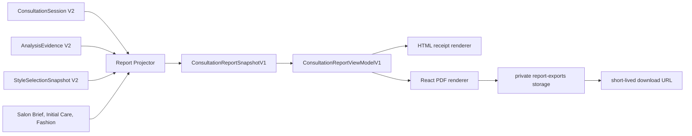

# 컨설팅 결과 명세서·PDF 구현 계획

- 작성일: 2026-08-15
- 최신 계약 갱신: 2026-08-16
- 상태: implementation-ready
- 기준 브랜치: `main@b33c33c`
- 조사 기준: `feat/2026-08-08-ai-consultant-frontend@d51ffcb`, `feat/2026-08-08-hairfit-v2-backend@b67aaa`
- 구현 대상: Web 우선, Expo 다운로드·공유 연결 후속
- 문서 범위: P0~P6 로컬 구현과 P7 결과 콘텐츠 고도화 계획; 원격 DB·배포는 별도 증거 필요

## 1. 목표

컨설팅 결과를 큰 이미지 카드 중심 화면이 아니라 A4 세로 인쇄에 적합한 “명세 영수증” 구조로 재편한다. 동시에 Discovery부터 Fashion까지 전체 여정에서 만들어진 분석 근거와 디렉팅 자료를 하나의 재현 가능한 PDF로 내보낼 수 있게 한다.

핵심 결과물은 다음 두 개다.

1. `/consulting/{sessionId}/result`: 기존 분할 Workbench를 대체하는 화면 열람·브라우저 인쇄용 세로형 결과 명세서
2. `ConsultationReportSnapshotV1 -> PDF`: 서버 권위 데이터를 고정해 만든 다운로드 가능한 PDF

`/consulting/{sessionId}/report`를 별도 사용자 여정으로 추가하지 않는다. 필요하면 `/result?print=1`의 alias 또는 영구 redirect로만 제공하며, 화면 Result와 PDF는 동일한 `ConsultationReportViewModelV1`을 사용한다.

## 2. 제품 원칙

- 결과 화면과 PDF는 동일한 `ConsultationReportViewModelV1`을 사용한다.
- PDF는 현재 UI를 캡처한 이미지가 아니라 검색·복사·접근성 태그 확장이 가능한 문서로 생성한다.
- 결과 생성 시점의 상담 버전, 선택 스냅샷, 분석 근거를 불변 스냅샷으로 고정한다.
- 원본 얼굴 사진은 기본적으로 화면 인쇄와 PDF에서 제외한다. 사용자가 명시적으로 포함을 선택한 경우에만 별도 감사 기록과 함께 포함한다.
- P7 결과 리포트는 `헤어·염색·메이크업·패션·최종` 5개 탭으로 구성하고 `not_started` section과 빈 선택 탭을 숨긴다.
- 리포트의 관리는 확정 결과에 따른 초기 케어까지만 포함한다. 실제 시술 이후 알림·관찰·만족도·장기 추적은 treatment record 기반 별도 Aftercare 프로그램에서 진행한다.
- 웹 화면의 Zustand/로컬 상태는 문서의 원본이 아니다. 서버의 ConsultationSession, AnalysisEvidence, StyleSelectionSnapshot 및 연결된 산출물이 원본이다.
- 흑백 인쇄에서도 의미가 유지되도록 색상만으로 상태를 구분하지 않는다.

## 3. 현재 상태와 차이

현재 컨설팅 프런트엔드는 다음 15개 Scene을 주소화한다.

`Discovery -> Photo -> Face Scan -> Analysis -> Personal Color -> Direction -> Preview -> Compare -> Decision -> Color Studio -> Salon Brief -> Makeup -> Fashion -> Result -> Aftercare`

현재 계약에는 `AnalysisEvidenceDraft`, `FaceAnalysis`, `PersonalColorDiagnosis`, `StrategySnapshot`, `SelectedStyleSnapshot`, `ColorDecisionSnapshot`, `SalonBriefVersion`, `MakeupDirectionSummary`, `SelectedFashionLook`, `ConsultationResultSummary`, `CareProgram`이 있다. V2 백엔드에는 더 강한 `AnalysisEvidenceV2`, `PersonalColorProfileV2`, `StyleSelectionSnapshotV2`, `ColorSelectionSnapshotV2`, `SalonBriefV2`, Makeup routine/artist brief, `FashionPreviewSetV2`, `ConsultationResultSnapshotV2`, `AftercareProgramV2` 계약이 있다.

부족한 부분은 다음과 같다.

- 전체 여정 산출물을 하나의 버전으로 묶는 보고서 스냅샷 없음
- 인쇄용 정보 구조와 `@media print` 계약 없음
- PDF 생성·상태 조회·다운로드 API 없음
- PDF 바이너리 저장, 만료, 감사, 재시도 모델 없음
- 원본 사진 포함 정책과 민감 정보 제거 규칙 없음
- 화면/PDF 섹션 정합성, 한글 폰트, 페이지 나눔 회귀 테스트 없음

## 4. 확정 아키텍처



### 렌더러 선택

- 화면·인쇄: React HTML + 전용 print CSS
- PDF: Node 런타임의 `@react-pdf/renderer`
- 공유 대상: React 컴포넌트가 아니라 순수 직렬화 뷰 모델, 섹션 순서, 문구, 디자인 토큰
- 금지: DOM 스크린샷, 클라이언트 `html2canvas`, 공개 Storage URL, 브라우저에서 서비스 역할 키 사용

`@react-pdf/renderer`는 신규 의존성으로 추가한다. 한글 폰트는 저장소가 소유하거나 배포 시 재배포 가능한 WOFF2/TTF 파일을 서버에서 등록한다. 폰트 라이선스와 실제 배포 런타임 번들 크기는 P0에서 승인한다.

### 출력 프로필

| profile | 대상 | 기본 포함 범위 |
| --- | --- | --- |
| `full_journey` | 사용자 보관용 | Hair·Color·Makeup·Fashion 결과, 최종 요약·살롱 명세·초기 케어 |
| `salon_handoff` | 디자이너 전달용 | 최종 선택, 구현 방향, 살롱 브리프, 주의사항; 원본 얼굴 제외 |
| `analysis_only` | 분석 검토용 | 촬영 품질, 분석 근거, 퍼스널 컬러, 방향 근거 |

첫 출시 UI는 `full_journey`와 `salon_handoff`만 노출한다. 시술 후 관리는 report profile이 아니라 별도 Aftercare 프로그램 화면·API로 제공한다.

## 5. 문서 정보 구조

### A4 명세 영수증 규격

- 용지: A4 portrait, 210 × 297 mm
- 인쇄 여백: 상하 12 mm, 좌우 12 mm
- 본문 최대 폭: 186 mm
- 화면 최대 폭: 760 px, 중앙 정렬
- 기본 글자: 화면 15 px, PDF 9.5 pt
- 섹션 간격: 16 px / PDF 8 pt
- 선: 1 px / PDF 0.5 pt, 흑백 대비 3:1 이상
- 큰 배경색과 그림자 제거, 잉크 사용량 최소화
- 페이지 머리말: HairFit, 보고서 번호, 프로필, 생성일
- 페이지 꼬리말: `p / total`, 상담 버전, 무결성 코드 앞 12자리

### P7 확정 탭과 섹션 순서

| 탭 순서 | 탭 | section 순서 | 주요 내용 |
| --- | --- | --- | --- |
| 01 | 헤어 | 얼굴·모발 분석 → 헤어 디자인 방향 → 후보 비교 → 최종 헤어 | 분석에서 확정 Hair까지의 근거와 결과 |
| 02 | 염색 | 퍼스널 컬러 → 최종 컬러 | 진단 근거와 확정 염색 결과 |
| 03 | 메이크업 | 메이크업 결과 | mood image, 7 module color board, harmony |
| 04 | 패션 | 패션 스타일링 | final 1+alternative 2, 구성·palette·연결·제약 |
| 05 | 최종 | 종합 컨설팅 결론 → 살롱 시술 명세 → 초기 케어 | 대표 결과, 디자이너 전달 명세, 시술 직후~초기 7일 케어 |

화면은 `final` 탭을 기본 활성화하고 query string으로 탭을 주소화한다. PDF·인쇄물은 탭을 고정 순서의 group heading으로 펼친다. 전체 section 수는 11개이며 section 중복 소유를 금지한다.

요청 명세, 입력 품질, 진행 상태, 문서 식별, 별도 무결성 section은 본문에서 제거한다. metadata와 고지는 compact header/footer로 이동한다.

## 6. 상태 계약과 version 경계

V1 호환 section은 다음 상태를 유지한다.

```ts
type ReportSectionStatus =
  | "ready"
  | "partial"
  | "not_started"
  | "unavailable"
  | "redacted";
```

- `ready`: 섹션 필수 필드와 권위 원본이 모두 존재
- `partial`: 일부 필드 또는 이미지가 없지만 오해 없이 표시 가능
- `not_started`: 사용자가 아직 해당 여정을 시작하지 않음
- `unavailable`: 원본은 필요하지만 조회·렌더 실패
- `redacted`: 정책 또는 사용자 선택으로 의도적으로 제거

`unavailable`을 빈 값으로 바꾸거나, 생성 실패 이미지를 성공 이미지로 대체해서는 안 된다.

P7의 V2 public ViewModel은 `not_started` section을 본문에 전달하지 않는다. `ready`, `partial`, `unavailable`, `redacted`만 렌더하고 빈 선택 탭도 숨긴다. `final` 탭은 항상 유지하며, `initial-care`는 확정 Hair 또는 Color 근거가 있을 때만 생성한다. V1의 5-state 계약은 기존 snapshot/PDF 호환을 위해 변경하지 않는다.

## 7. Phase 지도

| Phase | 문서 | 핵심 결과 | 선행 Gate |
| --- | --- | --- | --- |
| P0 | [계약·기준선](./phase-00-contract-and-baseline.md) | ADR, 계약 동결, fixture, 폰트·런타임 결정 | 없음 |
| P1 | [스냅샷·API](./phase-01-report-snapshot-and-api.md) | immutable snapshot, projection, RLS, API | P0 |
| P2 | [세로 명세 레이아웃](./phase-02-receipt-layout.md) | result report page, print CSS, 접근성 | P1 fixture 가능 |
| P3 | [PDF 내보내기](./phase-03-pdf-export-pipeline.md) | job, renderer, private storage, download | P1 |
| P4 | [여정 어댑터](./phase-04-journey-section-adapters.md) | 15개 Scene의 완전한 section mapping | P1~P3 |
| P5 | [보안·운영](./phase-05-security-observability.md) | privacy, retention, audit, SLO, alerts | P3 |
| P6 | [검증·출시](./phase-06-validation-rollout.md) | visual/PDF/E2E/mobile/canary/rollback | P2~P5 |
| P7 | [결과 콘텐츠 고도화](./phase-07-result-content-upgrade.md) | 5개 탭·11개 결과 section, 초기 케어/Aftercare 분리, ViewModel V2 | P0~P6 로컬 구현 |

상세 인수 조건은 [Acceptance Matrix](./acceptance-matrix.md)를 따른다.

## 8. 공통 작업 티켓 형식

```yaml
ticket_id: RP-P1-01
owner: role-or-name
status: planned
source_ref: branch-or-sha
integration_target: exact-branch
inputs: []
files: []
contract_changes: []
acceptance: []
evidence: []
rollback: []
blocked_by: []
```

## 9. 공통 Definition of Done

- [ ] 서버 권위 원본과 보고서 스냅샷의 버전·ID 연결이 검증됨
- [ ] 화면과 PDF가 동일한 fixture에서 같은 섹션 상태·핵심 값을 표시함
- [ ] 원본 얼굴 사진이 기본 출력에서 제외됨
- [ ] A4, Letter, 320/375/768/1280 px에서 잘림과 가로 스크롤이 없음
- [ ] 한글·영문·숫자·특수문자가 대체 글리프 없이 렌더됨
- [ ] 표제, 섹션, 표, 이미지 대체 텍스트가 접근성 검사를 통과함
- [ ] 소유권/RLS/만료/재시도/중복 요청 테스트가 통과함
- [ ] `git diff --check`, lint, typecheck, contract test, PDF 구조 검사, Playwright 시각 검증이 통과함
- [ ] 기능 플래그 비활성화 시 기존 컨설팅 결과 흐름이 그대로 동작함
- [ ] 관찰된 증거와 미검증 외부 상태가 구분되어 기록됨

## 10. 기능 플래그

```ts
"CONSULTATION_REPORT_SNAPSHOT_V1_ENABLED"
"CONSULTATION_RECEIPT_LAYOUT_V1_ENABLED"
"CONSULTATION_PDF_EXPORT_V1_ENABLED"
"CONSULTATION_PDF_RAW_PHOTO_OPT_IN_ENABLED"
```

플래그 순서는 Snapshot -> Receipt Layout -> 내부 PDF -> 사용자 5% -> 25% -> 100%다. 원본 사진 포함 플래그는 별도 보안 승인이 없으면 끝까지 `false`로 유지한다.

## 11. 명시적 제외 범위

- PDF 전자서명과 법적 원본 증명
- PDF 편집 기능
- 결제 영수증·세금계산서와의 결합
- 공개 검색 가능한 보고서 URL
- 원본 얼굴 사진의 기본 포함
- PDF 안에서 동영상·인터랙티브 비교 슬라이더 제공
- LLM이 기존 분석 결과를 다시 요약해 의미를 바꾸는 기능
- 구현 전 현재 `/api/consultations/*`와 `/api/v2/consultations/*`를 무계획으로 혼용하는 것

## 12. 구현 시작 전 결정 필요 항목

P0에서 다음 네 항목만 제품·운영 승인을 받으면 구현을 시작할 수 있다.

1. PDF 바이너리 기본 보존 시간: 제안 24시간
2. 원본 얼굴 사진 포함 기능: 제안 기본 제외 + 별도 opt-in
3. 첫 출시 프로필: 제안 `full_journey`, `salon_handoff`
4. 한글 폰트: 제안 Noto Sans KR subset 또는 저장소 보유 상업 배포 가능 폰트
