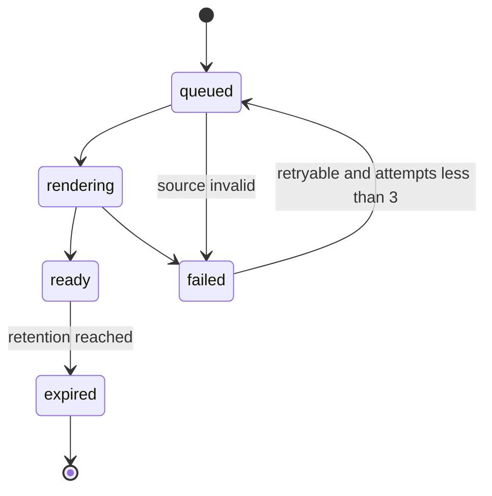

# P3. PDF 생성·저장·다운로드 파이프라인

> V1 PDF 기준선 문서다. P7에서는 요청·입력 section을 제거하고 Executive Summary를 첫 결과 section으로 사용한다. 상세 내용은 [P7 구현안](./phase-07-result-content-upgrade.md)을 따른다.

## 목표

동일한 보고서 snapshot에서 항상 동일한 핵심 내용과 15-stage 기반 섹션 순서를 가진 실제 `%PDF-` 바이너리를 생성한다. 이미지가 많은 전체 여정을 고려해 API 요청 수명과 렌더 작업을 분리하고, private storage와 짧은 다운로드 권한을 사용한다.

## 구현 경로

```text
my-app/lib/v2/report/pdf/
  font-registry.ts
  image-loader.ts
  pdf-design-tokens.ts
  ConsultationReportDocument.tsx
  PdfReportHeader.tsx
  PdfReportSection.tsx
  PdfReportTable.tsx
  PdfReportImages.tsx
  render-report-pdf.ts
  inspect-report-pdf.ts
  renderer-version.ts

my-app/app/api/v2/consultations/[consultationId]/
  report-exports/route.ts
  report-exports/[exportId]/route.ts
  report-exports/[exportId]/download/route.ts
```

작업 실행기는 기존 비동기 작업 인프라와 배포 계약을 재사용한다. 그 계약이 P0에서 확인되지 않으면 첫 구현은 내부 운영자용 synchronous spike로 제한하고 사용자 플래그를 열지 않는다.

## 상태 머신



### 전이 규칙

- worker는 `queued -> rendering`을 조건부 update로 획득한다.
- `rendering` lease는 2분이며 heartbeat가 없으면 recovery job이 재평가한다.
- 동일 job을 두 worker가 렌더해도 storage final path는 한 성공 결과만 가리킨다.
- `failed` 중 source invalid, access denied, font missing은 재시도 금지다.
- network image timeout과 transient storage error만 최대 3회 exponential backoff 한다.

## PDF renderer

### 문서 설정

- A4 portrait
- 12 mm equivalent padding
- PDF title: `HairFit Consultation Report`
- author: `HairFit`
- subject: profile + consultation fingerprint
- keywords에 user ID, email, 얼굴형 결과를 넣지 않음
- creation date는 export 생성 시점
- report snapshot 생성 시점과 상담 version은 본문에 별도 표기

### 폰트

- `Font.register`는 server module 초기화 시 한 번만 수행
- regular/bold 두 weight를 필수로 포함
- 외부 CDN 폰트 로드 금지
- glyph smoke test에 한글 완성형, 영문, 숫자, `₩`, `·`, `+`, `/`, 괄호 포함
- fallback 없는 글리프가 발견되면 export를 `failed/FONT_GLYPH_MISSING`으로 종료

### 이미지 입력

`image-loader.ts`가 허용하는 source는 다음뿐이다.

1. private storage의 검증된 object path
2. 서버 내부 image proxy가 반환한 bounded byte array
3. 저장소가 소유한 정적 asset

금지:

- snapshot에 들어온 임의 외부 URL을 그대로 fetch
- localhost, link-local, private network 주소
- redirect 2회 초과
- MIME sniff 결과가 allow-list와 다른 파일
- SVG script/external reference
- 20 MP 초과 또는 decoded 32 MB 초과 이미지

이미지는 orientation을 정규화하고, PDF용 최대 긴 변 1800 px로 축소한 뒤 JPEG/WebP를 renderer 지원 포맷으로 변환한다. 원본을 덮어쓰지 않고 export 임시 메모리에서만 처리한다.

## 페이지 나눔

- 문서 식별과 요청 명세는 1페이지 유지
- 분석 근거 표는 행 단위 wrapping 허용, table header 반복
- 최종 선택 카드는 이미지+제목+핵심 사유를 한 묶음으로 유지
- Color Studio 최종 컬러 이미지와 Makeup 방향 요약은 각각 독립 묶음으로 유지
- Salon Brief는 새 페이지 시작 허용
- Aftercare checkpoint는 행 단위 유지
- 고지·무결성 footer는 마지막 페이지에 최소 35 mm 공간 확보
- 빈 section은 1~2행 status block만 출력

## 생성 알고리즘

1. export job과 snapshot을 같은 owner 범위로 조회
2. snapshot schema와 digest 재검증
3. snapshot -> view model 변환
4. profile allow-list로 section 재검증
5. 폰트와 이미지 preflight
6. `renderToStream` 또는 `renderToBuffer`
7. PDF magic bytes, page count, byte size, text sample 검사
8. SHA-256 생성
9. temp storage path upload
10. DB transaction으로 ready metadata 기록
11. final path promote 또는 deterministic path copy
12. temp object 삭제

DB ready 기록 전에 final object가 없거나, object 업로드 전에 ready가 되면 안 된다. 중간 실패 시 temp path는 retention cleanup 대상이며 사용자 다운로드 대상이 아니다.

## 저장 경로

```text
consultation-report-exports/
  {userFingerprint}/
    {consultationFingerprint}/
      {snapshotId}/
        {exportId}.pdf
```

실제 user ID와 consultation ID를 path에 평문으로 넣지 않는다. fingerprint는 서버 secret과 domain separation을 사용한 HMAC 또는 승인된 비가역 식별자다.

## API client와 UI

`packages/api-client/src/index.ts`에 추가:

- `createConsultationReportSnapshot`
- `getConsultationReportSnapshot`
- `createConsultationReportExport`
- `getConsultationReportExport`
- `createConsultationReportDownload`

UI 상태:

- `PDF 만들기`: snapshot 선택/생성 dialog
- `준비 중`: polling 1.5s -> 3s -> 5s, 최대 2분
- `다운로드`: ready 이후 명시적 사용자 action
- `다시 만들기`: renderer version이 바뀌거나 export가 만료된 경우
- 이탈 후 돌아오면 최신 non-expired export를 재사용

## 성능과 제한

- 사용자당 active export 2개
- consultation snapshot당 ready export 3개 유지, 이후 오래된 binary부터 만료
- full journey 생성 분당 2회, salon handoff 분당 5회
- 전체 이미지 source bytes 40 MB 이하
- 출력 PDF 15 MB 이하
- 24페이지 초과 시 `REPORT_PAGE_LIMIT_EXCEEDED`
- worker 렌더 hard timeout 30초, 사용자 SLO는 p95 15초 이하

## 구조 검사

렌더 후 다음을 자동 확인한다.

- `%PDF-` header
- EOF marker
- 암호화되지 않은 정상 문서
- page count 1~24
- 파일 크기 20 KB~15 MB
- 제목 또는 report short ID 텍스트 추출 가능
- 각 `ready` section의 heading 존재
- 원본 storage token과 signed URL 문자열 부재
- raw photo 미포함 profile에서 raw photo object fingerprint 부재

## 테스트

### Golden fixture

- full journey 9 images
- partial journey 2 images + unavailable analysis detail
- salon handoff no raw photo
- aftercare long notes
- Korean long text 15 pages

각 fixture는 다음 증거를 만든다.

- PDF SHA는 renderer/font 변경 시 의도적으로 갱신
- page PNG render 150 DPI
- first/last/all section heading text extraction
- page count와 byte size

### Failure injection

- font missing
- image 404/timeout/wrong MIME/decompression bomb dimensions
- storage upload failure
- worker lease loss
- duplicate job delivery
- export expiration during download

### 명령

```powershell
npm --prefix my-app run consultation-report:pdf:test
npm --prefix my-app run consultation-report:pdf:visual
npm run typecheck
npm run lint
npm run build
```

## 롤백

1. `CONSULTATION_PDF_EXPORT_V1_ENABLED=false`
2. worker가 새 queued job을 획득하지 않게 함
3. rendering job은 안전 종료 후 failed/retryable 처리
4. ready PDF는 만료 시까지 유지하되 신규 signed URL 발급은 정책에 따라 중단 가능
5. snapshot과 상담 데이터는 보존
6. storage cleanup은 별도 retention job으로 수행

## Exit Gate

- [ ] 5개 golden fixture의 구조·시각 검사 통과
- [ ] 한글 glyph 누락 0
- [ ] 중복 delivery와 worker lease recovery 검증
- [ ] SSRF·MIME·size 제한 테스트 통과
- [ ] private object와 5분 download authorization 검증
- [ ] p95/파일 크기/page count 예산 통과
