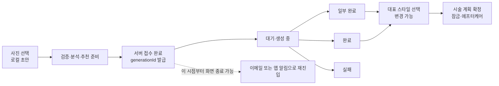

# HairFit 프론트엔드 UI/UX 흐름·컴포넌트 구조 분석 노트

- 작성일: 2026-07-14
- 대상: Next.js 웹 고객·살롱·관리자 경험, Expo 모바일 앱, 웹·앱 공통 계약과 UI 기반
- 상태: 2026-07-14 이전 상태의 감사 스냅샷. 현재 구현 진행 상태는 `docs/frontend-uiux-improvement-plan/README.md`를 따른다.
- 관련 문서: `docs/ui-ux-audit-2026-07-14.md`, `docs/plan-benefit-credit-policy-design.md`, `docs/mobile-port-map.md`

## 1. 결론

HairFit은 고객 생성, 결과 선택, 패션 스타일링, 에프터케어, 결제, 살롱 CRM, 관리자 운영까지 기능 범위가 충분히 넓다. 특히 헤어 생성 작업을 서버의 내구성 있는 작업으로 넘기고 진행 상태와 완료 이메일을 제공하는 방향은 사용자가 화면을 계속 붙들고 있어야 하는 문제를 크게 줄인다.

다만 현재 프론트엔드는 **기능은 존재하지만 사용자가 하나의 일관된 제품으로 이해하기 어려운 상태**다. 가장 큰 문제는 시각 스타일보다 아래 네 가지 구조에 있다.

1. 비용이 발생하는 행동의 가격·잔액·실패 정책이 실행 전에 보이지 않는다.
2. 같은 헤어 생성 기능에 서로 다른 진입 경로와 상태 원천이 공존한다.
3. 웹과 모바일이 공통 도메인 계약을 실제로 공유하지 않아 비용·상태·라우팅이 어긋난다.
4. 공용 UI처럼 보이는 코드가 존재하지만 안정성 등급, 접근성 계약, 테스트, 소유권 경계가 없다.

따라서 다음 작업의 중심은 전면적인 시각 재디자인이 아니라 **신뢰 가능한 유료 행동 → 단일 핵심 여정 → 공통 상태 계약 → 플랫폼별 UI 기반** 순서여야 한다.

## 2. 감사 범위와 판정 원칙

### 2.1 확인 범위

- 웹 `page.tsx` 38개, `layout.tsx` 5개
- 모바일 앱 화면 TSX 34개
- 웹 `my-app/components` TSX 58개
- 네이티브 공용 UI 19개 export가 모인 `packages/ui-native/src/index.tsx`
- 고객, 살롱, 관리자, 인증, 결제, 생성, 결과, 에프터케어, Styler의 진입·성공·실패·복구 흐름
- 공통 타입, 상태 저장소, API client, CSS 토큰, 접근성 속성, 컴포넌트 재사용 구조

### 2.2 심각도

| 등급 | 의미 |
| --- | --- |
| P0 | 금전·권한·개인정보·핵심 전환에서 신뢰를 훼손하거나 사용자가 복구할 수 없는 문제 |
| P1 | 핵심 여정의 이해·완료·재진입·오류 복구를 어렵게 하는 문제 |
| P2 | 접근성, 일관성, 반응형, 표현 품질을 낮추는 문제 |
| S0 | 여러 화면에서 지속적으로 UX 불일치를 만드는 구조적 원인 |
| S1 | 변경 시 회귀 가능성이 높고 기능 확장을 느리게 만드는 구조 |
| S2 | 즉시 장애는 아니지만 장기 유지보수 비용을 키우는 구조 |

### 2.3 근거 수준

- **확정**: 현재 소스에서 행동 또는 계약을 직접 확인했다.
- **검증 필요**: 정적 구조상 위험은 확인했지만 실제 크기, 기기, 운영 데이터에서 재현해야 한다.
- 최초 분석 시 브라우저 자동화 런타임은 초기화 중 `Cannot redefine property: process` 오류로 열리지 않았고 로컬 Next 개발 서버 프록시 연결도 끊겼다. 2026-07-15 후속 Playwright localhost 검증에서는 공개 랜딩 320/375/768/1024/1440px, 로그인·지원·B2B·결제 알림 375px, skip link와 대표 Dialog keyboard 계약을 확인했다. 이는 인증된 생성·결제·살롱 전체 흐름, axe·시각 회귀, iOS/Android 실기기 검증을 대체하지 않는다.

## 3. 제품 여정 진단

| 여정 | 현재 사용자가 겪을 수 있는 혼란 | 우선순위 | 목표 상태 |
| --- | --- | --- | --- |
| 랜딩 → 로그인/가입 → 홈 | 첫 홈에서 구독 안내와 계정 설정 모달이 연속으로 나타날 수 있다. 모바일 인증 성공은 원래 목적지 대신 홈으로 이동한다. | P1 | 로그인 전 목적지를 보존하고 첫 진입 차단 요소는 한 번에 하나만 노출한다. |
| 사진 → 분석 → 생성 접수 | 웹은 `/workspace`와 `/upload → /generate`가 함께 살아 있고, 언제부터 화면을 닫아도 되는지 문구가 모호하다. | P1/S0 | `/workspace` 하나로 시작하고 서버 접수 완료 시점을 명확히 표시한다. |
| 진행 보드 → 결과 | 웹은 처리 중 기록을 진행 화면으로 보내지만 모바일 마이페이지는 모두 결과 화면으로 보낸다. | P1 | 상태에 따라 `진행`과 `결과` 목적지를 공통 selector로 결정한다. |
| 후보 선택 → 시술 확정 | `선택`, `확정`, `대표 스타일`, `잠금`이 화면별로 다른 의미로 사용된다. | P1/S0 | 변경 가능한 선택과 과금·잠금이 수반되는 최종 확정을 별도 상태로 정의한다. |
| 결과 → Styler | 20크레딧 비용을 보여주지 않고 생성하며, 모바일은 작은 화면 모달·진행 복구가 부족하다. | P0/P1 | 비용 확인 후 시작하고 generating/failed 상태를 폴링·재시도할 수 있다. |
| 결과 → 에프터케어 | 첫 1회 무료와 이후 30크레딧 차감이 확정 전에 명확히 보이지 않는다. | P0 | 무료 여부, 비용, 차감 후 잔액, 잠금 결과를 확인한 뒤 실행한다. |
| 잔액 부족 → 결제 → 원래 작업 | 모바일에는 `/billing` 화면이 있지만 앱 내 진입 링크가 없어 핵심 여정을 복구할 수 없다. | P0 | 부족 안내에서 결제하고 원래 유료 행동으로 안전하게 돌아온다. |
| 살롱 초대 → 연결 | 공유되는 정보 범위·보존·철회가 불명확하고, 초대 재발급이 기존 링크를 무효화한다는 안내가 없다. | P1 | 동의 범위와 철회 방법을 명시하고 재발급의 결과를 확인받는다. |
| 관리자 환불·권한 변경 | 환불 승인과 관리자 권한 부여가 단일 클릭으로 실행될 수 있다. | P0 | 고위험 작업은 대상·변경값·되돌릴 수 없는 결과를 재확인하고 감사 기록을 남긴다. |

## 4. 핵심 생성 여정

### 4.1 사용자가 이해해야 하는 단일 상태 모델



현재 구현에서 내구성 있는 실행 경계는 사진 선택 직후가 아니라 분석과 추천 보드 준비 이후다. 따라서 화면에는 다음 두 상태를 분명히 구분해야 한다.

- `준비 중 — 아직 화면을 닫지 마세요.`
- `접수 완료 — 이제 다른 화면으로 이동하거나 앱을 닫아도 됩니다. 완료되면 이메일로 알려드립니다.`

목표 구조는 준비 단계까지 서버 작업으로 옮겨, 사용자가 시작 CTA를 누르고 서버가 요청을 수락한 직후부터 종료할 수 있게 하는 것이다.

### 4.2 이원화된 웹 진입 경로

확정 근거:

- 주 랜딩·홈 CTA는 `/workspace`를 사용한다: `my-app/app/page.tsx:221`, `my-app/app/home/page.tsx:428`.
- 구형 `/upload`는 직접 `/generate`로 이동한다: `my-app/app/upload/page.tsx:84-99`.
- Styler의 헤어 없음 복구는 다시 `/upload`로 보낸다: `my-app/app/styler/new/page.tsx:306-311`.
- `/upload`는 sitemap과 robots allow에도 남아 있다: `my-app/app/sitemap.ts:16`, `my-app/app/robots.ts:10`.

2026-07-15 실행 반영: 위 이원화는 Phase 08 로컬 구현에서 해소했다. 신규 CTA는 `/workspace`로 정렬했고, `/upload`와 ID 없는 `/generate`는 인증 전에 307/no-store redirect한다. owner-scoped 이미지 cache hydration이 끝난 뒤에만 생성 단계를 열며, `/generate/{id}` 진행 경로는 유지한다. sitemap/robots와 billing 복귀 allowlist도 같은 canonical 계약을 사용한다.

사용자 영향:

- 동일 기능인데 단계, 로그인 처리, 상태 저장 방식, 문구가 달라진다.
- 지원 문서와 분석 이벤트가 두 퍼널로 갈라진다.
- 구형 링크를 통해 들어온 사용자는 새 완료 알림·복구 계약을 동일하게 경험한다고 확신할 수 없다.

개선:

1. `/workspace`를 유일한 생성 시작 화면으로 지정한다.
2. `/upload`와 ID 없는 `/generate`는 기존 로컬 초안을 보존한 채 `/workspace`로 redirect한다.
3. sitemap, robots, 메일 CTA, Styler 복구 링크를 함께 교체한다.
4. 분석 이벤트를 `draft_started → accepted → terminal → result_opened`로 통일한다. 2026-07-17 로컬 구현에서 앞 세 단계는 DB 상태 전이, 마지막 단계는 인증된 결과 조회 endpoint가 멱등 기록하도록 반영했다.

### 4.3 진행 기록 라우팅 불일치

- 웹 마이페이지는 완료 시 `/result/:id`, 그 외 상태는 `/generate/:id`로 보낸다: `my-app/components/mypage/MyPageDashboardTabs.tsx:529`.
- 모바일 마이페이지는 처리 중 항목도 모두 `/result/:id`로 보낸다: `apps/hairfit-app/app/mypage.tsx:172-183`.

기존 `docs/ui-ux-audit-2026-07-14.md`의 “처리 중인 마이페이지 기록은 진행 보드로 연결한다”는 완료 주장은 웹에는 맞지만 모바일에는 맞지 않는다. 공통 `generationDestination(status, id)` selector를 `packages/shared`에 두고 양쪽에서 사용해야 한다.

## 5. P0 — 신뢰와 금전 흐름

### 5.1 유료 행동의 비용·잔액·실패 정책 미고지

서버 기본 정책은 헤어 10, Styler 20, 에프터케어 30크레딧이다: `my-app/lib/pricing-plan.ts:8-10`.

| 행동 | 현재 UI | 실제 계약 | 문제 |
| --- | --- | --- | --- |
| 헤어 생성·재생성 | “생성 시작”, “다시 생성” 중심 | 최초 실행에서 기본 10크레딧 차감: `my-app/app/api/generations/run/route.ts:394-473` | 추가 비용인지, 실패 시 어떻게 되는지 실행 전에 알 수 없다. |
| Styler 룩북 | “룩북 이미지 생성” | 기본 20크레딧: `my-app/app/api/styling/generate/route.ts:171-198` | 웹·앱 모두 비용과 차감 후 잔액이 없다. |
| 에프터케어 | 시술 확정·에프터케어 CTA | 첫 1회 무료, 이후 30크레딧: `my-app/app/api/hair-records/route.ts:268-290`, `365-400` | 무료 여부, 이후 가격, 확정 잠금을 한 번에 이해할 수 없다. |

모바일 API client의 에프터케어 응답 타입은 서버가 돌려줄 수 있는 비용·차감·첫 무료 정보를 충분히 표현하지 않는다: `packages/api-client/src/index.ts:630-647`.

필수 개선 계약:

```ts
type PaidActionQuote = {
  action: "hair_generation" | "outfit_generation" | "aftercare";
  costCredits: number;
  currentBalance: number;
  balanceAfter: number;
  isFree: boolean;
  isAllowed: boolean;
  failurePolicyLabel: string;
  lockConsequence?: string;
};
```

- 서버가 quote를 결정하고 클라이언트는 가격을 하드코딩하지 않는다.
- CTA는 `20크레딧 사용하고 생성`처럼 결과를 포함한다.
- 확인 화면에 현재 잔액, 차감 후 잔액, 첫 무료 여부, 실패·환불 정책, 잠금 결과를 표시한다.
- 잔액 부족은 API 실행 후 오류가 아니라 실행 전 결제 복구 CTA로 보여준다.
- 성공 후 영수증형 피드백에 실제 차감액과 남은 잔액을 표시한다.

### 5.2 모바일 결제 복구 경로 단절

- 모바일 `/billing` 화면은 존재하지만 앱 내 `/billing` 진입 링크가 없다.
- 마이페이지의 플랜/결제 패널은 조회 중심이다: `apps/hairfit-app/app/mypage.tsx:193-226`.
- 결제 플랜은 앱에 하드코딩되어 있다: `apps/hairfit-app/app/billing.tsx:10-14`.
- 결제 완료 실패는 재시도 없이 마이페이지 복귀에 의존한다: `apps/hairfit-app/app/payments/complete.tsx:12-50`.

이 구조에서는 크레딧이 부족한 사용자가 돈을 낼 의사가 있어도 생성 흐름을 완료할 수 없다. `PaidActionConfirm → Billing → PaymentComplete → 원래 action 복귀`를 하나의 return URL 계약으로 만들고, 결제 성공·실패·취소를 별도 상태로 보여줘야 한다.

### 5.3 관리자 고위험 행동의 안전장치 부족

- 전액 환불 승인: `my-app/app/admin/refunds/page.tsx:233-255`.
- 실제 PortOne 취소 실행: `my-app/app/api/admin/payments/refunds/[requestId]/approve/route.ts:216-222`.
- 관리자 권한 변경과 크레딧 조정: `my-app/app/admin/members/page.tsx:245-319`.

공통 `ConfirmActionDialog`에 대상 사용자·거래, 현재값→변경값, 환불 금액, 되돌릴 수 없는 결과를 표시해야 한다. 전액 환불과 관리자 권한 부여에는 재인증 또는 확인 문구 입력을 추가하고, 완료 후 처리자·시각·취소 ID를 남겨야 한다.

## 6. P1 — 이해, 복구, 재진입

### 6.1 선택과 확정의 의미 충돌

- 워크스페이스의 후보 선택은 변경 가능한 대표 스타일 저장이다: `my-app/components/workspace/WorkspaceWizard.tsx:605-627`.
- Styler는 `selectedVariantId`만 있어도 “확정된 헤어”로 취급한다: `my-app/app/styler/new/page.tsx:456-472`.
- 실제 변경 불가 확정은 결과 화면의 시술·에프터케어 동작이다: `my-app/components/result/ActionToolbar.tsx:285-293`.

권장 용어와 상태:

| 상태 | 사용자 문구 | 변경 가능 | 비용·잠금 |
| --- | --- | --- | --- |
| generated | 후보가 준비됐어요 | 해당 없음 | 없음 |
| selected | 대표 스타일로 선택 | 가능 | 없음 |
| confirmed | 시술 계획 확정 | 불가 또는 명시적 해제 필요 | 에프터케어 비용 가능 |

서버 필드, CTA, 배지, 마이페이지 기록, Styler 조건을 같은 상태 모델에 맞춰야 한다.

### 6.2 오류·빈 상태·로딩의 혼합

홈, 마이페이지, 에프터케어, 살롱 고객 목록, 관리자 목록에서 조회 실패를 `[]`, `null`, `0`으로 바꾸면서 실제 빈 상태와 장애를 구분하기 어렵다. Styler의 일부 fetch 경로는 `catch/finally`가 없어 로딩이 계속될 수 있다.

대표 근거:

- 웹 홈: `my-app/app/home/page.tsx:252-315`
- 웹 Styler: `my-app/app/styler/new/page.tsx:406-483`, `509-623`
- 모바일 결과: `apps/hairfit-app/app/result/[id].tsx:49-94`
- 모바일 관리자 통계: `apps/hairfit-app/app/admin/stats.tsx:52-68`

모든 비동기 패널은 아래 상호 배타적 계약을 사용해야 한다.

```ts
type ResourceState<T> =
  | { status: "idle" }
  | { status: "loading" }
  | { status: "ready"; data: T }
  | { status: "empty" }
  | { status: "error"; message: string; retry: () => void };
```

검색은 `AbortController` 또는 요청 sequence로 이전 응답이 최신 결과를 덮지 않게 한다. 사용자 메시지는 raw 서버 오류를 직접 노출하지 않고 안전한 오류 매퍼를 거친다.

### 6.3 결과 원본과 공유 계약

- 결과 조회 실패가 별도 오류 상태 없이 끝날 수 있다: `my-app/app/result/[id]/page.tsx:95-155`.
- 원본 또는 결과가 없으면 generic placeholder를 사용한다: `my-app/app/result/[id]/page.tsx:170-175`.
- 비교 컴포넌트는 이를 원본 이미지처럼 설명한다: `my-app/components/result/ComparisonView.tsx:20-36`.
- 공유 링크는 인증이 필요한 `/result/:id`다: `my-app/middleware.ts:9-21`.

완료 후 원본이 삭제되고 새 브라우저에는 로컬 preview가 없을 수 있으므로, 이메일 링크 재진입에서 가짜 원본이 비교 화면에 나타날 가능성이 높다. 실제 브라우저 E2E가 필요하지만 구조는 수정해야 한다.

- `beforeImage: null`을 허용하고 “개인정보 보호를 위해 원본이 삭제되었습니다”를 표시한다.
- 비교가 꼭 필요하면 별도 동의를 받은 저해상도 썸네일과 보존 기한을 정의한다.
- 공개 공유를 지원하려면 만료 가능한 읽기 전용 snapshot URL을 발급한다.
- 현재처럼 계정 전용이라면 버튼명을 `내 계정용 링크 복사`로 바꾼다.

### 6.4 결과 액션 과밀

결과 하단 툴바에는 공유, 다운로드, AI 평가, 상담지, 패션, 확정, 재생성이 동급으로 배치된다: `my-app/components/result/ActionToolbar.tsx:231-302`.

현재 상태에 맞는 주 CTA 하나만 남겨야 한다.

- 선택 전: `이 스타일 선택`
- 선택 후: `시술 계획 확정`
- 확정 후: `에프터케어 보기`
- 공유·다운로드·평가·상담지는 `더보기`
- 재생성은 비용 확인이 있는 보조 위험 행동

320px/375px에서 고정 툴바가 본문을 가리는지 실제 브라우저 검증이 필요하다.

### 6.5 인증·온보딩 복귀

- 모바일 로그인·OAuth·가입 성공은 원래 목적지를 보존하지 않고 홈으로 이동한다: `apps/hairfit-app/app/(auth)/login.tsx:110-159`, `signup.tsx:102-176`.
- MFA는 웹에서 완료하라는 안내에 의존하고 비밀번호 재설정 진입이 없다.
- 살롱 초대에서 로그인하면 invite code를 잃을 수 있다: `apps/hairfit-app/app/salon/match/[code].tsx:56-61`.
- `docs/mobile-port-map.md`는 `/onboarding`을 ported로 표시하지만 실제 `apps/hairfit-app/app/onboarding.tsx`는 없다.
- 서버는 생성 전에 성별이 없으면 428을 반환한다: `my-app/app/api/prompts/generate/route.ts:120-129`.

인증 route에는 allowlist 기반 `returnTo`를 적용하고, 살롱 invite code와 결제 복귀 정보를 보존해야 한다. 생성 전에 필수 프로필 누락을 확인해 사진 업로드 이후 늦게 막히지 않게 한다.

### 6.6 모바일 화면 셸과 긴 목록

- 루트가 `Slot` 중심이고 StatusBar를 숨긴다: `apps/hairfit-app/app/_layout.tsx:18-30`.
- 공용 `Screen`은 top safe area만 적용하고 모든 화면을 `ScrollView`로 감싸며 footer 위치는 고정값에 의존한다: `packages/ui-native/src/index.tsx:155-181`, `395-411`.
- 저장소에서 `KeyboardAvoidingView`, `FlatList`, `SectionList`, `RefreshControl` 사용을 찾지 못했다.
- 관리자 목록은 최대 80개를 한 번에 렌더하고 pagination이 없다.

정적 구조상 키보드 가림, 홈 인디케이터 겹침, 긴 목록 성능 저하 가능성이 있다. 실제 기기 확인을 전제로 아래 셸로 분리한다.

- `PageScaffold`: 공통 safe area, status bar, 역할별 내비게이션
- `ScrollScreen`: 짧은 읽기 화면
- `FormScreen`: 키보드 회피, submit footer, 오류 focus
- `VirtualizedListScreen`: FlatList/SectionList, pagination, refresh

### 6.7 살롱 동의와 운영 목록

- 살롱 연결 수락 화면은 어떤 데이터가 공유되는지 충분히 설명하지 않는다: `my-app/components/salon/MatchInviteClient.tsx:113-122`.
- 실제 API는 이메일과 최근 생성 기록까지 제공한다: `my-app/app/api/salon/customers/[id]/route.ts:83-122`.
- 초대 재발급은 기존 활성 링크를 즉시 무효화한다: `my-app/app/api/salon/matching/invite/route.ts:79-85`.
- 살롱 고객·매칭과 관리자 목록은 limit만 있고 전체 탐색 UI가 없다.

수락 전 공유 항목, 목적, 보존 기간, 철회 방법을 요약하고 연결 해제 기능을 제공한다. 재발급에는 기존 링크 무효화 확인을 추가한다. 목록에는 cursor pagination과 `1–100 / 총 N` 표기를 적용한다.

## 7. 컴포넌트 구조 진단

### 7.1 인벤토리와 결합도

가장 큰 feature 파일:

| 파일 | 규모 | 구조 위험 |
| --- | ---: | --- |
| `my-app/components/salon/SalonWorkspaceWizard.tsx` | 약 1,149줄 | 약 24개 로컬 상태, API, 동의, 렌더링 결합 |
| `my-app/components/mypage/MyPageDashboardTabs.tsx` | 약 1,101줄 | 탭, panel, formatter, 로컬 UI 중복 집중 |
| `my-app/components/workspace/WorkspaceWizard.tsx` | 약 1,016줄 | store, 업로드, API, 라우팅, dialog 결합 |
| `my-app/app/styler/new/page.tsx` | 약 950줄 | 상태, fetch, modal, 결제 행동 결합 |
| `apps/hairfit-app/app/mypage.tsx` | 약 658줄 | 모바일 panel과 데이터 표현 집중 |
| `apps/hairfit-app/app/styler/new.tsx` | 약 645줄 | 이미지, modal, 유료 생성, 오류 처리 결합 |
| `packages/ui-native/src/index.tsx` | 약 544줄 | 테마, layout, form, primitive, composite가 한 파일에 집중 |

파일 길이 자체가 문제는 아니다. 그러나 이 파일들은 화면 렌더링과 네트워크·도메인 전이·전역 상태·모달을 함께 소유한다. 이 때문에 작은 문구나 버튼 변경도 결제, 라우팅, 복구 상태를 건드릴 수 있다.

### 7.2 웹 UI 기반

- `Button`은 약 36개 import와 native button semantics, focus-visible을 갖춘 candidate다: `my-app/components/ui/Button.tsx:17`.
- `Surface` 계열은 약 38개 import와 `.app-*` namespace를 사용하는 candidate다: `my-app/components/ui/Surface.tsx:25`.
- `Card`, 공용 `SectionHeader`, `StatusBadge`는 현재 import 사용처가 없어 공용 기반으로 인정하기 어렵다.
- 마이페이지는 별도의 `SectionHeader`를 다시 정의한다: `my-app/components/mypage/MyPageDashboardTabs.tsx:440`.

전역 CSS는 의미 토큰과 `.app-*` surface 계약이라는 좋은 기반이 있다: `my-app/app/globals.css:3-86`, `238` 이후. 반면 Tailwind palette class를 전역 `!important`로 다시 해석하는 호환층이 `my-app/app/globals.css:474` 이후에 넓게 존재한다. 이 방식은 컴포넌트 내부의 평범한 utility 변경이 전역에서 다른 의미가 되는 숨은 계약을 만든다.

전면 삭제는 위험하다. Button, Surface, Dialog, InlineAlert, FormField처럼 의미 컴포넌트로 이전한 사용처부터 override를 단계적으로 축소해야 한다.

### 7.3 네이티브 UI 패키지 이중화 — S0

- 모바일 tsconfig는 `@hairfit/ui-native`를 실제 패키지 대신 앱의 `lib/ui-native.tsx`로 alias한다: `apps/hairfit-app/tsconfig.json:15`.
- 앱 브리지는 패키지를 export하면서 `Screen`과 Provider를 다시 정의한다: `apps/hairfit-app/lib/ui-native.tsx:42` 이후.
- 원 패키지에도 같은 `HeaderNavigationProvider`, `PatternLayer`, `Screen`이 있다: `packages/ui-native/src/index.tsx:93` 이후.
- `showHeader` prop과 Header context는 실질적인 소비 계약이 없다.
- 앱은 React Native 0.83.6인데 UI package peer 범위는 `>=0.85`다.

권장 경계:

- `@hairfit/ui-native`: Button, TextField, Stack, Chip 등 순수 native primitive
- 앱 `AppScreen`: 패턴 배경, safe area, status bar, footer, 앱 navigation
- 죽은 context와 무효 prop 제거
- app과 package의 React Native peer 범위 일치

### 7.4 공통 도메인 패키지가 웹에는 공통이 아님 — S0

모바일은 `@hairfit/shared`와 `@hairfit/api-client`를 사용하지만 웹은 생성·패션 타입을 로컬에서 다시 정의한다.

- 공유 생성 DTO: `packages/shared/src/index.ts:171`
- 웹 생성 DTO: `my-app/lib/recommendation-types.ts:30`
- 공유 패션 DTO: `packages/shared/src/index.ts:237`
- 웹 패션 DTO: `my-app/lib/fashion-types.ts:3`

실제 드리프트 사례가 모바일 마이페이지의 `credits / 5`다: `apps/hairfit-app/app/mypage.tsx:573`. 서버 기본 헤어 비용은 10크레딧이므로 사용 가능 횟수를 두 배로 보이게 한다.

공유해야 할 것:

- API DTO와 status enum
- 크레딧·플랜 selector
- status → label/tone/route selector
- 생성 단계 전이와 terminal 판정
- 개인 컬러 결과를 화면 section으로 바꾸는 순수 모델

공유하지 말아야 할 것:

- DOM과 React Native의 실제 렌더 컴포넌트
- focus trap, safe area, navigation, image renderer
- 고객과 살롱의 동의·방문·에프터케어 비즈니스 규칙

### 7.5 상태 소유권 — S0

웹 생성 store는 업로드 파일과 generation ID, 결과 grid, selected ID를 함께 저장한다: `my-app/store/useGenerationStore.ts:26`. 결과 화면은 서버 응답과 store fallback을 동시에 사용한다. 모바일도 전역 generation draft와 서버 detail을 병합한다.

목표 소유권:

| 시점 | 단일 원천 | 클라이언트 저장소 역할 |
| --- | --- | --- |
| 서버 접수 전 | 로컬 draft | 사진 URI, 분석 입력, optimistic preview |
| generation ID 발급 후 | 서버 generation detail | 화면 전환 캐시, 마지막 성공 응답 |
| 선택 PATCH 후 | 서버 선택 상태 | optimistic 표시 후 서버 응답으로 정합화 |
| terminal 후 | 서버 결과·알림 상태 | 읽기 캐시, 다운로드 상태 |

이 변경은 앱 종료 후 복구와 직접 연결되므로 단계별 adapter와 회귀 테스트 없이 store를 한 번에 걷어내면 안 된다.

### 7.6 Component Passport 판정

현재 `*.stories.*`, 컴포넌트 interaction test, Storybook, registry, Passport를 찾지 못했다. 따라서 지금 `stable`로 판정할 수 있는 컴포넌트는 없다.

| 컴포넌트 | 종류 | 현재 수준 | 승격 전 필수 조건 |
| --- | --- | --- | --- |
| 웹 `Button` | primitive | candidate | loading/disabled/a11y 계약, interaction·visual test |
| 웹 `Surface` | layout | candidate | variant/CSS contract, glow selector 결합 완화 |
| 웹 `Card` | composite | experimental/orphan | `SurfaceCard`와 역할 결정, 실제 채택 또는 폐기 |
| 웹 `SectionHeader` | composite | experimental/orphan | heading level API, 로컬 중복 통합 |
| 웹 `StatusBadge` | data-display | experimental/orphan | 공통 status selector 연결, 실제 사용처 |
| 네이티브 `Button` | primitive | candidate | Pressable props, accessibilityLabel/State, testID, loading |
| 네이티브 `TextField` | form primitive | experimental | label 연결, helper/error/disabled, 오류 안내 |
| 네이티브 `Screen` | layout | experimental | 이중 구현 제거, safe-area와 navigation 책임 분리 |
| `PipelineStatusIndicator` | feedback | candidate | 상태 interaction, screen reader, visual regression |
| 고객·살롱 Wizard | feature | experimental | controller/view/API 분리, 상태 전이 test |
| `MyPageDashboardTabs` | feature | experimental | panel 분리, async state 계약, responsive test |

## 8. 접근성·반응형·표현 품질

### 8.1 확인된 좋은 기반

- 웹 Button은 native semantics와 focus-visible을 유지한다.
- 마이페이지 탭은 `tablist`, `tab`, `tabpanel`, `aria-selected`를 구현한다.
- 생성 진행 상태는 `status`, `progressbar`, `alert`를 사용한다: `my-app/components/generate/PipelineStatusIndicator.tsx:109`.
- 모바일 퍼스널컬러 진행 일부에는 live region과 progressbar가 있다.

### 8.2 개선이 필요한 계약

- 웹에 독립적으로 구현된 dialog shell이 7개 있고 초기 focus, trap, ESC, focus restore, scroll lock 공통 계약이 없다.
- 후보 선택 버튼에 `aria-pressed`가 없고 비교 UI는 hover/focus 중심이다.
- `Link > Button` 중첩이 남아 있다: `my-app/app/upload/page.tsx:84-99`.
- skip link와 현재 메뉴 `aria-current`가 없다.
- App Router의 `loading.tsx`, `error.tsx`, `not-found.tsx` 경계가 없다.
- 네이티브 Button은 접근성 props 전달 범위가 좁고 TextField의 시각적 label이 입력과 명시적으로 연결되지 않는다.
- 모바일 이미지의 대체 설명, 선택 상태, 동적 오류 live region이 부족하다.
- 퍼스널컬러의 `Live/실시간 계산` 수치는 실제 서버 진행률이 아니라 수학 애니메이션이다. 시각 샘플이라고 밝히거나 실제 값만 표시해야 한다.
- 무한 반복 애니메이션의 reduced-motion 대응과 권한 영구 거부 시 OS 설정 복구가 없다.
- 사용자 행동 문구와 오류에 한국어·영어·개발자 설명이 혼재한다.

## 9. 목표 프론트엔드 구조

```text
packages/shared/src/
  generation/
    contract.ts          # DTO, status, terminal 판정
    selectors.ts         # label, tone, destination
    state-machine.ts     # 허용 전이
  billing/
    contract.ts          # quote, receipt, failure policy
    selectors.ts

my-app/features/generation/
  components/            # plain props 기반 웹 view
  hooks/                 # useGenerationJobController
  adapters/              # customer/salon API 차이

my-app/components/ui/
  Button
  Surface
  Dialog
  AsyncBoundary
  InlineAlert
  FormField

packages/ui-native/src/
  primitives/
  forms/
  feedback/

apps/hairfit-app/components/app/
  PageScaffold
  ScrollScreen
  FormScreen
  VirtualizedListScreen
  PaidActionSheet
```

핵심 원칙:

1. 페이지는 인증과 route orchestration만 맡는다.
2. controller는 비동기 전이와 복구를 맡고 JSX를 소유하지 않는다.
3. composite는 plain props와 semantic callback만 받는다.
4. 공통 package는 도메인 의미를 공유하고 플랫폼 렌더링은 합치지 않는다.
5. generation ID 발급 후 서버를 유일한 상태 원천으로 사용한다.
6. 결제 가능 행동은 반드시 quote → confirm → execute → receipt 순서를 따른다.

## 10. 개선 실행 순서와 수용 기준

> 아래 Phase A–E는 방향 요약이다. 독립 배포·검증·롤백 단위로 분리한 상세 실행 문서는 `docs/frontend-uiux-improvement-plan/README.md`와 Phase 00–13 개별 문서를 기준으로 한다.

### Phase A — 신뢰·과금 차단선

작업:

- 서버 주도 `PaidActionQuote` 계약 추가
- 웹 `CostAwareActionDialog`, 앱 `PaidActionSheet` 도입
- 헤어, 재생성, Styler, 에프터케어에 동일 계약 적용
- 모바일 부족 크레딧 → billing → 원래 작업 복귀
- 환불·권한 변경·크레딧 조정에 고위험 확인과 감사 영수증 적용

수용 기준:

- 모든 유료 CTA가 실행 전에 비용, 잔액, 차감 후 잔액, 무료 여부를 표시한다.
- 부족 사용자는 결제 후 같은 작업으로 돌아온다.
- 실패·취소·중복 탭에서 이중 차감이 발생하지 않는다.
- 환불과 관리자 권한 상승은 한 번의 클릭으로 완료되지 않는다.

### Phase B — 단일 핵심 여정과 복구

작업:

- `/workspace` 단일 진입, 구형 `/upload`·ID 없는 `/generate` redirect
- 서버 접수 전/후 종료 안내 분리
- 모바일 처리 중 기록 라우팅 수정
- `selected`와 `confirmed` 용어·상태 통일
- 결과 원본 없음, 오류, private share 상태 명확화
- 인증·살롱 초대·결제 `returnTo` 보존
- 필수 온보딩 사전 확인

수용 기준:

- 모든 생성 시작 CTA가 같은 화면과 같은 상태 머신으로 들어온다.
- 접수 완료 전에는 종료 경고, 완료 후에는 종료 가능 안내가 정확히 보인다.
- 웹 종료, 앱 강제 종료 후 이메일 링크로 진행·완료 상태에 재진입한다.
- loading, empty, error, partial, completed가 서로 다른 UI로 보인다.

### Phase C — 공통 계약과 UI 기반

작업:

- generation, billing, status route selector를 `packages/shared`로 이동
- 모바일 `@hairfit/ui-native` alias 이중화 제거
- 앱 전용 `AppScreen`과 네이티브 primitive 분리
- 웹 Dialog, AsyncBoundary, InlineAlert, FormField 도입
- Wizard, MyPage, Styler를 controller·adapter·view로 분해
- 전역 `!important` 호환 CSS를 채택된 의미 컴포넌트부터 축소

수용 기준:

- 크레딧 비용과 상태 목적지를 웹·앱에서 하드코딩하지 않는다.
- 동일 API 응답은 웹·앱에서 같은 status label, tone, 다음 route를 만든다.
- dialog keyboard 계약과 native field 접근성 계약이 자동 테스트된다.
- 대형 feature 분해 전후 사용자 흐름의 상태 전이 회귀 테스트가 통과한다.

### Phase D — 운영 화면·접근성·성능

작업:

- 살롱 동의 범위·철회, 초대 재발급 확인
- 관리자·살롱 cursor pagination과 검색 race 방지
- 모바일 역할별 Stack/Tabs, safe area, keyboard, virtualized list
- skip link, `aria-current`, touch comparison, reduced motion, 권한 설정 복구
- KO/EN 사용자 문구와 내부 오류 분리

수용 기준:

- 목록이 잘렸을 때 현재 범위와 총 건수를 사용자가 알 수 있다.
- 키보드, VoiceOver/TalkBack, 200% 글자 크기에서 핵심 여정을 완료한다.
- iOS 홈 인디케이터와 Android 키보드·뒤로가기에서 CTA가 가려지지 않는다.
- 빈 데이터와 네트워크 장애를 사용자가 구분하고 재시도할 수 있다.

### Phase E — 안정성 승격

작업:

- `docs/components/component-registry.json`과 Component Passport 도입
- candidate 컴포넌트 interaction test와 visual baseline 작성
- 웹 핵심 여정 E2E, 모바일 실기기 smoke, 결제·생성 종료 복구 E2E 구축
- 사용하지 않는 `src_legacy_scaffold`를 감사·스캔 범위에서 명시적으로 제외하거나 제거 계획 기록

수용 기준:

- Passport, 접근성, interaction, 시각 회귀를 통과한 컴포넌트만 `stable`로 승격한다.
- component scanner가 route와 legacy scaffold를 재사용 컴포넌트로 잘못 집계하지 않는다.
- UI 계약 변경이 있는 PR은 영향 화면과 검증 증거를 남긴다.

## 10.1 2026-07-15 구현 후 잔여 구조 리스크

이번 로컬 개선으로 생성 Quote·크레딧 예약/정산, 결제 callback 복구, 계정 전환 격리와 완료 이메일 outbox의 P0/P1 경계는 닫았다. 다음 항목은 출시 차단으로 과장하지 않되 후속 페이즈에서 구조적으로 해소해야 할 P2 리스크다.

- 살롱 생성 Quote는 살롱 payer에는 결속됐지만 동일 살롱 소유자의 정확한 `customerId`까지 Quote context와 replay 양쪽에서 검증하지 않는다. Phase 03·07A·11B에서 고객 오귀속 방지를 추가한다.
- 살롱 동의·스타일 metadata가 생성 accept RPC보다 먼저 저장돼 접수 실패 시 입력 변경만 남을 수 있다. Phase 07A·11B에서 사용자 입력과 금융 접수의 transaction 경계를 재정의한다.
- 동일 `clientRequestId`의 draft 업로드가 동시에 들어오면 DB checksum과 마지막 storage blob의 경합 가능성이 남는다. Phase 07A·07B에서 checksum 기반 object key와 strict replay 일치 검증을 추가한다.
- 장기 미확정 모바일 결제는 중복 결제를 안전하게 차단하지만 사용자가 스스로 해제할 수 없다. Phase 06에서 서버 확인 기반 취소 또는 추적 가능한 고객지원 case 생성 경로를 제공한다.

## 10.2 2026-07-15 관리자 고위험 흐름 실행 노트

기존 관리자 회원·환불 화면은 표 안의 작은 버튼이 즉시 mutation을 호출했다. 이 구조는 대상·현재 값·변경 후 값을 한 시야에서 비교할 수 없고, stale 목록·중복 클릭·외부 결제 timeout을 모두 일반 실패처럼 보이게 했다.

이번 개선에서 확인 흐름을 `대상 선택 → 변경 전후 확인 → typed phrase → expected-state RPC → 결과 receipt`로 고정했다. UI만 막는 것이 아니라 DB action key와 row lock이 최종 방어선이다. 따라서 같은 클릭이 재전송되어도 credit ledger나 PortOne cancel을 반복하지 않고 기존 감사 영수증을 반환한다.

환불은 특히 외부 응답이 없다는 사실과 취소가 실패했다는 사실을 분리했다. 첫 요청만 cancel을 실행하고 timeout은 `provider_pending`으로 남긴다. 이후 동일 작업은 PortOne lookup만 수행하며, webhook이 먼저 도착하면 환불 metadata와 action key를 보존한 채 원장과 receipt를 함께 완료한다. 운영자는 결과 panel에서 success, already processed, conflict, processing, provider pending, failed를 구분하고 receipt ID·시각·외부 취소 ID로 후속 조사를 시작할 수 있다.

컴포넌트 구조에서는 feature별 confirm modal을 새로 만들지 않고 `ConfirmActionDialog`의 target/before/after/confirmation slot을 admin 두 화면이 공유한다. 이 wrapper를 별도 experimental Passport로 등록해 Dialog primitive의 focus·ESC·restore 계약과 admin 도메인의 typed phrase·pending repeat-submit 방지를 분리했다.

남은 위험은 구현이 아니라 외부 증거다. linked Supabase migration, PortOne sandbox timeout/중복 webhook, Clerk 실제 metadata sync, 인증 관리자 keyboard·axe·responsive interaction은 아직 수행하지 않았다. 이 항목이 없으므로 component status와 전체 release 판정은 stable로 올리지 않는다.

## 11. 반드시 수행할 런타임 검증

| 영역 | 시나리오 |
| --- | --- |
| 생성 종료 복구 | 웹 탭 이동·브라우저 종료·앱 백그라운드·강제 종료 후 서버 완료, 이메일 1회, 링크 재진입 |
| 생성 실패 | 일부 완료, 전체 실패, 재시도, 만료 인증, 중복 시작, offline → online |
| 결제 | 충분/부족 잔액, 성공, 취소, 실패, 중복 탭, 결제 후 returnTo, 실제 차감 영수증 |
| 결과 | 원본 삭제 후 이메일 링크, placeholder 미노출, private share, 부분 결과, 고정 툴바 |
| 반응형 웹 | 320, 375, 768, 1024, 1440px; mobile menu, dialog, 결과 action, 관리자 표 |
| 모바일 | iPhone mini, 홈 인디케이터, Android 키보드·back, 큰 글씨, 회전, 느린 네트워크 |
| 접근성 | 키보드 전용, dialog focus 이동·복원, VoiceOver/TalkBack, live status, 선택 상태 |
| 살롱·관리자 | 초대 철회·재발급, 100건 이상 pagination, stale search, 환불·권한 재확인 |

## 12. 최종 우선순위

1. 유료 행동 quote·확인·결제 복구와 관리자 고위험 작업 안전장치
2. `/workspace` 단일 생성 여정과 접수 완료 시점의 명확한 종료 안내
3. 모바일 처리 중 route, 인증 returnTo, 온보딩 누락, 오류/빈 상태 분리
4. 공유 상태·선택/확정 용어·결과 액션 우선순위 정리
5. `packages/shared`의 상태·비용 계약과 네이티브 UI 이중 구조 정리
6. Dialog/AsyncBoundary/FormField/AppScreen 기반과 대형 feature 분해
7. 접근성·pagination·실기기·시각 회귀 검증 후 stable 승격

현재 제품에서 가장 먼저 손봐야 할 것은 색상이나 카드 모양이 아니다. **사용자가 돈이 드는지, 작업이 접수됐는지, 지금 화면을 닫아도 되는지, 실패했을 때 어디서 다시 시작하는지**를 모든 플랫폼에서 동일하게 알 수 있게 만드는 것이 우선이다.
