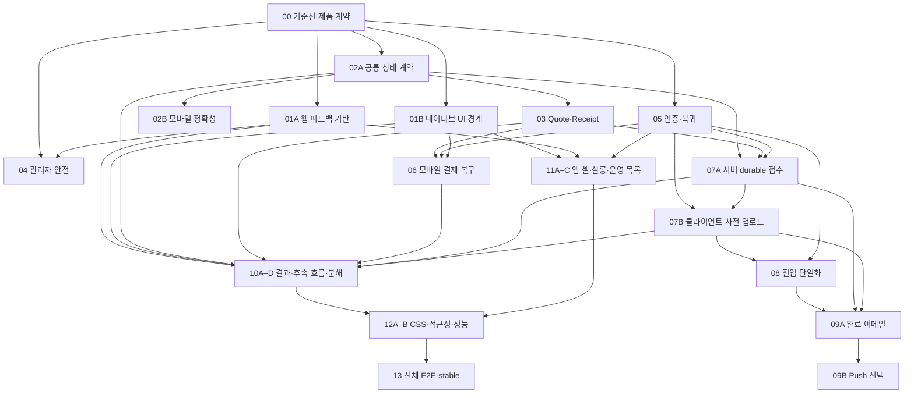

# HairFit 프론트엔드 UI/UX 개선 실행 플랜

- 작성일: 2026-07-14
- 상태: 구현 진행 중 — Phase 03의 고정 단가·원자 실행, Phase 04 관리자 안전, Phase 06 결제 복귀, Phase 07A·07B durable 접수, Phase 08 canonical 진입, Phase 09A 완료 이메일, Phase 09B Push 로컬 계약, Phase 10A 결과 의사결정, Phase 10B Styler 202 접수·전용 Workflow/outbox·완료 이메일, Phase 10D-1~10D-4 구조 분해, Phase 11A/11C 대표 네이티브 셸·운영 pagination, Phase 11B 살롱 동의·철회, Phase 12A CSS 계약과 Phase 01A/12B 운영 Dialog interaction·실제 테스트 Clerk 인증 진입 E2E, 고객·관리자·살롱 14-test 보호 화면 lane을 로컬 구현; 원격 migration·배포, 실제 Resend/Expo Push, PortOne sandbox/webhook, 로그인 완료 뒤 보호 화면의 승인된 fixture green run, 실제 스크린리더, iOS/Android 실기기와 운영 Push 자격 증명은 미완료
- 기준 분석: `docs/frontend-uiux-flow-component-architecture-analysis-2026-07-14.md`
- 제품 정책 SSoT: `docs/plan-benefit-credit-policy-design.md`
- 적용 범위: Next.js 웹, Expo 앱, 공통 계약, 생성 Workflow, 결제·알림·살롱·관리자 UI

## 1. 문서 목적

기존 분석의 Phase A–E는 방향을 이해하기에는 적합하지만, 한 페이즈 안에 과금·인증·라우팅·상태 소유권·컴포넌트 리팩터링이 함께 들어 있어 독립 배포와 원인별 롤백이 어렵다.

이 디렉터리는 개선 작업을 다음 원칙으로 다시 나눈 실행 명세다.

1. 한 페이즈는 하나의 주된 사용자 문제 또는 하나의 구조 계약만 바꾼다.
2. 각 페이즈는 독립적으로 검증·배포·롤백할 수 있어야 한다.
3. 사용자 행동 변경과 behavior-preserving 리팩터링을 같은 페이즈에 넣지 않는다.
4. 가격, 상태, route, 접근성 계약을 코드와 자동 검증에 함께 남긴다.
5. 후속 페이즈는 선행 페이즈의 출력 계약만 사용하고 내부 구현을 추측하지 않는다.

## 2. 실행 규칙

### Git 경계

- 각 페이즈 착수 전에 `$git-workflow-manager` preflight를 다시 실행한다.
- 구현 브랜치는 그 시점의 정확한 통합 대상과 SHA를 기록한 뒤 만든다.
- 사용자 행동 변경은 `feat/*`, behavior-preserving 구조 변경은 `refactoring/*`, 문서·테스트 기반만 바꾸는 작업은 `dev/*`를 기본 후보로 삼되 실제 저장소 프로필을 우선한다.
- 한 페이즈의 완료는 다른 브랜치 병합, push, release, deploy를 자동으로 허가하지 않는다.
- 현재 생성 완료 알림 작업이 아직 `main`에 통합되지 않았다면 Phase 07A·07B와 Phase 09A는 현재 알림 브랜치의 정확한 commit을 선행 입력으로 묶어야 한다.

### 컴포넌트 경계

- 모든 재사용 컴포넌트는 kind, stability level, public API, CSS, 상태, 접근성, 테스트 표면을 Passport에 기록한다.
- Phase 13 전까지 새 기반 컴포넌트는 `experimental` 또는 `candidate`다.
- `stable` 승격은 재사용 횟수가 아니라 계약·접근성·interaction·visual 증거로 결정한다.
- CSS selector, token, namespace, cascade layer 변경은 `style-contract` 변경으로 취급한다.

### 검증 경계

현재 명령의 실제 범위는 다음과 같다.

- `npm run typecheck`: 웹 `my-app`을 포함한 7개 workspace의 TypeScript 검사를 실행한다.
- `npm run lint:all`: 웹, Expo 앱, `@hairfit/ui-native`를 검사한다. 2026-07-15 기준 오류 0개·경고 10개였고, 2026-07-17 비-에프터케어 운영 목록 패치 뒤 오류 0개·범위에서 제외한 에프터케어 경고 1개다.
- `npm run build`: Next.js 웹만 빌드하고 Expo production bundle은 만들지 않는다.
- `npm run mobile:bundle`: Expo web/iOS/Android production export를 별도로 검증한다.
- `npm run mobile:sync`: 파일과 문자열 계약 검사이며 실기기 검증이 아니다.
- `npm run paid-action:contract:test`: Quote 서명·만료·재확인과 paid-action 실행 정적 계약을 검사한다. DB transaction·동시성은 별도 PostgreSQL smoke가 증명한다.
- `npm run generation-entry:contract:test`: 구형 `/upload`·ID 없는 `/generate`의 canonical redirect, owner-scoped draft hydration, billing 복귀 allowlist, read-only foreign-generation 403 fixture와 보호 화면 계약을 검사한다.
- `npm run admin-high-risk:contract:test`: 관리자 credit·role·refund expected-state/action-key/RLS/audit receipt, provider-unknown 재조회, webhook 원자 finalization, typed dialog 접근성, 기존 role 조회의 profile 무변경 fast path와 역할별 보호 E2E 구성을 검사한다.
- `npm run result-ux:contract:test`: 결과 placeholder 금지, 원본 삭제 안내, touch/keyboard 비교, 단일 의사결정 CTA와 계정 전용 공유 문구를 검사한다.
- `npm run list-pagination:contract:test`: versioned cursor·malformed fail-closed, 125개 후보 전체 도달, 첫 100 raw row 뒤 검색, stale-response 차단 계약을 검사한다.
- `npm run salon-consent:contract:test`: 동의 migration/RPC 권한, accept/revoke/reissue route, 개인정보 UI·정책 정렬을 검사한다.
- `npm run account-deletion:contract:test`: 웹·Expo 파괴적 확인, DB/Storage/Clerk 순서, 해시 tombstone 재시도와 로컬 저장소 정리를 검사한다.
- `npm run supabase:migrations:mirror:check`: 루트와 `my-app`의 전체 migration 파일명과 정규화된 SQL 내용을 비교해 일부 최신 파일만 맞는 거짓 양성을 막는다.
- `npm run supabase:migrations:fresh:check -- --databaseUrl=<local-empty-db-url>`: 로컬의 완전히 빈 PostgreSQL에 전체 migration을 순서대로 적용하고 핵심 생성·Styler·에프터케어·탈퇴 테이블을 확인한다. `pg_net`·`pg_cron` 설치만 Supabase hosted 전용이라 제외하며 원격 DB에는 실행하지 않는다.
- [UI/UX CI·출시 후보 외부 게이트](ci-release-gates-2026-07-18.md): PR 결정적 4-job 검증과 승인형 Clerk/생성 알림 preflight, 실제 메일·Push·PortOne·실기기 수동 게이트의 경계를 정의한다.
- [UI/UX 출시 거버넌스](release-governance-2026-07-18.md): 신규 생성·Styler 접수 pause, rollout owner, DB 호환 기간, dashboard/alert threshold와 안전한 drain/rollback을 정의한다.
- [UI/UX 후보 의존성 보안 검토](dependency-security-review-2026-07-18.md): Next·React·Clerk·Expo·OpenNext 패치, high/critical audit gate와 의도된 Expo 모노레포 경계를 기록한다.
- [출시 후보 고객 안내](release-candidate-notes-2026-07-18.md): 백그라운드 생성·확정 스타일 카드·결제 확인·개인정보 보관과 기본 비활성 기능을 고객 영향 기준으로 정리한다.
- `my-app/supabase/tests/paid_action_quote_smoke.sql`: migration 적용이 끝난 격리 DB에서 generation Quote 예약·rollback·payer·refund replay를 검사한다.
- `my-app/supabase/tests/paid_action_atomic_execution_smoke.sql`: Styler reserve/settle/refund와 에프터케어 first-free/30/replay/전체 rollback을 검사한다. 둘 다 staging/운영 증거가 아니다.
- `my-app/supabase/tests/salon_connection_consent_revocation_smoke.sql`: 격리 DB에서 invite rotation, 명시 동의, link/re-consent, 회원·살롱 철회, detail gate와 audit event를 검사한다.
- `npm run generation:original-retention:contract:test`와 `my-app/supabase/tests/generation_original_retention_smoke.sql`: 24시간 원본 보존, 재시도 포기·초안 만료 원자 전이, Storage 삭제 outbox lease, 삭제 후 재시도 차단을 검사한다.
- `portone:mobile:smoke`와 `portone:ui:smoke`도 실제 SDK 결제 조작 E2E가 아니다.

따라서 Phase 00, 01A, 01B에서 검증 하네스를 보강하고, 금전·알림 페이즈는 실제 sandbox/외부 서비스 증거를 해당 페이즈의 종료 게이트로 요구한다.

## 2.1 2026-07-15 구현 스냅샷

| 페이즈 | 현재 판정 | 남은 종료 게이트 |
| --- | --- | --- |
| 00 | 계약·registry·Passport·자동 기준선과 선택·잠금·알림 독립 fixture 구현, durable 알림 7상태/legacy 호환·무재발송 계약 및 공개 랜딩 viewport 대표 smoke | 인증 화면 전체 viewport, iOS/Android 실기기 baseline |
| 01A | 공통 웹 피드백 컴포넌트, 수동 overlay 4영역 전환, 운영 컴포넌트 기반 자동 공지·리뷰·Styler·고위험 확인 keyboard/focus/live/pending 상태·320/375px light/dark 도달성과 axe를 포함한 production Playwright 21/21 | 실제 인증 홈·관리자 API 통합·스크린리더 |
| 01B | package/app 경계와 native primitive 검사 구현 | iOS/Android 실기기 safe-area·field 확인 |
| 02A | 생성·Styler 상태·API DTO, 선택/확정, 가격 selector와 웹·Expo 공통 result-selection adapter, additive `selected_variant_id`와 JSON dual-read/write 구현; stale/unknown query·호환 계약 10/10 | 에프터케어 DTO, 원격 migration·30일 mismatch 0 관측, 인증 confirmed query 재진입 E2E |
| 02B | 모바일 비용·route·billing·문서 오류 소스 수정 | 로그인 계정 수동 조작과 실기기 확인 |
| 03 | shared 고정 10/20/0·30, 5분 HMAC Quote와 fingerprint snapshot, 세 action의 원자 reserve/charge/refund/free claim·공통 execution receipt 구현; shared 20/20·paid-action 17/17·generation 42/42·PG18.4 smoke와 실제 병렬 경합 확인 | 원격 migration·staging/운영 동시성, 실제 결제·ledger·receipt E2E |
| 04 | credit·role·refund expected-state/action-key, service-role 전용 감사 영수증 RPC, 환불 processing 선점·provider-unknown 재조회·webhook 원자 완료, typed `ConfirmActionDialog`와 receipt 결과 panel 구현; 계약 10/10·PG fresh apply/smoke, 기존 role 조회 무변경, 공통 Dialog와 관리자 통계/회원 조회 보호 E2E 목록, 320/375px 고위험 확인 screenshot 통과 | 운영 migration, PortOne sandbox timeout/중복 webhook, Clerk 실제 동기화, 승인 fixture·인증 관리자 mutation API E2E |
| 05 | generation·salon invite ResumeTarget, account-scoped 결제 복구, v2 24시간 만료, Expo MFA·비밀번호 재설정, 웹 open-redirect 방어, 웹·Expo 탈퇴 확인과 DB/Storage/Clerk 재시도 삭제 계약, AASA·Asset Links 외부 fail-closed preflight 구현 | 운영 Team ID·release cert와 현재 404인 association route 배포, 실제 Clerk MFA/reset email·테스트 계정 삭제, iOS/Android cold-start·로컬 정리 E2E |
| 06 | generation·Styler·에프터케어 부족 CTA, 계정별 SecureStore pending, customer/payment 결속, UUID 기반 strict `returnTo`, 복귀 후 fresh Quote·수동 재확인, `hairfit` app scheme 고정까지 로컬 구현 | PortOne sandbox/webhook, iOS/Android 종료·callback·계정 전환 E2E, 장기 미확정 주문 해제 |
| 07A | 원자적 `acceptedAt`·10크레딧 reservation, quote/ledger, preparation/Workflow outbox, terminal commit/refund와 lease fencing, 24시간 원본 보존·서버 재시도·포기/만료 원자 취소·Storage 삭제 outbox 구현; PG18.4에서 1분 지연·active/expired lease·restart·retry budget rollback smoke | 운영 migration·coordinated Worker/App rollout, 실제 staging dispatcher 중지/재시작·동시성·ledger/receipt·bucket 삭제 관측 E2E |
| 07B | 웹·앱 사전 업로드, 접수 전/후 종료 문구, 계정별 원본/receipt 복구, A→B stale async 차단, accept 응답 유실 동일 draft 재시도·DB idempotent replay, accepted 뒤 메모리/SecureStore/base64 정리, 공용 JPEG/PNG/WebP·8MB·512px 검증과 웹 Chromium 업로드 6/6·320/375px visual 구현. `UploadArea`·`ValidationCheck`는 CSS/타입/ARIA 계약을 갖춰 stable 승격 | 실제 Clerk 다중 계정, slow network·Safari, 브라우저·iOS·Android 종료/응답 유실/expiry·프로세스 로그 실사용 E2E |
| 08 | `/workspace` 단일 웹 진입, 구형 route 307/no-store·구조화 관측, 계정별 draft hydration 뒤 단계 handoff, billing/CTA/SEO 정렬, DB 상태 전이 기반 `draft_started → accepted → terminal → result_opened` 멱등 analytics 로컬 구현 | funnel migration 원격 적용·운영 query/dashboard, 인증 IndexedDB handoff·viewport 브라우저 E2E, 운영 legacy hit 관측 |
| 09A | 전용 이메일 outbox·불변 payload·5분 drain·generation 재진입·관리자 큐 지표·구조화 경보·운영 runbook과 host/confirm/SSL fail-closed staging 동시성 smoke·redacted artifact 구현 | 실제 staging run artifact URL, Resend 1회, 앱/웹 종료·재로그인, 운영 app-link, 외부 경보 수집·호출 |
| 09B | 명시적 opt-in, 기기 등록/revoke, 독립 push outbox, Expo ticket/receipt, foreground/tap/cold-start 복귀, 탈퇴 cascade·로컬 opt-in/badge 정리 구현 | EAS project ID·APNs/FCM 운영 자격 증명, 원격 migration, 실제 iOS/Android 수신·token rotation·탈퇴 후 미수신 E2E |
| 10B | 웹·Expo 20크레딧 Quote·receipt·billing 복귀, DB reserve/settle/refund/replay, 202 접수·2시간 lease·전용 Workflow/outbox·완료 이메일, 3초 polling·failed 재시도·모바일 스크롤 목록, 전신 사진 개인정보·즉시 삭제, Expo 한국어 오류 복구 로컬 구현; styling 7/7·paid-action 17/17·generation Workflow 45/45·PG smoke·Worker dry-run 통과 | 원격 migration·coordinated deploy, 실제 Resend, 인증 viewport·iOS/Android 강제 종료 E2E |
| 10C | 웹·Expo 첫 무료/추가 30 Quote·확정/잠금·billing 복귀, DB free claim·record/guide/6 contents/ledger/receipt 원자 RPC와 KST 기본 날짜를 구현하고 홈의 생성 기록을 시술 확정 스타일 카드로 치환했다. 생성 대기·진행·완료·실패는 마이페이지 `작업 현황`으로 분리 유지 | Expo DatePicker, 목록 오류/빈 상태, 인증 viewport·실기기·AI 단계 연결 종료 검증 |
| 10A | 웹 결과 오류 재시도·원본 삭제 상태·touch/keyboard 비교·단일 확정 CTA·계정 전용 링크·더보기 계층·재생성 비용 확인 로컬 구현. 결과 계약 11/11과 production component Chromium 4/4에서 선택/잠금·range keyboard·320/375px 고정 CTA/axe/visual 통과 | 승인된 인증 generation 재진입, 원본 정리 서버 상태·실기기 touch, 공개 snapshot 정책 승인 |
| 10D | 대형 feature 줄 수·상태 소유권 감사 완료, 고객·살롱 Workspace, 웹/앱 MyPage, 웹/앱 Styler의 독립 adapter/controller/panel/modal/view 로컬 분해 완료; Styler 계약 4/4 | 인증 interaction·visual·실기기와 연결 종료 증거 |
| 11A | Expo Router root `Stack`, StatusBar 표시, top/bottom safe area, scroll 소유권, 36개 route migration map, 비-에프터케어 22개 `AppScreen` 직접 이행, 관리자·살롱 5개 `VirtualizedListScreen`/refresh/load-more, keyboard-safe FormScreen, 인증 submit footer·첫 오류 focus·안전 오류 mapper, 공용 primitive 큰 글씨 재배치, 역할별 navigation·공통 계정·고위험 Android back 로컬 적용 | 에프터케어 `Screen` alias 2개, 전 화면 200% 글자·역할별 iOS/Android 실기기 navigation |
| 11B | versioned consent scope, 원자 invite 재발급, service-role accept/link/revoke RPC, 회원·살롱 연결 관리, 개인정보 문구, Expo invite ResumeTarget 로컬 구현; 계약 3/3·auth 5/5·PG18.4 fresh smoke | 운영 migration, 인증 웹 viewport·Clerk 계정 전환, iOS/Android 실기기 상호작용 |
| 11C | 관리자 회원·리뷰·수신/발신 메일·B2B·살롱 고객과 매칭 후보 deterministic cursor, 현재/전체 또는 다음 cursor, 웹 AbortController+최신 요청 guard, 앱 request fencing·FlatList/후보 bounded page, 비-에프터케어 안전 오류/label·조회/변경 가능성 로컬 구현; 목록 계약 13/13과 production `CustomerListClient` 4/4에서 125행 전체 도달·검색 race·320/375px axe/visual 통과 | 외부 pagination analytics, 승인된 인증 100+ 실데이터·통제되지 않은 실제 네트워크 역전·iOS/Android 성능 |
| 12A | semantic primitive·surface·pointer glow 계약, 사용처 0 selector 4개 제거, light/dark 320/375/768/1440px 검증 완료; `!important` 42회 palette layer 동결 | 동결 palette override는 별도 시각 증거가 생길 때만 추가 축소 |
| 12B | landmark·현재 메뉴·결과 touch 비교, 운영 Dialog keyboard/focus/axe, 비-에프터케어 안전 오류와 live region, 인증 진입 E2E, 개인컬러·reduced motion·사진 권한 복구, 한국어 fail-closed, offline/read refresh·401 재시도, 웹·Expo 공용 업로드 검증과 실제 Chromium 4/4·axe 0, 고객·관리자·살롱 보호 화면 14-test 목록 구현 | 보호 화면 Clerk green run, 실제 browser zoom·slow network·Turnstile·live Clerk 만료, 전체 screen reader·200% 글자·reduced motion·별도 에프터케어 KO/EN, 번역 provider 품질·CWV·실기기 |
| 13 | 최신 로컬 후보의 registry 48 components/48 passports·stable 13, Next static 111/111, production Playwright 72/72와 실제 테스트 Clerk 인증 진입 8/8 확인. `SubscriptionPolicyDisclosure`, `SubscriptionWaitlistForm`, `PersonalColorDiagnosisProgress`, `MyPageTabNavigation`은 정책 탐색, 신청 fencing/복구, truthful status·reduced-motion, query 보존·roving keyboard·모바일 local scroll과 1024/320/375px visual·axe·overflow를 확보해 candidate로 승격했다. 인증 checkout·실제 신청 이메일·인증 개인컬러·인증 MyPage와 screen reader 증거 전에는 stable로 올리지 않는다 | 첫 GitHub-hosted green run과 branch protection, 보호 화면·checkout 승인 fixture, 실제 Quote/결제 복귀·신청 저장/메일·개인컬러 결과 전환·MyPage route/back-forward·accept/Resend/Expo Push, 운영 migration·deploy·cron, PortOne sandbox/webhook, iOS/Android 실기기, Styler 연결 종료 |

## 3. 전체 페이즈

| ID | 문서 | 핵심 결과 | 우선순위 | 선행 |
| --- | --- | --- | --- | --- |
| 00 | [기준선과 제품 계약](phase-00-baseline-and-product-contracts.md) | 상태·과금·실패·알림·검증 기준 고정 | 필수 | 없음 |
| 01A | [웹 피드백 UI 기반](phase-01a-web-feedback-foundation.md) | Dialog, AsyncBoundary, FormField 계약 | 기반 | 00 |
| 01B | [네이티브 UI 패키지 경계](phase-01b-native-ui-package-boundary.md) | 공용 UI 원천 단일화와 호환층 | 기반 | 00 |
| 02A | [공통 상태·선택/확정 계약](phase-02a-shared-status-selection-contract.md) | 웹·앱 상태 의미와 route selector 통일 | 필수 | 00 |
| 02B | [모바일 정확성 핫픽스](phase-02b-mobile-correctness-hotfix.md) | `/5`, 처리 중 route, billing 진입 오류 수정 | 빠른 개선 | 02A |
| 03 | [유료 행동 Quote·Receipt 코어](phase-03-paid-action-quote-receipt-core.md) | 서버 가격 단일 원천과 멱등 영수증 | P0 | 00, 02A |
| 04 | [관리자 고위험 작업 안전장치](phase-04-admin-high-risk-safety.md) | 환불·권한·크레딧 오조작 방지 | P0 | 00, 01A |
| 05 | [인증·온보딩·복귀 대상](phase-05-auth-onboarding-return-target.md) | 로그인 후 원래 목적 복원 | P1 | 00 |
| 06 | [모바일 결제 복구 루프](phase-06-mobile-billing-recovery.md) | 잔액 부족 → 결제 → 최신 quote 복귀 | P0 | 01B, 03, 05 |
| 07 | [생성 조기 접수 상위 인덱스](phase-07-generation-server-source-of-truth.md) | 07A 서버와 07B 클라이언트의 통합 종료 안전 계약 | P0 | 02A, 03, 05 |
| 07A | [서버 내구성 생성 접수](phase-07a-durable-generation-acceptance.md) | 원자적 `acceptedAt`과 Workflow outbox | P0 | 02A, 03, 05 |
| 07B | [웹·앱 사전 업로드와 접수 UX](phase-07b-client-preupload-and-acceptance-ux.md) | `acceptedAt` 전/후 종료 안내와 receipt 복구 | P0 | 05, 07A |
| 08 | [생성 진입 단일화](phase-08-canonical-generation-entry.md) | `/workspace` canonical 퍼널 | P1 | 05, 07A, 07B |
| 09A | [완료 이메일과 딥링크](phase-09a-completion-email-reentry.md) | terminal 메일 1회와 정확한 재진입 | P0 | 05, 07A, 07B, 08 |
| 09B | [네이티브 Push·인앱 알림](phase-09b-native-push-notification-optional.md) | 앱 알림과 이메일 fallback | 선택 | 05, 07A, 07B, 09A |
| 10A | [결과 선택·확정·공유](phase-10a-result-decision-and-sharing.md) | 결과 의사결정과 개인정보 표현 정리 | P1 | 01A, 02A, 07, 09A |
| 10B | [Styler 흐름](phase-10b-styler-flow.md) | 20크레딧·진행·실패 복구 통일 | P0/P1 | 01A, 01B, 02A, 03, 06 |
| 10C | [에프터케어 흐름](phase-10c-aftercare-flow.md) | 첫 무료/30크레딧·잠금·날짜 계약 | P0/P1 | 01A, 01B, 02A, 03, 06 |
| 10D | [대형 Feature 컴포넌트 분해](phase-10d-feature-component-decomposition.md) | controller·adapter·view 분리 | 구조 | 01A, 02A, 10A–10C |
| 11A | [네이티브 화면 셸·폼·목록](phase-11a-native-screen-shell-and-lists.md) | safe area, keyboard, virtualized list | P1 | 01B, 05 |
| 11B | [살롱 동의·철회](phase-11b-salon-consent-and-revocation.md) | 공유 범위·철회·초대 무효화 고지 | P1 | 01A, 05 |
| 11C | [운영 목록·검색](phase-11c-operations-pagination-and-search.md) | cursor pagination과 stale 검색 방지 | P1 | 01A, 11A |
| 12A | [전역 CSS 계약 축소](phase-12a-global-css-contract-reduction.md) | 숨은 `!important` 의존 단계 제거 | 구조 | 01A, 10D |
| 12B | [접근성·반응형·문구·성능](phase-12b-accessibility-responsive-copy-performance.md) | 전 플랫폼 사용성 검증 | P1/P2 | 08–12A |
| 13 | [전체 E2E·안정성 승격·출시 준비](phase-13-e2e-stability-promotion-release-readiness.md) | 검증된 항목만 stable/출시 후보 | 최종 | 모든 필수 페이즈 |

## 4. 감사 항목 커버리지

| 감사에서 확인된 문제 | 담당 페이즈 |
| --- | --- |
| 헤어 10·Styler 20·에프터케어 0/30 비용 미고지 | 03, 06, 07A, 07B, 10B, 10C |
| 모바일 `/5`, 처리 중 기록 route, billing 진입 오류 | 02A, 02B |
| 관리자 환불·권한·크레딧 단일 클릭 | 04 |
| 인증·MFA·온보딩·초대·결제 `returnTo` 소실 | 05, 06 |
| generation ID 이후 store/server 이중 원천 | 02A, 07A, 07B |
| `/workspace`와 `/upload → /generate` 이원화 | 07B, 08 |
| 화면 종료 가능 시점과 완료 알림 | 07A, 07B, 09A, 선택 09B |
| 선택·확정·잠금 용어 충돌 | 00, 02A, 10A, 10C |
| 결과 원본 placeholder와 private 공유 혼란 | 10A |
| Styler modal·polling·실패 복구 | 10B |
| 에프터케어 날짜·첫 무료 동시성·오류 복구 | 03, 10C |
| dialog focus와 오류·빈 상태 혼합 | 01A, 10A–10C, 11C |
| 네이티브 UI package 이중화 | 01B |
| safe area·keyboard·StatusBar·긴 목록 | 11A, 11C |
| 살롱 공유 범위·철회·초대 재발급 | 11B |
| 살롱·관리자 pagination과 검색 race | 11C |
| 대형 Wizard·MyPage·Styler 결합 | 10D |
| 전역 `!important`와 숨은 CSS 계약 | 12A |
| 접근성·반응형·문구 혼용·가짜 진행·성능 | 12B |
| 테스트·Passport·registry·stable 근거 부재 | 00, 01A, 01B, 13 |

## 5. 의존성

## 6. 권장 실행 순서

1. Phase 00의 계약 최소 게이트를 먼저 고정하고, viewport·실기기 baseline은 Phase 13 승격 전 종료 게이트로 계속 추적한다.
2. Phase 01A, 01B, 02A, 04, 05를 가능한 범위에서 병렬 진행한다.
3. Phase 02B로 잘못된 모바일 정보를 빠르게 수정한다.
4. Phase 03 → 06으로 서버 가격 계약과 결제 복구를 먼저 완성한다.
5. Phase 07A → 07B → 08 → 09A로 서버 접수, 클라이언트 종료 경계, 완료 이메일, 재진입을 각각 증명한다.
6. Phase 10A–10C에서 결과 이후 각 사용자 흐름을 별도로 고친다.
7. Phase 10D는 사용자 행동이 안정된 뒤 behavior-preserving 리팩터링으로만 진행한다.
8. Phase 11A–11C, 12A–12B를 완료한 뒤 Phase 13에서 전체 출시 후보를 검증한다.
9. Phase 09B의 로컬 계약은 구현했지만 EAS/APNs/FCM 준비와 실기기 증거 전에는 운영 활성화하지 않으며 필수 이메일 경로를 대체하지 않는다.

## 7. 공통 중단 조건

다음 상황에서는 해당 페이즈를 완료 처리하지 않는다.

- 서버 정책과 UI 표시 비용이 다르다.
- 사용자 행동 변경과 대형 파일 분해가 같은 변경에 섞였다.
- migration 이전·이후 클라이언트 호환 경로가 없다.
- 브라우저/실기기 증거 없이 `stable`, “완료”, “앱을 닫아도 됨”을 주장한다.
- `mobile:sync`나 정규식 smoke를 실제 기기 E2E로 기록한다.
- 테스트 DB 확인 없이 write smoke를 운영 환경에서 실행한다.
- 외부 서비스 실패를 성공으로 가정하거나 배포되지 않은 알림을 완료로 표시한다.

## 8. 완료 보고 형식

각 페이즈 완료 보고에는 최소한 다음을 포함한다.

- 변경한 사용자 계약과 명시적 제외 범위
- 서버·DB·웹·앱 변경 파일
- migration과 backward compatibility 결과
- 실행한 자동 검증과 실제 런타임 증거
- feature flag 또는 rollback 방법
- 아직 남은 리스크
- 다음 페이즈가 사용할 출력 계약
