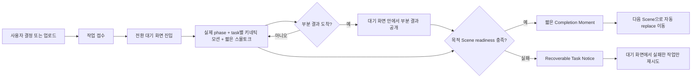

# HairFit V2 AI 컨설팅 생동감 개선 계획

- 작성일: 2026-08-09
- 대상 브랜치: `feat/2026-08-08-hairfit-v2-backend`
- 통합 대상: `develop/2026-08-08-hairfit-v2-backend`
- 문서 상태: 로컬 구현 완료, 현재 delta의 운영·실인증 재검증 대기
- 제품 방향: 이미지 생성기가 아니라 분석·결정·시술·관리·패션을 연결하는 AI 헤어스타일 컨설턴트
- 화면 경계: 기존 11개 Scene과 좌측 User input·우측 AI output/system data 구조는 유지하되, 비동기 작업 사이에는 단계 수에 포함되지 않는 full-canvas 전환 대기 화면을 사용한다.

## 1. 문제 정의

현재 컨설팅은 데이터와 자동 진행 계약은 갖췄지만 처리 중 화면이 상태 문자열, 빈 슬롯, 단일 로딩 표시에 가깝다. 사용자는 AI가 무엇을 확인하고 어떤 결과를 만들고 있는지 충분히 느끼지 못하며, 분석·생성·브리프·패션 사이의 전환도 기능적인 완료에 머문다.

개선 목표는 대기 시간을 장식하는 것이 아니라 **실제 서버 작업을 이해 가능한 상담 경험으로 번역하는 것**이다. 비동기 처리가 필요한 지점에서는 입력 Scene을 떠난 뒤 전환 대기 화면에 머물고, 서버가 목적 Scene의 readiness를 충족하면 Completion 연출 후 자동으로 다음 Scene으로 이동한다. 대기 화면은 사용자 여정 단계나 승인 지점으로 계산하지 않는다.

### 현재 구현에서 재사용할 기반

- 서버 소유 `lifecycleState`, `recommendedStage`, `allowedStages`, `activeTasks`, `blockingActions`
- 분석 작업의 `queued → preflight → landmarks → analyzing → completed/retry_required/failed`
- 프리뷰 보드의 `queued → generating → ready/failed`와 부분 품질 통과 결과
- 패션 배치의 `draft → quoted → approved → generating → partial → ready/failed/selected`
- 브리프·실제 시술·Aftercare·Fashion을 같은 선택 snapshot에 연결하는 lifecycle

## 2. 제품 원칙

1. **실제 상태만 표현한다.** 서버 이벤트나 저장된 작업 상태가 없는 가짜 진행률과 가짜 완료는 만들지 않는다.
2. **대기 화면은 transient screen이다.** 11개 Scene 사이에 존재하지만 완료 단계로 기록하지 않고 추가 Next, 확인, 새로고침 CTA를 요구하지 않는다.
3. **부분 결과를 우선한다.** 한 개라도 검증된 결과가 도착하면 대기 화면 안에서 캐러셀보다 결과를 먼저 보여주되, 목적 Scene 이동은 작업별 readiness 기준을 따른다.
4. **스몰토크는 응답을 요구하지 않는다.** 질문형 문구 대신 전문적이고 따뜻한 짧은 독백을 사용한다.
5. **완료 연출은 짧고 자동이다.** 완료를 확인시키기 위한 별도 버튼 없이 다음 추천 Scene 또는 결과 상태로 전환한다.
6. **실패는 명확하게 분리한다.** 스몰토크를 즉시 중단하고 원인, 보존된 결과, 재시도 가능 여부를 보여준다.
7. **새로고침 후에도 사실이 유지된다.** 클라이언트 타이머가 아니라 서버 task snapshot으로 화면을 복원한다.
8. **모션은 정보보다 앞서지 않는다.** `prefers-reduced-motion`과 스크린리더 사용자는 같은 상태 정보를 모션 없이 얻는다.

## 3. 목표 경험



### 전환 대기 화면 계약

- 대기 화면은 좌우 split canvas를 잠시 대체하는 full-canvas 화면이며 Scene header와 `ALL STAGES` 탐색은 유지한다.
- 별도 `waiting` stage나 12번째 Scene route를 만들지 않는다. 작업을 소유한 기존 Scene route가 `transitionHostStage`일 때 split canvas 대신 대기 화면 모드를 렌더링한다.
- 작업 접수 응답이 `taskId`, `originStage`, `transitionHostStage`, `destinationStage`, `readinessKey`를 반환하고 성공 응답 직후 host Scene으로 이동한다.
- 대기 화면은 서버 snapshot을 polling 또는 재검증해 실제 phase, 스몰토크, 부분 결과와 복구 상태를 표시한다.
- readiness 충족 시 0.6~1.0초 Completion 연출 후 `router.replace(destinationHref)`로 이동한다. 목적지가 같은 Scene의 결과 모드라면 task query/state를 제거한 canonical URL로 replace하고 결과 캔버스로 전환한다.
- 대기 중 새로고침하거나 host Scene URL을 다시 열어도 서버의 active task로 상태를 복원한다. 이미 readiness가 충족된 task라면 짧은 완료 표시 후 즉시 목적 Scene 또는 결과 모드로 이동한다.
- 사용자는 `ALL STAGES`로 대기 화면을 벗어날 수 있다. 다른 Scene에 있는 사용자까지 강제로 이동시키지 않으며, host Scene이나 추천 작업을 다시 선택했을 때 최신 상태를 적용한다.
- 오류나 사용자 조치 필요 상태에서는 자동 이동하지 않고 같은 대기 화면에서 복구 행동을 제공한다.

### 적용 지점

| 출발 | 대기 화면 host | readiness 기준 | 자동 도착 |
|---|---|---|---|
| Photo 업로드 완료 | Scan | Evidence와 8축 분석 전략 저장 | Analysis |
| Direction 전략 확정 | Previews | 비교 가능한 품질 통과 결과 2개 이상 | Previews 결과 모드 |
| Decision 최종 선택 | Salon Brief | 최초 brief version 저장 | Salon Brief 편집 모드 |
| 실제 시술 등록 | Aftercare | 실제 시술 기반 care program 저장 | Aftercare 프로그램 모드 |
| Fashion 방향 확정 | Fashion | 선택 가능한 품질 통과 결과 2개 이상 | Fashion 결과 모드 |

Discovery 저장, Analysis 열람, Compare 후보 지정처럼 별도 비동기 산출물이 없는 전환에는 대기 화면을 만들지 않는다. 실제 시술 전 장기 대기 또한 전환 대기 화면이 아니라 정적 lifecycle milestone이다.

## 4. 공용 상태 계약 보강

기존 `activeTasks`를 유지하면서 프레젠테이션에 필요한 필드만 additive하게 확장한다. 조합 폭증형 lifecycle enum은 만들지 않는다.

```ts
type ConsultantTaskPresentation = {
  taskId: string;
  kind: "analysis" | "preview-generation" | "brief" | "fashion-generation" | "aftercare-preparation";
  stage: ConsultationStage;
  originStage: ConsultationStage;
  transitionHostStage: ConsultationStage;
  destinationStage: ConsultationStage;
  readinessKey: string;
  status: "pending" | "running" | "waiting" | "partial" | "complete" | "failed";
  phaseKey: string;
  phaseIndex: number | null;
  phaseCount: number | null;
  completedUnits: number | null;
  totalUnits: number | null;
  messageSetKey: string;
  partialOutputCount: number;
  startedAt: string | null;
  updatedAt: string;
  completedAt: string | null;
  retryable: boolean;
};
```

### 진행률 규칙

- 단계 수나 생성 슬롯 수처럼 서버가 아는 값만 determinate progress로 표시한다.
- 모델 응답 시간을 임의 백분율로 환산하지 않는다. 총량을 알 수 없으면 단계명과 indeterminate activity만 표시한다.
- `waiting`은 외부 큐, 재시도 예약, 사용자 승인 대기처럼 실제로 작업이 멈춘 상태에만 사용한다.
- `partial`은 최소 한 개의 표시 가능한 결과가 있고 전체 작업은 끝나지 않은 상태다.
- `complete`는 저장된 완료 시각이 있을 때만 발생하며, 새로고침 후 완료 연출을 반복하지 않는다.

## 5. 제안 컴포넌트

| 컴포넌트 | 분류·상태 | 책임 | 금지 사항 |
|---|---|---|---|
| `ConsultationTransitionScreen` | feature layout · candidate | 11개 Scene 사이의 full-canvas 대기, task 복원, readiness 기반 자동 이동 | 정식 stage 등록, 자체 완료 추정, 사용자 가두기 |
| `ConsultantActivityRail` | feature data-display · candidate | 실제 phase, 완료 항목, 현재 작업, 단위 진행률 표시 | 자체 polling, 서버 상태 추론 |
| `ConsultantSmallTalkCarousel` | feature feedback · candidate | phase별 짧은 메시지 순환, 중복 방지, 정지 조건 처리 | 자유 생성 문구, 질문형 CTA, 완료 지연 |
| `ConsultantKineticCanvas` | feature visual/feedback · candidate | task kind와 실제 phase를 task별 SVG/CSS 모션으로 해석하고, 5초 이후 선택형 피젯 제공 | 진행률 가장, 결과 예고, payload 변경, 자체 polling |
| `PartialResultReveal` | feature composite · candidate | 분석 카드·이미지 슬롯·브리프 행의 부분 결과 순차 공개 | 완료까지 결과 숨김 |
| `CompletionMoment` | feature feedback · candidate | 실제 완료 milestone을 0.6~1.0초 안에 강조하고 자동 전환 | 확인 버튼, 1.2초 초과 인위적 대기 |
| `RecoverableTaskNotice` | feature feedback · candidate | 실패 원인, 보존 결과, 실패 범위, 재시도·대체 입력 제공 | 오류 중 스몰토크 재생, 전체 작업 초기화 |

### 컴포넌트 안정성 계약

- change gate: `behavioral + compatible + style-contract`
- CSS namespace: `.f-consultant-activity-*`, `.f-consultant-kinetic-*`
- 기존 `--app-*` 색상·간격·motion token을 재사용하고 신규 전역 토큰은 필요한 경우에만 additive하게 추가한다.
- 동적 위치·강도는 inline style 선언 대신 컴포넌트 root의 제한된 CSS custom property로 전달하고 passport에 목록을 고정한다.
- 서버 상태는 props로만 받고 컴포넌트가 API를 직접 호출하지 않는다.
- 구현 시 `docs/components/component-registry.json`과 별도 component passport를 갱신한다.

## 6. 스몰토크 캐러셀 계약

### 동작

- 대기 화면 진입 후 첫 메시지는 300ms 이내 표시한다.
- 메시지 교체 간격은 2.8~4.0초 범위의 결정적 cadence를 사용한다.
- 한 메시지는 한 문장, 최대 두 줄을 원칙으로 한다.
- 같은 task 안에서 같은 문장을 반복하지 않는다. 메시지를 모두 사용하면 마지막 상태 문장을 유지한다.
- phase가 바뀌면 해당 phase의 메시지 세트로 즉시 전환한다.
- 부분 결과가 도착하면 캐러셀을 멈추고 결과 공개를 우선한다.
- 브라우저 탭이 숨겨지면 교체 타이머를 일시 정지한다.
- 완료·실패·취소 시 즉시 정지한다.
- 메시지 순서는 task ID와 phase key를 기반으로 결정해 새로고침 시 과도하게 튀지 않게 한다.

### 카피 원칙

- LLM이 대기 문구를 실시간 생성하지 않는다. 검수된 로컬 메시지 카탈로그를 사용한다.
- 사용자의 얼굴·외모를 평가하거나 확정적으로 단정하지 않는다.
- “거의 다 됐어요”처럼 완료 시간을 암시하는 문구는 사용하지 않는다.
- “어떠세요?”, “기다려 주세요”를 반복해 응답이나 인내를 요구하지 않는다.
- 기술명보다 상담 의미를 먼저 말하되, 시스템 사전검사와 AI 분석은 구분한다.

### 메시지 카탈로그 초안

| 작업/phase | 메시지 예시 |
|---|---|
| 분석·preflight | 사진의 각도와 밝기가 분석에 충분한지 먼저 확인하고 있어요. |
| 분석·preflight | 얼굴 전체와 헤어라인이 안정적으로 보이는지 살펴보고 있어요. |
| 분석·landmarks | 얼굴 윤곽과 주요 기준점을 사진 위에 연결하고 있어요. |
| 분석·landmarks | 정면 균형뿐 아니라 옆 볼륨에 영향을 줄 지점도 보고 있어요. |
| 분석·AI interpretation | 관리하기 어려운 방향은 추천 전에 미리 걸러낼게요. |
| 분석·AI interpretation | 손상도와 아침 손질 시간까지 함께 비교하고 있어요. |
| 프리뷰·queue | 확정한 전략과 피하고 싶은 조건을 생성 기준에 반영했어요. |
| 프리뷰·generation | 먼저 완성된 결과부터 바로 보여드릴게요. |
| 프리뷰·quality | 어울림뿐 아니라 실제 시술 가능성도 함께 확인하고 있어요. |
| 브리프·compose | 미용사가 바로 이해할 수 있도록 핵심 요청을 정리하고 있어요. |
| 브리프·constraints | 손상·관리·회피 조건이 빠지지 않았는지 다시 확인하고 있어요. |
| 패션·direction | 확정한 헤어와 상황별 옷의 균형을 연결하고 있어요. |
| 패션·generation | DAILY·WORK·STATEMENT 결과를 완성되는 순서대로 준비하고 있어요. |
| 패션·quality | 헤어가 가려지거나 왜곡된 결과는 후보에서 제외할게요. |
| Aftercare·prepare | 실제 시술 기록을 기준으로 첫 관리 일정을 준비하고 있어요. |

## 7. Kinetic animation·fidget 계약

### 역할과 variant

`ConsultantKineticCanvas`는 실제 task kind와 phase를 props로 받아 대기 화면의 중심 시각을 구성한다. 애니메이션은 실제 진행률 표시가 아니며, 의미 상태는 항상 별도의 `ConsultantActivityRail`과 텍스트로 제공한다. 장식 SVG는 `aria-hidden="true"`로 두고 canvas 안에 의미를 중복 공지하지 않는다.

| variant | 시각 연출 | 실제 데이터 연결 |
|---|---|---|
| `analysis` | 얼굴 기준점이 차례로 나타나고 윤곽선이 연결되는 landmark constellation | `preflight`, `landmarks`, `analyzing` phase에 따라 활성 점·선만 변경하며 실제 landmark는 도착 즉시 overlay로 교체 |
| `preview-generation` | 3×3 tile이 낮은 강도로 호흡하고 작업 중 슬롯만 강조 | 실제 accepted 결과가 도착하면 해당 tile을 이미지로 교체하고 장식 모션을 축소 |
| `brief` | 빈 문서 선과 section marker가 순서대로 정렬 | 저장된 brief 행만 실제 텍스트로 공개하며 작성되지 않은 내용을 미리 만들지 않음 |
| `aftercare-preparation` | 관리 timeline node가 좌에서 우로 정돈 | 실제 저장된 시술·관리 이벤트에 해당하는 node만 활성화 |
| `fashion-generation` | DAILY·WORK·STATEMENT 카드와 palette·silhouette guide가 정렬 | 실제 slot 상태와 accepted 결과가 장식 layer보다 우선 |
| `complete` | 현재 variant의 움직임이 정돈되어 짧은 check composition으로 수렴 | 서버 readiness 충족 이후에만 실행하고 자동 이동을 지연하지 않음 |
| `failed` | 진행 모션을 즉시 정지하고 복구 정보에 시선을 양보 | 오류 상태와 보존된 부분 결과를 `RecoverableTaskNotice`가 표시 |
| `reduced-motion` | 현재 phase를 나타내는 정적 illustration | 모든 정보·복구·자동 전환 기능은 동일하게 유지 |

### 선택형 피젯

- 작업이 5초 이상 계속될 때만 “결과에 영향을 주지 않는 대기 인터랙션”으로 노출한다. 사용하지 않아도 어떤 정보·결과·전환도 놓치지 않는다.
- 허용 예시는 pointer에 가볍게 반응하는 hair strand, 드래그 후 원위치로 돌아가는 particle, tap에만 반응하는 palette ripple, 생성 슬롯 사이를 옮기는 light dot이다.
- 질문, 답변, 선호 입력, 저장 CTA를 넣지 않으며 상담 snapshot, 생성 prompt, task payload, readiness와 결과 순위에 어떤 변경도 만들지 않는다.
- raw pointer 좌표·drag path·tap 위치는 기록하거나 전송하지 않는다. 제품 계측이 필요하면 좌표 없는 `consultant_fidget_used` boolean 또는 집계 count만 사용한다.
- 키보드·터치에서 사용을 강요하지 않는다. pointer-only 피젯은 모바일에서 숨기고 tap 가능한 variant도 장식 수준으로만 제공한다.
- 부분 결과가 도착하면 피젯을 비활성화하고 결과에 시각 우선순위를 넘긴다. 완료·실패·취소·탭 숨김에서는 즉시 정지한다.

### 렌더링·성능 규칙

- CSS transform/opacity와 SVG를 우선한다. 측정으로 필요성이 입증되지 않은 Canvas/WebGL 엔진이나 별도 animation runtime은 도입하지 않는다.
- layout을 매 frame 읽거나 쓰지 않으며 transform·opacity 중심으로 합성한다. animation/fidget 자체가 network request를 발생시키지 않는다.
- 60fps를 목표로 하되 입자·점·선 수를 상한 처리한다. 모바일에서는 개체 수와 blur를 낮추고, `saveData`를 감지할 수 있으면 정적 또는 저강도 variant로 낮춘다.
- `document.visibilityState !== "visible"`, 사용자 pause, `prefers-reduced-motion: reduce`에서는 loop를 중단한다. reduced motion에서는 피젯도 비활성화한다.
- determinate progress를 표현하는 길이·채움·숫자는 실제 서버 값을 가진 Activity Rail에만 둔다. kinetic loop의 속도나 밀도로 남은 시간을 암시하지 않는다.
- 부분 결과가 등장하면 canvas를 축소·감쇠하고 실제 결과가 중심을 차지한다. Completion은 현재 loop의 주기 종료를 기다리지 않고 즉시 수렴한다.

## 8. 단계별 연출

### 8.1 사진 분석

1. 업로드 접수가 성공하면 Photo에서 분석 전환 대기 화면으로 이동한다.
2. 대기 화면에서 시스템 사전검사, landmark, AI 해석, Evidence 저장을 실제 pipeline 순서로 표시한다.
3. landmark가 저장되면 전체 분석 완료 전에도 대기 화면 안에서 사진 overlay를 먼저 공개한다.
4. Evidence와 8축 추천이 준비되면 `CompletionMoment`에서 “분석 근거가 준비됐어요”를 표시하고 Analysis로 자동 전환한다.
5. 재촬영이 필요한 경우에는 대기 화면을 유지하고 Photo로 돌아갈 명확한 복구 CTA를 제공한다.

### 8.2 헤어 프리뷰 생성

1. 스타일 방향 확정 직후 서버가 entitlement·사용량·멱등성을 내부 검증하고, 별도 유료 생성 확인 없이 프리뷰 생성 전환 대기 화면으로 이동한다. 접수·대기열·생성·품질 검사를 구분한다.
2. 대기 화면에 9개 compact skeleton을 두고 각 슬롯을 `waiting/generating/quality-check/accepted/rejected`로 표시한다.
3. 품질 통과 결과는 대기 화면 안에서 도착 즉시 이미지로 교체하고 스몰토크는 축소 또는 정지한다.
4. 비교 가능한 2개가 생기면 readiness가 충족된 것으로 보고 Completion 연출 후 Previews 결과 보드로 자동 이동한다.
5. 남은 생성은 결과 보드에서 계속 갱신하며 사용자가 전체 9개를 기다리도록 강제하지 않는다.

### 8.3 Salon Brief

1. 선택 확정 직후 브리프 구성 전환 대기 화면으로 이동하고 서버가 summary, cut, volume, color, styling, cautions를 구성한다.
2. 대기 화면에서 작성 중인 항목을 문서 skeleton으로 보여주고 저장된 행부터 순차 공개한다.
3. 최초 brief version이 저장되면 Completion 연출 후 Salon Brief 편집 Scene으로 자동 이동한다.
4. 브리프 생성 task가 Fashion의 병렬 개방 계약을 차단하지 않는다.

### 8.4 Fashion generation

1. Fashion 방향 확정 후 서버가 entitlement·사용량·멱등성을 내부 검증하고, 별도 유료 생성 확인 없이 생성 전환 대기 화면으로 이동한다. 9개 슬롯은 DAILY·WORK·STATEMENT 그룹으로 유지한다.
2. `completedUnits / totalUnits`를 실제 9개 작업 수로 표시한다.
3. 품질 통과 결과 2개가 도착하면 Completion 연출 후 Fashion 결과 보드로 자동 이동하며 최종 선택 수용조건은 그대로 유지한다.
4. 일부 실패 시 성공 결과를 유지하고 실패 슬롯만 재접수한다.

### 8.5 Aftercare

- 실제 시술 전 장기 대기는 캐러셀이나 스피너로 연출하지 않는다. “실제 시술 기록 대기”라는 정적 milestone으로 표시한다.
- 실제 시술 등록 직후 Aftercare 준비 전환 대기 화면으로 이동하고 짧은 프로그램 생성에만 activity와 스몰토크를 사용한다.
- 관리 일정이 저장되면 Completion 연출 후 Aftercare Scene으로 자동 이동해 오늘 행동과 다음 체크포인트를 바로 보여준다.

## 9. Completion Moment 규칙

- 실제 서버 완료 이벤트에만 반응한다.
- 권장 지속시간은 600~1000ms이며 최대 1200ms를 넘지 않는다.
- 전환 대기 화면 전체를 유지한 채 체크·강조선·짧은 문구로 완료를 전달한다.
- 자동 이동 대상은 task의 `destinationStage`와 최신 `allowedStages`를 함께 검증해 결정한다.
- 자동 이동은 해당 task의 대기 화면을 보고 있는 사용자에게만 수행한다. 다른 Scene에 있는 사용자에게는 “결과 준비됨” 링크만 표시한다.
- 새로고침으로 이미 완료된 task를 읽은 경우 애니메이션을 재생하지 않는다.

## 10. 오류·중단·재개

- 오류가 발생하면 캐러셀, kinetic/fidget loop와 완료 애니메이션을 즉시 중단한다.
- 오류 화면은 실패한 phase, 보존된 부분 결과 수, 비용 상태, 재시도 가능 여부를 보여준다.
- 분석 실패는 원본 사진과 통과한 사전검사 결과를 보존한다.
- 생성 실패는 승인된 결과와 성공 슬롯을 보존하고 실패 슬롯만 재시도한다.
- 409 version conflict는 최신 snapshot을 다시 받은 뒤 현재 task UI를 재구성한다.
- offline/timeout은 작업 실패로 단정하지 않고 서버 조회 재개 상태로 표시한다.
- signed URL 만료는 백그라운드에서 한 번 자동 갱신하고, 실패했을 때만 복구 행동을 노출한다.

## 11. 접근성·모션

- 캐러셀 자체는 `aria-live="off"`로 두어 문장마다 스크린리더를 방해하지 않는다.
- phase 변경, 부분 결과 최초 도착, 완료, 실패만 `aria-live="polite"`로 한 번 전달한다.
- 실제 오류는 기존 alert 계약을 사용한다.
- `prefers-reduced-motion: reduce`에서는 fade/slide/kinetic loop와 피젯 없이 정적 illustration, 텍스트와 상태만 즉시 교체한다.
- 진행 상태를 색상에만 의존하지 않고 라벨·아이콘·수치로 함께 표현한다.
- 자동 전환 후 기존 Scene의 H1 포커스 계약을 유지한다.
- 5초 미만의 단순 텍스트 교체라도 전체 재생이 5초를 넘으므로 캐러셀에는 명시적인 pause/resume 제어를 제공한다.

## 12. 분석 지표

| 지표 | 목표 |
|---|---:|
| 작업 접수 후 첫 의미 있는 상태 표시 | 300ms 이내 |
| 정상 분석 흐름의 추가 필수 클릭 | 0회 |
| 정상 생성 중 수동 상태 새로고침 | 0회 |
| 완료 후 별도 Next 클릭 | 0회 |
| 첫 부분 결과 공개 | 서버 수신 후 300ms 이내 |
| 완료 연출 추가 지연 | 최대 1.2초 |
| readiness 충족 후 목적 Scene 자동 이동 | 1.5초 이내 |
| 같은 task의 스몰토크 문장 반복 | 0회 |
| 오류 발생 후 스몰토크 노출 | 0회 |
| reduced-motion 기능 손실 | 0건 |
| animation/fidget로 발생한 network request | 0건 |
| 10초 성능 harness의 animation-caused long task(50ms 초과) | 0건 |
| kinetic layer의 layout shift | 0 |

제품 측정 이벤트는 사용자 텍스트나 사진 정보를 포함하지 않는다.

- `consultant_task_visible`
- `consultant_phase_changed`
- `consultant_first_partial_visible`
- `consultant_task_completed_visible`
- `consultant_task_recovery_shown`
- `consultant_auto_transitioned`
- `consultant_fidget_used` (좌표·경로 없는 boolean 또는 집계 count)

## 13. 구현 순서

### Phase 0. 계약 고정

- [x] task presentation DTO와 phase/message key를 shared contract에 additive하게 추가
- [x] 분석·프리뷰·브리프·패션·Aftercare phase mapping 표 확정
- [x] task variant별 motion storyboard, 최대 개체 수, partial/complete/failure 전환표 확정
- [x] 메시지 카탈로그 카피 리뷰
- [x] 제안 컴포넌트 passport와 registry 항목 작성
- [x] `CONSULTATION_LIVENESS_V2_ENABLED` rollback flag 정의

### Phase 1. 분석 pilot

- [x] `ConsultationTransitionScreen`, `ConsultantActivityRail`, `ConsultantSmallTalkCarousel`, `ConsultantKineticCanvas`, `CompletionMoment` 구현
- [x] `analysis`, `complete`, `failed`, `reduced-motion` variant와 5초 이후 선택형 피젯 구현
- [x] Scan의 기존 polling snapshot을 presentation DTO에 연결
- [x] landmark 부분 공개와 Analysis 자동 전환 연결
- [x] 실패·재촬영 복구 UI 구현
- [x] reduced-motion, screen reader, refresh/resume 검증

### Phase 2. 프리뷰·패션 생성

- [x] `PartialResultReveal`을 3×3 프리뷰와 Fashion 9-slot에 적용
- [x] `preview-generation`, `fashion-generation` kinetic variant와 실제 결과 우선 전환 적용
- [x] 실제 단위 진행률과 품질 검사 상태 표시
- [x] 부분 결과 우선, 실패 슬롯만 재시도
- [x] 방향 확정 이후 별도 유료 생성 확인·추가 클릭 0회 검증

### Phase 3. Brief·Aftercare

- [x] 브리프 자동 구성 phase와 순차 행 공개
- [x] `brief`, `aftercare-preparation` kinetic variant와 실제 저장 행·timeline 우선 전환 적용
- [x] 실제 시술 전 정적 milestone과 시술 후 프로그램 준비 상태 분리
- [x] Brief/Fashion 병렬 개방 계약 회귀 검증

### Phase 4. 관측·점진 활성화

- [x] 이벤트 계측과 개인정보 필드 제외 검사
- [ ] 내부 harness → 개발 계정 → canary 순서로 flag 활성화
- [ ] 완료 전환 이탈률, 수동 새로고침, 재시도율, 부분 결과 체감시간 확인
- [ ] 카피 반복·피로도 검토 후 메시지 세트 조정

## 14. 테스트 계획

### 단위·계약

- task state → phase/message set mapping
- 같은 task 내 메시지 비반복과 phase 전환 초기화
- 부분 결과 도착 시 캐러셀 정지
- 완료·실패·취소 시 타이머 정리
- 이미 완료된 task의 완료 연출 재생 방지
- 피젯 입력이 상담 snapshot, prompt payload, task state와 readiness를 변경하지 않음
- 피젯 계측에 raw pointer 좌표·drag path·tap 위치가 포함되지 않음
- 권한·DB·네트워크 오류를 정상 waiting으로 오인하지 않음

### 컴포넌트·접근성

- fake timer 기반 cadence와 hidden-tab pause
- hidden tab·사용자 pause·완료·실패에서 kinetic/fidget loop 즉시 정리
- reduced-motion에서 정적 illustration로 동일 정보·복구·자동 전환 제공하고 피젯 비활성화
- partial 결과가 kinetic canvas보다 먼저 보이고 Completion이 loop 종료를 기다리지 않음
- `aria-live`가 phase·부분 결과·완료·실패에만 반응
- 키보드 포커스와 자동 Scene 전환 후 H1 focus 유지
- 작은 모바일에서 메시지 두 줄 제한, 저복잡도 variant, 가로 overflow와 kinetic layout shift 0
- 10초 harness에서 animation-caused long task 50ms 초과 0건, animation/fidget network request 0건

### 브라우저 E2E

1. 사진 선택 → 전환 대기 화면 → preflight → landmark 부분 공개 → 분석 완료 → Analysis 자동 이동
2. 새로고침 후 진행 중 task 재개와 문구 중복 방지
3. 프리뷰 대기 화면에서 1개 도착 즉시 공개, 2개 도착 시 Previews 결과 보드 자동 이동
4. Fashion 대기 화면의 partial/failed/retry/readiness와 결과 보드 자동 이동
5. Brief와 Fashion 병렬 개방, Aftercare 실제 시술 gating 유지
6. 실패 시 스몰토크 중단, 성공 결과 보존, 재시도 범위 제한
7. readiness 완료 후 별도 Next·수동 refresh·불필요 승인 없이 목적 Scene 자동 이동
8. 5초 이후 피젯 노출, 무사용 정상 진행, 사용 후 payload 불변, partial/complete 도착 시 즉시 종료

실제 인증, 라이브 AI, 유료 생성, 원격 migration은 별도 승인 없이는 통과로 주장하지 않는다.

## 15. 롤아웃·롤백

- flag OFF: 기존 lifecycle workspace와 현재 상태 표시를 그대로 사용한다.
- flag ON: presentation DTO와 생동감 컴포넌트만 활성화하며 여정·결제·생성 계약은 바꾸지 않는다.
- 초기 canary는 분석 Scene에만 적용하고 프리뷰·패션·브리프 순으로 확장한다.
- 오류율이나 자동 전환 이탈이 기준을 넘으면 UI flag만 OFF한다.
- 롤백은 상담 snapshot, Evidence, 생성 결과, 브리프, 선택 이력과 결제 기록을 삭제하지 않는다.
- 추가 작업 이벤트 테이블이 필요하면 기존 schema를 변경하지 않는 additive migration과 service-role 전용 RLS 계약을 사용한다.

## 16. 완료 정의

다음 항목을 모두 충족해야 생동감 개선을 완료로 판정한다.

- [x] 분석·프리뷰·브리프·패션·Aftercare 준비 상태가 실제 서버 응답 또는 durable task phase를 표시한다.
- [x] 비동기 작업 접수 후 전환 대기 화면에 머물고 readiness 충족 시 목적 Scene으로 자동 이동한다.
- [x] 스몰토크는 검수된 메시지 카탈로그만 사용하고 응답을 요구하지 않는다.
- [x] task별 kinetic variant가 실제 phase를 반영하되 진행률·완료를 가장하지 않고 semantic status와 분리된다.
- [x] 선택형 피젯은 5초 이후에만 나타나며 무시 가능하고 입력·prompt·task·결과·readiness를 변경하지 않는다.
- [x] 부분 결과가 캐러셀보다 우선하며 완료까지 숨겨지지 않는다.
- [x] 정상 흐름에 Next, 상태 새로고침, 분석 재요청 클릭이 추가되지 않는다.
- [x] 완료 연출은 1.2초 이내이며 이미 완료된 task에서 반복되지 않는다.
- [x] 실패·중단·재개·409·signed URL 만료가 데이터 손실 없이 복구된다.
- [x] reduced-motion, screen reader, 모바일 overflow와 자동 포커스 계약을 통과한다.
- [x] hidden tab·pause·partial·complete·failure에서 모션이 정리되고 layout shift, network request, 50ms 초과 animation long task가 0건이다.
- [x] component passport·registry·CSS 계약과 브라우저 E2E가 통과한다.
- [x] flag OFF 롤백과 데이터 보존이 검증된다.
- [x] 실제로 실행하지 않은 인증·AI·결제·원격 상태를 완료 증거로 표시하지 않는다.

## 17. 구현 상태 판정

2026-08-09 로컬 구현·검증 범위에서 공용 activity rail, 스몰토크 캐러셀, task별 kinetic canvas, 5초 선택형 피젯, 부분 결과 우선 공개, completion moment, recoverable notice, 자동 전환, 개인정보 없는 브라우저 관측 이벤트를 구현했다. 분석·프리뷰·Fashion은 persisted task/board/batch 상태를 polling하며, Brief·Aftercare는 실제 V2 API 응답과 consultation snapshot 저장 경계에서 phase를 전환한다. polling 실패는 정상 대기로 표시하지 않고 캐러셀·모션을 중단한다.

2026-08-10 현재 로컬 계약 재검증은 shared 75개, consulting contract 26개, HairFit V2 backend 15개, CSS contract 9개와 migration mirror 83개를 통과했다. consultation browser 14개와 프로덕션 Next.js 빌드는 직전 전체 검증 기록이며 이번 문서 정규화에서는 재실행하지 않았다. 당시 브라우저 harness는 일반 Scene과 AI 대기 중 상담 이탈 확인, 첫 의미 상태·부분 결과를 response end 후 300ms 이내, completion/자동 handoff를 1.5초 이내로 검증했고, 10초 구간의 50ms 초과 long task·layout shift·animation/fidget network request가 모두 0임을 확인했다.

이전 보완 작업의 개발 Clerk 업로드·라이브 분석과 원격 migration `202608090001`~`004`는 별도 과거 증거다. 현재 생동감 delta에 대해서는 개발 계정 canary, 실제 인증·라이브 AI provider·유료 결제, lifecycle migration `20260809111554`, 원격 flag 활성화와 배포를 재실행하지 않았으며 완료 증거에 포함하지 않는다. Docker는 이 작업의 요구사항도 검증 수단도 아니다. Phase 4의 canary·실사용 지표·카피 피로도 검토는 배포 승인을 받은 뒤 수행하는 운영 항목으로 남긴다.
