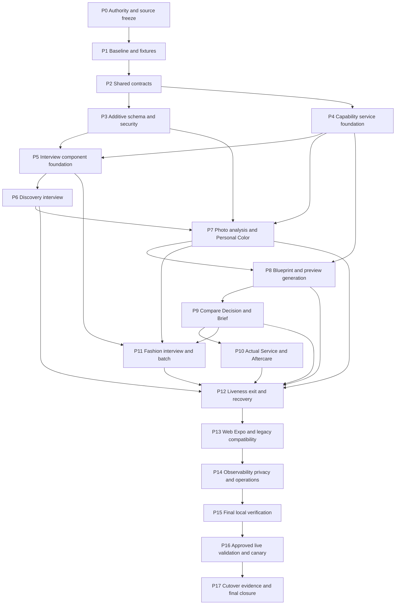

# HairFit V2 엔진 리사이클링·인터뷰 경험 통합 완수 골

> 2026-08-11 진행 기록: P0~P15 로컬 구현·검증은 `implementation_complete`다. 공용 인터뷰 기반, durable Capability 결과 replay·retryable failure/만료 lease 재획득, Discovery/Fashion 7-topic adapter, 동의 기반 Personal Color 자동 연결, 별도 유료 생성 확인 제거, Fashion 추천·생성의 서버 단일 배치 접수, Brief 자동 생성, 실제 시술 기반 Aftercare 자동 생성·우측 출력이 반영됐다. Photo에는 얼굴 위치 기반 4:5 crop·사용자 위치 조정과 private 자연광 보조 사진의 Personal Color 전용 입력이 추가됐다. Analysis 우측에는 저장된 얼굴 좌표 measurement만 사용하는 비율 매트릭스를 추가했다. Web 상담 Scene production Chromium 회귀 20/20, 상담 정적 계약 73/73, shared 85/85가 통과했다. 11 Scene axe serious/critical 0, 390/768px, 200% 상당 뷰포트, keyboard focus와 대기 연출 성능 계약도 통과했다. Expo는 같은 `ConsultationSnapshot`·consultation ID를 권위 상태로 사용하고 Discovery/Fashion 인터뷰, Photo 4:5 crop·자연광 보조 사진, 자동 Brief, 실제 시술 Aftercare, Fashion 9-slot batch를 연결했으며 전체 Jest 175/175와 Web·Android·iOS bundle이 통과했다. P14는 allow-list 관측, interview/capability lifecycle 지표, first-evidence/preview/ready-count, receipt·balance reconciliation, retention, 계정삭제 cascade, 독립 flag rollback runbook을 로컬 구현했다. native PostgreSQL에서 85개 migration fresh-chain·기존 데이터 upgrade probe·RLS/RPC·entitlement 경쟁·9-slot 정산·Capability lease/fence/retry·선택 replay·삭제 cascade도 통과했다. pgTAP 형식 대신 동일 27개 구조 assertion과 추가 행동 계약을 native PostgreSQL 직접 SQL로 검증했고, 원본 DOCX는 Microsoft Word 실제 렌더링 52/52페이지를 통과했다. P16 원격 read-only 진단 후 Cloudflare 서버 rollout flag 25개를 명시적 OFF로 등록했다. 사용자 지정 `gpt-4o`가 실제 OpenAI 비전 경로로 실행되도록 provider 분기를 추가했고 별도 승인으로 `PROMPT_VISION_MODEL=gpt-4o` 단일 이름을 등록해 필수 서버 설정은 32/32 READY다. 별도 승인된 Supabase migration 3개는 fail-closed 실행기로 적용해 remote `82 -> 85`로 수렴했다. 신규 운영 RPC 2개는 `SECURITY INVOKER`이며 SQL 구조, PostgREST schema cache, service-role 성공·anon `42501` 거부, advisor에서 HairFit 신규 WARN 0을 확인했다. 결과는 `hairfit-v2/p16-supabase-migration-apply-result-2026-08-11.md`와 `hairfit-v2/p16-cloudflare-model-registration-result-2026-08-11.md`를 따른다. 최신 로컬 결과와 요구서 괴리율은 `hairfit-v2/p15-final-local-verification-2026-08-11.md`를 따른다. P16 소스 배포·실인증·live provider·canary와 P17 cutover·운영 인계가 남아 있어 전체 골 완료 상태는 아니다.

- 작성일: 2026-08-11
- 활성 작업 브랜치: `feat/2026-08-08-hairfit-v2-backend`
- 통합 대상: `develop/2026-08-08-hairfit-v2-backend`
- 문서 상태: 실행 권위·최종 종료조건
- 제품 정의: 헤어 이미지 생성기가 아니라 사진 근거, 사용자 조건, 스타일 결정, 살롱 실행, 실제 시술, 에프터케어와 패션까지 이어지는 AI 컨설턴트
- 화면 권위: `HairFit_Interactive_Consulting_Frontend_Design_Plan_v1.0.docx`
- lifecycle 권위: `hairfit-v2-lifecycle-workspace-completion-2026-08-09.md`
- 대기·생동감 권위: `hairfit-v2-consulting-liveness-improvement-plan-2026-08-09.md`
- 엔진 재사용 상세: `hairfit-v2-legacy-wizard-engine-recycling-plan-2026-08-10.md`
- 인터뷰 상세: `hairfit-v2-interview-experience-improvement-plan-2026-08-11.md`
- 검증 원칙: 모든 구현이 끝난 마지막 단계에서 전체 회귀를 수행한다. Docker는 요구하지 않는다.

## 1. 최종 목표

HairFit V2를 구 마법사 UI와 단계 제어 없이 완성된 비마법사형 AI 컨설턴트 lifecycle로 통합한다.

다음 두 작업을 별도 프로젝트로 나누지 않고 하나의 server-owned consultation 흐름으로 완수한다.

1. 구 Workspace, Result, Personal Color, Styler, Aftercare에 존재하는 운영 엔진을 공용 Capability Service로 분리해 재사용한다.
2. Discovery와 Fashion 방향 설정을 단독 인터뷰 레이아웃으로 개선한다.

완료된 사용자는 다음 경험을 가져야 한다.

```text
Discovery 인터뷰
  -> Photo 시스템 사전검사
  -> landmark와 AI 분석
  -> Analysis·Direction
  -> blueprint 기반 3x3 헤어 생성
  -> Compare·Decision
  -> Salon Brief 자동 생성
  -> Fashion 인터뷰·9-look 배치
  -> 실제 시술 기록
  -> Aftercare 프로그램
```

처리가 필요한 구간은 실제 task 상태를 표시하는 대기 화면에 머물고 readiness가 충족되면 자동 이동한다. 사용자는 언제든 상담을 나갈 수 있으며 저장된 입력·완료 결과와 서버 작업은 유지된다.

## 2. 완료 상태 정의

### `implementation_complete`

P0~P15가 모두 종료되고 로컬 코드·계약·build·브라우저 회귀 증거가 확보된 상태다. 원격 DB, 실인증, 라이브 AI, entitlement 기반 실제 생성, canary와 배포는 아직 완료로 주장하지 않는다.

### `goal_complete`

P0~P17이 모두 종료된 상태다. 승인된 원격 migration, 실인증 업로드·분석, entitlement가 준비된 테스트 계정의 실제 9-slot 생성, 중복 소비·복구 검증, canary와 운영 인계 증거가 모두 존재해야 한다. 유료 생성 여부를 묻거나 결제를 확인하는 사용자 단계는 종료조건에 포함하지 않는다.

사용자가 실환경 검증을 실행하지 않기로 선택하면 해당 항목은 `waived`가 아니라 `not_run`으로 남는다. 이 골의 범위를 사용자가 명시적으로 다시 정의하지 않는 한 `goal_complete`로 판정하지 않는다.

## 3. 변경 불가 제품 계약

1. 원본 문서의 11개 Scene URL과 역할을 유지한다.
2. 인터뷰는 Discovery와 Fashion Scene 내부 표현이며 새 Scene이나 하위 Wizard가 아니다.
3. `recommendedStage`, `allowedStages`, `completedStages`, `activeTasks`, `blockingActions`를 서버가 계산한다.
4. `currentStep`, `stepIndex`, 공통 Next, 저장→Next 이중 동작을 도입하지 않는다.
5. 사용자 확인은 전략 확정, 인터뷰 최종 방향, 최종 선택, 실제 시술 확인처럼 디자인·시술 결정에만 둔다. 유료 생성 여부를 묻는 별도 확인은 두지 않는다.
6. 시스템 사진 사전검사와 생성형 AI 분석을 구분한다.
7. still image 사전검사는 decode·metadata·Sharp·pixel signal·FaceMesh 경계를 사용하며 video 요구가 없는 한 ffmpeg를 필수 의존성으로 추가하지 않는다.
8. AI 분석 전에 차단된 사진은 provider로 전송하지 않는다.
9. landmark와 evidence는 서버 저장 좌표를 Web·Expo가 렌더링하며 클라이언트가 임의 재추론하지 않는다.
10. 사용자 옵션과 확정 전략은 분석·blueprint 선택·생성 prompt·Brief·Fashion에 versioned snapshot으로 이어진다.
11. 구 Wizard UI, controller, route state는 V2 authoritative source가 아니다.
12. 기존 공개 `--app-*` 토큰·타이포그래피·표면 스타일을 유지하고 새 스타일은 scoped feature namespace로 제한한다.
13. 장시간 작업은 durable task, outbox, lease, fencing, retry와 멱등 키를 사용한다.
14. 같은 입력의 완료 결과는 재사용하고 이중 과금하지 않는다.
15. partial success를 보존하고 실패한 slot만 재시도한다.
16. 원본 얼굴 사진, provider prompt, secret, 내부 chain-of-thought와 service-role 경로를 고객 응답·공유 결과·관측 이벤트에 노출하지 않는다.
17. 모든 schema 변경은 additive migration과 개별 rollback flag를 가진다.
18. Docker 부재를 실패나 통과 증거로 사용하지 않는다.
19. 실행하지 않은 원격·인증·AI·결제·실기기 검증을 통과로 위장하지 않는다.

## 4. 완수 범위

| 영역 | 반드시 완수할 결과 |
|---|---|
| Discovery | 단독 인터뷰, 자동 저장, 적응형 충돌 질문, 전체 summary, Photo 직접 이동 |
| Photo | 8축 시스템 사전검사, private upload, 차단·경고·복구 |
| Analysis | FaceMesh landmark, AI evidence, Personal Color 자동 연결, overlay와 provenance |
| Direction | evidence 기반 8축 전략과 사용자 확정 revision |
| Hair blueprint | main source revision이 고정된 catalog-v4 182개와 정확히 9개 추천 |
| Hair preview | 사용자 입력·전략·blueprint prompt, durable 3x3 생성, 품질·partial retry |
| Compare·Decision | 8개 비교축, shortlist, immutable selected style snapshot |
| Salon Brief | 선택 snapshot 기반 자동 초안, AI 원본·사용자 편집 revision, 공유 만료·취소 |
| Actual Service | 실제 시술 종류·날짜·변경사항·동의한 after photo |
| Aftercare | 실제 시술 occurrence 기반 프로그램, replay·비용·versioned check-in |
| Fashion | 단독 방향 인터뷰, 기존 헤어·컬러 prefill, 방향 확정 후 entitlement 기반 9개 추천·durable batch 자동 접수 |
| Liveness | 실제 task phase, 부분 결과, 스몰토크, motion·fidget, completion, 자동 handoff |
| Exit·Resume | 모든 Scene·waiting에서 상담 나가기, draft 안내, 서버 작업 지속, 재진입 복구 |
| Web·Expo | 동일 shared contract, normalized snapshot, owner/auth 경계와 핵심 여정 parity |
| 운영 | feature flag, 관측, migration, RLS, retention, 삭제, canary, rollback runbook |

## 5. Phase 의존성



Phase 번호를 건너뛸 수 없다. 선행 Phase의 종료조건이 충족되지 않으면 다음 Phase를 완료로 표시하지 않는다. 독립 구현이 가능한 작업은 병렬로 진행할 수 있지만 종료 판정은 위 의존성을 따른다.

## 6. 공통 Phase 종료 규칙

모든 Phase는 다음 증거를 가져야 한다.

- 명시된 산출물 파일과 계약
- 관련 변경 경로 목록
- 실행한 검증 명령과 결과
- 실행하지 않은 검증과 이유
- feature flag OFF 회귀 또는 rollback 절차
- 개인정보·비용·데이터 손실 위험 점검
- 다음 Phase가 사용할 versioned 입력

체크박스, 문서 선언, fixture만으로 실제 기능을 완료 처리하지 않는다. 반대로 실환경 접근이 필요하지 않은 정적 계약은 불필요한 live smoke 때문에 막지 않고 `implementation_complete`에 포함한다.

## 7. P0 - 권위·브랜치·소스 동결

### 목표

작업 기준과 가져올 legacy/main 엔진의 출처를 재현 가능하게 고정한다.

### 구현·문서

- 현재 작업 브랜치와 dirty path를 같은 HairFit V2 컨텍스트로 분류한다.
- 통합 대상과 사용자 승인 경계를 기록한다.
- 원본 DOCX, lifecycle, liveness, recycling, interview, 본 문서의 권위 순서를 고정한다.
- `main`을 fetch한 뒤 exact source SHA를 기록한다.
- blueprint·recommendation·Fashion·Brief·Aftercare·Personal Color 엔진의 source file manifest와 SHA-256을 만든다.
- 현재 untracked `hairstyle-catalog-recommendation.ts`와 `main` 차이를 분류하고 임의 덮어쓰지 않는다.
- 기존 사용자 변경과 새 작업의 소유 경계를 기록한다.

### 검증

- branch, HEAD, main, merge-base, left/right commit count 기록
- source file 존재·hash·import graph 확인
- 변경 대상과 비대상 경로 검토

### 롤백

- Git 상태를 변경하지 않은 manifest 작성 단계로 유지한다.
- source가 모호하면 구현을 시작하지 않는다.

### 종료조건

- [x] exact work SHA와 source `main` SHA가 기록된다.
- [x] 가져올 엔진별 파일·export·hash manifest가 존재한다.
- [x] 충돌·미추적 파일의 처리 방법이 명시된다.
- [x] branch 전환·merge·push·deploy 권한이 분리되어 있다.

증거: [P0 source freeze](hairfit-v2/p0-source-freeze-evidence-2026-08-11.md), [machine-readable source manifest](hairfit-v2/source-manifest-2026-08-11.json)

## 8. P1 - 기준선·fixture·괴리율 동결

### 목표

현재 동작과 실패를 재현할 수 있는 기준선을 확보한다.

### 구현·문서

- 현재 shared, consulting, V2, CSS, migration, blueprint audit 결과를 기록한다.
- Discovery와 Fashion 기존 폼의 normalized output fixture를 저장한다.
- 11 Scene snapshot fixture와 lifecycle 상태 fixture를 확보한다.
- Photo pass/warning/block, landmark, AI partial/failure fixture를 확보한다.
- 9-slot preview·Fashion partial/retry·refund fixture를 확보한다.
- legacy engine의 정상·fallback·실패 결과 fixture를 확보한다.
- 기능 괴리율과 능동형 UX 괴리율 재채점 기준을 고정한다.

### 기준선

- shared `75/75`
- consulting `26/26`
- HairFit V2 `15/15`
- global CSS contract `9/9`
- migration mirror `83/83`
- catalog-v4 blueprint `182`
- consultation browser 직전 기록 `14/14`

위 수치는 착수 기준이며 최종 검증 시 현재 테스트 수에 맞춰 증가할 수 있다. 감소는 원인과 승인 없이 허용하지 않는다.

### 종료조건

- [x] 각 capability의 성공·partial·failed fixture가 있다.
- [x] 인터뷰 전후 normalized output parity 기준이 있다.
- [x] 기존 브라우저·build 증거와 이번에 재실행하지 않은 범위가 구분된다.
- [x] rollback 비교에 사용할 flag OFF snapshot이 있다.

증거: [P1-P2 contract and fixture evidence](hairfit-v2/p1-p2-contract-fixture-evidence-2026-08-11.md), `packages/shared/src/fixtures/consulting-v2.ts`

## 9. P2 - Shared lifecycle·Capability·Interview 계약

### 목표

Web, Expo, API, workflow가 같은 타입과 상태 전이를 사용하게 한다.

### 구현

- `CapabilityRequest`, `CapabilityResult`, `CapabilityTaskReceipt`
- `inputFingerprint`, `outputFingerprint`, `engineVersion`, `sourceRevision`
- `provider`, `model`, `promptPolicyVersion`, `catalogCycleId`
- `idempotencyKey`, `attempt`, `costReceipt`, `fallbackMode`
- `waiting`, `partial`, `completed`, `retry_required`, `failed`, `cancelled`
- `ConsultationInterviewDraft`, topic coverage, skip, conflict, summary revision
- `ConsultationInputProfile`과 `FashionDirectionSnapshot`의 unknown/provenance 확장
- `PersonalColorEvidenceV2`, `SalonBriefV2`, `ActualServiceV2`, `AftercareProgramV2`, `FashionPreviewBatchV2`
- 기존 `recommendedStage`, `allowedStages`, `activeTasks`, `blockingActions` 유지

### 불변식

- interview에는 `currentStep`, 질문 index와 route lock이 없다.
- capability result는 완료와 fallback을 구분한다.
- provider raw response와 prompt는 public DTO에 없다.
- 생성 권리는 기존 entitlement에서 판정하고 execution receipt와 중복 소비 방지 기록을 남긴다. 인터뷰가 유료 여부를 질문하지 않는다.

### 검증

- shared typecheck와 contract test
- Web·Expo compile fixture
- unknown enum·future field 안전 처리
- public DTO secret/prompt deny-list test

### 종료조건

- [x] 모든 신규 DTO가 `@hairfit/shared`에서 단일 정의된다.
- [x] Web·Expo·API가 중복 타입을 만들지 않는다.
- [x] 상태 전이와 public/private field 경계 테스트가 통과한다.
- [x] 기존 클라이언트가 additive field를 무시해도 깨지지 않는다.

증거: [P1-P2 contract and fixture evidence](hairfit-v2/p1-p2-contract-fixture-evidence-2026-08-11.md), shared `83 / 83`, Web·Expo typecheck pass

## 10. P3 - Additive schema·RLS·멱등성·migration

### 목표

엔진·인터뷰·task 상태를 서버 정본으로 안전하게 보존한다.

### 구현

- capability task/attempt/result provenance
- interview draft metadata와 confirmed revision
- Personal Color evidence version
- Salon Brief AI/user revision 연결
- Actual Service occurrence와 after photo consent bundle
- Aftercare request/receipt/version
- Fashion recommendation set, entitlement receipt, batch, slot attempt
- source engine manifest와 imported legacy provenance
- owner scope, forced RLS, service-role-only mutation RPC
- lease, fencing token, retry count, terminal timestamps
- root와 `my-app` migration mirror

### 보안·비용

- raw prompt·provider response·service-role secret 저장 위치 제한
- client가 owner ID, cost, completion을 임의 지정하지 못함
- entitlement 재검증과 balance/usage change 처리
- replay가 중복 charge/refund를 만들지 않음

### 검증

- SQL syntax·mirror·table/column/constraint/RLS 정적 검사
- RPC 고정 `search_path`와 execute 권한 검사
- migration 순서·additive 여부 검사
- Docker fresh-chain은 요구하지 않음

### 롤백

- flag OFF로 read/write adapter를 legacy 경로로 전환
- 새 row를 삭제하지 않고 reconciliation 대상으로 유지

### 종료조건

- [ ] root/my-app migration이 byte-identical이다.
- [ ] 신규 public table은 RLS forced이고 owner/service-role 경계가 검증된다.
- [ ] 동일 idempotency key의 중복 비용·중복 결과가 없다.
- [ ] schema rollback이 데이터 삭제를 요구하지 않는다.

## 11. P4 - 공용 Capability Service 기반

### 목표

legacy route와 V2 route가 화면이 아니라 동일한 엔진 service를 호출하게 한다.

### 구현

- engine adapter interface
- request normalization
- result normalization
- deterministic fallback 기록
- durable command/outbox adapter
- provenance·cost·latency recorder
- legacy lazy import와 결과 replay
- route handler에서 prompt 조립, provider SDK, service-role DB, 비용 계산 제거

### Capability 목록

1. Hair Blueprint Recommendation
2. Hair Preview Generation
3. Personal Color Analysis
4. Salon Brief Generation
5. Aftercare Program Generation
6. Fashion Recommendation and Generation

### 검증

- legacy/V2 동일 fixture의 normalized engine 결과 비교
- provider 실패와 fallback 구분
- duplicate request replay
- public response 민감 필드 부재

### 종료조건

- [ ] 여섯 capability가 공용 service boundary를 가진다.
- [ ] legacy와 V2 route의 중복 engine implementation이 제거된다.
- [ ] Wizard component·controller가 service에 import되지 않는다.
- [ ] 같은 입력 완료 결과는 추가 비용 없이 replay된다.

## 12. P5 - 공용 인터뷰 컴포넌트 기반

### 목표

Discovery와 Fashion이 공유할 단독 인터뷰 layout과 interaction 계약을 구현한다.

### Change Gate

- `behavioral`: 자동 진행, focus, 저장, summary, exit/resume
- `style-contract`: `.f-consulting-interview-*` namespace

### 구현

- `ConsultationInterviewShell` - layout/candidate
- `InterviewQuestionRenderer` - feature/candidate
- `InterviewCoverageIndicator` - data-display/candidate
- `InterviewSummaryDrawer` - data-display/candidate
- `InterviewSaveStatus` - feedback/candidate
- component passport와 registry
- radio, checkbox, text, range, compound question variant
- 200% zoom, 390px, keyboard, reduced motion

### 금지

- 공용 component의 domain DTO import
- 자체 API 호출·polling
- 고정 질문 단계 수
- 질문별 공통 Next
- 기존 global token·Scene selector 변경

### 종료조건

- [ ] fixture schema로 domain-independent rendering이 가능하다.
- [ ] public API, CSS, state, a11y, test surface passport가 존재한다.
- [ ] registry에 candidate 상태로 등록된다.
- [ ] focus·keyboard·summary drawer·exit interaction test가 통과한다.

## 13. P6 - Discovery 인터뷰 완수

### 목표

기존 대형 입력 폼을 7개 주제의 적응형 인터뷰로 전환한다.

### 구현

- 목적·목표
- 현재 모발
- 손상·시술 이력
- 원하는·가능한 시술
- 관리 강도·시간·열기구·방문 주기
- 변화 강도·회피·추가 메모
- unknown과 미용실 재확인 blocker
- 과감한 변화/낮은 관리, 손상/시술 충돌 후속 질문
- 답변별 versioned autosave
- 전체 summary와 `이 기준으로 사진 준비`
- Photo 직접 이동
- 기존 `DiscoveryWorkbench` flag OFF fallback

### 검증

- 기존 `ConsultationInputProfile` field 완전성
- 기존 prompt input normalization parity
- single choice 자동 진행
- multi/free input 완료 행동
- stale snapshot 409, offline, exit/resume
- AI summary OFF fallback

### 종료조건

- [ ] 필수 profile field가 누락되지 않는다.
- [ ] 단일 선택에 공통 Next가 없다.
- [ ] 미응답·unknown·conflict가 임의 기본값으로 위장되지 않는다.
- [ ] summary 확인 한 번으로 Photo가 직접 열린다.
- [ ] flag OFF 기존 폼 결과와 normalized contract가 호환된다.

## 14. P7 - Photo·landmark·AI 분석·Personal Color

### 목표

사진 선택 이후 사용자 수동 호출 없이 시스템 검사부터 AI evidence와 Personal Color까지 연결한다.

### 구현

- browser metadata/decode/resolution/face/pixel preflight
- private draft upload
- server Sharp preflight 재검증
- 차단 결과 `422`, provider 미호출
- FaceMesh landmark·contour·hairline·measurement
- AI face/hair strategy evidence
- Personal Color consent와 자동 task
- normalized evidence version·confidence·source mode
- signed URL 자동 발급·만료 갱신
- landmark partial reveal과 Analysis 자동 handoff
- manual correction revision과 model original 보존

### 재사용 엔진

- `analyzePersonalColor`
- palette normalization
- legacy style profile lazy reuse

### 검증

- 시스템 검사 카드가 AI 결과로 표시되지 않음
- pass/warning/block fixture
- AI 호출 횟수와 block 시 0회
- overlay 좌표와 evidence ledger linkage
- provider failure가 진단 완료로 위장되지 않음
- 사진 동의 없을 때 Personal Color unavailable

### 종료조건

- [ ] 사진 선택 후 별도 분석 버튼 없이 pipeline이 시작된다.
- [ ] 저장 landmark가 사진 위에 렌더링된다.
- [ ] Personal Color provenance와 confidence가 정확하다.
- [ ] Scan·Analysis 완료 승인을 반복하지 않는다.
- [ ] 새로고침·이탈 후 task 상태가 복구된다.

## 15. P8 - Hair blueprint·프리뷰 생성 엔진

### 목표

main의 catalog-v4와 사용자 입력을 고정해 정확히 9개 blueprint 방향과 사용 가능한 preview board를 생성한다.

### 구현

- exact main source revision import
- 182 blueprint manifest·active cycle
- 얼굴 evidence, 현재 모발, 전략, 관리·시술·회피 조건 기반 추천
- BALANCE 3, IMAGE 3, LIFESTYLE 3
- attempt에 blueprint slug, cycle, prompt version, input fingerprint 고정
- private photo, evidence, strategy, user option을 prompt compiler에 연결
- durable 9-slot queue
- identity·geometry·background·hair-boundary·duplicate quality gate
- partial output, failed-slot retry, receipt replay
- 브라우저 종료 뒤 workflow 지속

### 권리·소비 계약

- 전략 확정 시 기존 entitlement를 서버가 재검증
- 별도 유료 생성 확인 CTA 없이 9-slot 접수
- entitlement가 없으면 인터뷰 밖의 기존 상품 구매 경로로 안내하고 자동 차감하지 않음
- terminal full failure restore/refund
- partial accepted 결과 보존

### 검증

- blueprint audit 182 이상 회귀 없음
- 사용자 option이 9개 provider prompt artifact에 포함
- public response에 prompt 원문 없음
- same board replay와 비용 1회
- partial 2~3개로 의사결정 가능, ready 9개 semantics 구분

### 종료조건

- [ ] source SHA·manifest·hash가 result provenance에 남는다.
- [ ] 정확히 9개 recommendation과 slot intent가 결정적이다.
- [ ] 전략 확정과 entitlement 검증 후 서버가 별도 유료 확인 없이 모든 slot을 durable하게 접수한다.
- [ ] 실패 slot만 재시도하고 성공 결과를 폐기하지 않는다.
- [ ] 사용자 입력·전략 누락 prompt가 없다.

## 16. P9 - Compare·Decision·Salon Brief

### 목표

생성 결과를 실제 선택과 살롱 실행 문서로 연결한다.

### 구현

- shortlist 2~3개
- 8개 비교축: 얼굴 균형, 볼륨, 현재 모발 gap, 시술, 손상 가능성, 관리 시간, 방문 주기, 제한
- finalist와 backup
- immutable `StyleSelectionSnapshotV2`
- 선택 revision·supersedes 관계
- 선택과 동시에 Salon Brief capability task 등록
- customer/designer audience
- AI 원본과 사용자 편집 revision 분리
- share expiry·revoke·원본 얼굴 미포함
- Brief와 Fashion 병렬 개방

### 검증

- 미완료·다른 상담 preview 선택 거부
- selection mutation 불가
- Brief fallback 명시
- share token owner·expiry·revocation
- 선택 직후 Aftercare 자동 개방 금지

### 종료조건

- [ ] 8축 비교 근거가 server snapshot에서 파생된다.
- [ ] 최종 선택은 immutable snapshot이다.
- [ ] Brief가 자동 생성되고 사용자는 편집·공유만 수행한다.
- [ ] Brief와 Fashion이 병렬 allowed stage가 된다.
- [ ] Aftercare는 actual service 전에는 blocker를 유지한다.

## 17. P10 - Actual Service·Aftercare 엔진

### 목표

선택이 아니라 실제 시술 occurrence를 기준으로 Aftercare를 생성한다.

### 구현

- 실제 시술 종류·날짜·현장 변경·메모
- 동의한 after photo private upload와 fingerprint bundle
- 최초 실제 시술 필드 lock과 correction policy
- `actualServiceId + aftercareProgramRequestId + engineVersion` 멱등성
- `generateAftercareGuide`, `hair-care-generator`, `aftercare-model` adapter
- 오늘 행동, D+3, W+2, W+6, W+10
- concern·satisfaction·checkpoint version patch
- 첫 프로그램 무료·추가 프로그램 quote 정책
- user exit 후 task 지속·재진입

### 불변식

- 같은 selection이라도 다른 시술일은 다른 occurrence다.
- 같은 request ID만 replay한다.
- 원격 AI 중단 전 비용·DB write semantics를 명확히 한다.

### 검증

- actual service 없는 생성 거부
- first-free/paid/replay concurrency
- consent bundle constraint
- account deletion storage outbox
- provider failure·RPC response loss 구분

### 종료조건

- [ ] 실제 시술 전 Aftercare가 생성되지 않는다.
- [ ] 한 selection에 복수 occurrence·program이 가능하다.
- [ ] 같은 request replay가 추가 과금을 만들지 않는다.
- [ ] after photo와 체크인 데이터가 private·versioned로 보존된다.
- [ ] 이탈·재진입에서 생성 상태가 복구된다.

## 18. P11 - Fashion 인터뷰·추천·9-slot 배치

### 목표

확정 헤어와 컬러를 재사용하는 단독 인터뷰 뒤 한 번의 방향 확인으로 9개 룩을 생성한다. 유료 생성 여부를 묻는 확인 단계는 두지 않는다.

### 인터뷰

- 착용 상황
- 원하는 인상·장르
- 핏
- 노출·넥라인
- 계절·기후
- 예산
- 회피 아이템
- Selected Style, Personal Color, Discovery, body profile prefill
- conflict question과 전체 summary

### 엔진 재사용

- `fashion-recommendation-generator`
- `fashion-catalog`
- `openai-image`
- `styling-workflow-execution`
- workflow/outbox/notification
- V2 styling source adapter

### 배치

- DAILY 3, WORK 3, STATEMENT 3
- 추천·entitlement 상태 자동 준비
- 방향 확인 후 entitlement가 있으면 9-slot 자동 접수
- entitlement가 없으면 기존 상품 구매 경로를 안내하고 인터뷰 답변 보존
- server orchestrator concurrency 3
- completed-first partial reveal
- failed slot retry
- shortlist 최대 3개와 최종 룩
- selection/body photo/color/direction hash 기반 legacy reuse

### 검증

- 이미 저장된 헤어·컬러를 반복 질문하지 않음
- 방향 확인 전 generation 호출 0회
- 방향 확인과 entitlement 검증 뒤 9-slot 자동 접수
- 브라우저 9-call loop 부재
- owner/snapshot/session guard
- 생성 접수 후 방향 수정은 새 revision·새 batch 필요성을 안내하고 기존 batch는 불변

### 종료조건

- [ ] `FashionDirectionSnapshot`이 완전하고 provenance가 있다.
- [ ] 유료 생성 확인 단계 없이 방향 확인과 entitlement 검증만으로 batch가 접수된다.
- [ ] 서버가 9개를 durable batch로 실행한다.
- [ ] partial·retry·failed·ready 상태가 저장된다.
- [ ] legacy 결과 재사용이 추가 과금을 만들지 않는다.

## 19. P12 - Liveness·우측 데이터·Exit·Recovery

### 목표

분석·생성·Brief·Aftercare·Fashion 사이를 살아 있는 상담 경험으로 연결한다.

### 구현

- full-canvas transient waiting screen
- actual phase activity rail
- 짧은 deterministic small-talk carousel
- task별 kinetic animation
- 5초 이후 선택형 result-neutral fidget
- partial result 우선
- completion 1.2초 이내와 자동 handoff
- failure/offline/retry notice
- 모든 Scene·waiting의 상담 나가기
- unsaved draft 안내와 `/home` 복귀
- 좌측 user input·우측 AI output/system data 독립 scroll 회귀
- 인터뷰 중에는 단독 layout과 summary drawer
- Scene title 압축·입력 구분선 회귀

### 금지

- 가짜 진행률·완료 시간
- 완료 후 공통 Next
- fidget가 prompt·payload·readiness 변경
- polling 실패를 정상 대기로 표시

### 검증

- refresh/resume message continuity
- partial이 motion보다 우선
- reduced motion·hidden tab timer cleanup
- exit focus·draft disclosure
- no animation network request·layout shift·long task 예산

### 종료조건

- [ ] 실제 task state만 UI phase를 결정한다.
- [ ] readiness 충족 후 자동 이동한다.
- [ ] 사용자는 모든 상태에서 안전하게 나가고 재개한다.
- [ ] 우측 output은 분석 외 Scene에서도 실제 데이터가 충분하다.
- [ ] 인터뷰 layout이 기존 split canvas 계약을 다른 Scene에서 깨지 않는다.

## 20. P13 - Web·Expo·legacy 호환

### 목표

플랫폼별 중복 상태와 레거시 deep link 단절을 제거한다.

### 구현

- shared API client의 capability/interview/task DTO
- Expo consultation resume와 interview renderer parity
- native landmark overlay와 stored correction
- native Photo·Analysis·Preview·Decision·Brief 핵심 parity
- Fashion interview·batch 상태 parity
- Aftercare actual service·program 조회 parity
- legacy Workspace/Result/Personal Color/Styler/Aftercare route adapter
- 기존 deep link와 feature flag rollback
- V2 기본 경로에서 legacy Wizard UI import 제거

### 검증

- Web·Expo typecheck/test/bundle
- same consultation ID와 input fingerprint
- offline/resume/deep link
- old URL compatibility
- legacy flag OFF/ON matrix

### 종료조건

- [ ] Web·Expo가 같은 server snapshot과 shared DTO를 사용한다.
- [ ] 플랫폼별로 별도 authoritative state를 만들지 않는다.
- [ ] 기존 링크와 저장 결과가 유실되지 않는다.
- [ ] V2 기본 UI에 Wizard navigation이 나타나지 않는다.

## 21. P14 - 관측·개인정보·운영·rollback

### 목표

canary와 장애 대응에 필요한 운영 계약을 완성한다.

### 구현

- capability queued/partial/completed/failed/replayed metrics
- interview opened/topic/confirmed/exited/resumed/save-failed metrics
- time-to-first-evidence, first-preview, ready-count
- entitlement/usage/charge/refund/replay reconciliation
- PII·prompt·photo·provider payload deny-list
- signed URL expiry·refresh
- retention과 account deletion outbox
- feature flag dashboard/runbook
- dead-letter·stale lease·unknown settlement runbook
- engine/cycle/prompt version 관측

### Feature flag

```text
CONSULTATION_DISCOVERY_INTERVIEW_ENABLED
CONSULTATION_FASHION_INTERVIEW_ENABLED
CONSULTATION_INTERVIEW_AI_SUMMARY_ENABLED
CONSULTATION_PERSONAL_COLOR_CAPABILITY_ENABLED
CONSULTATION_SALON_BRIEF_CAPABILITY_ENABLED
CONSULTATION_AFTERCARE_CAPABILITY_ENABLED
CONSULTATION_HAIR_PREVIEW_BATCH_ENABLED
CONSULTATION_FASHION_BATCH_ENABLED
CONSULTATION_LIVENESS_V2_ENABLED
```

### 롤백

- flag별 독립 OFF
- 저장된 V2 result 보존
- 진행 중 생성 작업 완료·소비 복구
- legacy adapter read 가능
- 새 migration을 down/drop하지 않음

### 종료조건

로컬 코드·정적 계약은 구현됐다. 아래 체크는 원격 RPC·실정산·삭제 smoke까지 통과할 때만 닫는다.

- [ ] 민감 payload 없는 관측이 capability·interview 전체를 덮는다.
- [ ] 비용 receipt와 balance를 reconciliation할 수 있다.
- [ ] retention·삭제가 신규 row와 Storage를 포함한다.
- [ ] 각 flag의 OFF 경로와 데이터 보존이 검증된다.

## 22. P15 - 최종 로컬 종합 검증

### 실행 시점

P0~P14 코드와 문서 수정이 모두 끝난 뒤 한 번 수행한다. Phase 중간의 focused test는 개발 피드백일 뿐 최종 증거를 대체하지 않는다.

### 필수 검증

- Git changed-path·source manifest·diff whitespace
- root/workspace typecheck
- focused lint와 전체 lint 정책
- shared contract
- consulting contract
- HairFit V2 contract
- capability별 unit/integration
- entitlement·usage·replay·refund contract
- component registry validator
- component passport
- global CSS contract
- migration mirror와 additive SQL/RLS 정적 검사
- production Next build flag OFF/ON
- Expo Jest·Web/iOS/Android bundle
- 기존 consultation browser 14-case
- 신규 interview browser 12-case
- accessibility: keyboard, focus, 390px, 768px, 200% zoom, reduced motion
- performance: layout shift, long task, animation network request
- 기능 요구서·능동형 UX 괴리율 재산정

### 정량 종료조건

- test failure 0
- type error 0
- lint error 0
- broken local doc link 0
- migration mirror mismatch 0
- component registry/passport error 0
- serious/critical axe violation 0
- 기능 요구서 괴리율 10% 이하
- 능동형 AI UX 괴리율 15% 이하
- 공통 Next 0
- 단일 선택 질문의 불필요 Next 0
- prompt/provider/source photo public leak 0
- 같은 idempotency key 중복 비용 0

### 종료조건

- [ ] 모든 필수 검증 명령·SHA·결과가 최종 보고서에 있다.
- [ ] 실패·skip·not_run이 숨겨지지 않는다.
- [ ] flag OFF/ON 결과가 모두 있다.
- [ ] `implementation_complete` 판정이 문서화된다.

## 23. P16 - 승인된 실환경·canary 검증

실행 명령, 승인 경계, 비밀정보 규칙, 중단·rollback과 증거 형식은 `hairfit-v2/p16-live-validation-execution-packet-2026-08-11.md`를 따른다. 승인된 원격 read-only 진단은 `hairfit-v2/p16-read-only-remote-diagnostic-2026-08-11.md`에 고정했다. 연결 대상·82/85 migration drift·정확한 3개 dry-run·기존 HairFit RLS/service-role grant·private Storage·advisor를 통과했다. 이어 `hairfit-v2/p16-cloudflare-off-registration-2026-08-11.md`와 같이 Cloudflare 서버 rollout flag 25개를 명시적 `false`로 등록했다. 별도 승인으로 `PROMPT_VISION_MODEL=gpt-4o` 단일 이름을 등록해 OpenAI vision credential을 포함한 필수 서버 이름은 32/32 READY다. 별도 승인된 migration 3개는 fail-closed 실행기로 적용해 remote `82 -> 85`로 수렴했다. exposed 신규 RPC는 모두 `SECURITY INVOKER`이며 read-only SQL 구조, PostgREST table/RPC schema cache, service-role 성공·anon `42501` 거부, advisor를 통과했다. 결과는 `hairfit-v2/p16-supabase-migration-apply-result-2026-08-11.md`와 `hairfit-v2/p16-cloudflare-model-registration-result-2026-08-11.md`를 따른다. `/consulting/new`는 계속 404이고 소스 배포·실인증/live provider/canary는 별도 승인 전까지 실행하지 않는다.

### 선행조건

- 사용자의 원격 migration·실인증·live provider·배포 승인
- 테스트 계정·사진·비용 한도·정리 정책
- P15 complete
- rollback 담당·관측 dashboard 준비

### 순서

1. 원격 migration 이력·RLS·RPC·private bucket 검증
2. flag OFF remote smoke
3. 개발 Clerk 실제 로그인·상담 생성
4. 실제 사진 upload→preflight→FaceMesh→live AI→evidence→overlay
5. Discovery interview→Photo 자동 이동
6. Personal Color provenance
7. hair 전략 확정→entitlement 검증→9-slot generation→partial/retry→ready
8. shortlist→Decision→Brief
9. Fashion interview→방향 확정→entitlement 검증→9-slot batch→selection
10. Actual Service→Aftercare→check-in
11. exit/browser close→task continue→resume
12. 비용 reservation·charge·refund·replay와 balance reconciliation
13. Web canary 5%→25%→100%
14. Expo approved development build smoke

### 데이터 안전

- 이메일·user ID·원본 사진 경로를 로그나 채팅에 출력하지 않는다.
- 테스트 artifact를 임의 삭제하지 않는다.
- 삭제가 필요하면 exact row·object와 복구 가능성을 별도 승인받는다.

### 종료조건

- [ ] 원격 migration·RLS·Storage가 실제 환경에서 통과한다.
- [ ] 실인증 사진 분석과 landmark overlay가 통과한다.
- [ ] entitlement가 준비된 계정의 hair/Fashion 실제 생성, 중복 소비 방지와 실패 복구가 통과한다.
- [ ] actual service와 Aftercare가 통과한다.
- [ ] exit/resume과 partial recovery가 통과한다.
- [ ] canary 지표가 rollback threshold를 넘지 않는다.
- [ ] Expo 핵심 smoke 또는 명시된 platform scope 재정의가 있다.

## 24. P17 - Cutover·문서·최종 종료

### 목표

구현 사실, 운영 사실과 남은 위험을 일치시키고 안전하게 인계한다.

### 구현·문서

- 최종 implementation report
- source engine manifest
- migration/canary evidence
- feature flag 현재값
- rollback runbook
- known risk·deferred item
- legacy deprecation inventory
- component registry/passport 최종 상태
- 테스트·build·browser·live evidence 링크
- merge/push/deploy 상태를 각각 구분

### legacy 폐기 기준

- V2 기본 경로 import 0
- 두 compatible release 또는 합의된 관찰 기간
- read mismatch 0
- deep link·stored result adapter 유지
- 삭제는 별도 cleanup 승인

### 최종 종료조건

- [ ] P0~P17 체크리스트가 모두 충족된다.
- [ ] `implementation_complete`와 `goal_complete` 증거가 모두 있다.
- [ ] remote/live/deploy 상태가 사실과 일치한다.
- [ ] rollback 경로가 데이터 삭제 없이 실행 가능하다.
- [ ] 미완료·not_run·deferred 필수 항목이 없다.
- [ ] 사용자가 요구한 인터뷰와 엔진 재활용 범위가 하나의 consultation에서 연결된다.

위 조건이 하나라도 충족되지 않으면 골을 완료 처리하지 않는다.

## 25. 통합 수용 시나리오

1. 신규 사용자가 Discovery 인터뷰에서 중복 Next 없이 목적·모발·관리 조건을 저장한다.
2. 중간에 나간 뒤 같은 답변과 첫 미충족 주제로 복귀한다.
3. 사진을 선택하면 시스템 사전검사, upload, landmark, AI, Personal Color가 자동으로 이어진다.
4. 저장 landmark와 evidence가 Scan·Analysis·Direction에서 같은 ID로 연결된다.
5. main revision이 고정된 182 blueprint에서 사용자 조건 기반 9개 방향을 만든다.
6. 전략 확정 뒤 유료 확인 없이 hair 9-slot을 durable하게 실행하고 부분 결과부터 보여준다.
7. 8개 축으로 비교하고 immutable style snapshot을 확정한다.
8. Salon Brief가 자동 생성되고 Fashion이 병렬 개방된다.
9. Fashion 인터뷰가 기존 헤어·컬러를 재사용하고 부족한 방향만 질문한다.
10. Fashion 방향 확인 뒤 entitlement를 자동 검증하고 별도 유료 확인 없이 9-look batch가 실행된다.
11. 실제 시술 종류·날짜를 저장하기 전에는 Aftercare가 열리지 않는다.
12. 실제 시술 이후 Aftercare를 생성하고 같은 request replay는 추가 과금하지 않는다.
13. 분석·생성·Brief·Aftercare·Fashion waiting에서 실제 phase, partial, recovery와 자동 handoff가 동작한다.
14. 모든 Scene과 waiting에서 상담을 나가고 서버 작업을 계속한 뒤 재개한다.
15. flag OFF에서 기존 사용자·deep link·결과·결제·저장 데이터가 유지된다.

## 26. 골 실행 프롬프트

```text
HairFit V2를 구 마법사 UI 없이 완성된 비마법사형 AI 컨설턴트 lifecycle로 통합한다. hairfit-v2-engine-recycling-interview-completion-goal-2026-08-11.md를 최종 실행 권위로 사용하고 P0부터 P17까지 번호를 건너뛰지 않는다. 각 Phase는 선행조건, 산출물, 검증, rollback과 종료조건을 충족한 증거가 있을 때만 완료한다.

먼저 main의 exact source SHA와 헤어 블루프린트, preview generation, Personal Color, Salon Brief, Aftercare, Fashion 엔진의 파일 manifest·hash를 고정한다. 구 Wizard UI, currentStep, route controller를 재사용하지 않고 엔진만 공용 Capability Service로 분리한다. legacy와 V2 route는 같은 service를 호출하고 모든 request/result에 input/output fingerprint, engine/source/prompt/catalog version, idempotency key와 entitlement·usage receipt를 남긴다.

Discovery와 Fashion 방향 설정은 각 Scene 내부의 단독 인터뷰 레이아웃으로 구현한다. 단일 선택은 자동 저장·자동 진행하고 복수 선택·자유 입력·최종 summary에만 완료 행동을 둔다. 인터뷰는 currentStep, stepIndex, 질문별 공통 Next를 사용하지 않는다. Discovery는 ConsultationInputProfile을, Fashion은 FashionDirectionSnapshot을 완전하게 산출한다. 질문·분기·완료는 deterministic schema가 결정하고 AI는 자유 입력 구조화와 요약에만 사용한다.

Photo 시스템 사전검사, private upload, FaceMesh landmark, AI evidence, Personal Color, blueprint 기반 hair 9-slot, Compare·Decision, immutable selection, Salon Brief, actual service, Aftercare, Fashion interview와 9-slot durable batch를 한 consultation server snapshot으로 연결한다. 분석·생성·후속 출력은 실제 task phase, partial result, waiting motion, small-talk, fidget, completion, failure recovery와 자동 handoff를 제공한다. 사용자는 모든 Scene과 waiting에서 나갈 수 있고 서버 작업은 계속되며 재진입 시 복구한다.

기존 11개 Scene, recommendedStage, allowedStages, activeTasks, blockingActions, 공개 CSS 토큰·표면, Web·Expo shared contract, 비용·환불·보안·RLS·retention·account deletion 경계를 유지한다. 새 schema는 additive migration, 새 UI는 scoped CSS와 component passport/registry, 새 기능은 독립 flag와 데이터 보존 rollback을 가진다. Docker는 요구하지 않는다.

P0~P14 구현 후 P15에서 typecheck, lint, shared/consulting/V2/capability/entitlement·usage 계약, migration mirror·RLS 정적 검사, component registry/passport, CSS contract, production build, Expo bundle, 기존 14-case와 신규 interview 12-case 브라우저 회귀, 접근성·성능·괴리율을 한 번 종합 검증한다. 이 결과가 모두 통과해야 implementation_complete다.

사용자 승인을 받은 뒤 P16 원격 migration, 실인증 사진 분석, live AI, entitlement 기반 hair/Fashion 실제 생성·소비 복구, actual service·Aftercare, exit/resume, Web canary와 Expo smoke를 수행한다. 유료 생성 여부 확인은 사용자 흐름과 종료조건에서 제외한다. P17에서 cutover·rollback·deprecation·최종 보고서를 닫는다. 실행하지 않은 원격·인증·AI·실기기·배포 증거를 통과로 위장하지 않는다. P0~P17 모든 종료조건을 만족하고 미완료·not_run 필수 항목이 없을 때만 goal_complete로 종료한다.
```

## 27. P25 생성 흐름 보강

2026-08-12에 확인된 패션 2-result 정체, 공통 입력 provenance, onboarding `styleTarget`, 구 Salon Brief 상세 항목, 부분 결과·stalled·retrying UX와 생성 timing 계측은 [P25 구현 기록](hairfit-v2/p25-generation-flow-remediation-2026-08-12.md)을 권위 문서로 사용한다. P25의 로컬 검증과 원격 적용 경계를 P15~P17 종료조건에 추가하며, 2개 결과는 비교 가능 기준일 뿐 9-slot 배치 완료로 인정하지 않는다.
