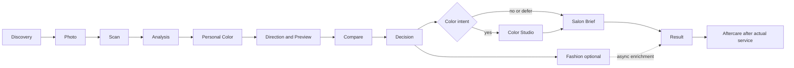

# HairFit V2 퍼스널 컬러·Color Studio·Result 구현 계획

작성일: 2026-08-12
상태: 구현 기준안
대상: HairFit V2 웹 컨설팅
범위: 퍼스널 컬러 진단 Scene, 확정 헤어 기반 실시간 염색 시뮬레이션, 고품질 컬러 확정본, 최종 Result 허브

> **2026-08-13 대체 공지:** 이 문서의 퍼스널 컬러와 Result 설계는 유지한다. 다만 마스크 기반 실시간 염색, Hair mask 생성, 마스크 입력 기반 AI Color Studio 설계는 [P27 염색 프리뷰 대기 워크플로우 명세](./p27-personal-color-hair-color-preview-waiting-workflow-implementation-spec-2026-08-13.md)가 대체한다. 새 기본 경로는 확정 헤어와 퍼스널 컬러를 기준으로 low 탐색 후보를 자동 생성하고, transition waiting 뒤 Color Studio에서 비교·선택한 결과를 medium으로 확정하며, 생성 요청에 마스크를 전달하지 않는다.

> **2026-08-13 Journey 결정:** 후반 여정의 canonical 순서는 `Salon Brief → Fashion → Result → Aftercare`다. Result는 현재 컬러 provenance와 일치하는 Fashion 최종 룩이 선택된 뒤 자동 컴파일하며, Aftercare는 Result와 실제 시술 기록이 모두 준비된 뒤 열린다.

## 1. 목적

현재 HairFit V2 컨설팅은 얼굴·모발 분석, 헤어 방향 설정, 프리뷰 비교, 최종 스타일 확정, Salon Brief, Fashion, Aftercare를 제공한다. 그러나 다음 세 가지 제품 단위가 독립된 사용자 경험으로 완성되지 않았다.

1. 분석 Evidence를 이용해 퍼스널 컬러를 자동 진단하고 헤어 컬러 결정에 연결하는 단계
2. 확정된 헤어스타일의 형태를 유지한 채 머리색을 즉시 바꿔 보는 Color Studio
3. 헤어·컬러·Fashion 선택을 한곳에 모으고 Aftercare의 후속 생명주기를 이어 주는 Result 마무리 단계

이 계획은 세 기능을 단순한 순차 마법사 단계로 추가하지 않는다. 서버가 계산한 `recommendedStage`, `allowedStages`, `completedStages`, `activeTasks`를 유지하고, 사용자의 의도와 준비 상태에 따라 열리는 비선형 lifecycle workspace로 구현한다.

## 2. 현재 구현 기준과 확인된 간극

### 2.1 재사용 가능한 현재 자산

- `PersonalColorEvidenceV2`와 `personal_color_evidence_v2`
- `/api/v2/consultations/[consultationId]/personal-color`
- `runPersonalColorCapability`와 기존 `legacy-personal-color-v1` 엔진
- `PersonalColorDiagnosisPageClient`, `PersonalColorResultDetails`
- 확정 `StyleSelectionSnapshotV2`
- 공통 `ConsultationGenerationInputSnapshotV2`와 provenance
- `SalonBriefV2`, `FashionPreviewSetV2`, `AftercareProgramV2`
- durable task, transition screen, polling, 부분 결과 및 복구 UI
- `.f-consulting-*`, `.f-consultant-*` 전역 CSS 계약

### 2.2 새로 구현해야 하는 간극

- 현재 11개 `ConsultationStage`에 `personal-color`, `color-studio`, `result`가 없다.
- 퍼스널 컬러는 저장 API와 별도 페이지가 있으나 컨설팅 Journey의 독립 Scene이 아니다.
- 현재 `PersonalColorEvidenceV2`는 season, undertone, palette만 저장하며 4축, 12타입 blend, 추천·주의 팔레트, 염색 방향을 충분히 표현하지 못한다.
- preview 품질 판정에는 `hair_mask_failure`가 있지만 재사용할 수 있는 헤어 알파 마스크가 영속화되어 있지 않다.
- 현재 헤어 블루프린트는 기본적으로 기존 머리색 유지를 지시한다. 확정 스타일의 형태를 잠그고 색상만 바꾸는 별도 생성 모드가 없다.
- 색상 선택을 Salon Brief, Fashion, Result에 일관되게 전달하는 immutable snapshot이 없다.
- Fashion까지 확정된 상담 결과와 실제 시술 이후 Aftercare를 분리해 보여 주는 최종 Result snapshot이 없다.

## 3. 제품 원칙

### 3.1 비마법사 원칙

- 공통 `Next` 버튼을 추가하지 않는다.
- 저장 후 사용자가 같은 화면에서 다시 이동 버튼을 눌러야 하는 이중 동작을 만들지 않는다.
- 준비된 작업은 서버가 자동 시작하고 완료되면 추천 Scene을 갱신한다.
- 퍼스널 컬러 또는 Color Studio를 이용하지 않아도 헤어 상담 전체가 막히지 않는다.
- Fashion 최종 룩 선택은 Result 컴파일 조건이다. Aftercare는 Result 이후 실제 시술 기록에 의해 열리는 후속 lifecycle이다.

### 3.2 실시간과 AI 생성의 분리

`실시간 염색 시뮬레이션`은 생성형 AI를 슬라이더마다 호출하는 기능이 아니다.

- 즉시 탐색: 저장된 헤어 마스크와 브라우저 GPU 합성
- 고품질 확정: 사용자가 고른 후보 한 건을 현재 이미지 생성 capability로 재생성

즉시 탐색 결과에는 `SIMULATION`을 표시한다. 고품질 생성 결과에는 사용한 모델, 프롬프트 정책, 입력 fingerprint와 생성 시각을 기록한다.

### 3.3 성별과 공정성

- 퍼스널 컬러 진단은 성별을 입력으로 사용하지 않는다.
- `styleTarget`은 헤어·패션 카탈로그와 표현 방향에만 사용한다.
- 피부색의 우열, 인종·민족·건강 상태를 추론하지 않는다.
- 염색 구현성은 현재 모발 상태와 시술 이력으로 판단하며 성별로 제한하지 않는다.

## 4. 목표 lifecycle



Stage Map은 숫자 순서보다 다음 그룹을 우선 표시한다.

- 진단: Discovery, Photo, Scan, Analysis, Personal Color
- 결정: Direction, Previews, Compare, Decision, Color Studio
- 전달: Salon Brief, Result
- 확장: Fashion, Aftercare

## 5. Stage와 Journey 계약 변경

### 5.1 Stage 추가

```ts
export const CONSULTATION_STAGE_SLUGS = [
  "discovery",
  "photo",
  "scan",
  "analysis",
  "personal-color",
  "direction",
  "previews",
  "compare",
  "decision",
  "color-studio",
  "salon-brief",
  "result",
  "fashion",
  "aftercare",
] as const;
```

### 5.2 Task 종류 추가

```ts
type ConsultationTaskKind =
  | "analysis"
  | "personal-color-analysis"
  | "preview-generation"
  | "hair-mask-extraction"
  | "hair-color-generation"
  | "brief"
  | "result-compilation"
  | "fashion-generation"
  | "aftercare-preparation";
```

### 5.3 Journey 준비 조건

| Scene | 허용 조건 | 완료 조건 | 실패·보류 처리 |
| --- | --- | --- | --- |
| Personal Color | analysis evidence 준비 | `ready`, `deferred`, `unavailable` | 재촬영은 Photo로 복구, 보류는 Direction 허용 |
| Color Studio | 확정 style snapshot + 염색 의향 | `confirmed`, `keep-current`, `deferred`, `salon-review` | mask 실패 시 정적 비교 또는 고품질 생성만 허용 |
| Salon Brief | 확정 style + color terminal | Brief version 생성 | Color Studio 미대상 고객은 즉시 생성 |
| Fashion | Brief + personal color terminal + color terminal | 현재 color revision과 연결된 최종 룩 선택 | batch 부분 실패는 사용 가능한 후보 선택 또는 명시적 재시도로 종료 |
| Result | 분석 + 확정 style + Brief + Fashion 최종 룩 | Result snapshot 준비 | Aftercare 미완료는 Result를 차단하지 않음 |
| Aftercare | Result + 실제 시술 유형·시술일 | 관리 프로그램 준비 | 실제 시술 전에는 잠금과 복구 안내 유지 |

### 5.4 추천 Stage 규칙

1. 분석 완료 후 퍼스널 컬러 품질이 usable 또는 warning이면 `personal-color`를 추천한다.
2. 퍼스널 컬러가 unavailable 또는 deferred여도 `direction`을 허용한다.
3. 최종 스타일 확정 후 Discovery의 `desiredServices` 또는 `allowedServices`에 염색이 있으면 `color-studio`를 추천한다.
4. 염색 의향이 없으면 Color Studio를 건너뛰고 Brief 생성 작업을 자동 시작한다.
5. Brief가 준비되면 `fashion`을 추천한다.
6. 현재 color revision과 연결된 Fashion 최종 룩이 선택되면 `result`를 자동 컴파일하고 추천한다.
7. Aftercare는 Result가 준비되고 실제 시술일과 시술 기록이 있을 때만 허용한다.

## 6. Personal Color Scene 구현

### 6.1 자동 실행

- 얼굴·모발 분석 Evidence가 저장되면 `personal-color-analysis` task를 outbox에 enqueue한다.
- `photo.colorAssistUrl`이 있고 유효하면 우선 사용한다.
- 보조 사진이 없으면 `PhotoQualityV2.skinColorReliability`가 임계값 이상인 주 사진을 사용한다.
- 같은 `consultationId + sourceImageFingerprint + promptPolicyVersion`은 같은 idempotency key를 사용한다.
- 화면 진입은 작업을 시작하는 필수 조건이 아니다.

### 6.2 상태 모델

```ts
type PersonalColorDiagnosisStatus =
  | "queued"
  | "quality-check"
  | "analyzing"
  | "ready"
  | "retry-required"
  | "deferred"
  | "unavailable";
```

`ready`, `deferred`, `unavailable`을 terminal 상태로 취급한다. provider 실패는 terminal로 가장하지 않고 `retry-required`로 남긴다.

### 6.3 Evidence V2 확장

기존 필드는 유지하고 additive 필드를 추가한다.

```ts
interface PersonalColorEvidenceV2 {
  schemaVersion: "personal-color-evidence-v2";
  id: string;
  consultationId: string;
  sourceAnalysisEvidenceId: string;
  sourceImageFingerprint: string;
  model: { provider: string; name: string; version: string };
  quality: {
    status: "reliable" | "usable-with-warning" | "unreliable-retry";
    confidence: number;
    warnings: string[];
    colorCast: string | null;
    makeupInfluence: "none" | "possible" | "strong";
  };
  axes: {
    temperature: number;
    value: number;
    chroma: number;
    contrast: number;
  };
  result: {
    primary: string;
    secondary: string | null;
    blend: Record<string, number>;
    undertone: string;
    confidence: number;
    detailVersion: "color-detail-v2" | null;
    summary: string;
    bestColors: PersonalColorSwatchDetailV2[];
    avoidColors: PersonalColorSwatchDetailV2[];
    stylingPalette: string[];
    hairColorHints: string[];
  };
  palette: {
    best: string[];
    neutrals: string[];
    accents: string[];
    caution: string[];
    metals: string[];
  };
  hairColorDirections: HairColorDirectionV2[];
  createdAt: string;
}
```

12타입 blend 합계는 허용 오차 내에서 1이어야 한다. palette 값은 승인된 HEX allowlist 또는 versioned catalog ID만 저장한다.

`PersonalColorSwatchDetailV2`는 구 엔진의 `PersonalColorResult`가 이미 제공하는 다음 필드를 손실 없이 유지한다.

- 한글명·영문명·HEX·기본 분류 근거
- 추천 근거와 주의·비추천 근거
- 색상이 만드는 시각적 의미
- 의상·메이크업·헤어·액세서리 스타일링 팁
- 색상별 2~3개 조합명, 조합 HEX, 조합 이유

V2 mapper는 이를 단순 HEX 배열로 축약하지 않는다. `PersonalColorResult → PersonalColorEvidenceV2 → PersonalColorDiagnosis` 전 구간에서 같은 상세 필드를 보존해야 한다. 기존 evidence처럼 상세 필드가 없는 row는 단순 swatch로 호환 표시하되, 새 분석 결과를 이전 포맷으로 강등하지 않는다.

기존 consultation의 `personal_color_evidence_v2.result`가 이미 축약됐더라도 같은 consultation의 `consultation_capability_results_v2.output`에 상세 구 엔진 결과가 남아 있으면 server hydration에서 누락 필드만 병합한다. Evidence에 이미 저장된 값은 덮어쓰지 않으며, capability receipt에도 상세 데이터가 없을 때만 재진단을 안내한다.

### 6.4 화면 계약

좌측 독립 스크롤:

- 진단에 사용한 사진
- 피부 sample polygon과 제외 영역 토글
- 촬영 품질과 경고
- 자연광 사진 재촬영
- 분석 보류

우측 독립 스크롤:

- 1순위·2순위 타입과 confidence
- Temperature, Value, Chroma, Contrast 4축
- 12타입 blend 그래프
- Best, Neutral, Accent, Caution palette
- 추천·주의 색상별 추천 근거, 주의 근거, 의미, 스타일링 팁
- 각 색상에 대응하는 2~3개 실제 조합과 조합 이유
- 스타일링 팔레트와 추천 금속
- 추천 hair color directions
- hair direction별 목표 레벨, 탈색 정책, 유지 주기
- 종합 진단 요약, 추천 근거와 오프라인 드레이핑 권고

### 6.4.1 구 엔진 정보량 동등성 종료조건

- 구 엔진의 `PersonalColorResultDetails`를 consulting에서도 재사용한다.
- `bestColors`와 `avoidColors`의 상세 필드가 Evidence 저장과 server hydration 뒤에도 동일하다.
- 4축, 12타입 blend, 주·보조 타입, 상세 팔레트, 헤어 방향을 한 화면에서 모두 확인할 수 있다.
- 구 엔진이 제공하는 추천 근거·비추천 근거·색상 의미·스타일링 팁·컬러 조합 중 하나라도 V2 변환에서 누락되면 완료로 판정하지 않는다.
- 기존 상세 필드 없는 evidence는 오류 없이 단순 팔레트로 표시한다.
- 기존 Evidence는 빈약하지만 durable capability receipt에 상세 결과가 있으면 재진단 없이 복구한다.

### 6.5 자동 전환

- 분석 완료 시 `CompletionMoment`를 보여 준 뒤 Direction을 추천한다.
- 자동 URL 이동은 사용자가 Personal Color Scene에 머물러 있고 결과 패널을 확인할 수 있는 최소 노출 시간이 지난 경우에만 수행한다.
- 키보드·스크린리더 사용 중이거나 사용자가 결과를 탐색 중이면 강제 이동하지 않고 추천 CTA만 갱신한다.

## 7. Color Studio Scene 구현

### 7.1 진입과 종료

진입 조건:

- confirmed `StyleSelectionSnapshotV2`
- 확정 프리뷰 이미지 경로
- 고객의 염색 의향 또는 수동 진입

종료 상태:

```ts
type ColorDecisionStatus =
  | "editing"
  | "confirming"
  | "confirmed"
  | "keep-current"
  | "deferred"
  | "salon-review";
```

유료 생성 확인 UI는 추가하지 않는다. 현재 entitlement·generation capability가 허용하는 범위에서 한 번의 고품질 확정 요청을 실행한다.

### 7.2 두 계층 렌더링

#### A. Instant Simulation

브라우저에서 다음 입력을 합성한다.

- 확정 프리뷰 원본 texture
- 같은 좌표계의 8-bit hair alpha mask
- target color 또는 catalog swatch
- level, temperature, chroma, intensity
- root depth, highlight amount, technique

WebGL2 fragment shader가 source luminance와 texture를 유지하며 target hue/chroma를 혼합한다. 마스크 경계는 feathered alpha를 사용한다. WebGL2를 사용할 수 없는 환경은 Canvas 2D fallback을 사용하고 고급 highlight 조절을 비활성화한다.

실시간 합성은 다음 경우 정확도 경고를 표시한다.

- 현재 추정 레벨보다 2단계 이상 밝은 목표
- 탈색이 필요한 목표
- 블랙 또는 매우 짙은 염색 이력
- 손상도가 높음
- hair mask confidence가 임계값 미만

#### B. High-fidelity AI Confirmation

사용자가 후보를 확정하면 한 건의 `hair-color-generation` durable task를 만든다.

생성 고정 조건:

- identity, 얼굴 형상, 피부색, 포즈, 표정 유지
- 확정된 커트, 기장, 앞머리, 가르마, 컬, 볼륨 유지
- 배경과 의상 유지
- hair mask 밖 픽셀 변경 최소화
- 선택한 level, tone, technique만 적용
- 뿌리, 반사광, 모발 결, 음영을 현실적으로 재구성
- 피부색을 선택한 머리색에 맞춰 변경하지 않음

품질 검증 실패 코드는 다음을 사용한다.

- `identity_drift`
- `style_geometry_drift`
- `hair_mask_leak`
- `target_color_mismatch`
- `skin_tone_shift`
- `background_damage`
- `provider_timeout`

자동 재시도는 동일 prompt hash에서 최대 1회만 허용하고, 그 이후에는 즉시 시뮬레이션 결과와 복구 안내를 유지한다.

### 7.3 헤어 마스크 생성과 영속화

현재 `hair_mask_failure`는 품질 rejection code일 뿐 재사용 가능한 asset이 아니다. 다음 capability를 추가한다.

```ts
interface HairMaskArtifactV2 {
  id: string;
  consultationId: string;
  selectionSnapshotId: string;
  sourceImageFingerprint: string;
  storagePath: string;
  width: number;
  height: number;
  confidence: number;
  boundaryScore: number;
  model: { provider: string; name: string; version: string };
  createdAt: string;
}
```

- Color Studio 첫 진입 전에 백그라운드로 mask를 준비한다.
- 동일 확정 이미지 fingerprint는 mask를 재사용한다.
- mask 파일은 원본 이미지와 동일한 retention·접근 정책을 따른다.
- 고객 API는 private storage path를 노출하지 않고 짧은 수명의 signed URL만 반환한다.

### 7.4 Color catalog

`HairDyeCatalogItemV2`는 단순 색 이름이 아니라 시술 가능성을 포함한다.

```ts
interface HairDyeCatalogItemV2 {
  id: string;
  nameKo: string;
  family: string;
  swatchHex: string;
  temperature: "warm" | "cool" | "neutral";
  levelRange: [number, number];
  chroma: "soft" | "clear" | "vivid";
  bleachPolicy: "none" | "optional" | "recommended" | "required";
  techniques: Array<"full" | "root" | "highlight" | "balayage" | "ombre">;
  maintenance: "low" | "medium" | "high";
  fadeDirection: string;
  compatiblePersonalColorTypes: string[];
  contraindications: string[];
  promptTokens: string[];
  catalogVersion: string;
}
```

추천 점수에는 퍼스널 컬러, 현재 모발 레벨, 염색·탈색 이력, 손상, 관리 가능 시간, salon cycle을 사용한다.

### 7.5 Color selection snapshot

```ts
interface ColorSelectionSnapshotV2 {
  schemaVersion: "color-selection-snapshot-v1";
  id: string;
  consultationId: string;
  selectionSnapshotId: string;
  personalColorEvidenceId: string | null;
  hairMaskArtifactId: string | null;
  snapshotVersion: number;
  status: "draft" | "confirmed" | "superseded";
  decision: {
    state: "confirmed" | "keep-current" | "deferred" | "salon-review";
    catalogItemId: string | null;
    technique: string | null;
    targetLevel: number | null;
    intensity: number | null;
    rootDepth: number | null;
  };
  feasibility: {
    bleachPolicy: string;
    estimatedSessions: number | null;
    maintenance: string;
    fadeDirection: string;
    warnings: string[];
  };
  instantSimulation: {
    parameterHash: string;
    imagePath: string | null;
  } | null;
  finalGeneration: {
    attemptId: string;
    imagePath: string;
    fingerprint: string;
    model: string;
    promptVersion: string;
    promptHash: string;
  } | null;
  inputFingerprint: string;
  confirmedAt: string | null;
  createdAt: string;
}
```

Color snapshot은 확정 헤어 snapshot을 변경하지 않는다. 색상 변경은 별도 revision으로 관리한다.

## 8. Result 마무리 Scene

### 8.1 Result의 역할

Result는 추가 승인 폼이 아니다. 다음을 수행하는 영속적인 상담 결과 허브다.

- 확정 헤어와 확정 컬러를 대표 이미지로 표시
- 분석부터 결정까지의 핵심 이유를 설명
- Personal Color와 Salon Brief를 연결
- 확정 Fashion 룩과 Aftercare의 후속 행동 표시
- 상담 종료, 나가기, 재진입 제공
- 공유·내보내기에 동일한 snapshot 사용

### 8.2 Result readiness와 후속 lifecycle 분리

Result compilation readiness:

- Analysis evidence ready
- Personal Color terminal
- Hair selection confirmed
- Color decision terminal 또는 비대상
- Salon Brief ready
- 현재 Color selection revision과 일치하는 Fashion 최종 룩 선택

후속 lifecycle:

- Actual service record
- Aftercare program

Aftercare 관찰 기간이나 실제 시술 기록이 없다는 이유로 상담 Result를 미완료로 표시하지 않는다.

### 8.3 Result snapshot

```ts
interface ConsultationResultSnapshotV2 {
  schemaVersion: "consultation-result-snapshot-v1";
  id: string;
  consultationId: string;
  resultVersion: number;
  status: "assembling" | "core-ready" | "updated" | "attention-required";
  analysisEvidenceId: string;
  personalColor: {
    state: "ready" | "deferred" | "unavailable";
    evidenceId: string | null;
  };
  selectionSnapshotId: string;
  colorSelectionSnapshotId: string | null;
  salonBriefVersionId: string;
  fashionPreviewSetId: string | null;
  actualServiceId: string | null;
  aftercareProgramId: string | null;
  heroImage: {
    source: "hair-selection" | "color-confirmation";
    path: string;
    fingerprint: string;
  };
  synthesis: {
    headline: string;
    rationale: string[];
    limitations: string[];
    nextActions: string[];
  };
  inputFingerprint: string;
  provenance: ConsultationInputProvenanceV2[];
  compiledAt: string;
}
```

Fashion 선택 또는 color revision이 바뀌면 기존 Result를 덮어쓰지 않고 `resultVersion + 1`을 생성한다. Aftercare는 Result 이후 별도 lifecycle record로 유지한다.

### 8.4 Result UI

상단 타이틀 영역은 compact variant를 사용한다. 큰 장식 타이틀이 결과 콘텐츠의 세로 공간을 빼앗지 않게 한다.

좌측 독립 스크롤:

- 최종 hero 이미지
- 컬러 적용 전·후 비교
- 선택한 헤어와 컬러 요약
- 이미지 다운로드·공유

우측 독립 스크롤:

- AI 종합 결론
- 얼굴·모발 분석 근거
- 퍼스널 컬러와 염색 구현성
- Salon Brief 요약과 상세 링크
- Fashion 준비·생성·선택 상태
- Aftercare 활성 조건과 실제 시술 기록 CTA
- 수정 가능한 이전 Scene 링크

## 9. 프론트엔드 컴포넌트 계획

### 9.1 Component Passport 요약

| 컴포넌트 | kind | 안정성 | 책임 |
| --- | --- | --- | --- |
| `PersonalColorWorkbench` | feature | candidate | 퍼스널 컬러 작업 상태와 Evidence 표시 |
| `HairColorSimulationCanvas` | feature | experimental | source + 전용 AI hair mask + color parameter GPU 합성 |
| `HairColorControls` | form | candidate | 색상·level·기법·강도 입력 |
| `HairColorRecommendationPanel` | data-display | candidate | AI 추천, 구현성, 유지 정보 |
| `ColorCandidateCompare` | feature | candidate | 현재색과 최대 3개 후보 비교 |
| `ColorGenerationTransition` | feedback | candidate | 고품질 생성 상태·부분 결과·복구 |
| `ConsultationResultWorkbench` | feature | candidate | 최종 snapshot 조합·후속 상태 표시 |
| `ConsultationOutcomeCard` | data-display | candidate | Result 섹션 공통 상태 |

`HairColorSimulationCanvas`는 domain-specific feature로 유지한다. 범용 Canvas primitive나 디자인 시스템으로 조기 승격하지 않는다.

모발 마스킹은 범용 LLM의 좌표 추정이나 수동 SVG를 사용하지 않는다. 브라우저의 MediaPipe Hair Segmenter가 확정 preview와 동일 좌표계에서 픽셀 단위 confidence mask를 만들고, 서버는 원본 크기·alpha·면적 범위·boundary certainty를 재검증한 뒤 private artifact로 저장한다. 개발 E2E 하네스도 수동 fixture를 화면에 적용하지 않고 동일한 on-device AI 추론 결과를 사용한다.

### 9.2 CSS 계약

- 기존 색상·타이포그래피·border·spacing 토큰을 유지한다.
- 새 CSS는 `app/globals.css`의 HairFit V2 feature section에 추가한다.
- namespace:
  - `.f-consulting-personal-color-*`
  - `.f-consulting-color-studio-*`
  - `.f-consulting-result-*`
- 상태는 `data-state`, `data-quality`, `data-renderer`, `aria-busy`로 표현한다.
- runtime shader parameter만 CSS custom property 또는 Canvas uniform으로 전달한다.
- `prefers-reduced-motion`에서는 scan animation과 completion motion을 정지한다.
- 좌우 pane은 desktop에서 독립 스크롤, mobile에서는 문서 순서대로 단일 스크롤한다.

### 9.3 접근성

- 색상 swatch는 색만으로 의미를 전달하지 않고 이름·HEX·명도·온도 label을 제공한다.
- slider는 현재 값, 최소·최대, 단위를 읽을 수 있어야 한다.
- Canvas와 동일한 정보를 텍스트 요약으로 제공한다.
- 생성 상태는 실제 서버 상태만 `aria-live`로 알린다.
- 가상의 퍼센트 진행률을 표시하지 않는다.
- Before/After 조절은 키보드로 동작해야 한다.

## 10. API 설계

### 10.1 Personal Color

```text
POST /api/v2/consultations/:id/personal-color/tasks
GET  /api/v2/consultations/:id/personal-color
POST /api/v2/consultations/:id/personal-color/defer
POST /api/v2/consultations/:id/personal-color/retry
```

### 10.2 Hair mask

```text
POST /api/v2/consultations/:id/color-studio/mask
GET  /api/v2/consultations/:id/color-studio/mask
```

POST는 `maskDataUrl`, `modelVersion`, 선택적 `force`를 받아 인증 사용자와 확정 preview를 다시 대조한다. 서버 검증을 통과한 AI mask만 idempotent private artifact로 저장하고, GET은 상태와 signed asset URL을 반환한다.

### 10.3 Color selection과 generation

```text
GET   /api/v2/consultations/:id/color-studio
PATCH /api/v2/consultations/:id/color-studio/draft
POST  /api/v2/consultations/:id/color-studio/generate
POST  /api/v2/consultations/:id/color-studio/confirm
POST  /api/v2/consultations/:id/color-studio/keep-current
POST  /api/v2/consultations/:id/color-studio/defer
```

- `draft`에는 low-cost parameter만 저장하며 generation을 시작하지 않는다.
- `generate`는 확정 헤어 snapshot과 parameter hash를 검사한다.
- 같은 idempotency key로 중복 생성하지 않는다.
- `confirm`은 완료된 attempt만 선택할 수 있다.
- stale selection snapshot을 참조하면 `409 COLOR_SOURCE_STALE`을 반환한다.

### 10.4 Result

```text
POST /api/v2/consultations/:id/result/tasks
GET  /api/v2/consultations/:id/result
POST /api/v2/consultations/:id/result/refresh
```

Result는 사용자 입력값을 직접 수정하지 않는다. `refresh`는 최신 canonical snapshot을 조합해 새 버전을 생성한다.

## 11. DB와 Storage 변경

additive migration으로 다음 테이블을 추가한다.

- `hair_color_mask_artifacts_v2`
- `hair_color_selection_snapshots_v2`
- `hair_color_generation_attempts_v2`
- `consultation_result_snapshots_v2`

공통 요구사항:

- 모든 row에 `consultation_id`, `user_id`, 생성·갱신 시각 저장
- 사용자별 RLS와 service-role worker 정책 분리
- confirmed color snapshot은 consultation당 한 개만 활성
- fingerprint와 idempotency key unique index
- 원본·mask·simulation·final image 경로는 private storage
- DB와 `my-app/supabase/migrations` mirror에 동일 migration 적용
- 실패 시 기존 V2 row를 삭제하지 않고 feature flag를 OFF로 전환

기존 `generation_attempts_v2`는 `preview_variant_id`에 결합되어 있으므로 Color Studio attempt를 억지로 넣지 않는다. 공통 durable runtime은 재사용하되 color 전용 attempt table을 둔다.

## 12. 공통 입력과 downstream invalidation

`ConsultationGenerationInputSnapshotV2`에 additive color decision을 추가한다.

```ts
hairColorDecision: {
  colorSelectionSnapshotId: string;
  state: "confirmed" | "keep-current" | "deferred" | "salon-review";
  catalogItemId: string | null;
  technique: string | null;
  targetLevel: number | null;
  bleachPolicy: string | null;
  maintenance: string | null;
} | null;
```

provenance source에 `hair-color-selection`을 추가한다.

Color snapshot이 확정되면:

- Salon Brief color section을 새 버전으로 재생성
- Fashion이 아직 생성 전이면 새 색상을 입력으로 사용
- Fashion이 이미 존재하면 stale 표시 후 사용자 선택으로 refresh
- Result snapshot을 새 버전으로 compile
- Aftercare는 실제 시술 기록 전에는 갱신하지 않음

Color 변경은 확정 커트·스타일 snapshot을 supersede하지 않는다.

## 13. 생성 프롬프트 정책

새 prompt mode는 `hair-color-lift-and-tone-v2`로 고정한다. 단순 tint overlay를 금지하고 `기존 색소 lift/탈염 → 노출 undertone 중화 → 목표 색소 deposit/toning` 순서로 처리한다. 목표 salon level 5부터 약한 lift, 7부터 탈색·언더톤 보정, 9부터 다회 탈색 가능성을 시뮬레이션과 경고에 함께 반영한다.

입력:

- confirmed selection image와 fingerprint
- hair mask artifact
- PersonalColorEvidenceV2
- current hair profile과 treatment history
- HairDyeCatalogItemV2
- technique·level·intensity
- styleTarget은 표현 일관성에만 사용

필수 positive constraints:

- preserve exact haircut geometry
- preserve identity and facial geometry
- preserve pose, expression, skin tone, background and clothing
- modify only hair color within mask-guided boundary
- maintain realistic strand texture, roots, highlights and shadows
- salon-achievable color result
- target salon level에 맞는 visible luminance lift
- lift 이후 orange/yellow undertone neutralization

필수 negative constraints:

- no haircut change
- no length, fringe, parting, curl or volume change
- no face retouching or skin tone shift
- no makeup, eye, eyebrow, clothing or background change
- no helmet-like flat recolor
- no color spill outside hair

prompt hash는 raw prompt가 아니라 canonical policy, normalized input, catalog version, mask fingerprint의 SHA-256으로 계산한다.

## 14. 성능과 관측성

### 14.1 목표 지표

- Stage 진입 후 cached mask 표시: p95 500ms 이내
- 신규 mask 준비: p95 목표 3초, 실제 provider 기준으로 측정 후 확정
- slider 입력에서 Canvas 반영: p95 100ms 이내
- desktop 목표 30fps 이상, 지원 기기에서는 60fps
- WebGL context loss 복구 또는 Canvas fallback 성공률 99% 이상
- 고품질 생성은 고정 가상 진행률 대신 실제 task phase와 heartbeat 표시

### 14.2 이벤트

- `personal_color_started|ready|retry_required|deferred`
- `color_studio_opened`
- `color_mask_ready|failed|reused`
- `color_simulation_changed`
- `color_candidate_saved|removed`
- `color_generation_started|partial|ready|failed|retried`
- `color_selection_confirmed|keep_current|deferred|salon_review`
- `result_compilation_started|core_ready|updated|failed`
- `consultation_exited|resumed`

로그에 signed URL, 원본 이미지, user ID, raw provider prompt를 기록하지 않는다.

## 15. Feature flags와 롤백

```text
CONSULTATION_PERSONAL_COLOR_SCENE_ENABLED
CONSULTATION_COLOR_STUDIO_ENABLED
CONSULTATION_COLOR_LIVE_SIMULATION_ENABLED
CONSULTATION_COLOR_AI_CONFIRMATION_ENABLED
CONSULTATION_RESULT_SCENE_ENABLED
```

롤백 순서:

1. AI confirmation OFF: 실시간 simulation과 현재색 유지 선택은 보존
2. live simulation OFF: 추천 swatch와 고품질 단일 생성만 제공
3. Color Studio OFF: 기존 Decision에서 Brief로 연결
4. Personal Color Scene OFF: 기존 Analysis 내 요약 adapter 유지
5. Result Scene OFF: 기존 Brief → Fashion 경로와 실제 시술 기반 Aftercare 링크를 유지

DB row와 storage artifact는 feature flag OFF 시에도 삭제하지 않는다.

### 15.1 2026-08-13 구현 상태 갱신

- Personal Color, Color Studio, Result를 포함하는 14-Scene shared lifecycle과 자동 readiness 계산을 구현했다.
- Personal Color는 Photo 분석과 병렬 자동 실행하며 4축·12타입 blend·품질·근거를 `personal_color_evidence_v2`에서 복구한다.
- Color Studio 마스크는 원본 분석 hairline을 재투영하지 않고, 확정 preview 자체를 vision segmentation 입력으로 사용한다. normalized polygon을 동일 width/height의 versioned alpha artifact로 rasterize하고 동일 fingerprint는 재사용한다.
- 라이브 합성용 opaque-hair alpha와 OpenAI edit용 transparent-hair alpha를 분리했다. 공급자 결과는 mask 내부 변화량과 외부 pixel drift를 측정해 hair-only gate를 통과하지 못하면 최대 1회 자동 재시도한다.
- 3개 color candidate 저장·재적용·삭제, WebGL2/Canvas fallback, Before/After, 저신뢰 mask 재생성, 탈색 경고를 구현했다.
- 생성 확정뿐 아니라 현재 색 유지·결정 보류·살롱 검토도 `color_selection_snapshots_v2` immutable terminal snapshot으로 저장한다.
- Brief generation input, Result snapshot, Fashion input에 color provenance를 연결했다. 확정 color snapshot이 바뀌면 기존 Fashion 결과를 보존한 채 stale 안내와 새 9-look batch 재생성 동선을 제공한다.
- Result compiler는 실제 `salon_brief_versions_v2.id`를 FK로 저장하고 현재 color revision과 일치하는 Fashion 최종 선택을 입력 fingerprint와 rationale에 포함한다. Aftercare만 Result readiness에서 제외한다.
- Personal Color Scene, Color Studio, Result flag가 OFF이면 해당 Scene을 journey allowed/recommended에서 제외하고 기존 Analysis·Brief·Fashion 경로로 되돌린다. 저장 row와 artifact는 삭제하지 않는다.
- 서버 재진입 시 `color_selection_snapshots_v2`, `hair_mask_artifacts_v2`, `hair_color_generation_runs_v2`, `consultation_result_snapshots_v2`를 다시 읽어 consultation JSON보다 최신인 immutable Color/Result 상태를 복원한다.
- Fashion recommendation/session/batch/preview set은 공통 `generation_input_fingerprint`와 `color_selection_snapshot_id`를 저장한다. 현재 컬러와 다른 결과는 보존하되 stale로 표시하고 새 9-look batch로 명시적으로 갱신한다.
- E2E harness에 독립 Personal Color, Color Studio, Result 완성 상태와 세미리얼 정면 모델·동일 좌표 mask fixture를 추가했다.
- 로컬 검증에는 shared test 93/93, shared/app typecheck, consulting contract 100/100, HairFit V2 contract 15/15, global CSS 9/9, synthetic alpha inversion·hair-only drift fixture 2/2, ESLint 무경고, Next production build가 포함된다.
- Docker 없이 임시 로컬 PostgreSQL에서 전체 87 migration fresh chain과 mirror 일치를 검증했다. 신규 4개 테이블은 RLS와 force RLS가 모두 활성화되고 `service_role`에만 권한이 부여됨을 확인했다.
- 브라우저 검증에서 WebGL2 실시간 합성, 후보 2건, slider 5개, 키보드 slider/Before-After, slider 조작 시 생성 API 0회, desktop 좌우 독립 스크롤, mobile 단일 스크롤, 가로 overflow 없음, console 0건을 확인했다. Lighthouse snapshot은 Accessibility/Best Practices/SEO/Agentic Browsing 100, 실패 0건이다.
- staging·실서비스는 이번 로컬 완료 증거에 포함하지 않는다. 사용자가 실사용자 인증, 실제 사진 기반 유료 Hair/Fashion provider smoke, 실제 시술·Aftercare 관찰을 패스했으며, read-only live preflight는 `PROMPT_VISION_MODEL`, 18개 명시 flag, Supabase link marker 부족으로 NOT READY다. 원격 DB, 환경 변수, secret, 배포 상태는 변경하지 않았다.

## 16. 구현 Phase

### P0. 계약 동결

- Stage, task, lifecycle terminal 상태 확정
- `StyleSelectionSnapshotV2` 명칭을 canonical로 사용
- API base를 `/api/v2/consultations/*`로 고정
- component passport와 CSS namespace 확정

종료 기준:

- shared contract test가 새 stage와 terminal 상태를 검증
- 기존 11 Scene route가 회귀하지 않음

### P1. Personal Color Scene 통합

- 기존 capability 자동 enqueue
- Evidence v2 확장과 mapping
- Workbench, quality, palette, retry/defer
- transition/polling 연결

종료 기준:

- 화면 진입 없이 작업 시작
- signed URL 자동 갱신
- ready/retry/defer/unavailable 네 경로 검증
- Direction으로의 자동 readiness handoff 검증

### P2. Hair mask pipeline

- mask capability와 artifact persistence
- signed URL API
- confidence와 boundary quality
- cache/idempotency/retry

종료 기준:

- 확정 preview와 같은 좌표의 mask 반환
- 얼굴·귀·의상 영역 누출 회귀 fixture 통과
- 동일 fingerprint 재요청이 provider를 다시 호출하지 않음

### P3. Instant Color Studio

- WebGL2 renderer와 Canvas fallback
- color controls, recommendation, compare
- candidate draft와 terminal 선택
- responsive/a11y/CSS 구현

종료 기준:

- slider 조작에 네트워크 생성 요청 없음
- haircut geometry와 원본 이미지가 바뀌지 않음
- Before/After 키보드 조작 가능
- low-confidence/bleach 경고 표시

### P4. High-fidelity color generation

- prompt compiler mode
- durable attempt와 polling
- quality gate와 1회 자동 retry
- final color snapshot confirm

종료 기준:

- 색상 외 스타일·얼굴·배경 변경 회귀 검사 통과
- 새로고침·이탈·재진입 후 task 복구
- 중복 클릭이 중복 attempt를 만들지 않음
- 실패 시 즉시 simulation과 복구 동선 유지

### P5. Brief → Fashion → Result 연결

- generation input color projection
- Brief color section versioning
- Fashion stale/refresh 정책
- Result snapshot과 Workbench

종료 기준:

- Color 확정 후 Brief, Fashion, Result가 동일 snapshot ID를 사용
- Brief 완료 뒤 Fashion이 열리고, Fashion 최종 선택 뒤 Result가 자동 컴파일
- Aftercare 미준비가 Result를 차단하지 않음
- 상담 종료 후 Result URL로 재진입 가능

### P6. 최종 검증과 rollout

- contract/unit/typecheck/lint/build
- migration fresh/mirror/RLS/idempotency
- browser E2E와 visual regression
- feature flag OFF/ON canary
- 승인된 실환경 provider smoke

종료 기준:

- 아래 18장의 종료조건을 모두 충족
- 로컬·staging·실서비스 검증을 구분해 기록
- Docker를 요구하지 않음

## 17. 테스트 계획

### 17.1 Unit과 contract

- 12타입 blend normalization
- palette allowlist
- color recommendation scoring
- current level과 bleach feasibility
- mask coordinate·alpha validation
- color parameter hash
- prompt invariants
- Result compilation readiness와 Fashion/color provenance 일치
- downstream invalidation
- journey allowed/recommended/completed stage

### 17.2 Integration

- analysis evidence -> personal color task -> evidence 저장
- selection snapshot -> mask -> signed URL
- color generation task lease, heartbeat, retry, terminal
- color confirm transaction과 단일 active snapshot
- Brief/Result version update
- RLS cross-user 접근 차단

### 17.3 Browser E2E

1. 염색 희망 고객은 Decision 후 Color Studio를 추천받는다.
2. 염색 비희망 고객은 Color Studio 없이 Brief로 간다.
3. Color Studio에서 slider 조작 중 생성 API가 호출되지 않는다.
4. 후보 저장·비교·삭제가 새로고침 후 복구된다.
5. 고품질 생성 중 페이지를 나갔다 돌아와도 상태가 이어진다.
6. 실패·정체·재시도가 구분된다.
7. Color 확정 후 Result hero와 Brief 색상이 일치한다.
8. Fashion 진행 중에는 Result가 잠기고 Fashion 복구 동선을 표시한다.
9. Fashion 최종 선택 직후 Result가 자동 컴파일되며 확정 룩과 팔레트를 표시한다.
10. 실제 시술 전 Aftercare는 안내 상태이고 Result는 완료 상태다.
11. 모바일·키보드·reduced motion 경로가 동작한다.

### 17.4 시각 QA

- 헤어 경계 halo, 귀·이마·목 색상 누출
- 검은 머리, 금발, 곱슬, 잔머리, 긴 머리, 짧은 머리 fixture
- 어두운 배경과 머리색 경계
- 저해상도와 mask warning
- desktop 좌우 독립 스크롤
- mobile 단일 스크롤과 sticky control 충돌

## 18. 전체 종료조건

다음 항목이 모두 충족되어야 완료로 판정한다.

- [x] Personal Color가 독립 Scene이며 자동 실행·복구된다.
- [x] 촬영 품질, 4축, 12타입 blend, confidence와 근거를 표시한다.
- [x] 성별을 퍼스널 컬러 진단 입력으로 사용하지 않는다.
- [x] 염색 희망 여부에 따라 Color Studio가 조건부로 열린다.
- [x] 확정 헤어 이미지에서 실시간으로 머리색이 변한다.
- [x] slider 조작마다 AI 생성이나 비용 이벤트가 발생하지 않는다.
- [x] 헤어 마스크가 versioned artifact로 저장·재사용된다.
- [x] 저신뢰 mask와 탈색 필요 색상을 사실대로 경고한다.
- [x] 고품질 생성은 얼굴·헤어 형태·배경을 잠그고 색만 변경한다.
- [x] 유료 생성 확인 단계를 추가하지 않는다.
- [x] 생성 중·부분 결과·정체·실패·재시도가 구분된다.
- [x] 사용자가 중간에 나가도 서버 작업이 계속되고 재진입 시 복구된다.
- [x] 확정 color snapshot이 Brief, Fashion, Result에 provenance와 함께 연결된다.
- [x] Color 변경이 확정 haircut snapshot을 무효화하지 않는다.
- [x] Result는 별도 최종 승인 없이 자동 compile된다.
- [x] 현재 컬러와 연결된 Fashion 최종 선택이 Result readiness를 충족하며, Aftercare 미완료는 Result를 차단하지 않는다.
- [x] 기존 CSS 시각 체계를 유지하고 새 namespace만 추가한다.
- [x] contract, unit, migration, browser, visual, 접근성 검증이 통과한다.

## 19. 예상 변경 파일 지도

Shared contracts:

- `packages/shared/src/consulting/contract.ts`
- `packages/shared/src/consulting/journey.ts`
- `packages/shared/src/consulting/presentation.ts`
- `packages/shared/src/v2/analysis/contract.ts`
- `packages/shared/src/v2/selection/contract.ts`
- `packages/shared/src/v2/generation-input/contract.ts`
- `packages/shared/src/v2/outputs/contract.ts`
- 신규 `packages/shared/src/v2/color-studio/contract.ts`

Frontend:

- `my-app/components/consulting/ConsultationStagePage.tsx`
- 신규 `my-app/components/consulting/workbenches/PersonalColorWorkbench.tsx`
- 신규 `my-app/components/consulting/workbenches/ColorStudioWorkbench.tsx`
- 신규 `my-app/components/consulting/workbenches/ResultWorkbench.tsx`
- 신규 `my-app/components/consulting/color-studio/*`
- `my-app/components/consulting/scene/StageMapOverlay.tsx`
- `my-app/app/globals.css`

Backend and API:

- `my-app/lib/capabilities/personal-color-service.ts`
- 신규 `my-app/lib/capabilities/hair-mask-service.ts`
- 신규 `my-app/lib/capabilities/hair-color-generation-service.ts`
- 신규 `my-app/lib/consulting/color-studio-server.ts`
- 신규 `my-app/lib/consulting/result-compiler.ts`
- `my-app/lib/consulting/generation-input-server.ts`
- `my-app/lib/v2/outputs-server.ts`
- 신규 `my-app/app/api/v2/consultations/[consultationId]/color-studio/*`
- 신규 `my-app/app/api/v2/consultations/[consultationId]/result/*`

Database:

- 신규 additive Supabase migration
- 동일 migration을 `supabase/migrations`와 `my-app/supabase/migrations`에 mirror

Tests:

- shared journey·contract tests
- Personal Color mapping·quality tests
- mask artifact·renderer parameter tests
- Color Studio API·idempotency tests
- prompt invariant·quality gate tests
- Result readiness·versioning tests
- consulting E2E harness와 Playwright 시나리오

## 20. 구현 시 금지사항

- 14개 Scene을 공통 Next로 강제하는 선형 wizard
- `currentStep` 기반 별도 Color Studio 내부 wizard
- slider 변경마다 provider 요청
- 가상 생성 퍼센트 또는 실제 상태와 무관한 progress
- 피부색과 얼굴을 염색 결과에 맞춰 보정
- 확정 헤어 snapshot을 직접 수정하는 mutable update
- Fashion batch 상태만으로 Result를 열거나, 현재 color revision과 다른 stale Fashion 선택을 Result에 사용
- feature component의 임의 inline 색상·spacing 스타일
- raw image, signed URL, user ID, raw prompt 로그
- 실환경 smoke 없이 실제 provider·배포 완료라고 주장
