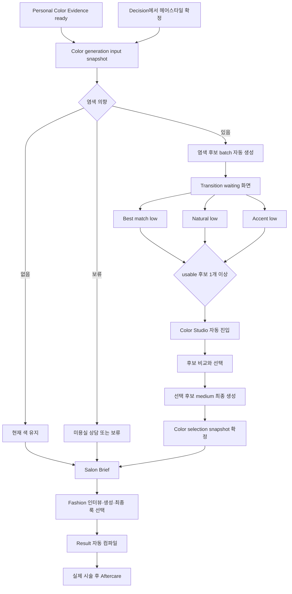

# HairFit V2 퍼스널 컬러 기반 염색 프리뷰 대기 워크플로우 구현 명세

작성일: 2026-08-13
상태: 부분 구현 · 기본 Color Studio 경로 전환 완료, 운영 검증 잔여
대상: HairFit V2 웹 컨설팅
연결 문서: [P26 퍼스널 컬러·Color Studio·Result 구현 계획](./p26-personal-color-result-color-studio-implementation-plan-2026-08-12.md)
대체 범위: P26의 마스크 기반 실시간 염색, Hair mask 생성, 마스크 입력 기반 AI 컬러 생성 설계

## 0. 2026-08-13 구현 반영 현황

이번 반영으로 기본 Color Studio는 다음 계약을 사용한다.

- 서버가 상담 스냅샷과 최신 `personal_color_evidence_v2`를 읽어 `best-match`, `natural`, `accent` 세 후보를 결정한다.
- 클라이언트가 임의 색상·강도·명도 값을 생성 API에 보내지 않고 `candidateKey + purpose`만 보낸다.
- Color Studio 진입 후 빠진 low 후보를 병렬로 자동 접수하고, 완료된 첫 후보부터 선택할 수 있다.
- 후보 선택은 별도 유료 확인이나 최종 생성 버튼 없이 medium 최종 생성을 시작한다.
- medium 결과가 완료되면 color selection snapshot을 자동 확정하고 Salon Brief로 이동한다.
- 기본 UI와 provider 요청에서 Hair mask, Canvas/WebGL 합성, 색상·명도 슬라이더를 제거했다.
- 기존 `hair_mask_artifacts_v2`와 구형 렌더러는 적용 데이터 보존과 rollback을 위해 삭제하지 않았다.
- 기존 generation run 테이블의 `hair_mask_id`만 additive migration으로 nullable 처리했다.
- 재진입용 스냅샷은 최근 exploration/final run과 private storage signed URL을 함께 복구한다.

아직 P27 전체 완료로 보지 않는 항목은 다음과 같다.

- 별도 transition waiting presentation과 첫 usable 결과 기준 자동 Scene 전환
- 독립 batch/slot 테이블과 슬롯별 lease/retry 집계
- signed URL 만료 감지 후 화면 내 자동 재발급
- 얼굴 landmark·헤어 형태·배경을 각각 측정하는 정밀 identity drift 품질 게이트
- 실인증 사용자, live provider, 원격 migration, 운영 비용·지연 evidence

따라서 이 문서의 완료 정의는 유지하며, 이번 변경은 Color Studio 기본 경로의 P27 전환으로 판정한다.

## 1. 결정 요약

Color Studio를 마스크 기반 실시간 색상 합성 도구에서 **AI가 만든 퍼스널 컬러 염색 후보를 비교하고 확정하는 Scene**으로 변경한다.

핵심 결정은 다음과 같다.

1. 헤어 확정본과 퍼스널 컬러 Evidence가 준비되면 서버가 염색 탐색 프리뷰를 자동 생성한다.
2. Decision과 Color Studio 사이에 별도 번호를 갖지 않는 transition waiting 화면을 둔다.
3. 탐색 후보 3개는 `gpt-image-2`, `quality: low`로 병렬 생성한다.
4. 첫 번째 사용 가능한 후보가 준비되면 Color Studio로 자동 전환하고, 나머지는 부분 결과로 계속 채운다.
5. 사용자가 후보를 선택하면 같은 입력과 선택 근거로 `quality: medium` 최종본을 자동 생성한다.
6. 생성 요청에는 모발 마스크, 마스크 URL, 마스크 base64, 마스크 파생 알파 채널을 전달하지 않는다.
7. 마스크는 기본 경로에서 생성하지 않는다. 필요하면 사후 품질 측정 전용 실험 기능으로만 두며 기본값은 OFF다.
8. 유료 생성 확인 단계는 추가하지 않는다. 사용자의 컬러 후보 선택이 최종 생성 의사 표시다.
9. 생성 중 사용자가 상담을 나가도 서버 작업은 유지되며, 재진입하면 동일 batch를 복구한다.
10. 퍼스널 컬러가 `deferred` 또는 `unavailable`이면 자동 생성을 건너뛰고 현재 색 유지·미용실 상담 선택을 제공한다.

이 변경은 Color Studio를 제거하지 않는다. Color Studio의 역할을 `직접 색칠`에서 `근거 있는 AI 후보 비교와 최종 선택`으로 재정의한다.

## 2. 목표와 비목표

### 2.1 목표

- 확정 헤어스타일의 형태와 사용자 정체성을 유지한 염색 후보 제공
- 퍼스널 컬러, 현재 모발, 손상도, 탈색 허용 범위, 관리 성향을 후보 선정에 반영
- 분석 결과 이후 사용자가 별도 생성 버튼을 반복해서 누르지 않는 자동 진행
- 생성 대기를 생동감 있는 컨설턴트 transition으로 표현
- 첫 결과 우선 노출과 부분 결과 갱신으로 체감 대기시간 단축
- 중복 비용을 막는 idempotency, lease, retry, provenance 구현
- Salon Brief와 Result가 최종 컬러 선택의 근거와 결과를 재사용

### 2.2 비목표

- WebGL 또는 Canvas로 실제 모발을 실시간 색칠하는 기능
- 마스크를 OpenAI Images API의 edit mask로 보내는 기능
- 사용자가 RGB/HSL/알파 슬라이더를 조작하는 그래픽 편집기
- 얼굴·피부·눈썹·배경을 임의로 보정하는 뷰티 필터
- 시술 가능성이나 탈색 횟수를 의학적·화학적으로 보증하는 기능
- 15번째 컨설팅 Stage 추가
- 유료 생성 승인 모달 또는 결제 확인 단계 추가
- Docker를 요구하는 개발·검증 절차

## 3. 기존 P26 설계와의 대체 관계

| 항목 | P26 기존안 | P27 확정안 |
|---|---|---|
| Color Studio 핵심 | 마스크 기반 즉시 합성 | AI 후보 비교·선택 |
| 탐색 | Canvas/WebGL 색상 조절 | 퍼스널 컬러 기반 low 후보 3개 |
| 최종 | 마스크 기반 고품질 edit | 선택 후보 기반 medium edit |
| 헤어 마스크 | 진입 필수 선행 작업 | 생성 입력에서 완전 제외 |
| Waiting | mask와 generation을 연속 표시 | 후보 batch 전용 transition |
| 다음 단계 이동 | mask 준비 후 Studio 진입 | 첫 usable 후보에서 자동 진입 |
| 부분 결과 | 최종본 중심 | 슬롯 단위 즉시 노출 |
| 품질 판정 | hair-only mask metrics 중심 | 정체성·형태·배경·색상 변화량 중심 |
| 실패 복구 | 단일 run 재시도 | 슬롯별 상태, batch 집계, 부분 성공 |
| 저장 단위 | 단일 generation run | batch + exploration/final slot |

P26의 Personal Color Scene과 Result Scene 설계는 유지한다. P26의 다음 영역만 P27이 대체한다.

- `3.2 실시간과 AI 생성의 분리` 중 마스크 기반 실시간 합성
- `5.2 Task 종류 추가` 중 `hair-mask-extraction`
- `7.2 두 계층 렌더링`
- `7.3 헤어 마스크 생성과 영속화`
- `9.1 Component Passport` 중 `HairColorCanvas`, `HairMaskOverlay`
- `10.2 Hair mask`
- `13. 생성 프롬프트 정책` 중 provider mask 입력
- `P2 Hair mask pipeline`, `P3 Instant Color Studio`

## 4. 목표 lifecycle



### 4.1 Stage 수 유지

- `personal-color`, `decision`, `color-studio`, `salon-brief`, `fashion`, `result`, `aftercare` Stage는 그대로 유지하며 후반 canonical 순서는 `Salon Brief → Fashion → Result → Aftercare`로 고정한다.
- waiting은 URL Stage가 아니라 `activeTask.transitionHostStage = "color-studio"`인 presentation 상태다.
- 진행 카운트는 기존 14개를 유지한다.
- ALL STAGES에는 waiting 항목을 추가하지 않는다.

### 4.2 자동 진행 규칙

1. 퍼스널 컬러가 `ready`이고 헤어 선택이 확정되면 서버가 color input fingerprint를 계산한다.
2. 사용자가 염색 의향을 선택한 상담이면 active batch를 하나만 생성한다.
3. Decision 완료 직후 Color Studio route로 이동하면 transition presentation이 batch 상태를 표시한다.
4. usable exploration slot이 1개 이상이면 transition이 Color Studio workbench로 자동 전환한다.
5. 나머지 슬롯은 polling 또는 revalidation으로 카드에 추가된다.
6. 별도의 공통 `Next` 버튼이나 `생성 요청` 버튼은 두지 않는다.
7. 사용자가 후보를 선택하는 행위는 medium 최종 생성 trigger이자 최종 컬러 의사 표시다.
8. medium 생성 완료 후 `colorDecision.state = confirmed`가 되고 Salon Brief가 열린다.

## 5. 사용자 경험 명세

### 5.1 Decision 직후 transition waiting

#### 진입 조건

- `StyleSelectionSnapshotV2` 확정
- `PersonalColorEvidenceV2.state = ready`
- Discovery에서 염색 의향 있음
- 유효한 동일 fingerprint batch가 아직 terminal이 아님

#### 화면 구성

- 상단: `당신의 헤어에 맞는 컬러를 준비하고 있어요`
- 보조 문구: 퍼스널 컬러 유형과 현재 처리 phase를 짧게 설명
- 중앙: CSS 기반의 움직이는 컬러 리본 또는 세 개의 색상 오브가 순환하는 fidget
- 하단: 현재 완료 슬롯 수 `1 / 3`과 짧은 컨설턴트 메시지 carousel
- 보조 CTA: `상담 나가기`
- 오류 시에만: `다시 연결`, `현재 색 유지`, `미용실에서 상담`

기본 상태에는 사용자의 입력을 요구하는 버튼을 두지 않는다.

#### 메시지 carousel

- 메시지는 4~7초 간격으로 전환한다.
- `prefers-reduced-motion`에서는 자동 이동을 중단하고 한 문장만 표시한다.
- 서버 상태와 무관한 가짜 진행률을 표시하지 않는다.
- 예시:
  - `웜·쿨뿐 아니라 밝기와 대비까지 함께 보고 있어요.`
  - `지금 헤어의 결은 유지하고 색감만 바꿔 볼게요.`
  - `탈색 부담이 큰 후보는 별도로 표시해 둘게요.`
  - `먼저 완성된 컬러부터 바로 보여드릴게요.`

#### 자동 전환

- `usableCount >= 1`이면 600~900ms의 complete moment 후 workbench로 교체한다.
- route push를 반복하지 않고 동일 Color Studio 페이지에서 presentation state만 전환한다.
- 화면 판독기에는 `첫 번째 컬러 프리뷰가 준비되었습니다`를 polite live region으로 알린다.

### 5.2 Color Studio workbench

Color Studio는 좌측 user context, 우측 AI output 구조를 유지한다.

#### 좌측: 선택 기준

- 퍼스널 컬러 12타입 blend와 주조·보조 타입
- 온도, 명도, 채도, 대비 축 요약
- 현재 모발 레벨과 손상도
- 탈색 허용 여부와 추천 target level
- 후보별 추천 이유, 예상 관리 주기, 미용실 전달 메모
- `현재 색 유지`, `결정을 나중에`, `미용실에서 상담` terminal 선택

#### 우측: AI 프리뷰

- 확정 헤어 원본 1장
- exploration 후보 카드 최대 3장
- 슬롯 상태: 생성 중, 검수 중, 준비됨, 재시도 중, 실패
- 준비되는 순서대로 카드 추가
- 원본/후보 비교 토글
- 선택 후보 강조 및 medium 최종 생성 상태
- 최종본 완료 후 `염색 방향 확정` complete moment

#### 제거되는 UI

- 모발 마스크 레이어 표시
- 마스크 ON/OFF
- 모발 경계 편집
- 색상 알파, 채도, 온도, 뿌리 깊이 실시간 슬라이더
- Canvas/WebGL 결과를 최종 결과처럼 표시하는 UI
- `AI 이미지 생성` 수동 버튼

### 5.3 부분 성공

- 3개 중 1개가 준비되면 Color Studio를 연다.
- 2번째와 3번째가 도착하면 레이아웃 위치를 유지한 채 카드만 채운다.
- 1개 또는 2개가 실패해도 준비된 후보를 선택할 수 있다.
- 모든 exploration 슬롯이 실패했을 때만 API batch를 `retry-required`로 전환한다.
- 사용자가 이미 후보를 선택했다면 늦게 도착한 후보가 선택을 자동 변경하지 않는다.

### 5.4 이탈과 재진입

- `상담 나가기`는 batch를 취소하지 않는다.
- workspace에 `컬러 프리뷰 생성 중`, `컬러 선택 가능`, `컬러 확정 완료` 상태를 표시한다.
- 재진입 시 URL이 아니라 서버 batch와 slot 상태를 조회한다.
- 만료된 signed URL은 자동 재발급한다.
- 동일 fingerprint의 active batch가 있으면 새 batch를 만들지 않는다.

### 5.5 퍼스널 컬러 terminal 분기

| Personal Color 상태 | 처리 |
|---|---|
| `ready` | 후보 3개 자동 생성 |
| `deferred` | 자동 생성 안 함, 현재 색 유지·미용실 상담·재진단 제공 |
| `unavailable` | 원인 설명, 재촬영·현재 색 유지·미용실 상담 제공 |
| `pending` | Personal Color transition에 머물며 Color Studio 잠금 |

## 6. 후보 컴파일 정책

서버는 퍼스널 컬러 Evidence와 상담 입력으로 3개의 서로 다른 후보를 만든다.

| 슬롯 | 목적 | 결정 기준 |
|---|---|---|
| `best-match` | 진단 최적 일치 | 주조·보조 타입, 얼굴 대비, 피부 undertone |
| `natural` | 낮은 관리 부담 | 현재 레벨, 손상도, 탈색 회피, 뿌리 성장 대비 |
| `accent` | 변화 체감 | 선호 변화 강도, 허용 서비스, 포인트 컬러 |

후보 입력 우선순위는 다음과 같다.

1. 확정 헤어스타일의 형태와 이미지
2. 퍼스널 컬러 `hairColorDirections`
3. 현재 모발 레벨, 손상도, 염색·탈색 이력
4. Discovery의 변화 강도, 관리 가능 시간, 미용실 방문 주기
5. 허용 서비스와 피하고 싶은 조건
6. 사용자의 추가 메모

P26의 구 엔진 정보량 동등성 계약을 선행조건으로 둔다. 후보 compiler는 단순 season/undertone 또는 HEX만 읽지 않고, 보존된 색상별 추천·주의 근거, 스타일링 팁, 조합 정보와 hair direction의 시술 조건을 input snapshot provenance에 포함한다.

성별은 후보 팔레트를 제한하는 기준으로 사용하지 않는다. 온보딩의 스타일 타깃 정보는 헤어 형태와 패션 추천의 표현에는 쓰되, 퍼스널 컬러의 색상 적합도를 성별로 분기하지 않는다.

### 6.1 후보 catalog 계약

```ts
type HairColorCandidateKey = "best-match" | "natural" | "accent";

interface HairColorCandidateV2 {
  key: HairColorCandidateKey;
  name: string;
  salonName: string;
  swatchHex: string;
  targetLevel: number | null;
  liftLevel: number | null;
  bleachPolicy: "none" | "optional" | "recommended" | "required" | "salon-review";
  technique: "full" | "root" | "highlight" | "balayage" | "ombre";
  rationale: string[];
  maintenance: string;
  caution: string[];
}
```

`swatchHex`는 UI reference다. 이미지 모델의 색상 표현을 보증하는 값으로 취급하지 않는다.

## 7. Task와 상태 계약

### 7.1 Task kind

기존 `hair-mask-extraction`, `hair-color-generation`을 새 기본 경로에서 사용하지 않고 다음 task로 통합한다.

```ts
type ConsultationTaskKind =
  | ExistingTaskKind
  | "hair-color-preview-generation";
```

phase 순서는 다음과 같다.

```ts
const HAIR_COLOR_PREVIEW_PHASES = [
  "palette",
  "queue",
  "generating",
  "quality",
  "partial-ready",
  "ready",
] as const;
```

task mapping:

- `originStage`: `decision`
- `transitionHostStage`: `color-studio`
- `destinationStage`: `color-studio`
- `readinessKey`: `hair-color-usable-previews>=1`
- `totalUnits`: 3 exploration slots
- `completedUnits`: terminal exploration slot 수
- `partialOutputCount`: usable exploration slot 수

medium final 생성은 같은 batch의 `purpose = final` slot으로 추가하며 Color Studio 안에서 task detail을 갱신한다. Salon Brief 해제 기준은 `colorDecision`의 terminal 상태다.

### 7.2 Batch 상태

```ts
type HairColorPreviewBatchStatus =
  | "queued"
  | "palette"
  | "generating"
  | "quality"
  | "partial-ready"
  | "completed"
  | "retry-required"
  | "failed"
  | "cancelled";
```

### 7.3 Slot 상태

```ts
type HairColorPreviewSlotStatus =
  | "queued"
  | "generating"
  | "quality"
  | "completed"
  | "retrying"
  | "retry-required"
  | "failed"
  | "cancelled";

type HairColorPreviewPurpose = "exploration" | "final";
type HairColorPreviewQuality = "low" | "medium";
```

### 7.4 집계 규칙

- exploration usable 1개 이상, 미완료 슬롯 존재: `partial-ready`
- exploration 3개 terminal, usable 1개 이상: `completed`
- exploration 3개 모두 실패: `retry-required`
- final slot 완료: `colorDecision.state = confirmed`
- user terminal 선택: `keep-current | deferred | salon-review`
- active lease 만료: 재접수 가능하면 `retrying`, 한도 소진이면 API 상태 `retry-required`

## 8. 서버 권위와 idempotency

### 8.1 Generation input snapshot

생성 전에 immutable input을 만든다.

```ts
interface HairColorGenerationInputSnapshotV2 {
  schemaVersion: "hair-color-generation-input-v2";
  consultationId: string;
  userId: string;
  styleSelectionSnapshotId: string;
  styleSelectionFingerprint: string;
  sourceImage: { bucket: string; path: string; sha256: string };
  personalColorEvidenceId: string;
  personalColorFingerprint: string;
  discoveryFingerprint: string;
  candidates: HairColorCandidateV2[];
  promptPolicyVersion: "personal-color-hair-dye-v3";
  createdAt: string;
}
```

### 8.2 Fingerprint

```text
sha256(
  consultationId
  + styleSelectionFingerprint
  + personalColorFingerprint
  + discoveryFingerprint
  + candidatePolicyVersion
  + promptPolicyVersion
  + model
)
```

다음 입력이 바뀌면 새 fingerprint를 만들고 기존 결과는 stale 처리한다.

- 최종 헤어 선택
- source preview artifact
- Personal Color Evidence
- 탈색 허용, 변화 강도, 관리 조건
- candidate 또는 prompt policy version

단순 페이지 새로고침, signed URL 재발급, UI 정렬 변경은 새 fingerprint를 만들지 않는다.

### 8.3 중복 방지

- 한 consultation과 input fingerprint에는 active exploration batch가 최대 1개다.
- 한 batch에는 candidate key와 purpose 조합당 active slot이 최대 1개다.
- 선택 후보와 medium final fingerprint가 같으면 기존 final slot을 재사용한다.
- route 재호출은 insert가 아니라 기존 resource를 반환한다.
- provider 요청 ID와 usage를 slot별로 저장한다.

## 9. 데이터베이스와 Storage

기존 `20260813090000_personal_color_studio_result.sql`은 수정하지 않는다. 이미 적용되었을 가능성이 있는 migration을 과거 시점에서 변경하면 원격 이력과 파일 내용이 어긋날 수 있다.

구현 시 다음 명령으로 additive migration을 새로 만든다.

```powershell
supabase migration new personal_color_hair_color_preview_batches
```

실제 timestamp 파일명은 CLI가 생성한 값을 사용한다. 동일 migration을 루트와 `my-app/supabase/migrations`에 미러링하는 현재 저장소 규칙을 유지한다.

### 9.1 새 테이블

#### `hair_color_preview_batches_v2`

| 열 | 타입 | 규칙 |
|---|---|---|
| `id` | uuid | PK |
| `consultation_id` | uuid | consultation FK |
| `user_id` | text | owner |
| `selection_snapshot_id` | uuid | 확정 헤어 FK |
| `personal_color_evidence_id` | uuid | Personal Color FK |
| `input_snapshot` | jsonb | immutable input |
| `input_fingerprint` | text | idempotency |
| `state` | text | batch status check; DB에는 snake_case 저장 |
| `usable_count` | int | 0~3 |
| `terminal_count` | int | 0~3 |
| `requested_count` | int | 기본 3 |
| `started_at` | timestamptz | nullable |
| `completed_at` | timestamptz | nullable |
| `created_at` | timestamptz | default now |
| `updated_at` | timestamptz | default now |

필수 index:

- active batch partial unique: `(consultation_id, input_fingerprint)` where state is non-terminal
- recovery: `(state, updated_at)`
- owner lookup: `(user_id, consultation_id, created_at desc)`

#### `hair_color_preview_slots_v2`

| 열 | 타입 | 규칙 |
|---|---|---|
| `id` | uuid | PK |
| `batch_id` | uuid | batch FK |
| `user_id` | text | owner |
| `candidate_key` | text | best-match/natural/accent |
| `purpose` | text | exploration/final |
| `quality` | text | low/medium |
| `candidate_snapshot` | jsonb | 생성 당시 후보 |
| `idempotency_key` | text | unique |
| `state` | text | slot status; DB에는 snake_case 저장 |
| `provider` | text | nullable |
| `model` | text | nullable |
| `provider_request_id` | text | nullable |
| `output_bucket` | text | nullable |
| `output_path` | text | nullable |
| `output_sha256` | text | nullable |
| `quality_result` | jsonb | 판정 근거 |
| `usage` | jsonb | provider usage |
| `attempt_count` | int | default 0 |
| `heartbeat_at` | timestamptz | nullable |
| `lease_expires_at` | timestamptz | nullable |
| `error_code` | text | nullable, 사용자 메시지와 분리 |
| `error_message` | text | nullable, raw secret 금지 |
| `created_at` | timestamptz | default now |
| `updated_at` | timestamptz | default now |
| `completed_at` | timestamptz | nullable |

필수 index:

- unique `idempotency_key`
- active slot partial unique: `(batch_id, candidate_key, purpose)` where state is non-terminal
- lease recovery: `(state, lease_expires_at, updated_at)`

새 테이블에는 `hair_mask_id` 열을 만들지 않는다.

shared/API 계약은 기존 컨설팅 상태 표기에 맞춰 `partial-ready`, `retry-required`처럼 kebab-case를 사용한다. DB check constraint에는 `partial_ready`, `retry_required`처럼 snake_case를 저장하고 server mapper에서 명시적으로 변환한다. API가 DB row를 그대로 노출하지 않는다.

### 9.2 기존 테이블과 호환

- `hair_color_generation_runs_v2`와 `hair_mask_artifacts_v2`는 삭제하지 않는다.
- 새 기본 경로에서는 두 테이블에 write하지 않는다.
- `color_selection_snapshots_v2`에는 additive nullable 열을 추가한다.
  - `preview_batch_id`
  - `selected_preview_slot_id`
  - `final_preview_slot_id`
- 기존 `generation_run_id`, `hair_mask_id`는 legacy rollback 호환을 위해 유지한다.
- 새 snapshot에서는 기존 두 열을 `null`로 저장한다.

### 9.3 접근 제어

- `public` schema에 만드는 모든 테이블은 RLS를 enable하고 force한다.
- `anon`, `authenticated`의 직접 table 권한은 revoke한다.
- 서버 전용 `service_role`에 필요한 최소 권한만 grant한다.
- 사용자 소유권 확인은 Next.js server route에서 Clerk user와 `user_id`를 대조한다.
- service role 또는 secret key를 클라이언트 bundle에 포함하지 않는다.
- grant와 RLS 설정은 같은 migration에 포함한다.

Supabase의 현재 문서도 Data API 접근은 grants와 RLS 두 층으로 통제하고, 노출 schema의 객체에는 둘을 함께 사용하도록 안내한다.

### 9.4 Storage

- source와 output은 private bucket에 저장한다.
- DB와 API에는 bucket/path를 저장하되 브라우저에는 signed URL만 반환한다.
- signed URL 만료는 클라이언트 재요청으로 자동 복구한다.
- provider에 전달한 원본과 생성 결과의 sha256을 provenance에 남긴다.
- raw base64 이미지는 DB, application log, telemetry에 저장하지 않는다.

## 10. API 계약

### 10.1 자동 batch 시작 또는 조회

`POST /api/v2/consultations/:consultationId/color-previews`

서버가 Decision 완료 transaction 또는 first Color Studio read에서 idempotent하게 호출한다.

요청:

```json
{
  "selectionSnapshotId": "uuid",
  "personalColorEvidenceId": "uuid"
}
```

응답:

```json
{
  "batch": {
    "id": "uuid",
    "state": "generating",
    "requestedCount": 3,
    "usableCount": 0,
    "terminalCount": 0
  },
  "slots": []
}
```

클라이언트가 후보 catalog, prompt, model, quality를 임의 지정하지 않는다.

### 10.2 상태와 부분 결과 조회

`GET /api/v2/consultations/:consultationId/color-previews?batchId=:id`

- owner 검증
- stale lease reconcile
- 만료 직전 output URL 재서명
- batch와 slot presentation 반환
- storage path, provider raw error, prompt 전문은 반환하지 않음

### 10.3 후보 선택과 final 생성

`POST /api/v2/consultations/:consultationId/color-previews/:batchId/select`

요청:

```json
{
  "slotId": "uuid"
}
```

서버는 해당 exploration slot이 completed인지 확인한 뒤 medium final slot을 idempotent하게 생성한다. 별도 유료 확인 필드는 받지 않는다.

### 10.4 terminal 선택

`POST /api/v2/consultations/:consultationId/color-selection/terminal`

허용 상태:

- `keep-current`
- `deferred`
- `salon-review`

terminal 선택은 자동 batch를 취소하지 않는다. 더 이상 필요 없는 active slot의 provider dispatch 전이면 `cancelled`로 전환할 수 있으나 이미 실행 중인 요청의 결과는 선택에 반영하지 않는다.

## 11. 생성 모델과 프롬프트 계약

### 11.1 모델 계층

| 목적 | 모델 | quality | 기본 크기·형식 | 개수 | trigger |
|---|---|---:|---|---:|---|
| 탐색 | `gpt-image-2` | `low` | `1024x1536`, WebP | 3 | 입력 준비 후 자동 |
| 최종 | `gpt-image-2` | `medium` | `1024x1536`, WebP | 1 | 후보 선택 직후 자동 |

OpenAI 공식 Image guide는 `low`를 빠른 draft·thumbnail·반복 탐색에 사용한 뒤 `medium` 또는 `high`로 최종 자산을 만드는 방식을 안내한다. 이 명세는 탐색 속도와 최종 품질의 균형을 위해 low/medium 계층을 채택한다.

기본 크기와 형식은 현재 이미지 adapter의 portrait 계약을 유지한다. 운영에서 `OPENAI_IMAGE_SIZE`를 바꾸더라도 fingerprint와 telemetry에 실제 값을 기록하며, 같은 batch의 exploration 슬롯은 동일 크기를 사용한다.

### 11.2 provider 요청 입력

허용:

- 확정된 헤어 프리뷰 이미지 1장
- candidate prompt
- `model`, `quality`, `size`, `output_format`

금지:

- `mask`
- `input_image_mask`
- `maskDataUrl`
- hair alpha PNG
- client segmentation bitmap
- mask storage signed URL

`gpt-image-2`는 reference image를 고충실도로 처리하므로 별도 `input_fidelity` 값을 보내지 않는다.

### 11.3 Prompt policy

고정 구조:

```text
Task: recolor only the hair pigment of the person in the reference image.

Identity lock:
- preserve face identity, facial geometry, skin tone, expression, pose and gaze
- preserve camera angle, crop, lighting direction and background

Hair structure lock:
- preserve the confirmed haircut, length, silhouette, parting, bangs, volume and strand flow
- do not add, remove, grow, shorten or restyle hair

Color direction:
- salon color: {salonName}
- target level: {targetLevel}
- technique: {technique}
- root and highlight behavior: {candidatePolicy}
- personal color reason: {rationale}

Natural rendering:
- change pigment while preserving strand texture, shadows and specular highlights
- show a plausible salon result for the current base level and bleach policy

Do not:
- alter face, skin, eyebrows, eyes, makeup, clothing or background
- add text, accessories or watermarks
```

사용자 자유 텍스트를 system policy 뒤에 그대로 연결하지 않는다. 허용 길이와 위험 문자열을 정규화한 structured field로만 삽입한다.

## 12. 품질 판정

마스크 없이 다음 지표를 조합한다.

| 지표 | 목적 | hard fail 예시 |
|---|---|---|
| 얼굴 identity similarity | 동일 인물 유지 | 임계치 미만 |
| facial landmark drift | 얼굴 형태 보존 | 주요 점 이동 과다 |
| crop/pose similarity | 구도 유지 | 얼굴 위치·크기 변화 과다 |
| background similarity | 배경 보존 | 대면적 배경 변형 |
| hairstyle geometry | 길이·윤곽·가르마 유지 | 커트 형태 변경 |
| skin-tone delta | 피부색 불변 | 얼굴 피부 평균 변화 과다 |
| color-direction score | 후보 컬러 반영 | 목표와 현저히 불일치 |
| artifact/safety | 생성 오류 방지 | 이중 얼굴, 손상 이미지, moderation |

### 12.1 마스크 경계

- provider 생성 입력에서는 언제나 마스크를 금지한다.
- 기본 QA에서도 마스크 추출 task를 실행하지 않는다.
- 향후 품질 연구가 필요하면 서버 내부, 저장하지 않는 ephemeral segmentation을 실험 flag 아래 사용할 수 있다.
- 이 실험은 사용자가 보는 Color Studio와 provider request에 영향을 주지 않는다.
- `HAIRFIT_V2_HAIR_MASK_QA_EXPERIMENT=false`가 기본값이다.

### 12.2 재시도

- exploration slot: transient `429`, `5xx`, network timeout에 한해 자동 1회 재시도
- user-correctable image error, moderation, invalid input은 자동 재시도하지 않음
- final slot: transient 또는 quality fail에 최대 1회 재시도, 총 provider attempt 최대 2회
- 일부 exploration 실패는 다른 slot을 막지 않음
- 모든 slot 실패 시에만 사용자의 복구 선택을 요구

## 13. Journey 계약 변경

### 13.1 allowed와 recommended

- Personal Color terminal 전에는 Direction을 차단하는 현재 규칙을 유지한다.
- selection 확정 + 염색 의향 + Personal Color ready이면 `color-studio`를 allowed로 연다.
- usable slot이 0이면 `recommendedStage = color-studio`, transition presentation을 보여 준다.
- usable slot이 1개 이상이면 같은 Stage의 workbench를 보여 준다.
- colorDecision terminal 전에는 Salon Brief를 차단한다.
- `keep-current`, `deferred`, `salon-review`, `confirmed`는 모두 colorDecision terminal이다.

### 13.2 서버 snapshot 필드

```ts
interface ConsultationSnapshot {
  hairColorPreviewBatch: HairColorPreviewBatchSummary | null;
  colorDecision: ColorDecisionSnapshot;
}

interface ColorDecisionSnapshot {
  state: "not-applicable" | "waiting" | "exploring" | "finalizing" |
    "confirmed" | "keep-current" | "deferred" | "salon-review";
  previewBatchId: string | null;
  selectedPreviewSlotId: string | null;
  finalPreviewSlotId: string | null;
  finalImagePath: string | null;
  confirmedAt: string | null;
}
```

`masking`, `hairMask`는 legacy adapter에서만 읽고 새 snapshot write에서는 사용하지 않는다.

## 14. 프론트엔드 변경 지도

### 14.1 새 컴포넌트

- `HairColorPreviewTransition`
  - active task와 message carousel
  - fidget, progress units, exit, recovery
- `PersonalColorHairDirectionPanel`
  - 진단 축, 후보 근거, 탈색·관리 정보
- `HairColorPreviewBoard`
  - 원본과 3개 slot의 안정적인 grid
- `HairColorPreviewCard`
  - generation/quality/ready/failed presentation
- `HairColorFinalizationMoment`
  - medium 생성 waiting과 complete 상태
- `HairColorTerminalChoices`
  - keep-current/deferred/salon-review

### 14.2 변경 컴포넌트

- `ColorStudioWorkbench`
  - mask/canvas editor 제거
  - batch read, 후보 선택, final presentation으로 교체
- `ConsultationStagePage`
  - color preview task transition 연결
- `FloatingStageControls`
  - waiting/finalizing 동안 공통 Next 미표시
- `SceneIdentity`
  - Color Studio 설명을 `퍼스널 컬러 염색 후보 비교`로 변경
- `PersonalColorResultDetails`
  - hairColorDirections와 후보 생성 연결 상태 표시

### 14.3 legacy 격리

다음 파일은 즉시 삭제하지 않고 legacy flag 아래 격리한다.

- `components/consulting/color-studio/HairColorCanvas.tsx`
- `lib/consulting/client-hair-segmentation.ts`
- `lib/consulting/hair-mask-image.ts`
- `hair-mask-extraction` task adapter

P27 rollout 안정화 후 별도 cleanup phase에서 참조 0건과 원격 rollback 기간 종료를 확인한 뒤 제거한다.

### 14.4 CSS와 접근성

- 현재 `.f-consulting-*`, `.f-consultant-*` 스타일 언어를 유지한다.
- 새 컴포넌트는 기존 색, 타이포, border, spacing token을 재사용한다.
- 좌측 user context와 우측 AI output은 desktop에서 개별 scroll을 유지한다.
- mobile에서는 문서 순서가 context → preview → actions가 되도록 단일 column으로 접는다.
- 상태는 색만으로 구분하지 않고 icon, label, live region을 함께 쓴다.
- fidget은 CSS transform/opacity 중심으로 만들고 reduced motion을 지원한다.

## 15. Salon Brief → Fashion → Result 연결

### 15.1 Salon Brief

`colorDecision.state = confirmed`이면 다음을 추가한다.

- 선택 컬러명과 salon name
- target level, 예상 lift, bleach policy
- technique와 root handling
- Personal Color 추천 근거
- 유지 주기와 홈케어 주의
- 확정 이미지 reference
- 현장 strand test와 디자이너 조정 가능 범위

terminal이 `keep-current`, `deferred`, `salon-review`이면 그 상태와 이유를 명시하고 없는 컬러를 추정하지 않는다.

### 15.2 Result

- 현재 color selection revision과 일치하는 Fashion 최종 룩 선택을 필수 입력으로 사용
- 원본 확정 헤어와 최종 컬러 결과 비교
- Personal Color Evidence 링크
- 선택 후보 rationale
- 생성 provenance: model, quality, policy version, completion time
- Salon Brief 링크
- 확정 Fashion 룩, palette, neckline, silhouette와 shopping keyword

Color selection이 바뀌면 Brief를 새 version으로 만들고 기존 Fashion 선택을 stale 처리한다. 새 color revision으로 Fashion 룩을 다시 확정한 뒤 Result를 새 version으로 컴파일한다. 기존 version은 이력으로 남긴다.

## 16. 관측성과 비용 통제

### 16.1 이벤트

- `hair_color_batch_created`
- `hair_color_slot_started`
- `hair_color_slot_completed`
- `hair_color_slot_failed`
- `hair_color_first_usable`
- `hair_color_studio_entered`
- `hair_color_candidate_selected`
- `hair_color_final_completed`
- `hair_color_terminal_selected`
- `hair_color_batch_resumed`

모든 이벤트는 consultation, batch, slot, purpose, quality, latency, attempt count를 포함하되 이미지와 prompt 전문은 포함하지 않는다.

### 16.2 지표

- time to first usable preview
- time to 2 usable previews
- exploration batch terminal time
- final medium completion time
- slot success, retry, retry-required rate
- duplicate batch/slot prevention count
- waiting exit rate와 resume rate
- 후보별 선택률
- keep-current/deferred/salon-review rate
- exploration과 final의 provider usage 및 추정 비용

### 16.3 비용 상한

- exploration: 기본 3 low, 자동 재시도 포함 provider attempt 최대 6
- final: medium provider attempt 최대 2
- 페이지 새로고침, polling, signed URL 갱신은 provider 호출을 만들지 않음
- 이미 completed인 동일 fingerprint는 재사용
- 실제 가격은 배포 시점 공식 가격표와 usage response로 계산하며 코드에 고정 금액을 박지 않음

## 17. Feature flag와 rollout

| flag | 기본값 | 역할 |
|---|---:|---|
| `HAIRFIT_V2_PERSONAL_COLOR_HAIR_PREVIEWS` | false | P27 전체 경로 |
| `HAIRFIT_V2_HAIR_COLOR_LEGACY_MASK_INPUT` | true | rollback용 P26 경로 |
| `HAIRFIT_V2_HAIR_MASK_QA_EXPERIMENT` | false | 사후 QA 연구만 |
| `HAIRFIT_V2_HAIR_COLOR_AUTO_HANDOFF` | true | 첫 usable 자동 전환 |

rollout 순서:

1. 로컬 fixture와 provider mock
2. staff consultation canary
3. 새 batch shadow write, provider dispatch 없음
4. staff provider low generation
5. medium final과 Brief/Result 연결
6. 제한 사용자 활성화
7. 성공률·대기 이탈·비용 관찰
8. P27 기본 ON
9. rollback 관찰 기간 후 legacy cleanup

원격 migration, 원격 flag, 실제 provider 비용 집행, 실사용자 검증은 각각 명시적 실행 승인 후 수행한다.

## 18. 구현 Phase

### P0. 계약 동결과 문서 정합성

- P26 supersession notice 추가
- task, batch, slot, colorDecision 계약 확정
- 후보 3개와 low/medium 계층 확정
- 생성 입력 마스크 금지 contract test 작성

종료조건:

- 문서와 shared contract의 이름·상태가 1:1 대응
- 14 Stage 구조가 유지됨
- 유료 확인 단계가 없음

### P1. Additive schema

- CLI로 새 migration 생성
- batch/slot 테이블과 index/check/FK 작성
- color selection snapshot nullable 연결 열 추가
- RLS force, revoke, service role grant
- 루트와 my-app migration mirror

종료조건:

- 기존 P26 migration 파일 변경 없음
- 새 테이블에 `hair_mask_id` 없음
- migration lint와 schema contract 통과
- Docker 없이 가능한 정적 SQL 검증과 remote read-only diff 완료

### P2. 후보 compiler와 input snapshot

- Personal Color hairColorDirections 정규화
- current hair, damage, maintenance, bleach policy 병합
- 3개 candidate 생성
- fingerprint와 stale 정책 구현

종료조건:

- 같은 입력은 같은 후보·fingerprint
- 한 축 변경 시 fingerprint 변경
- deferred/unavailable은 batch 미생성

### P3. Durable batch와 slot worker

- idempotent batch/slot create
- 3개 low slot 병렬 dispatch
- lease/heartbeat/reconcile
- 부분 성공 집계
- private storage upload와 usage 저장

종료조건:

- 동시에 같은 요청을 보내도 active batch 1개
- slot 하나가 실패해도 나머지 진행
- 만료 lease가 정책대로 복구
- provider FormData에 mask field가 존재하지 않음

### P4. Waiting transition

- Color Studio transition presentation
- message carousel과 fidget
- 첫 usable auto handoff
- exit/resume
- signed URL auto refresh

종료조건:

- 사용자가 생성 버튼 또는 Next를 누르지 않고 첫 결과까지 도달
- complete moment 후 동일 Stage workbench 전환
- reduced motion과 live region 검증

### P5. Color Studio 비교 UI

- 기존 mask/canvas editor 격리
- 원본/후보 비교
- 부분 slot presentation
- terminal choices
- 선택 시 medium final 자동 시작

종료조건:

- 화면에 mask control 없음
- 생성/검수/완료/실패/재시도 상태 구분 가능
- 첫 결과 이후 늦은 결과가 선택 상태를 깨지 않음

### P6. Final, Brief, Fashion, Result

- medium final 생성과 quality gate
- color selection immutable snapshot
- Brief → Fashion → Result provenance 연결
- 변경 시 version/invalidation

종료조건:

- 최종 컬러 결과와 근거가 Brief·Fashion·Result에 동일하게 표시
- Fashion 최종 선택 전 Result 잠금, 선택 직후 자동 컴파일
- keep-current/deferred/salon-review가 정상 종료
- 과거 version 보존

### P7. 검증

- unit/contract/integration/browser E2E
- fixture happy/partial/failure/deferred/resume
- TypeScript, lint, targeted tests, production build
- live provider와 실인증은 별도 승인 범위로 분리

종료조건:

- 19절 acceptance criteria 전부 evidence 확보
- 범위 밖 실패와 신규 회귀를 구분해 기록
- 미검증 live 항목을 완료로 표현하지 않음

### P8. 원격 canary와 관찰

- migration history 확인 후 단일 운영자가 remote push
- staff flag 활성화
- 실제 provider latency, quality, usage 관찰
- 단계별 rollback drill

종료조건:

- 원격 schema cache와 migration history 일치
- 중복 비용·소유권·signed URL 회귀 없음
- canary 지표가 사전 임계치를 충족

### P9. Legacy retirement

- P27 안정화 기간 종료 확인
- legacy 참조 검색
- mask route, client segmentation, legacy tables의 보존·삭제 정책 별도 승인

종료조건:

- rollback 필요 기간이 끝나기 전에는 삭제하지 않음
- 삭제 시 데이터 보존·복구 계획과 별도 migration 존재

## 19. 검증과 수용조건

### 19.1 Contract와 unit

- [ ] 14개 Stage slug 유지
- [ ] 새 task kind와 phase 순서 일치
- [ ] candidate compiler가 정확히 3개 역할을 생성
- [ ] Personal Color terminal 분기 테스트
- [ ] 동일 fingerprint idempotency 테스트
- [ ] 입력 변경 stale 테스트
- [ ] exploration=low, final=medium 강제 테스트
- [ ] provider request에 `mask`, `input_image_mask`, `maskDataUrl` 없음
- [ ] `input_fidelity`를 임의 전송하지 않음
- [ ] Brief/Result provenance mapping 테스트

### 19.2 Integration

- [ ] 헤어 확정 + Personal Color ready 후 batch 자동 생성
- [ ] 새로고침 10회에도 batch 1개
- [ ] low slot 3개가 독립 진행
- [ ] 첫 usable에서 workbench 자동 전환
- [ ] partial failure에서도 선택 가능
- [ ] 모든 실패에서 retry-required UI
- [ ] 선택 시 medium final 1개만 생성
- [ ] lease 만료 복구와 최대 attempt 준수
- [ ] 이탈 후 재진입 시 동일 batch 복구
- [ ] signed URL 만료 자동 갱신
- [ ] 다른 사용자의 batch 접근 거부

### 19.3 Browser E2E

- [ ] Decision 완료 후 별도 Next 없음
- [ ] waiting 메시지와 실제 phase 정합
- [ ] 움직임 감소 설정에서 carousel/fidget 정지
- [ ] 생성·검수·완료·중단 상태 시각 구분
- [ ] 첫 후보부터 클릭 가능
- [ ] 늦은 후보가 layout과 선택을 흔들지 않음
- [ ] mobile 단일 column과 desktop 양쪽 scroll
- [ ] 상담 나가기와 workspace 복귀
- [ ] terminal 세 가지 경로가 Salon Brief로 연결
- [ ] keyboard와 screen reader 상태 알림

### 19.4 완료 정의

다음 조건이 모두 만족되어야 P27 구현을 완료로 판정한다.

1. 생성 요청 경로 어디에서도 마스크가 provider에 전달되지 않는다.
2. Color Studio 기본 UI에 마스크 기반 실시간 염색이 없다.
3. 퍼스널 컬러와 확정 헤어 준비 후 탐색 batch가 자동으로 정확히 한 번 시작된다.
4. low 후보 3개가 독립적으로 생성되고 첫 usable 결과가 즉시 노출된다.
5. 사용자는 별도의 생성 요청이나 공통 Next 없이 waiting에서 Color Studio로 이동한다.
6. 후보 선택 후 medium 최종본이 자동 생성된다.
7. 유료 생성 확인 단계가 없다.
8. 사용자 이탈과 재진입에도 동일 서버 작업을 복구한다.
9. partial failure, total failure, retry, terminal 선택이 모두 닫힌 상태를 갖는다.
10. Brief와 Result가 최종 이미지, Personal Color 근거, 시술 조건, provenance를 재사용한다.
11. 새 DB 객체에 RLS와 최소 grant가 적용되고 private storage만 사용한다.
12. 기존 P26 migration과 legacy data를 파괴하지 않고 flag rollback이 가능하다.
13. unit, contract, integration, browser E2E, build가 통과한다.
14. live provider, 실인증, 원격 migration은 실제 수행 evidence가 있을 때만 검증 완료로 표시한다.

## 20. Rollback

### 20.1 애플리케이션 rollback

1. `HAIRFIT_V2_PERSONAL_COLOR_HAIR_PREVIEWS=false`
2. legacy 유지가 필요하면 `HAIRFIT_V2_HAIR_COLOR_LEGACY_MASK_INPUT=true`
3. P27 batch/slot dispatch 중지
4. 새 테이블은 read-only 보존
5. 진행 중 사용자에게 현재 색 유지·보류·미용실 상담 제공

### 20.2 데이터 rollback

- 새 테이블을 즉시 drop하지 않는다.
- 기존 `hair_color_generation_runs_v2`, `hair_mask_artifacts_v2`를 변경하지 않았으므로 legacy code가 읽을 수 있다.
- 새 color selection nullable FK는 legacy reader가 무시할 수 있다.
- provider output은 retention 정책에 따라 보존하고 orphan cleanup을 별도 job으로 수행한다.

### 20.3 실패 시 금지

- remote SQL editor에서 임의 schema 수정
- 적용된 migration 파일 내용 수정
- 진행 중 batch row 수동 삭제
- 사용자 결과를 다른 fingerprint 결과로 대체
- 실패를 숨기기 위해 fake progress 또는 자동 선택 표시

## 21. 예상 변경 파일

### Shared

- `packages/shared/src/consulting/contract.ts`
- `packages/shared/src/consulting/journey.ts`
- `packages/shared/src/consulting/presentation.ts`
- 대응 `.test.ts`와 fixture

### Backend

- `my-app/lib/consulting/hair-color-candidate-compiler.ts`
- `my-app/lib/consulting/hair-color-preview-server.ts`
- `my-app/lib/consulting/server-store.ts`
- `my-app/lib/openai-image.ts`
- `my-app/app/api/v2/consultations/[consultationId]/color-previews/route.ts`
- `my-app/app/api/v2/consultations/[consultationId]/color-previews/[batchId]/select/route.ts`
- `my-app/app/api/v2/consultations/[consultationId]/color-selection/terminal/route.ts`

### Frontend

- `my-app/components/consulting/workbenches/ColorStudioWorkbench.tsx`
- `my-app/components/consulting/color-studio/HairColorPreviewTransition.tsx`
- `my-app/components/consulting/color-studio/PersonalColorHairDirectionPanel.tsx`
- `my-app/components/consulting/color-studio/HairColorPreviewBoard.tsx`
- `my-app/components/consulting/color-studio/HairColorPreviewCard.tsx`
- `my-app/components/consulting/color-studio/HairColorFinalizationMoment.tsx`
- `my-app/components/consulting/ConsultationStagePage.tsx`
- `my-app/app/globals.css`

### Data와 검증

- CLI가 생성한 신규 `supabase/migrations/<timestamp>_personal_color_hair_color_preview_batches.sql`
- 동일한 `my-app/supabase/migrations/...` mirror
- contract, server, route, component, live E2E test

## 22. 구현 시 금지사항

- 마스크를 생성 요청에 다시 추가하지 않는다.
- P27 waiting을 새 Stage나 하위 wizard step으로 만들지 않는다.
- 생성 완료 전 사용자가 매번 확인·Next·새로고침을 누르게 하지 않는다.
- 프론트 상태만으로 batch 완료를 판정하지 않는다.
- server source path와 signed URL을 같은 값으로 저장하지 않는다.
- 일부 슬롯 실패를 전체 batch 실패로 확대하지 않는다.
- 사용자의 후보 선택 전 final medium을 선행 생성하지 않는다.
- 유료 생성 확인 여부를 계약에 추가하지 않는다.
- 성별로 컬러 추천 가능 범위를 제한하지 않는다.
- Docker를 종료조건으로 요구하지 않는다.

## 23. 공식 구현 근거

- OpenAI Image generation guide: <https://developers.openai.com/api/docs/guides/image-generation>
- OpenAI GPT Image 2 model: <https://developers.openai.com/api/docs/models/gpt-image-2>
- Supabase Securing your API: <https://supabase.com/docs/guides/api/securing-your-api>
- Supabase Row Level Security: <https://supabase.com/docs/guides/database/postgres/row-level-security>
- Supabase Database migrations: <https://supabase.com/docs/guides/deployment/database-migrations>

이 문서는 구현 기준을 확정하지만 실제 원격 migration, provider 호출, 실사용자 인증 E2E를 수행했다는 증거는 아니다. 각 항목은 P8의 별도 실행과 증거가 있어야 완료로 판정한다.
