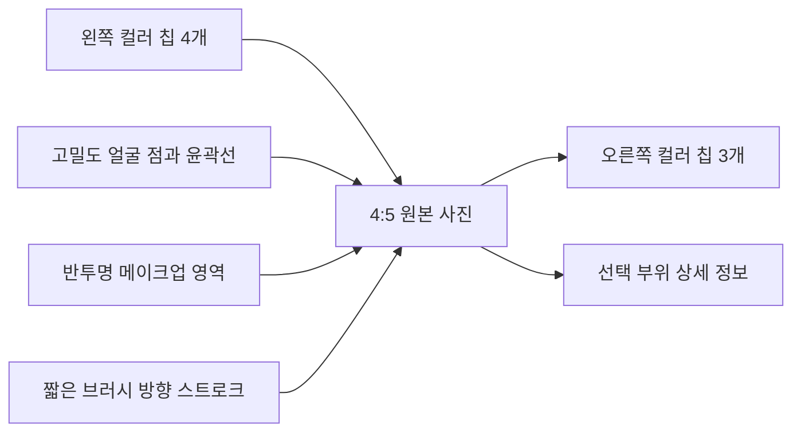

# HairFit V2 P37 — 메이크업 고밀도 랜드마크·레퍼런스 동기화 구현 명세

- 작성일: 2026-08-15
- 상태: 구현 승인 전 설계 기준
- 적용 범위: HairFit V2 Web Makeup Direction, 이후 Native 동기화
- 선행 페이즈: P30 얼굴 관찰 파이프라인, P33 Makeup Foundation Map, P34 Makeup Zone Prescriptions
- 대체 범위: P34의 메이크업 캔버스 렌더링·콜아웃 규칙
- 비대체 범위: 퍼스널 컬러 판정, 메이크업 방향 정책, 확정 스냅샷, 루틴·아티스트 브리프
- 후속 고도화: `p38-makeup-vision-semantic-dense-line-map-implementation-spec-2026-08-15.md`가 초정밀 atlas와 비전 semantic refinement를 정의한다.

## 1. 결론

현재 화면이 레퍼런스 시안과 다르게 보이는 핵심 원인은 랜드마크 모델의 부재가 아니다. 서버에는 468개 이상 FaceMesh 좌표가 있지만, 분석 Evidence는 13개 의미점만 노출하고 Makeup Geometry V1은 부위마다 소수 좌표와 합성 타원·직사각형을 사용한다. 프론트는 다시 이를 한 부위씩만 보여주기 때문에 얼굴 구조를 따라가는 촘촘한 메이크업 지도 대신 독립된 도형 몇 개처럼 보인다.

P37은 원본 4:5 사진 위에 고밀도 얼굴 토폴로지를 유지하면서, 눈썹·눈·코·입술·얼굴 윤곽을 연속 곡선으로 연결하고 메이크업 컬러 영역과 브러시 방향을 같은 좌표계에 겹친다. 컬러 칩은 레퍼런스처럼 사진 좌우에 4개/3개로 분산하고, 짧은 직선 또는 한 번만 꺾이는 연결선으로 해당 얼굴 부위와 연결한다.

목표는 “랜드마크가 많아 보이는 화면”이 아니라 **같은 모델 사진과 같은 스냅샷에서 레퍼런스의 위치·밀도·선형·컬러 배치를 재현하는 것**이다.

## 2. 레퍼런스 잠금 계약

구현을 시작하기 전에 사용자가 승인한 목표 시안을 아래 고정 경로에 저장한다.

`docs/hairfit-v2/references/makeup-direction-dense-landmark-target-v1.png`

이 파일은 P37의 시각 골든 마스터다. 승인 전 임시 캡처나 현재 구현 화면을 목표 시안으로 바꾸지 않는다. 골든 마스터 교체는 별도 리뷰와 파일 버전 증가가 필요하다.

고정 비교 조건:

| 항목 | 고정값 |
|---|---|
| 모델 사진 | E2E fixture의 동일한 세미리얼 모델 원본 |
| 이미지 비율 | 4:5 |
| 비교 뷰포트 | 390×844, 768×900, 1440×1100 |
| 기본 상태 | 전체 지도, 활성 모듈 `base`, 호버 없음 |
| 상세 상태 | `blush`, `eyeshadow`, `nose_contour` 각 1장 |
| 픽셀 처리 | 원본 이미지 filter/morph/smoothing 없음 |
| 폰트·색 토큰 | 현재 HairFit 디자인 토큰 유지 |

## 3. 현재 구현과 괴리 원인

| 계층 | 현재 상태 | 레퍼런스 괴리 |
|---|---|---|
| 얼굴 분석 | `buildFaceGeometryV2()`는 468개 이상을 받지만 Evidence에는 13개 의미점만 투영 | 눈·코·입술·윤곽을 따라가는 점열이 없음 |
| Makeup compiler | 눈썹 5점, 눈 6점, 입술 12점과 합성 12각 타원·폭 고정 band 사용 | 실제 얼굴 구조보다 도형 템플릿처럼 보임 |
| 베이스 가이드 | T존·콧날·턱선이 직사각형/band 중심 | 곡률과 얼굴 폭 변화가 반영되지 않음 |
| Canvas | 활성 콜아웃 하나만 렌더링 | 레퍼런스의 전체 얼굴 지도 밀도가 사라짐 |
| 컬러 칩 | 사진 밖 레일과 별도 정보 패널 중심 | 레퍼런스의 얼굴-칩 직접 대응이 약함 |
| 방향 가이드 | 소수의 큰 화살표 | 브러시 스트로크의 반복감과 흐름이 부족함 |

### 수정 원칙

1. FaceMesh 원본 좌표를 프론트에서 재추론하지 않는다.
2. 서버가 버전된 topology projection을 생성한다.
3. 합성 타원·직사각형은 fallback 전용으로 내린다.
4. 전체 얼굴 지도는 항상 보이고, 선택된 부위는 강조만 한다.
5. 컬러 영역, 방향선, 콜아웃은 동일한 snapshot revision을 사용한다.

## 4. 목표 화면 구조



### 4.1 레이어 순서

| z | 레이어 | 기본 표시 | 규칙 |
|---:|---|---|---|
| 0 | 원본 사진 | 항상 | 픽셀 변경 금지 |
| 1 | 전체 얼굴 mesh contour | 항상 | 중성색, 낮은 불투명도 |
| 2 | 부위별 landmark dots | 항상 | 2.0~3.2px, 얼굴 크기 비례 |
| 3 | 7개 메이크업 컬러 영역 | 항상 | 비활성 10~16%, 활성 24~32% |
| 4 | 브러시 방향 스트로크 | 항상 | 비활성은 짧고 옅게, 활성만 화살촉 강조 |
| 5 | 콜아웃 연결선 | 항상 | 얼굴을 관통하지 않는 최단 경로 |
| 6 | 좌우 컬러 칩 | 항상 | 왼쪽 4개, 오른쪽 3개, 중복 없음 |
| 7 | 선택 상세 정보 | 선택/호버 | 사진 바깥 하단 또는 인접 패널 |

### 4.2 기본 시각 규격

- landmark tick: 각 좌표에서 contour 접선에 수직인 4~6px 미세 선으로 표시하며 원·타원 점을 사용하지 않는다.
- contour stroke: 1px 기본, 1.5px 활성. `vector-effect: non-scaling-stroke` 사용.
- 점과 선은 사진 대비가 확보되는 아이보리/웜 골드 계열을 사용하고 38~58% 불투명도를 유지한다.
- 메이크업 영역은 Personal Color 기반 선색으로만 구분하며 채움 면을 만들지 않는다.
- 콜아웃 선은 1px, 활성 1.5px. 사진 중심축, 양 눈동자, 입술 내부를 가로지르지 않는다.
- 컬러 칩은 레퍼런스와 동일한 작은 직사각형으로 유지한다. 칩 자체에 긴 설명을 넣지 않는다.
- 모든 메이크업 영역은 ordered landmark를 잇는 개방형 곡선으로 그린다. `Z` 폐곡선, circle, ellipse, polygon, filled marker를 금지한다.

## 5. 고밀도 랜드마크 계약

### 5.1 입력

`FaceObservationBundleV2.landmarks`의 468개 이상 정규화 좌표를 유일한 기하 입력으로 사용한다. 478점 모델에서 iris 좌표가 존재하면 눈 중심 정밀화에만 사용하고, 없으면 468점 계약으로 정상 동작해야 한다.

### 5.2 화면에 표시하는 점

468개 전체 삼각 mesh를 그대로 그리면 메이크업보다 진단 장비처럼 보이므로, 렌더링 projection은 얼굴 특징을 따라가는 140~190개의 점으로 제한한다. 모든 원본 인덱스는 서버 snapshot에 provenance로 남긴다.

| 그룹 | 최소 표시점 | 필수 구조 |
|---|---:|---|
| face oval/jaw | 36 | 이마 외곽부터 귀밑·턱끝까지 연속 |
| left/right brow | 각 10 | 위·아래 경계와 꼬리 |
| left/right eye | 각 16 | 위·아래 눈꺼풀 폐곡선 |
| outer/inner lip | 각 20 | 외곽과 입술 안쪽 폐곡선 |
| nose bridge/alar/tip | 24 이상 | 콧대 양측, 콧볼, 코끝 |
| cheek/blush guides | 각 8 이상 | 광대에서 관자 방향 곡선 |
| T-zone/center axis | 10 이상 | 이마 중앙, 미간, 콧대 |

권장 MediaPipe index set은 `packages/shared/src/makeup/topology-v2.ts`에 상수로 둔다. face oval은 기존 `MEDIAPIPE_FACE_OVAL_INDICES`와 동일한 순서를 재사용한다. 눈·눈썹·입술·코는 좌우와 외곽/내곽을 별도 ordered path로 정의하고 배열 순서 자체를 계약 테스트한다.

V2 구현의 시작 index set은 다음과 같이 고정한다. provider topology 검증 없이 배열을 정렬하거나 좌우를 뒤집지 않는다.

```ts
const MAKEUP_FACE_TOPOLOGY_V2 = {
  faceOval: [10,338,297,332,284,251,389,356,454,323,361,288,397,365,379,378,400,377,152,148,176,149,150,136,172,58,132,93,234,127,162,21,54,103,67,109,10],
  leftBrowUpper: [70,63,105,66,107],
  leftBrowLower: [46,53,52,65,55],
  rightBrowUpper: [336,296,334,293,300],
  rightBrowLower: [276,283,282,295,285],
  leftEye: [33,7,163,144,145,153,154,155,133,173,157,158,159,160,161,246,33],
  rightEye: [263,249,390,373,374,380,381,382,362,398,384,385,386,387,388,466,263],
  outerLip: [61,146,91,181,84,17,314,405,321,375,291,409,270,269,267,0,37,39,40,185,61],
  innerLip: [78,95,88,178,87,14,317,402,318,324,308,415,310,311,312,13,82,81,80,191,78],
  noseBridge: [168,6,197,195,5,4,1],
  noseLeft: [168,98,97,99,240,75,59,166,219,218,1],
  noseRight: [168,327,326,328,460,305,289,392,439,438,1],
  leftCheek: [50,101,205,187,147,123,117,118],
  rightCheek: [280,330,425,411,376,352,346,347],
  tZone: [109,10,338,151,9,8,168,6,197,1],
} as const;
```

폐곡선의 마지막 index는 시작 index를 반복한다. 렌더러는 중복점을 dot으로 두 번 그리지 않고 path close 용도로만 사용한다. `left/right`는 화면 좌우가 아니라 provider가 정의한 피사체 기준을 유지하고, callout 배치 계층에서 사진 방향에 맞춰 표시 측을 결정한다.

### 5.3 출력 계약

```ts
type MakeupTopologyProjectionV2 = {
  version: "makeup-topology-v2";
  coordinateSpace: "normalized_source_image";
  sourceModel: { provider: string; name: string; version: string; pointCount: number };
  pointSets: Array<{
    id: "face_oval" | "left_brow" | "right_brow" | "left_eye" | "right_eye" |
      "nose" | "outer_lip" | "inner_lip" | "left_cheek" | "right_cheek" | "t_zone";
    sourceIndices: number[];
    points: MakeupNormalizedPoint[];
    closed: boolean;
  }>;
  moduleRegions: Array<{
    module: MakeupModule;
    paths: MakeupNormalizedPoint[][];
    strokePaths: MakeupNormalizedPoint[][];
    calloutAnchors: MakeupNormalizedPoint[];
  }>;
  confidence: number;
  degradedReason: null | "insufficient_points" | "low_confidence" | "occluded";
};
```

규칙:

- `sourceIndices.length === points.length`.
- 모든 좌표는 0~1 범위이며 사진 crop/rotation transform이 확정된 뒤 저장한다.
- 좌우 대칭을 가정해 한쪽 좌표를 복제하지 않는다.
- 서버 snapshot은 ordered point set을 저장하고 프론트는 index topology를 재조립하지 않는다.
- point count가 468 미만이면 V2를 조용히 흉내 내지 않는다. `degradedReason`을 표시하고 기존 sparse map으로 명시적 fallback한다.

## 6. 부위별 렌더링 규칙

### 6.1 눈썹

- 눈썹 위·아래 경계 점을 각각 연결하고 시작점·산·꼬리를 작은 강조점으로 둔다.
- 방향선은 시작점에서 산까지 3~4개의 짧은 스트로크, 산에서 꼬리까지 2~3개 스트로크로 분할한다.
- 한 개의 긴 화살표로 눈썹 전체를 덮지 않는다.

### 6.2 아이섀도·아이라인·속눈썹

- 눈꺼풀 폐곡선과 crease 곡선을 분리한다.
- 아이섀도는 eyelid 안쪽에 얇은 gradient-like SVG fill을 사용하되 CSS/raster filter는 사용하지 않는다.
- 아이라인은 upper lid ordered path를 그대로 따른다.
- 속눈썹은 눈꺼풀 접선에 수직인 5~7개의 짧은 fan vector로 표시한다.
- 양 눈의 실제 비대칭을 유지한다.

### 6.3 블러셔

- 단일 타원을 폐기하고 광대 landmark를 따라 2개의 curved band를 만든다.
- 각 볼에 3개의 평행 brush stroke를 배치한다.
- 코 방향의 시작 경계와 관자 방향의 끝 경계를 점으로 명확히 구분한다.

### 6.4 립

- outer/inner lip 20점 폐곡선을 모두 표시한다.
- 입술 컬러 영역은 두 폐곡선 사이의 fill rule로 계산한다.
- 큐피드 보우, 양 입꼬리, 하순 중앙점을 강조한다.

### 6.5 T존·콧날·턱선

- T존은 이마의 가로 직사각형을 폐기하고 이마 중심 landmark를 따라 부드러운 부채꼴/세로 곡선으로 만든다.
- 콧날 섀도우는 콧대 양측 6점 이상의 곡선을 사용하고 코끝에서 자연스럽게 좁아져야 한다.
- 턱선 섀도우는 face oval의 귀밑~턱끝 ordered points를 그대로 따라가며 좌우 각각 8점 이상을 사용한다.
- 하이라이트와 섀도우가 같은 픽셀을 과도하게 덮으면 compiler가 겹침을 줄이고 warning provenance를 저장한다.

## 7. 컬러 칩·연결선 계약

고정 배치:

| 왼쪽 | 오른쪽 |
|---|---|
| EYEBROW | T-ZONE |
| EYE | NOSE CONTOUR |
| BLUSH | JAW SHADOW |
| LIP |  |

- 각 칩은 유일한 `calloutId`와 색상 하나만 가진다.
- 연결선은 해당 영역의 바깥쪽 anchor에서 사진 가장자리 방향으로 출발한다.
- 선은 직선 또는 한 번의 90도/완만한 elbow만 허용한다.
- 두 연결선의 교차, 칩 중첩, 얼굴 중앙 관통을 금지한다.
- hover/focus/tap은 해당 영역의 점·곡선·채움·스트로크를 함께 강조한다.
- 상세 카드에는 색상명, HEX, 강도, 질감, 브러시 방향을 표시하되 얼굴 위를 덮지 않는다.
- 키보드 포커스 순서는 왼쪽 위→아래, 오른쪽 위→아래다.

## 8. 인터랙션 상태

| 상태 | 전체 mesh | 비활성 영역 | 활성 영역 | 상세 정보 |
|---|---|---|---|---|
| 기본 overview | 표시 | 표시 | base 강조 | base |
| 칩 hover/focus | 표시 | 35% 감쇠 | 즉시 강조 | 대상 갱신 |
| 모듈 선택 | 표시 | 표시 | 선택 유지 | 선택 유지 |
| detail | 표시 | 20% 감쇠 | 점·경로·스트로크 최대 강조 | 편집 컨트롤 연결 |
| degraded | sparse 표시 | 가능 영역만 | 경고 배지 | 사유와 재분석 CTA |

hover는 서버 상태를 변경하지 않는다. click/tap으로 선택했을 때만 `activeModule`이 바뀐다. 메이크업 snapshot 수정은 기존 revision patch 계약을 유지한다.

## 9. 구현 변경 지점

### 9.1 Shared/backend

| 파일 | 변경 |
|---|---|
| `packages/shared/src/makeup/contract.ts` | `MakeupTopologyProjectionV2` 및 degraded contract 추가 |
| `packages/shared/src/makeup/topology-v2.ts` | ordered FaceMesh index set과 path compiler 추가 |
| `packages/shared/src/makeup/geometry.ts` | 합성 도형 V1과 topology V2 compiler 분리 |
| `packages/shared/src/makeup/schema.ts` | point set, source index, bounds, minimum count 검증 |
| `my-app/lib/makeup/makeup-direction-server.ts` | V2 projection 저장·revision·provenance 연결 |
| `packages/shared/src/makeup/contract.test.ts` | topology 순서, 범위, 좌우 비복제, fallback 테스트 |

기존 DB snapshot JSON 컬럼에 additive field로 저장할 수 있으면 새 migration을 만들지 않는다. 컬럼/제약 변경이 필요할 때만 additive migration을 별도 페이즈로 추가한다.

### 9.2 Web

| 파일 | 변경 |
|---|---|
| `MakeupDirectionCanvas.tsx` | 전체 topology·7개 영역 동시 투영, 활성 강조, callout anchor 사용 |
| `MakeupDirectionPaths.tsx` | 점·곡선·영역·브러시 stroke 전용 순수 SVG 컴포넌트 신설 |
| `MakeupColorCallouts.tsx` | 좌우 칩과 collision-free connector 전용 컴포넌트 신설 |
| `MakeupDirectionFixture.tsx` | 468점 기반 고정 fixture와 승인된 모델 사진 사용 |
| `globals.css` | `makeup-direction-v2-*` namespace 추가, 기존 스타일 토큰 유지 |
| `MakeupDirectionMatrix.tsx` | 시각 지도와 동일 snapshot revision 표시 |

한 컴포넌트에서 모든 SVG와 칩 좌표를 계산하지 않는다. geometry projection, SVG rendering, callout layout, semantic information을 분리한다.

### 9.3 Native

Web 골든 마스터 승인 후 Native를 진행한다. Native는 첫 anchor 한 개만 표시하는 현재 구현을 폐기하고 같은 ordered point sets를 `react-native-svg`에 투영한다. Web과 Native는 독립적으로 geometry를 생성하지 않는다.

## 10. 성능·접근성·안전

- SVG DOM 목표: 점·path·connector를 합쳐 320개 이하.
- 초기 topology render: 데스크톱 p95 32ms 이하, hover/focus 시각 반응 p95 50ms 이하.
- resize 시에만 connector layout을 다시 계산하고 pointer move마다 geometry를 재계산하지 않는다.
- `prefers-reduced-motion`에서는 강조 전환 애니메이션을 제거한다.
- Canvas는 시각 보조이며 Direction Matrix와 상세 패널이 동일한 정보를 텍스트로 제공한다.
- 색만으로 상태를 구분하지 않고 점 크기, 선 굵기, `aria-pressed`를 함께 사용한다.
- 원본 signed photo URL, raw 468 landmarks, 얼굴 좌표를 telemetry에 기록하지 않는다.
- 원본 사진 filter, 얼굴 morph, 피부 smoothing, 성별 기반 모듈 제거를 금지한다.

## 11. 단계별 구현 계획

### P37-0 — 레퍼런스 고정과 baseline

- 승인 시안을 고정 경로에 저장한다.
- 현재 화면을 동일 viewport·fixture·상태로 다시 캡처한다.
- 점 개수, 곡선 개수, 칩 배치, 교차선 수, screenshot diff를 baseline JSON으로 저장한다.

종료조건:

- 골든 마스터 SHA-256과 비교 환경이 문서화된다.
- 현재 괴리가 눈대중이 아닌 측정값으로 재현된다.

### P37-1 — Dense topology contract

- ordered index set과 projection schema를 구현한다.
- 468/478점 입력, 저신뢰·가림·점 부족 fallback을 검증한다.
- 기존 Makeup snapshot에 additive projection을 연결한다.

종료조건:

- 승인 fixture에서 140~190개 표시점이 생성된다.
- 필수 11개 point set이 모두 존재하고 좌표 범위 오류가 0건이다.
- 같은 입력은 byte-stable projection을 생성한다.

### P37-2 — 얼굴 곡선과 메이크업 영역

- Catmull-Rom 또는 monotone cubic 기반 SVG path compiler를 구현한다.
- 눈썹·눈·코·입술·윤곽·볼·T존을 ordered path로 렌더링한다.
- 합성 타원·직사각형은 degraded fallback 외에는 사용하지 않는다.

종료조건:

- 원시 polygon 꼭짓점이 보이는 구간이 없다.
- 각 부위가 실제 landmark path와 최대 3px 이내로 정렬된다.
- 얼굴 좌우 비대칭이 fixture 좌표와 동일하게 유지된다.

### P37-3 — 브러시 스트로크와 콜아웃

- 짧은 반복 stroke와 접선 기반 방향을 추가한다.
- 왼쪽 4개·오른쪽 3개 칩과 connector를 구현한다.
- hover/focus/tap 동기화를 연결한다.

종료조건:

- 컬러 칩 중복 0, connector 교차 0, 얼굴 중앙 관통 0.
- 칩과 대상 영역 연결 오차가 desktop 12px, mobile 8px 이하다.
- 마우스·키보드·터치가 동일한 상세 정보를 연다.

### P37-4 — 레퍼런스 시각 동기화

- 승인 시안과 overlay 비교 도구를 만든다.
- 위치·크기·불투명도·선 굵기만 조정하며 임의 새 장식을 추가하지 않는다.
- 390/768/1440 골든 캡처를 고정한다.

종료조건:

- 사진 영역 masked SSIM 0.95 이상 또는 승인된 perceptual diff threshold 통과.
- 랜드마크/곡선 keypoint projection 평균 오차 3px 이하, p95 6px 이하.
- 칩 중심 위치 평균 오차 6px 이하, p95 12px 이하.
- 사용자 승인 캡처가 evidence에 저장된다.

### P37-5 — 회귀·Native handoff

- Matrix, module adjustment, snapshot confirmation, routine/brief 회귀를 실행한다.
- Web 계약을 Native projection 명세로 전달한다.
- 기능 플래그 `MAKEUP_DENSE_LANDMARK_MAP_V2`의 off 경로를 검증한다.

종료조건:

- Web 390/768/1440, keyboard, reduced motion, axe critical/serious 0건.
- 기존 P33~P36 계약 테스트 통과.
- flag off에서 V1 데이터 손실 없이 기존 Makeup 화면으로 복귀한다.
- Native는 Web 승인 전 완료로 판정하지 않는다.

## 12. 검증 매트릭스

| 검증 | 방법 | 합격 기준 |
|---|---|---|
| topology completeness | shared unit | 필수 point set 11개, 표시점 140~190 |
| deterministic output | snapshot test | 동일 입력 byte-stable |
| source alignment | landmark projection test | mean ≤3px, p95 ≤6px |
| visual fidelity | Playwright golden comparison | SSIM ≥0.95 또는 승인 threshold |
| callout layout | DOM geometry test | 중복·교차·중앙 관통 0 |
| original pixels | DOM/CSS contract | filter/morph/smoothing 0 |
| interaction | Playwright | hover/focus/tap parity |
| accessibility | axe + keyboard | critical/serious 0, 전체 칩 접근 가능 |
| responsive | 390/768/1440 | 수평 overflow 0, 사진/칩 잘림 0 |
| performance | browser timing | 초기 p95 ≤32ms, 강조 p95 ≤50ms |
| rollback | flag test | V1 복귀, snapshot 보존 |

## 13. 최종 종료조건

다음 조건을 모두 만족해야 P37을 완료로 판정한다.

1. 승인된 목표 이미지가 버전된 골든 마스터로 고정됐다.
2. 서버 FaceMesh에서 유도된 140~190개의 표시점과 ordered paths가 snapshot에 저장된다.
3. 눈썹·눈·코·입술·볼·T존·턱선이 합성 도형이 아니라 실제 좌표 곡선을 따른다.
4. 전체 얼굴 지도가 기본 화면에 유지되고 선택은 강조만 변경한다.
5. 왼쪽 4개·오른쪽 3개 컬러 칩이 중복 없이 해당 부위에 연결된다.
6. 브러시 방향은 한 개의 큰 화살표가 아니라 짧은 반복 스트로크로 표현된다.
7. 레퍼런스 동기화 수치, 반응형, 접근성, 원본 픽셀 보존 검증이 모두 통과한다.
8. P33~P36 회귀가 없고 flag off rollback이 데이터 손실 없이 동작한다.
9. Web 골든 캡처를 사용자가 승인했다.
10. Native는 별도의 화면·기기 검증 전에는 동기화 완료로 보고하지 않는다.

## 14. 명시적 비목표

- 이 페이즈에서 생성형 AI로 메이크업 결과 이미지를 합성하지 않는다.
- 얼굴 형태, 피부 결, 눈·코·입술 크기를 변경하지 않는다.
- 랜드마크가 메이크업 효과 자체인 것처럼 과장하지 않는다.
- 골든 마스터 없이 개발자가 임의로 “비슷하다”고 판정하지 않는다.
- 로컬 fixture 검증을 실제 사용자 사진, 실인증, 배포 환경 증거로 확대 해석하지 않는다.

## 15. 2026-08-15 로컬 구현 결과

| 항목 | 결과 | 증거 |
|---|---|---|
| Dense topology V2 계약 | 완료 | 15개 ordered point set, 7개 module region, 7개 callout anchor, 점 부족 degraded fallback |
| 서버 projection | 완료 | MediaPipe 468점 입력에서 중복 제거된 표시점 140~190개를 결정적으로 생성 |
| Web face map | 완료 | circle·ellipse·polygon·filled marker·`Z` 폐곡선 없이 얼굴 윤곽·눈썹·눈·코·입술·볼·T존·턱선을 open SVG line과 짧은 tick/stroke로 렌더링 |
| E2E 모델 좌표 | 완료 | `hairfit-semi-real-model-v1.png`에서 MediaPipeFaceMesh로 직접 추출한 좌표를 fixture로 고정하고 sampleEllipse 제거 |
| 컬러 콜아웃 | 완료 | 왼쪽 4개·오른쪽 3개, elbow connector, hover·focus·tap 상세 동기화 |
| 원본 사진 보존 | 완료 | 원본 raster에 filter·morph·smoothing을 적용하지 않고 SVG overlay만 사용 |
| 반응형·접근성 | 로컬 통과 | 390/768/1440, reduced motion, keyboard, axe critical/serious 0 |
| 회귀 | 로컬 통과 | shared 119, P33~P36 각 7, Makeup Playwright 6 |
| 승인 시안 수치 비교 | 대기 | 승인 원본 파일이 고정 경로에 없어 SSIM·keypoint 오차를 산출하지 않음 |
| Native 동기화 | 대기 | Web 골든 승인 이후 별도 화면·기기 검증 필요 |

로컬 캡처:

- `docs/hairfit-v2/evidence/p06-makeup-zone-direction-desktop.png`
- `docs/hairfit-v2/evidence/p08-makeup-tablet-accessibility.png`

현재 상태는 P37-1~P37-3과 Web 회귀 검증까지 완료했다. P37 전체 완료 판정은 승인 시안 원본을
`docs/hairfit-v2/references/makeup-direction-dense-landmark-target-v1.png`에 고정하고 P37-4의 수치 비교 및 사용자 승인을 받은 뒤에만 가능하다.
