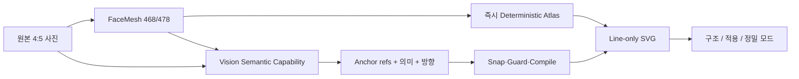
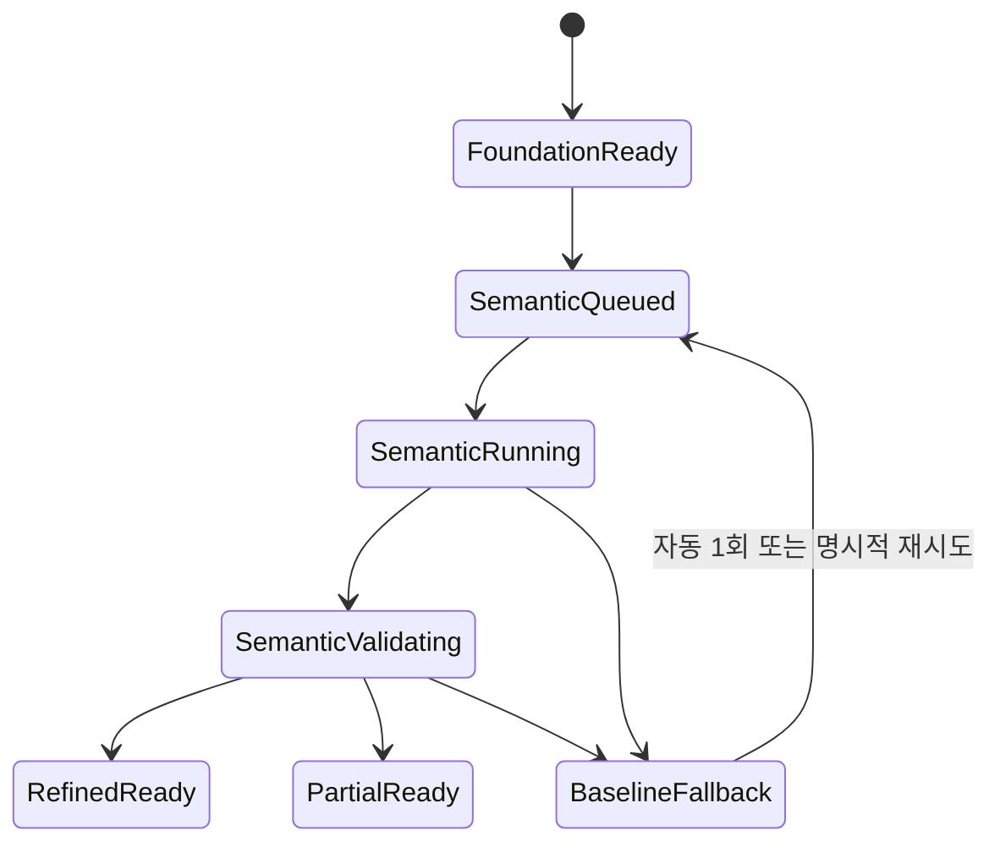

# HairFit V2 P38 — 비전 시맨틱·초정밀 메이크업 라인 맵 구현 명세

- 작성일: 2026-08-15
- 상태: 로컬 구현·mock 검증 완료, staff canary·Native 실제 기기 검증 대기
- 적용 범위: HairFit V2 Web Makeup Direction, 서버 비전 capability, 이후 Native handoff
- 선행 페이즈: P30 얼굴 관찰, P33 Makeup Foundation, P34 Zone Prescriptions, P37 Dense Landmark Line Map
- 규범 우선순위: 이 문서의 line-only·vision semantic 규칙이 P37의 점·채움·합성 도형 규칙을 대체한다.
- 비대체 범위: 퍼스널 컬러 판정, 7개 메이크업 모듈 정책, 확정 스냅샷, 루틴·아티스트 브리프
- 최고 승인 경계: 로컬 문서 작성과 이후 별도 승인된 구현까지. 배포·원격 migration·실서비스 canary는 별도 승인 대상이다.

## 1. 결정

P38은 생성형 비전 모델이 사진 위에 완성된 SVG나 raster를 직접 그리는 구조로 만들지 않는다.

**FaceMesh가 얼굴 기하를 소유하고, 비전 모델은 메이크업 의미와 적용 방향을 구조화된 데이터로 제안하며, 서버 compiler가 이를 실제 landmark 선에 스냅해 그린다.**

이 결정을 적용하는 이유는 다음과 같다.

1. 비전 모델이 좌표와 이미지를 직접 그리면 동일 입력에도 선 위치가 흔들린다.
2. raster 결과는 hover, focus, module 조절, 접근성 표, revision patch와 동기화할 수 없다.
3. FaceMesh 좌표에 스냅하면 얼굴 비대칭·표정·촬영 구도를 유지하면서도 허용 범위를 검증할 수 있다.
4. 비전 호출이 실패하거나 느려도 P37의 결정론적 라인 맵을 즉시 표시할 수 있다.
5. 모델 교체와 무관하게 Web·Native가 같은 compiled projection을 렌더링할 수 있다.

P38의 사용자 체감 목표는 “랜드마크가 많아 보이는 화면”이 아니라 다음 세 가지다.

- 얼굴 구조를 따라가는 정교한 선
- 부위마다 다른 메이크업 적용 이유와 브러시 흐름
- 비전 분석 전·진행 중·완료 후가 자연스럽게 이어지는 자동 refinement

## 2. 현재 기준선과 문제

P37 로컬 구현은 다음을 이미 제공한다.

- MediaPipeFaceMesh 기반 ordered topology V2
- 15개 point set과 약 140~190개의 고유 source index
- 원·타원·polygon·filled marker를 사용하지 않는 open SVG line
- 좌우 4/3 컬러 callout과 hover·focus·tap 동기화
- 390/768/1440 fixture 및 접근성 회귀

남은 한계는 다음과 같다.

| 영역 | P37 상태 | P38에서 해결할 문제 |
|---|---|---|
| 얼굴 구조 | 외곽·눈썹·눈·코·입술·볼 중심 15개 set | 아이홀, 언더아이, 광대, 관자, 인중, 콧볼, 턱 중심 등 세부 구조 부족 |
| 메이크업 의미 | 모듈별 고정 topology 조합 | 실제 눈·광대·콧대 특징에 따른 적용 위치 차이가 약함 |
| 브러시 흐름 | topology stroke path의 단순 점선 | 시작·중간·끝, 반복 횟수, 방향, 금지 경계 부족 |
| 분석 상태 | 완성 projection을 즉시 표시 | 비전 refinement 진행·완료·fallback 상태가 없음 |
| 설명 데이터 | 컬러·강도·질감·방향 중심 | 얼굴 특징→적용 전략→주의점의 provenance 부족 |
| fixture | 단일 세미리얼 모델 중심 | 다양한 얼굴·수염·안경·앞머리·가림 검증 부족 |

## 3. 목표 화면 계약

### 3.1 표현 모드

| 모드 | 목적 | 표시 내용 |
|---|---|---|
| `structure` | 얼굴 구조 이해 | 전체 구조선, 미세 landmark tick, 낮은 불투명도의 의미 부위 |
| `application` | 메이크업 적용 | 선택 모듈 line bundle, 짧은 brush stroke, 시작·종료 경계, callout |
| `precision` | 정밀 분석 검토 | 468/478점 중 허용 projection, source anchor, confidence, exclusion |

기본 진입은 `application`이다. 전체 얼굴 구조선은 모든 모드에서 유지하고 선택 부위는 색·선 굵기·불투명도만 강화한다. 모드 전환은 서버 상태를 변경하지 않는다.

### 3.2 시각 레이어



레이어 순서는 고정한다.

| z | 레이어 | 규칙 |
|---:|---|---|
| 0 | 원본 사진 | filter, morph, smoothing 금지 |
| 1 | deterministic structure atlas | 비전 결과와 무관하게 즉시 표시 |
| 2 | semantic line bundle | 검증을 통과한 결과만 표시 |
| 3 | landmark tick | 원 대신 4~6px 접선 수직선 사용 |
| 4 | brush stroke | 짧은 open line 3~9개, filled arrow 금지 |
| 5 | callout connector | 얼굴 중심과 보호 영역을 피하는 open polyline |
| 6 | 좌우 컬러 칩 | 왼쪽 4개·오른쪽 3개, 중복 금지 |
| 7 | 분석 상태·상세 정보 | 사진 바깥에 표시 |

### 3.3 금지 primitive

얼굴과 메이크업 가이드에는 아래 요소를 사용하지 않는다.

- SVG `circle`, `ellipse`, `polygon`
- `Z` 또는 `z`로 닫힌 path
- fill이 있는 얼굴·메이크업 영역
- filled arrow marker
- 임의 rectangle, band, sampleEllipse 기반 얼굴 geometry
- 비전 모델이 생성한 raster overlay

컬러 칩과 일반 UI 사각형은 금지 대상이 아니다.

## 4. Dense Face Atlas V3

### 4.1 입력

유일한 얼굴 기하 source는 `FaceObservationBundleV2.landmarks`다.

- 478점이면 iris를 포함한 정밀 눈 중심을 사용한다.
- 468점이면 iris 없이 정상 동작한다.
- 468점 미만이면 V3를 흉내 내지 않고 P37 degraded map으로 내려간다.
- manual correction이 존재하면 확정된 correction revision을 적용한 뒤 V3를 계산한다.
- 사진 crop·rotation이 확정된 `normalized_source_image` 좌표만 사용한다.

### 4.2 목표 line set

V3는 최소 30개, 목표 40~48개의 ordered open line set을 제공한다.

| 그룹 | 필수 line set | 목표 수 |
|---|---|---:|
| 얼굴 외곽 | 전체 외곽, 좌우 관자, 좌우 턱, 턱끝, 광대 외곽 | 7 |
| 눈썹 | 좌우 상단·하단·중심축 | 6 |
| 눈 | 좌우 위·아래 눈꺼풀, crease, 언더아이 | 8 |
| 코 | 중심 콧대, 좌우 콧대, 좌우 콧볼, 코끝 | 6 |
| 입술 | 상·하 외곽, 상·하 안쪽, 입술산, 입꼬리 축 | 6 |
| 안면 중심 | 인중, 팔자 좌우, 턱 중앙 | 4 |
| 메이크업 구조 | T존, C존 좌우, 블러셔 좌우, 턱 음영 좌우 | 7 |

### 4.3 렌더 밀도

- `structure`: 고유 source index 200개 이상, line segment 180~260개
- `application`: structure 유지 + 선택 module stroke 12~36개
- `precision`: 최대 478점 중 허용된 300~420개 tick과 260~420개 segment
- 전체 SVG node는 desktop 760개, mobile 520개 이하
- 비활성선은 28~45%, 활성선은 78~100% opacity
- 모든 선은 `vector-effect="non-scaling-stroke"` 사용

### 4.4 V3 projection 계약

```ts
export type MakeupAtlasLineId =
  | "face.oval" | "face.temple.left" | "face.temple.right"
  | "face.cheekbone.left" | "face.cheekbone.right"
  | "face.jaw.left" | "face.jaw.right" | "face.chin"
  | "brow.upper.left" | "brow.lower.left" | "brow.axis.left"
  | "brow.upper.right" | "brow.lower.right" | "brow.axis.right"
  | "eye.upper.left" | "eye.lower.left" | "eye.crease.left" | "eye.under.left"
  | "eye.upper.right" | "eye.lower.right" | "eye.crease.right" | "eye.under.right"
  | "nose.bridge.center" | "nose.bridge.left" | "nose.bridge.right"
  | "nose.alar.left" | "nose.alar.right" | "nose.tip"
  | "lip.outer.upper" | "lip.outer.lower" | "lip.inner.upper"
  | "lip.inner.lower" | "lip.cupid" | "lip.corner.axis"
  | "center.philtrum" | "center.nasolabial.left"
  | "center.nasolabial.right" | "center.chin";

export interface MakeupDenseAtlasV3 {
  version: "makeup-dense-atlas-v3";
  coordinateSpace: "normalized_source_image";
  sourceModel: {
    provider: string;
    name: string;
    version: string;
    pointCount: 468 | 478;
  };
  sourceCorrectionRevision: number;
  lineSets: Array<{
    id: MakeupAtlasLineId;
    sourceIndices: number[];
    points: MakeupNormalizedPoint[];
    open: true;
    confidence: number;
  }>;
  uniqueSourcePointCount: number;
  degradedReason: null | "insufficient_points" | "low_confidence" | "occluded";
}
```

규칙:

- `sourceIndices.length === points.length`
- 모든 line은 `open: true`
- 같은 source 입력은 byte-stable atlas를 생성
- 좌우 얼굴을 복제하거나 평균내지 않음
- source index 순서는 provider topology 순서를 유지
- `uniqueSourcePointCount >= 200`을 통과하지 못하면 precision 모드를 열지 않음

## 5. Vision Semantic Capability

### 5.1 모델 선택

모델명은 코드에 하드코딩하지 않고 기존 `my-app/lib/vision-model.ts`의 우선순위를 재사용한다.

1. `PROMPT_VISION_MODEL`
2. `PROMPT_RESEARCH_MODEL`
3. `PROMPT_LLM_MODEL`
4. repository default

사용자가 지정한 GPT-4o canary는 배포 환경에서 `PROMPT_VISION_MODEL=gpt-4o`로 선택한다. OpenAI 모델이면 Responses API의 strict `json_schema`를 사용하고, Gemini 모델이면 같은 schema를 provider adapter에서 검증한다. 모델 가용성·가격·실서비스 키는 canary 직전에 별도 확인한다.

### 5.2 capability 식별자

```ts
capability: "makeup-semantic-map"
engineVersion: "makeup-semantic-map-v3"
promptPolicyVersion: "makeup-semantic-anchor-selection-v1"
fallbackMode: "deterministic-dense-atlas-v3"
```

기존 `consultation_capability_tasks_v2`, `consultation_capability_attempts_v2`, `consultation_capability_results_v2`를 재사용한다. P38 전용 task table을 만들지 않는다.

### 5.3 입력 payload

비전 모델에는 최대 두 장의 이미지를 전달한다.

1. 1024px 이하로 정규화한 원본 4:5 사진
2. 같은 사진에 allowlisted anchor group ID만 표시한 reference map

텍스트 입력에는 다음만 포함한다.

- 7개 모듈의 현재 enable 상태
- 사용자가 선택한 presentation, occasion, preparation time, skill level
- facial hair와 사용자 제외 요청
- Personal Color의 활성 profile ID가 아닌 허용 palette attribute
- line atlas의 allowlisted anchor group 설명

모델에 raw signed URL, user ID, consultation ID, storage path, 전체 478점 JSON을 전달하지 않는다.

### 5.4 입력 fingerprint

```ts
semanticInputFingerprint = sha256({
  sourceImageFingerprint,
  faceObservationBundleId,
  sourceCorrectionRevision,
  denseAtlasVersion,
  makeupSnapshotSourceFingerprint,
  contextRevision,
  moduleStateFingerprint,
  personalColorProfileFingerprint,
  promptPolicyVersion,
  model,
});
```

동일 fingerprint는 완료된 capability result를 재사용한다. hover, focus, mode 전환, 페이지 재진입은 새 비전 호출을 만들지 않는다.

## 6. Vision structured output 계약

비전 모델은 SVG path나 자유 좌표 배열을 반환하지 않는다. allowlisted anchor reference와 제한된 offset만 반환한다.

```ts
export type MakeupSemanticZoneId =
  | "brow.left" | "brow.right"
  | "eyeshadow.left" | "eyeshadow.right"
  | "eyeliner.left" | "eyeliner.right"
  | "lashes.left" | "lashes.right"
  | "blush.left" | "blush.right"
  | "lip.upper" | "lip.lower"
  | "t_zone.highlight"
  | "nose.contour.left" | "nose.contour.right"
  | "jaw.shadow.left" | "jaw.shadow.right";

export interface MakeupSemanticMapV3 {
  schemaVersion: "makeup-semantic-map-v3";
  faceCharacteristics: {
    brow: string;
    eye: string;
    cheekbone: string;
    nose: string;
    lip: string;
    jaw: string;
  };
  zones: Array<{
    id: MakeupSemanticZoneId;
    module: MakeupModule;
    purpose: "highlight" | "shadow" | "color" | "definition";
    anchorRefs: Array<{
      lineId: MakeupAtlasLineId;
      sourceIndex: number;
      tangentOffset: number;
      normalOffset: number;
    }>;
    pathMode: "follow_topology" | "parallel_offset" | "interpolate_between";
    brushDirection: "inner_to_outer" | "outer_to_inner" | "upward" | "downward" | "radial";
    brushStrokeCount: number;
    intensity: number;
    reason: string;
    caution: string;
    exclusions: Array<"hair" | "facial_hair" | "glasses" | "eye" | "nostril" | "lip_inner" | "occluded">;
    confidence: {
      semantic: number;
      visibility: number;
    };
  }>;
  summary: string;
}
```

strict schema 제한:

- zone ID 중복 금지
- `tangentOffset`, `normalOffset`: -0.025~0.025
- `brushStrokeCount`: 3~9
- `intensity`, confidence: 0~1
- `reason`, `caution`, `summary`: 한국어, 각각 최대 180자
- allowlist에 없는 line ID와 source index 금지
- 성별·인종·연령·건강 상태 추정 필드 금지
- 제품 브랜드와 구매 권유 금지

## 7. Snap·Guard·Compile

### 7.1 신뢰 경계

비전 결과는 서버 validator를 통과하기 전까지 렌더링 데이터가 아니다.

검증 순서:

1. strict schema validation
2. source fingerprint와 correction revision 일치
3. allowlisted line/source index 확인
4. offset 범위 clamp가 아니라 fail-closed 검증
5. 인접 anchor continuity 확인
6. 보호 영역 교차 검사
7. self-intersection·비정상 segment gap 검사
8. confidence gate
9. deterministic projection compile

### 7.2 보호 영역

아래 영역은 module policy가 명시적으로 허용하지 않는 한 선이 통과할 수 없다.

- iris와 pupil
- 안구 내부
- nostril 내부
- inner lip 내부
- hair·glasses·facial hair로 가려진 영역
- 사진 경계 밖

### 7.3 수치 기준

| 검증 | 합격 기준 |
|---|---:|
| anchor→source landmark 거리 | mean ≤2px, p95 ≤5px |
| 인접 segment gap | source face width의 6% 이하 |
| normal/tangent offset | 절대값 0.025 이하 |
| 보호 영역 관통 | 0건 |
| self-intersection | 의도된 눈·입술 contour 외 0건 |
| semantic confidence | zone별 0.70 이상 |
| visibility confidence | zone별 0.65 이상 |

한 zone만 실패하면 해당 zone은 deterministic V3 line으로 대체하고 결과 상태를 `partial`로 둔다. 구조 전체가 실패하면 P37/P38 deterministic atlas를 유지하고 capability는 retryable failure 또는 rejected result로 기록한다.

### 7.4 compiled projection

```ts
export interface MakeupSemanticProjectionV3 {
  version: "makeup-semantic-projection-v3";
  sourceFingerprint: string;
  semanticOutputFingerprint: string;
  atlasVersion: "makeup-dense-atlas-v3";
  state: "complete" | "partial" | "fallback";
  lineBundles: Array<{
    zoneId: MakeupSemanticZoneId;
    module: MakeupModule;
    role: "structure" | "application" | "brush" | "boundary";
    points: MakeupNormalizedPoint[];
    open: true;
    colorToken: string;
    emphasis: number;
    provenance: {
      sourceIndices: number[];
      semanticConfidence: number | null;
      fallback: boolean;
    };
  }>;
  excludedZones: Array<{ zoneId: MakeupSemanticZoneId; reason: string }>;
  warnings: string[];
}
```

프론트는 `anchorRefs`를 재해석하지 않고 이 projection만 그린다.

## 8. 비동기 workflow

P38은 새 사용자 단계를 만들지 않는다. Makeup 진입과 build 동작 한 번으로 자동 진행한다.



snapshot의 기존 `map_ready`, `partial_ready`, `user_adjusted`, `confirmed` 상태를 비전 task 상태로 오염시키지 않는다. 서버 응답에서 두 상태를 별도 제공한다.

```ts
interface MakeupDirectionServerState {
  snapshot: MakeupDirectionSnapshot | null;
  revision: number | null;
  sourceFingerprint: string | null;
  semanticMap: CapabilityResult<MakeupSemanticProjectionV3> | null;
}
```

### 8.1 자동 진행 규칙

- foundation map은 원격 비전 호출을 기다리지 않고 즉시 표시한다.
- 비전 task는 build 성공 직후 자동 dispatch한다.
- queued/running/validating 동안 작은 refinement 상태를 표시한다.
- 완료되면 페이지 이동이나 Next 클릭 없이 projection을 교체한다.
- 사용자가 페이지를 나가도 durable task는 계속되고 재진입 시 이어서 읽는다.
- provider timeout 시 UI는 foundation map을 계속 제공하며 빈 화면을 만들지 않는다.
- retryable failure는 exponential backoff로 서버 자동 1회 재시도한다.
- 최종 실패 뒤에만 `정밀 분석 다시 시도` CTA를 제공한다.

### 8.2 revision 충돌 방지

비전 결과를 editable `makeup_direction_snapshots.snapshot`에 비동기로 덮어쓰지 않는다.

- capability result는 source fingerprint와 독립적으로 저장한다.
- read 시 현재 snapshot source fingerprint와 일치할 때만 합성한다.
- 사용자의 module patch와 비전 task는 같은 revision row를 경쟁해 update하지 않는다.
- confirmed snapshot도 source fingerprint가 같으면 동일 semantic result를 읽을 수 있다.
- source, personal color, selected style, context가 바뀌면 이전 result는 stale로 표시하고 사용하지 않는다.

현재 snapshot이 JSONB이고 capability durability table이 존재하므로 P38 기본 구현에는 DB migration이 필요 없다. 새 컬럼이나 RPC signature를 추가하려면 별도 migration 검토를 먼저 수행한다.

## 9. API 계약

### 9.1 기존 build 확장

`POST /api/consultations/[sessionId]/makeup/build`

요청은 기존 `expectedRevision`을 유지한다. 응답에 semantic task receipt를 additive로 추가한다.

```json
{
  "snapshot": {},
  "revision": 5,
  "sourceFingerprint": "redacted",
  "semanticMap": {
    "schemaVersion": "capability-result-v1",
    "capability": "makeup-semantic-map",
    "state": "queued",
    "output": null
  }
}
```

### 9.2 read

`GET /api/consultations/[sessionId]/makeup`

- snapshot과 현재 fingerprint에 맞는 semantic task/result를 함께 반환
- owner 확인 필수
- raw provider response와 raw image를 반환하지 않음

### 9.3 retry

`POST /api/consultations/[sessionId]/makeup/semantic-map/retry`

```ts
type Request = {
  snapshotId: string;
  sourceFingerprint: string;
  failedTaskId: string;
};
```

- retryable terminal state에서만 허용
- 동일 fingerprint의 completed result가 있으면 replay
- 새 task 생성 시 기존 cost receipt와 attempt provenance 보존
- 사용자의 module selection이나 adjustment를 초기화하지 않음

## 10. Web UX 계약

### 10.1 상태 표현

| semantic 상태 | 사진 위 | 사진 밖 상태 문구 | 사용자 동작 |
|---|---|---|---|
| 없음 | deterministic atlas | `얼굴 구조를 준비했어요.` | 즉시 탐색 가능 |
| queued | atlas | `메이크업 포인트를 정리하고 있어요.` | 탐색 가능 |
| running | atlas + 미세 trace | 짧은 small-talk carousel | 탐색·이탈 가능 |
| validating | atlas | `얼굴선에 맞춰 가이드를 다듬고 있어요.` | 탐색 가능 |
| complete | semantic projection | `정밀 가이드가 준비됐어요.` | 자동 전환 |
| partial | 혼합 projection | 누락 부위와 fallback 표시 | 계속 진행 가능 |
| failed | deterministic atlas | 실패 사유와 재시도 CTA | 계속 진행 가능 |

small-talk 메시지는 사실을 과장하지 않는다.

- `눈썹의 시작점과 꼬리 흐름을 확인하고 있어요.`
- `광대와 볼 중심의 간격을 맞추고 있어요.`
- `콧대와 턱선에 선이 겹치지 않게 다듬고 있어요.`
- `선택한 컬러와 브러시 방향을 연결하고 있어요.`

### 10.2 인터랙션

- hover: 미리보기, 서버 상태 변경 없음
- focus: hover와 동일한 상세 정보, 포인터 이벤트가 덮어쓰지 않음
- tap/click: active callout 선택
- mode 전환: structure/application/precision만 변경
- module patch: 기존 revision API 사용
- semantic refinement 완료: active module과 scroll 위치 유지
- image replacement: layout shift를 만들지 않음

### 10.3 애니메이션

- foundation→semantic 전환 240~420ms opacity/stroke interpolation
- brush line은 한 번에 긴 화살표를 그리지 않고 3~9개 선을 40~80ms 간격으로 강조
- 무한 반복 pulse 금지
- `prefers-reduced-motion`에서는 즉시 최종 상태 표시
- 애니메이션은 semantic task 완료를 지연하지 않음

## 11. 구현 파일 지도

### 11.1 Shared

| 파일 | 작업 |
|---|---|
| `packages/shared/src/makeup/contract.ts` | V3 atlas·semantic map·projection·server state 계약 추가 |
| `packages/shared/src/makeup/topology-v3.ts` | 30개 이상 ordered line set과 deterministic atlas compiler |
| `packages/shared/src/makeup/semantic-map-v3.ts` | anchor allowlist, snap, guard, projection compiler |
| `packages/shared/src/makeup/schema.ts` | strict schema와 bounds validation 추가 |
| `packages/shared/src/makeup/index.ts` | V3 export 추가 |
| `packages/shared/src/consulting/capability.ts` | `makeup-semantic-map` capability 등록 |
| `packages/shared/src/makeup/contract.test.ts` | V2 회귀와 V3 deterministic/guard 테스트 |

### 11.2 Backend

| 파일 | 작업 |
|---|---|
| `my-app/lib/vision-model.ts` | 기존 provider 선택 재사용, 새 하드코딩 금지 |
| `my-app/lib/capabilities/makeup-semantic-map-service.ts` | durable capability adapter 신설 |
| `my-app/lib/makeup/makeup-semantic-vision-server.ts` | 원본/reference map 입력, strict output parsing |
| `my-app/lib/makeup/makeup-direction-server.ts` | build dispatch와 read-time semantic result composition |
| `my-app/app/api/consultations/[sessionId]/makeup/build/route.ts` | additive task receipt 반환 |
| `my-app/app/api/consultations/[sessionId]/makeup/route.ts` | semantic state 포함 |
| `my-app/app/api/consultations/[sessionId]/makeup/semantic-map/retry/route.ts` | owner-checked retry |
| `my-app/lib/v2/observability.ts` | redacted semantic lifecycle event 허용 |

### 11.3 Web

| 파일 | 작업 |
|---|---|
| `MakeupDirectionPaths.tsx` | V3 line bundle renderer와 mode 분기 |
| `MakeupDirectionCanvas.tsx` | foundation/semantic projection 전환과 active state 보존 |
| `MakeupSemanticStatus.tsx` | queued/running/validating/partial/fallback 상태 표현 |
| `MakeupPrecisionModeControls.tsx` | 3개 표현 모드 접근 가능한 버튼 제공 |
| `MakeupColorCallouts.tsx` | V3 zone 설명·confidence 연결 |
| `MakeupDirectionFixture.tsx` | 모델 추출 좌표와 semantic complete/partial/failure fixture |
| `MakeupDirectionStage.tsx` | polling/reconcile와 자동 refinement 적용 |
| `my-app/app/globals.css` | line-only V3, 상태·motion·reduced-motion CSS |
| `tests/web-e2e/makeup-direction-semantic.spec.ts` | 시각·상태·접근성·fallback E2E |

### 11.4 문서·컴포넌트 거버넌스

- `docs/components/passports/web-consulting-makeup-direction.yaml`에 V3 public/state/CSS/test contract 추가
- 기존 candidate 상태 유지
- root namespace와 P37 selector를 제거하지 않고 additive V3 selector 사용
- P37 rollback 경로가 제거되기 전 stable 승격 금지

## 12. Feature flag와 rollout

| flag | 역할 | OFF |
|---|---|---|
| `MAKEUP_DENSE_ATLAS_V3` | 30개 이상 line atlas와 precision mode | P37 topology V2 |
| `MAKEUP_SEMANTIC_VISION_V3` | 비전 capability dispatch와 semantic projection | deterministic V3 또는 P37 |
| `MAKEUP_SEMANTIC_VISION_STAFF_ONLY` | staff canary 제한 | 일반 사용자 비전 호출 금지 |

의존 규칙:

- semantic vision ON + dense atlas OFF 조합은 허용하지 않는다.
- dense atlas ON + semantic vision OFF는 정상적인 deterministic V3 모드다.
- 모든 flag OFF는 P37 화면으로 복귀한다.

rollout 순서:

1. local fixture
2. test environment, provider mock
3. staff canary 0%→staff only
4. consented internal real-photo matrix
5. 10% canary
6. 50% canary
7. 100%

각 단계는 최소 24시간 또는 사전에 승인된 샘플 수를 충족하기 전 확대하지 않는다.

## 13. 성능·비용 예산

### 13.1 UX 성능

| 항목 | 목표 |
|---|---:|
| 기존 observation에서 deterministic atlas compile | p95 ≤100ms |
| foundation line 첫 표시 | p95 ≤300ms |
| hover/focus/tap 반응 | p95 ≤50ms |
| semantic refinement | p50 ≤4초, p95 ≤10초 목표 |
| foreground UI timeout | 12초 후 background 지속 |
| desktop line transition | p95 ≤420ms |
| mobile frame rate | 상호작용 중 50fps 이상 |

### 13.2 provider 비용 통제

- fingerprint당 완료된 비전 호출 최대 1회
- 자동 retry 최대 1회
- 입력 이미지 최대 2장, 각 최대 1024px
- structured output 최대 12KB
- hover/focus/mode 전환 시 provider 호출 0회
- 완료 result cache 재방문 hit 목표 80% 이상
- durable `costReceipt`에 provider usage를 저장하되 사용자·사진·좌표를 기록하지 않음
- 실제 원화·달러 비용과 일일 상한은 canary 직전 현재 모델 가격을 확인해 별도 운영 문서에 고정

## 14. Observability

허용 event:

- `makeup.semantic.queued`
- `makeup.semantic.running`
- `makeup.semantic.completed`
- `makeup.semantic.partial`
- `makeup.semantic.rejected`
- `makeup.semantic.fallback`
- `makeup.semantic.rendered`

허용 payload:

- capability state
- engine/prompt policy version
- provider/model
- duration bucket
- complete/partial/fallback zone count
- validation error code 집계
- retry count
- cost receipt 요약

금지 payload:

- 원본·reference 이미지
- signed URL과 storage path
- raw landmark 좌표
- consultation/user ID 원문
- 모델 원문 응답
- 얼굴 특징 서술 원문

## 15. 개인정보·안전·포용성

- 비전 결과는 미용 가이드이며 의료·피부 질환 진단으로 표현하지 않는다.
- 성별에 따라 모듈을 숨기거나 강도를 자동 제한하지 않는다.
- 인종·민족·나이·성 정체성·건강 상태를 추론하지 않는다.
- 수염, 안경, 앞머리는 스타일 특성이 아니라 geometry exclusion으로만 처리한다.
- Personal Color는 확정된 profile attribute만 소비하고 피부톤을 다시 추정하지 않는다.
- provider 전송은 기존 서버 측 인증·retention 정책을 따르며 브라우저에 provider key를 노출하지 않는다.
- 사용자 사진을 학습 데이터로 재사용하지 않는다. 별도 training consent와 분리한다.

## 16. 평가 fixture와 승인 세트

최소 30개 fixture를 준비한다.

| 조건 | 최소 수 |
|---|---:|
| 정면·양호 품질 | 8 |
| 좌우 미세 비대칭 | 4 |
| 안경 | 4 |
| 수염·콧수염·stubble | 4 |
| 앞머리·헤어라인 일부 가림 | 4 |
| 낮은 조명·색 편향 warning | 3 |
| 부분 가림·low confidence | 3 |

한 fixture가 여러 조건을 충족할 수 있다. 실제 사용자 사진은 명시적 검증 동의가 있을 때만 사용하고, 그 전에는 승인된 합성·내부 모델 자산을 사용한다.

사람 검수 항목:

- 선이 실제 얼굴 부위에 붙어 있는가
- 선택 부위와 색상·브러시 방향이 이해되는가
- 과도한 진단 장비 느낌이 없는가
- 선이 눈·콧구멍·입술 내부를 침범하지 않는가
- 남성·수염·안경 fixture에서도 모듈이 임의로 사라지지 않는가
- P37보다 디테일과 정보량이 실제로 개선됐는가

각 항목 5점 척도 평균 4.0 이상, 침범 관련 항목은 5.0이어야 한다.

## 17. 단계별 구현 계획

### P38-0 — 기준선·골든·fixture 잠금

작업:

- P37 현재 캡처와 승인 목표 이미지를 버전 고정
- 30개 fixture manifest 작성
- structure/application/precision 각각 baseline 캡처
- 기존 line count, node count, interaction timing 기록

종료조건:

- 골든 파일 SHA-256과 viewport·fixture·active module이 기록됨
- P37 baseline을 새 목표로 몰래 교체하지 않음
- 실제 사용자 데이터 없이 실행 가능한 fixture가 최소 20개 존재

### P38-1 — Dense Atlas V3

작업:

- 30개 이상 ordered line set 정의
- 468/478 provider topology 검증
- tick tangent 계산과 precision projection 구현
- V2 degraded fallback 유지

종료조건:

- line set ≥30
- structure 고유 point ≥200
- same input byte-stable
- circle·ellipse·polygon·filled path·closed `Z` 0개
- 468/478 fixture 모두 정상

### P38-2 — Vision capability와 strict output

작업:

- provider adapter와 strict schema 구현
- 원본/reference map 2-image 입력
- durable task·result·cost receipt 연결
- fingerprint cache·idempotent replay 구현

종료조건:

- mock OpenAI·Gemini adapter가 같은 normalized output 생성
- schema 이탈 응답 100% 거부
- 동일 fingerprint 재방문 provider 추가 호출 0회
- raw provider response가 public API·telemetry에 노출되지 않음

### P38-3 — Snap·Guard·Projection compiler

작업:

- anchor allowlist와 offset 검증
- 보호 영역·segment gap·self-intersection 검사
- complete/partial/fallback projection compiler
- 실패 zone만 deterministic 대체

종료조건:

- anchor mean ≤2px, p95 ≤5px
- 보호 영역 관통 0
- invalid fixture fail-closed 100%
- partial projection에서 나머지 module이 사라지지 않음

### P38-4 — 자동 refinement UX

작업:

- semantic status와 small-talk carousel
- foundation→semantic 자동 교체
- active module·scroll·focus 보존
- 3개 표현 모드와 reduced-motion 구현
- 페이지 이탈·복귀 resume

종료조건:

- 추가 Next·완료 버튼 없이 자동 refinement
- 비전 대기 중 모든 deterministic guide 사용 가능
- 완료 시 layout shift ≤0.02 CLS
- focus·tap·hover 정보 parity
- reduced-motion에서 필요한 정보 손실 0

### P38-5 — 회귀·성능·접근성

작업:

- shared contract, phase 05~08, Web E2E 실행
- 390/768/1440 visual·overflow 검사
- axe, keyboard, reduced motion 검사
- line/node count와 timing budget 검사

종료조건:

- TypeScript·ESLint·build 통과
- P33~P37 회귀 0
- axe critical/serious 0
- 수평 overflow 0
- foundation p95 ≤300ms, interaction p95 ≤50ms

### P38-6 — staff canary

작업:

- 현재 모델 가용성·비용·key·retention 확인
- staff-only flag와 운영 dashboard
- 30개 fixture + 승인된 내부 실제 사진 검증
- rejection·fallback·latency·cost 관찰

종료조건:

- provider 성공률 ≥98%
- valid semantic complete/partial ≥95%
- 보호 영역 관통 0
- fallback이 빈 화면 없이 100% 동작
- 사용자 승인 캡처와 운영 승인 기록

### P38-7 — Native handoff·일반 rollout

작업:

- compiled projection을 `react-native-svg`에 그대로 투영
- Web과 Native geometry 재계산 금지
- 기기별 성능·접근성 검증
- 10%→50%→100% rollout

종료조건:

- Web/Native 동일 fixture projection fingerprint 일치
- 실제 Android/iOS 기기 검증 통과
- 24시간 canary gate 단계별 통과
- rollback drill 완료

## 18. 검증 매트릭스

| 검증 | 방법 | 합격 기준 |
|---|---|---|
| atlas completeness | shared unit | line set ≥30, unique point ≥200 |
| deterministic atlas | byte snapshot | 동일 입력 동일 출력 |
| structured output | provider mock | schema 이탈 100% 거부 |
| source alignment | projection metric | mean ≤2px, p95 ≤5px |
| protected regions | geometry unit | 관통 0 |
| line-only contract | DOM/source test | 금지 primitive 0 |
| idempotency | capability integration | cache hit 추가 호출 0 |
| partial fallback | integration | 실패 zone만 대체 |
| async UX | Playwright | 자동 refine, 상태·resume 정상 |
| interaction | Playwright | hover/focus/tap parity |
| responsive | 390/768/1440 | overflow·칩 중복 0 |
| accessibility | axe+keyboard | critical/serious 0 |
| source pixels | DOM/CSS | filter/morph/smoothing 0 |
| privacy | payload audit | 이미지·좌표·ID telemetry 0 |
| performance | browser timing | 문서 예산 통과 |
| rollout | staff canary | 성공·fallback·침범 기준 통과 |

## 19. 최종 종료조건

다음 조건을 모두 만족해야 P38을 완료로 판정한다.

1. 승인 목표 이미지와 30개 fixture manifest가 버전 고정됐다.
2. Dense Atlas V3가 최소 30개 line set과 200개 고유 source point를 사용한다.
3. 얼굴·메이크업 가이드에 circle, ellipse, polygon, fill, closed `Z`, filled marker가 0개다.
4. 비전 모델은 strict semantic anchor output만 반환하고 SVG·raster를 직접 생성하지 않는다.
5. 모든 accepted line이 FaceMesh에 스냅되고 mean 2px, p95 5px 기준을 통과한다.
6. 눈·콧구멍·inner lip 등 보호 영역 관통이 0건이다.
7. 비전 실패·timeout·partial 결과에서도 deterministic map과 7개 모듈이 유지된다.
8. 사진 선택 이후 추가 사용자 클릭 없이 foundation→semantic refinement가 자동 진행된다.
9. 페이지 이탈·복귀, cache replay, retry, source stale 처리가 검증됐다.
10. 390/768/1440, keyboard, touch, reduced motion, axe 검증을 통과했다.
11. P33~P37, routine, artist brief, confirmation revision 회귀가 없다.
12. provider 실사용 성공률·비용·latency가 staff canary 기준을 통과했다.
13. 사용자 승인 캡처와 사람 검수 평균 4.0 이상을 확보했다.
14. Native는 실제 기기 검증 전 완료로 확대 해석하지 않는다.
15. 일반 rollout 전에 rollback drill을 완료했다.

## 20. Rollback

rollback 순서는 데이터 삭제 없이 flag로 수행한다.

1. `MAKEUP_SEMANTIC_VISION_V3=off`: provider 호출과 semantic projection 합성을 중단하고 deterministic V3 유지
2. `MAKEUP_DENSE_ATLAS_V3=off`: P37 topology V2 renderer로 복귀
3. `MAKEUP_SEMANTIC_VISION_STAFF_ONLY=on`: 일반 사용자 차단, staff 조사 유지

기존 capability task/result와 snapshot은 삭제하지 않는다. OFF 상태에서 읽지 않을 뿐이며, rollback 뒤에도 module patch, confirmation, routine, brief는 동일하게 동작해야 한다.

## 21. 명시적 비목표

- 이 페이즈에서 생성형 메이크업 결과 사진을 만들지 않는다.
- 피부 결·얼굴형·눈·코·입술 크기를 변경하지 않는다.
- 비전 결과로 Personal Color를 다시 판정하지 않는다.
- 메이크업 브랜드·상품을 자동 선택하거나 구매를 유도하지 않는다.
- 비전 모델의 자유 텍스트를 사용자에게 그대로 표시하지 않는다.
- 실서비스 provider 검증 없이 GPT-4o 또는 다른 모델의 비용·속도·정확도를 확정 수치로 보고하지 않는다.
- 로컬 fixture 통과를 원격 DB, 실인증, canary, 배포 완료로 확대 해석하지 않는다.

## 22. 구현·검증 기록

### 22.1 페이즈 동기화

| 페이즈 | 구현/증거 | 판정 |
|---|---|---|
| P38-0 | `p38-makeup-fixture-manifest-2026-08-15.md`, 478점 골든, 30개 계약 fixture, SHA-256 고정 | 로컬 완료 |
| P38-1 | `topology-v3.ts`, 골든 기준 46개 open line·260 unique point·388 segment·420 tick | 완료 |
| P38-2 | strict schema provider adapter, 원본/reference 2-image 제한, durable capability, fingerprint replay, provider 내부 자동 1회 retry | mock/정적 완료 |
| P38-3 | `semantic-v3.ts` snap·offset·continuity·self-intersection·protected-region guard, zone fallback | 완료 |
| P38-4 | 자동 dispatch/poll/re-entry, 진행·partial·completed·fallback 문구, 3개 모드, reduced motion | fixture 완료 |
| P38-5 | shared/web test, typecheck, ESLint, production build, 390/768/1440 Playwright+axe | 완료 |
| P38-6 | 세 feature flag, admin staff gate, canary/rollback runbook | 실행 준비 완료; 실 provider 증거 없음 |
| P38-7 | API client semantic 계약, Native handoff·동일 fingerprint·기기 gate, 10/50/100 rollout 문서 | handoff 준비 완료; 실제 기기/rollout 미실행 |

구현 파일명은 실제 저장소를 기준으로 한다. 본문 초안의 `semantic-map-v3.ts`, `makeup-semantic-vision-server.ts`, 별도 status/mode 컴포넌트는 각각 `semantic-v3.ts`, `makeup-semantic-provider.ts`, `MakeupDirectionStage.tsx` 내부 상태·모드 구현으로 통합됐다.

### 22.2 2026-08-15 로컬 증거

- shared 전체 Node test: 126/126 통과(P38 makeup 세트 15/15 포함)
- Web consulting contract: 109/109 통과(semantic 집중 세트 4/4 포함)
- rollout/readiness contract: 11/11 통과
- shared·web TypeScript: 통과
- P38 대상 ESLint: 통과
- Next.js production E2E build: 통과
- Chromium P38 + personal color makeup quality: 6/6 통과
- viewport: 390, 768, 1440
- axe critical/serious: 0
- 수평 overflow: 0
- 금지 SVG primitive 및 closed path: 0
- fixture test 기준 snap mean/p95: 0px/0px. source index에 exact snap한 뒤 허용 offset을 별도 적용하므로 offset을 snap 오류로 계산하지 않는다.
- 최종 projection 보호영역 관통: 0. 관통 후보는 reject 후 해당 zone만 clipped deterministic fallback으로 대체한다.

### 22.3 완료 판정 경계

이 저장소에서 자동 수행 가능한 P38 구현과 rollout 준비는 완료됐다. 다음은 별도 승인·외부 환경이 필요한 release gate이며 이 로컬 결과로 충족됐다고 주장하지 않는다.

- 실제 provider 성공률·비용·p50/p95 staff canary
- 동의된 내부 실제 사진 사람 검수 평균 4.0 이상
- Android/iOS 물리 기기 `react-native-svg` parity와 접근성 검증
- 10/50/100% 운영 rollout과 24시간 관찰
- 운영 환경 rollback drill

관련 문서:

- `p38-makeup-fixture-manifest-2026-08-15.md`
- `p38-makeup-semantic-native-handoff-2026-08-15.md`
- `p38-makeup-semantic-canary-rollout-runbook-2026-08-15.md`
