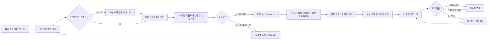
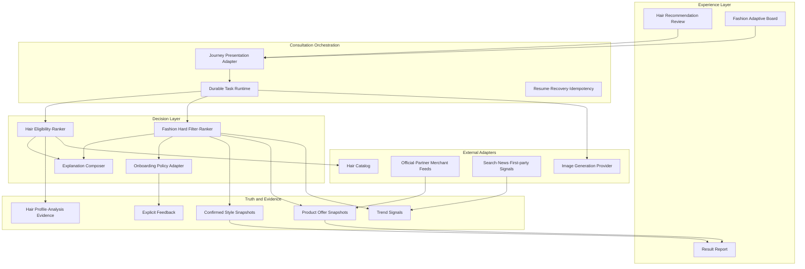

# P46 — AI 주도 헤어 9안 생성·단일 결정·실상품 패션 개인화 아키텍처

- 기준일: 2026-08-20
- 상태: 승인된 제품 결정 반영 아키텍처, 구현 전
- 대상: HairFit V2 Web/Native 컨설팅, 공유 계약, 추천·생성 capability, 상품·트렌드 데이터, PostgreSQL/Supabase 저장 계층
- 선행 문서: P25 공통 생성 입력, P40 메이크업 인터뷰·AI 근거, P41 컨설턴트형 4챕터 여정, P43 챕터 압축
- 구현 원칙: 기존 CSS 시각 스타일 유지, additive migration, durable task·중단/재개·provenance 유지
- 비목표: 의료·체형 진단, 사진 기반 의류 사이즈 확정, 픽셀 단위 가상착용 보장, 무단 상품 스크래핑, 별도 유료 생성 확인 CTA, 원격 migration·배포

## 구현 페이즈 문서

1. [P47 — Phase 00 Hair·Fashion 계약 기준선과 호환 계층](./p47-phase-00-hair-fashion-contract-baseline-2026-08-20.md)
2. [P48 — Phase 01 Hair 9안 Shadow Ranker](./p48-phase-01-hair-nine-preview-shadow-ranker-2026-08-20.md)
3. [P49 — Phase 02 Hair 9안 생성·AI Primary 고객 UX 전환](./p49-phase-02-hair-nine-preview-primary-ux-cutover-2026-08-20.md)
4. [P50 — Phase 03 Fashion Product Truth·Freshness](./p50-phase-03-fashion-product-truth-freshness-2026-08-20.md)
5. [P51 — Phase 04 온보딩 Fashion 개인화 정책·Ranker](./p51-phase-04-onboarding-fashion-personalization-ranker-2026-08-20.md)
6. [P52 — Phase 05 Adaptive Fashion 3·6·9 Durable Generation](./p52-phase-05-adaptive-fashion-generation-2026-08-20.md)
7. [P53 — Phase 06 Result Report·Observability·Canary](./p53-phase-06-report-observability-canary-2026-08-20.md)

P47부터 순서대로 종료 증거를 충족한 뒤 다음 페이즈로 이동한다. 문서 작성 완료는 구현·migration·provider·배포 완료를 의미하지 않는다.

## 1. 문서 권위와 변경 결정

이 문서는 다음 제품 결정을 권위 계약으로 고정한다.

1. Hair의 기존 3×3 다양성·9개 생성·9개 terminal 완료 계약은 신규 모드에서도 유지한다.
2. 고객에게 9개 후보를 모두 비교·shortlist하도록 강제하지 않는다. AI가 생성된 9개를 품질·적합도·현실성 기준으로 평가해 최적 헤어 한 개를 주 추천으로 제시한다.
3. 고객은 주 추천을 `이대로 진행`하거나 마음에 걸리는 요소를 대화형으로 조정한다. 나머지 8개는 재조정·감사·복구에 쓰는 내부 대안이며 기본 여정의 선택 과제가 아니다.
4. 패션은 확정된 단일 헤어·컬러·메이크업 revision을 사용한다.
5. 패션 상품은 국내 구매 가능성이 확인된 실제 상품을 근거로 추천한다.
6. 패션 이미지는 기본 3개만 생성한다. 같은 방향의 `대표안 / 실용안 / 변주안`이며 AI가 최종 권장안 한 개를 지정한다.
7. 더 탐색하려는 고객에게만 3개 단위로 확장하며 한 상담 revision에서 최대 9개까지 보존한다.
8. `TREND MATCH / WEARABLE / TIMELESS`는 고객에게 고르게 하는 세 방향이 아니라 내부 랭킹 축이다.
9. 사이즈·예산·회피·접근성·가치 조건은 온보딩의 사용자 개인화 정책이 소유하며 AI 추론과 행동 학습보다 우선한다.
10. 생성 이미지는 실제 상품을 참조한 `착장 예상 시뮬레이션`이며 실제 상품의 픽셀 단위 동일 재현이라고 표시하지 않는다.

### 1.1 기존 문서와의 충돌 처리

| 기존 계약 | P46 권위 결정 |
|---|---|
| Hair `direction → previews → compare → decision`을 고객 행동으로 노출 | 내부 stage와 deep link는 호환용으로 유지하되 고객 표시 계약은 `단일 추천 → 확인/조정 → 확정`으로 축약 |
| Hair accepted 9개·shortlist 2~3개를 기본 완료조건으로 사용 | 9개 생성·terminal 완료는 유지하되 shortlist·compare의 고객 완료조건만 제거; AI primary 확정이 신규 고객 완료조건 |
| Fashion `DAILY / WORK / STATEMENT` 9-slot 고정 | 신규 모드는 기본 3개, 선택 확장 6개·9개의 동적 `requestedCount` 사용 |
| Fashion `requestedCount: 9` literal | `requestedCount: 3 | 6 | 9`, `terminalCount === requestedCount`로 교체 |
| 상품의 `brandName`, `productUrl`이 null이어도 추천 완료 | 실상품 모드에서는 검증된 offer snapshot이 없는 look plan을 생성 불가 처리 |
| Google News RSS 장르 신호를 상품 진실처럼 사용할 가능성 | 상품 진실 계층과 트렌드 신호 계층을 분리; 뉴스·검색 신호는 랭킹 보조로만 사용 |

P41의 4챕터, 내부 stage, Aftercare 외부 프로그램, provenance, 중단·재개 계약은 유지한다. 이 문서는 Hair와 Fashion 도메인의 고객 결정 방식과 완료조건만 구체화한다.

## 2. 목표 사용자 여정



### 2.1 고객 행동 예산

- Hair 진입 후 고객의 9안 비교·shortlist: 0회
- Hair 기본 생성 요청: 자동 1회, 내부 프리뷰 9개
- Hair 필수 고객 행동: `이대로 진행` 또는 `마음에 걸리는 점 말하기` 1회
- Fashion 방향 카드 선택: 0회
- Fashion 기본 생성 요청: 이번 상담 맥락 확인 후 자동 1회
- Fashion 기본 결과: 3개
- Fashion 최종안: AI가 기본 지정, 고객은 그대로 확정하거나 대안을 선택
- 별도 `Next`, 생성별 견적 승인, 유료 생성 확인 CTA: 0회

고객의 선택권은 제거하지 않는다. 다만 컨설턴트가 결론을 제시하고 고객은 불편한 부분만 수정하도록 작업 주도권을 AI에 둔다.

## 3. 논리 아키텍처



### 3.1 책임 경계

| 계층 | 책임 | 금지 |
|---|---|---|
| Experience | 9안 생성 진행, 단일 권장안, 근거, 조정·확정·재개 | 내부 후보 배열과 점수표를 필수 선택 과제로 노출 |
| Orchestration | durable task, 멱등 접수, partial, retry, handoff | 브라우저 fan-out과 클라이언트 권위 완료 판정 |
| Decision | eligibility, deterministic score, conflict, primary 선택 | LLM이 상품·가격·재고·좌표를 창작 |
| Explanation | 검증된 reason code를 고객 문장으로 변환 | 근거 source ID 외 정보 추가 판단 |
| Truth | 확정 snapshot, 상품 offer, trend, feedback revision | mutable 외부 값을 과거 결과에 덮어쓰기 |
| Provider adapter | 공식 피드·생성 모델 호출과 정규화 | 특정 provider 응답을 공유 계약에 직접 노출 |

## 4. AI 주도 헤어 9안 생성과 단일 추천

### 4.1 3×3 생성 유지와 단일 제시

기존 3열 기장별 Hair catalog는 유지하되 고객용 비교 그리드가 아니라 retrieval pool로 사용한다.

1. 상담 의도, 허용 시술, 관리 가능 범위, 변화 강도, 회피 조건을 hard constraint로 적용한다.
2. 얼굴 관측, 모질 profile, 현재 기장, 퍼스널 컬러, style target을 검증된 source revision과 함께 읽는다.
3. 기장 bucket과 전략 열 전체에서 기존 3×3 역할을 채울 9개 설계를 만든다.
4. 생성 provider에 9개 설계를 durable batch로 접수하고 슬롯별 partial·retry·terminal을 추적한다.
5. 9개 terminal 산출물에 대해 정책 scorer가 입력 적합도, 얼굴·모질 근거, 이미지 품질, 헤어 정체성 보존을 평가해 primary 한 개를 결정한다.
6. LLM은 primary를 바꾸지 않고 고객용 이유·예상 변화·주의점을 설명한다.

`internalAlternatives`는 생성이 끝난 나머지 8개 프리뷰와 랭킹 근거다. 재조정·복구·감사 추적에는 사용하지만 고객에게 모두 비교하라고 요구하지 않는다. 고객이 명시적으로 다른 안을 요청한 경우에만 보조 탐색 UI에서 제한적으로 열 수 있으며, 이는 기본 완료조건이 아니다.

### 4.2 추천 입력 우선순위

```text
사용자 금지·허용 조건
  > 실제 현재 기장·시술 이력·관리 가능 범위
  > 확인된 얼굴·모질 evidence
  > 명시한 목표 인상·변화 강도
  > 퍼스널 컬러·style target
  > 트렌드·탐색 다양성
```

낮은 confidence 관측은 추천 점수를 높이거나 제한을 확정하는 근거로 사용하지 않는다.

### 4.3 추가 질문 정책

다음 조건 중 하나일 때만 단일 질문을 제안한다.

- top-2 추천 점수 차이가 정책 임계값 미만이고 답변에 따라 primary가 바뀜
- 사용자 입력과 시각 관측이 충돌하고 안전한 시술 범위에 영향
- 관리 시간·허용 시술·현재 기장이 없어서 추천을 확정할 수 없음

질문 예산은 추천 cycle당 최대 1개다. 답을 건너뛰면 안전한 기본안과 한계를 표시하고 추천을 계속한다.

### 4.4 공유 계약

```ts
interface HairRecommendationDecisionV1 {
  schemaVersion: "hair-recommendation-decision-v1";
  consultationId: string;
  inputFingerprint: string;
  hairProfileRevision: number;
  catalogVersion: string;
  policyVersion: string;
  state:
    | "planning-nine"
    | "clarification-required"
    | "preview-batch-generating"
    | "ranking"
    | "primary-ready"
    | "adjustment-requested"
    | "confirmed"
    | "failed";
  primaryRecommendation: HairDesignRecommendationV1 | null;
  previewBatchId: string | null;
  requestedCount: 9;
  terminalCount: number;
  internalAlternatives: Array<{
    catalogItemId: string;
    previewId: string;
    rank: number;
    reasonCodes: string[];
  }>;
  confidence: number;
  clarification: ConsultationClarification | null;
  sourceIds: string[];
  revision: number;
  confirmedRevision: number | null;
}

interface HairAdjustmentRequestV1 {
  baseRecommendationRevision: number;
  aspects: Array<
    | "length"
    | "bangs"
    | "layer"
    | "volume"
    | "texture"
    | "maintenance"
    | "other"
  >;
  userText: string | null;
  expectedRevision: number;
}
```

### 4.5 확정 불변식

- `confirmedHairRevision`은 Hair/Color/Makeup/Fashion/Brief/Result의 동일 source다.
- 고객 조정은 확정 row를 수정하지 않고 새 recommendation·preview revision을 만든다.
- 새 revision 확정 전 downstream은 이전 confirmed revision을 계속 사용한다.
- old Compare deep link는 primary review로 redirect하며 기존 shortlist 데이터는 삭제하지 않는다.
- legacy `preview_board_ready`, `shortlisted`, `style_selected` lifecycle은 adapter가 신규 상태를 projection한다.

## 5. 온보딩 소유 패션 개인화 정책

### 5.1 소유권과 화면 경계

지속되는 개인화 정책은 Fashion 단계가 아니라 온보딩의 계정 프로필이 소유한다. Fashion 단독 화면은 정책 입력 폼이 아니며 이번 상담에서 달라지는 착용 맥락만 확인한다.

| 구분 | 소유 화면 | 수명 | 예시 |
|---|---|---|---|
| 사용자 개인화 정책 | 온보딩·프로필 설정 | 상담 간 지속 | 사이즈, 핏, 예산 기준, 회피 조건, 가치·접근성 정책 |
| 이번 상담 맥락 | Fashion 단독 화면 | 상담 revision | 착용 상황, 드레스코드, 계절·환경, 일회성 목표 |
| 행동 피드백 | Fashion 결과에서 수집, 온보딩·프로필에서 관리 | 동의 기간 | 좋아요·싫어요와 이유, 학습 초기화 |
| 생성 snapshot | 서버 | 생성·리포트 역사 보존 | 온보딩 policy revision + 상담 context revision |

Fashion 진입 시 온보딩 정책을 요약해 보여주되 같은 질문을 다시 하지 않는다. 필수 hard constraint가 비어 있으면 Fashion 내부에 복제 폼을 만들지 않고 `개인화 설정 보완` CTA로 온보딩 편집 화면을 연다. 저장 후 원래 상담으로 복귀한다.

### 5.2 온보딩 명시 입력

- 평소 착용 사이즈와 선택적 실측
- 선호 핏, 실루엣, 노출·넥라인
- 선호·회피 색상과 소재
- 알레르기·촉감·착탈·이동성·신발 높이 조건
- 기본 활동량과 준비 시간
- 기본 총 착장 예산과 품목별 상한
- 보유·재사용 아이템
- 선호·제외 브랜드와 판매처
- 비건, 동물성 소재 회피, 패스트패션 회피 등 가치 기준
- 추천 학습 사용 여부와 기록 초기화

사진은 실루엣과 비율 참고에만 사용한다. 사진으로 성별, 정확한 사이즈, 체중, 콤플렉스를 추정하거나 고객 문구로 표시하지 않는다.

온보딩을 한 번에 긴 설문으로 만들지 않는다. 기본 추천에 필요한 사이즈·회피·접근성만 초기 coverage로 받고, 나머지는 프로필 설정에서 점진적으로 보완할 수 있다. 다만 누락된 값이 실상품 eligibility를 결정하면 생성 직전에 온보딩 보완이 필요하다는 이유를 명시한다.

### 5.3 이번 상담 맥락

Fashion 화면에서 확인할 수 있는 값은 다음으로 제한한다.

- 가장 먼저 필요한 착용 상황
- 적용할 드레스코드
- 계절·지역·실내외 환경
- 선택적 일회성 목표 또는 온보딩 기본 예산 override

이미 상담 목표·일정·위치에서 확정된 값은 자동 prefill하고 다시 묻지 않는다. 단일 선택은 자동 저장하며 공통 Next를 추가하지 않는다. 일회성 override는 온보딩 기본 정책을 변경하지 않는다.

### 5.4 컨설팅 snapshot 연결

Fashion recommendation은 다음 source를 한 번에 고정한다.

- `confirmedHairRevision`
- 확정 염색 또는 현재 컬러 revision
- 확정 Makeup rationale revision
- Personal Color profile revision
- onboarding `styleTarget`
- onboarding personalization policy revision
- consultation Fashion context revision
- product catalog cycle과 offer snapshot 시각

명시 설정이 AI 추론, trend score, 과거 행동보다 항상 우선한다. `styleTarget`은 탐색과 핏 표현에 사용하지만 남성·여성 카탈로그를 고정 차단하지 않는다.

정책이나 context가 변경되면 기존 생성 결과를 덮어쓰지 않고 새 `FashionPersonalizationSnapshotV1`과 generation input fingerprint를 만든다.

### 5.5 hard filter

다음 조건은 점수가 아니라 추천 자격이다.

1. 국내 배송 가능
2. 현재 재고 있음
3. 사용자 사이즈 또는 허용 사이즈 범위 있음
4. 총예산·품목별 상한 이내
5. 회피 색상·품목·소재·브랜드·판매처 제외
6. 접근성·착탈·활동 조건 충족
7. 공식 브랜드몰 또는 검증 판매자
8. 허용 freshness 이내의 offer snapshot

hard filter를 통과한 상품이 부족하면 조건을 몰래 완화하지 않는다. 부족한 조건과 수정 가능한 항목을 고객에게 알려준다.

### 5.6 내부 랭킹 축

| 축 | 의미 | 주요 근거 |
|---|---|---|
| `TREND_MATCH` | 현재 관심도와 상승 속도 | 최근 30일 관심도, 최근 7일 velocity, 계절 적합도 |
| `WEARABLE` | 실제 착용 가능성과 편안함 | 핏, 활동성, 드레스코드, 접근성, 보유 아이템 |
| `TIMELESS` | 장기 활용과 조합 가능성 | 반복 착용, 기본 품목 호환, 유행 의존도, 소재·구성 |

세 축은 고객 선택 카드가 아니다. 정책 ranker가 상담 목적에 따라 가중치를 정하고, 선택된 단일 방향 안에서 3개 look role을 만든다. weight와 reason code는 `fashion-ranker-policy-v2`처럼 버전 관리한다.

### 5.7 피드백 학습

`좋아요 / 싫어요 / 보류`와 다음 reason code를 저장한다.

- color, fit, price, material, trend-level, familiarity
- brand, seller, already-owned, accessibility, other

최근 명시 피드백에 높은 가중치를 두되 영구 성향으로 단정하지 않는다. 사용자는 온보딩·프로필 설정에서 학습 기록을 열람·수정·초기화할 수 있다. 행동 데이터로 성별·체형·경제상태 등 민감 특성을 새로 추론하지 않는다. 학습 동의가 꺼져 있으면 해당 상담의 명시 선택에는 사용하되 다음 상담의 랭킹 profile로 투영하지 않는다.

```ts
interface UserFashionPersonalizationPolicyV1 {
  schemaVersion: "user-fashion-personalization-policy-v1";
  scope: "account";
  hardConstraints: FashionHardConstraintsV1;
  softPreferences: FashionSoftPreferencesV1;
  ownedItems: OwnedFashionItemV1[];
  ethicalPreferences: FashionEthicalPreferencesV1;
  accessibilityNeeds: FashionAccessibilityNeedV1[];
  learningConsent: boolean;
  feedbackProjectionRevision: number | null;
  sourceIds: string[];
  revision: number;
  confirmedRevision: number;
}

interface ConsultationFashionContextV1 {
  schemaVersion: "consultation-fashion-context-v1";
  consultationId: string;
  occasion: string;
  dressCode: string | null;
  seasonEnvironment: string;
  oneTimeGoal: string | null;
  oneTimeBudgetOverride: FashionBudgetConstraintV1 | null;
  sourceIds: string[];
  revision: number;
}

interface FashionPersonalizationSnapshotV1 {
  schemaVersion: "fashion-personalization-snapshot-v1";
  consultationId: string;
  onboardingPolicyRevision: number;
  consultationContextRevision: number;
  effectiveConstraints: FashionHardConstraintsV1;
  effectivePreferences: FashionSoftPreferencesV1;
  sourceIds: string[];
  inputFingerprint: string;
  createdAt: string;
}
```

## 6. 실상품 진실 계층

### 6.1 공급자 정책

초기 공급자는 공식 브랜드 피드와 국내 배송이 확인된 검증 판매자 피드로 제한한다. 임의 웹페이지 스크래핑을 상품 진실 소스로 사용하지 않는다.

외부 피드 adapter는 공급자별 응답을 다음 공통 offer로 정규화한다. Google Merchant 상품 데이터 명세가 상품 ID, 링크, 이미지, 가격, 재고, 브랜드·식별자 같은 필드를 별도로 관리하는 점을 참고하되 HairFit의 공급자 계약으로 직접 종속시키지는 않는다. 공식 명세: [Google Merchant product data specification](https://support.google.com/merchants/answer/7052112/product-data-specification?hl=en-AU)

```ts
interface ProductOfferSnapshotV1 {
  schemaVersion: "product-offer-snapshot-v1";
  offerId: string;
  canonicalProductId: string;
  gtin: string | null;
  brand: string;
  title: string;
  category: string;
  sellerId: string;
  sellerTrust: "official" | "verified";
  canonicalUrl: string;
  imageUrl: string;
  price: { amount: number; currency: "KRW" };
  availability: "in-stock" | "preorder" | "backorder" | "out-of-stock";
  shipsToKorea: boolean;
  sizes: string[];
  colors: string[];
  materials: string[];
  fitTags: string[];
  source: { provider: string; feedId: string; license: string | null };
  affiliateDisclosure: string | null;
  observedAt: string;
  expiresAt: string;
}
```

### 6.2 freshness와 재검증

- 상품을 추천 화면에 표시할 때 가격·재고를 재검증한다.
- 구매 링크 진입 직전 다시 재검증한다.
- 24시간 이상 갱신되지 않은 offer는 신규 추천과 생성에서 숨긴다.
- 결과 리포트 가격은 `observedAt`을 포함한 역사 snapshot이며 현재가로 단정하지 않는다.
- 품절 시 기존 시뮬레이션과 선택 기록은 보존하고 동일 방향의 대체 offer를 새 revision으로 제안한다.

### 6.3 트렌드 신호 계층

트렌드 신호는 상품 존재·가격·재고를 증명하지 않는다.

```ts
interface FashionTrendSignalV1 {
  term: string;
  market: "KR";
  interest30d: number | null;
  velocity7d: number | null;
  seasonalFit: number;
  firstPartyEngagement: number | null;
  sourceCount: number;
  observedAt: string;
  sourceIds: string[];
}
```

현재 Google News RSS 기반 신호는 보조 source adapter로 유지할 수 있다. Google Trends API는 일·주·월·연 단위 및 지역 데이터를 제공하지만 2026-08-20 현재 alpha 접근이므로 단일 운영 의존점으로 사용하지 않는다. 공식 상태: [Google Trends API Alpha](https://developers.google.com/search/apis/trends)

## 7. 기본 3개·선택 확장 패션 생성

### 7.1 기본 look 역할

확정된 단일 Fashion direction에서 다음 세 개만 기본 생성한다.

| role | 목적 | 차별 조건 |
|---|---|---|
| `hero` | AI 최종 권장 후보 | 전체 개인화 점수 최고 |
| `practical` | 실용 대안 | 예산·활동성·보유 아이템 우선 |
| `variation` | 같은 방향의 변주 | 핵심 실루엣 또는 대표 품목 최소 하나 다름 |

각 look은 `outer / top / bottom / shoes` 네 핵심 품목과 선택 accessory로 구성한다. 필수 category가 존재하지 않으면 계절·상황에 맞게 명시적으로 `not_applicable` 처리한다.

### 7.2 적응형 batch 계약

```ts
type FashionBatchRequestedCount = 3 | 6 | 9;

interface AdaptiveFashionPreviewBatchV2 {
  schemaVersion: "adaptive-fashion-preview-batch-v2";
  id: string;
  consultationId: string;
  generationInputFingerprint: string;
  confirmedHairRevision: number;
  colorRevision: number | null;
  makeupRationaleRevision: number | null;
  personalizationSnapshotId: string;
  onboardingPolicyRevision: number;
  consultationContextRevision: number;
  requestedCount: FashionBatchRequestedCount;
  completedCount: number;
  failedCount: number;
  terminalCount: number;
  expansionRound: 0 | 1 | 2;
  state:
    | "approved"
    | "generating"
    | "partial"
    | "ready"
    | "failed"
    | "selected"
    | "cancelled";
  slots: Record<string, FashionPreviewSlotProgress>;
  recommendedLookId: string | null;
  selectedLookId: string | null;
}
```

완료 판정은 literal 9가 아니라 다음 식을 사용한다.

```text
batchTerminal = terminalCount === requestedCount
baseReady = requestedCount >= 3 && firstRoundTerminalCount === 3
selectionReady = baseReady && recommendedLookId != null
```

### 7.3 부분 결과와 확장

- `1/3`, `2/3`, `3/3` 상태를 실제 서버 task 기준으로 표시한다.
- 먼저 완료된 결과는 전체 완료 전 탐색할 수 있다.
- 실패·정체·lease 만료는 해당 슬롯만 재접수하고 완료 결과는 유지한다.
- 2개 완료는 partial이며 batch 완료로 판정하지 않는다.
- 기본 3개가 terminal이 되면 AI가 `recommendedLookId`를 지정한다.
- 고객이 `이 방향으로 3개 더 보기`를 요청하면 기존 batch를 변형하지 않고 expansion revision을 추가한다.
- 확장 후 AI 권장안이 바뀌면 변경 이유와 이전 권장안을 함께 보존한다.
- 한 confirmed input fingerprint당 최대 9개까지만 활성 결과로 보존한다.

### 7.4 생성 정체성 불변식

- 세 이미지 모두 동일한 `confirmedHairRevision`, 얼굴 identity, body source를 사용한다.
- 확정 헤어스타일이나 헤어 컬러가 달라지면 품질 실패로 처리한다.
- 각 look은 생성 당시의 `ProductOfferSnapshotV1[]`을 참조한다.
- 공식 상품 이미지·가격·링크는 시뮬레이션 이미지와 분리해 보여준다.
- 고객 문구는 `착장 예상 시뮬레이션`이며 실제 핏·색·질감 동일성을 보장하지 않는다.

### 7.5 권리 확인

기존 entitlement·usage receipt·중복 소비 방지·슬롯별 복구는 유지한다. 서버가 기본 3개 또는 확장 3개의 권리를 내부 검증하며 고객에게 별도 유료 생성 확인 화면을 추가하지 않는다. 권리가 부족하면 생성 확인을 묻는 대신 현재 entitlement 상태와 가능한 복구 경로를 표시한다.

## 8. API와 이벤트

### 8.1 Hair

- `POST /api/v2/consultations/:id/hair-recommendation/runs`
  - input fingerprint 기준 primary ranking과 필요 시 clarification 생성
- `GET /api/v2/consultations/:id/hair-recommendation`
  - primary, 설명, task, preview, adjustment history 반환
- `PATCH /api/v2/consultations/:id/hair-recommendation/clarification`
  - `expectedRevision`과 단일 답변 저장
- `POST /api/v2/consultations/:id/hair-recommendation/adjust`
  - 기존 confirmed snapshot 변경 없이 새 recommendation revision 생성
- `POST /api/v2/consultations/:id/hair-recommendation/confirm`
  - primary를 immutable selection snapshot으로 확정

### 8.2 Fashion

- `GET /api/v2/me/onboarding/fashion-personalization`
- `PATCH /api/v2/me/onboarding/fashion-personalization`
  - 계정 범위 정책과 `expectedRevision` 저장
- `POST /api/v2/me/onboarding/fashion-personalization/confirm`
  - onboarding coverage와 학습 동의를 확정
- `GET /api/v2/consultations/:id/fashion/context`
- `PATCH /api/v2/consultations/:id/fashion/context`
  - 이번 상담의 상황·드레스코드·환경·일회성 override만 저장
- `POST /api/v2/consultations/:id/fashion/recommendation`
  - 온보딩 policy와 상담 context를 immutable snapshot으로 합성한 뒤 단일 direction과 3개 look plan 준비
- `POST /api/v2/consultations/:id/fashion-batches`
  - 기본 3개 접수; server entitlement와 idempotency 적용
- `POST /api/v2/consultations/:id/fashion-batches/:batchId/expand`
  - terminal 기본 batch에서 3개 단위 확장
- `GET /api/v2/consultations/:id/fashion-batches/:batchId`
  - partial·stalled·retrying·terminal 상태와 offer snapshot 반환
- `POST /api/v2/consultations/:id/fashion/selection`
  - AI 권장안 수락 또는 다른 look 선택
- `POST /api/v2/consultations/:id/fashion/feedback`
  - 명시 반응과 reason code 저장

기존 `/fashion-batch`, shortlist, selection route는 legacy adapter로 유지한다. 신규 UI는 브라우저에서 슬롯별 추천·생성 fan-out을 실행하지 않는다.

### 8.3 이벤트

- `HAIR_PRIMARY_RECOMMENDATION_READY`
- `HAIR_CLARIFICATION_REQUIRED`
- `HAIR_ADJUSTMENT_REQUESTED`
- `HAIR_RECOMMENDATION_CONFIRMED`
- `FASHION_DIRECTION_RECOMMENDED`
- `ONBOARDING_FASHION_POLICY_CONFIRMED`
- `FASHION_PERSONALIZATION_SNAPSHOT_CREATED`
- `FASHION_BASE_BATCH_ACCEPTED`
- `FASHION_PARTIAL_RESULT_READY`
- `FASHION_BASE_BATCH_READY`
- `FASHION_EXPANSION_REQUESTED`
- `FASHION_LOOK_RECOMMENDED`
- `FASHION_LOOK_SELECTED`
- `PRODUCT_OFFER_REPLACED`

이벤트 payload에는 원본 사진, signed URL, 자유 입력 원문, 상세 신체 정보, 인증정보를 넣지 않는다.

## 9. 저장 모델

구현 시 실제 저장소 상태를 다시 확인하고 Supabase CLI로 additive migration을 생성한다. 문서에서 임의 timestamp 파일명을 선결정하지 않는다.

| 저장 대상 | 목적 | 핵심 불변식 |
|---|---|---|
| `consultation_hair_recommendations_v2` | primary·내부 대안·근거·조정 revision | confirmed revision 불변, source fingerprint 멱등 |
| 기존 `style_selection_snapshots_v2` | 최종 Hair 권위 snapshot | downstream 공통 source |
| `user_fashion_personalization_profiles_v2` | 온보딩의 계정 범위 constraint·preference·동의 | 사용자 명시값 우선, revision conflict 보호 |
| `consultation_fashion_contexts_v2` | 상담별 상황·드레스코드·환경·일회성 override | 계정 정책을 수정하지 않음 |
| `fashion_personalization_snapshots_v2` | 생성에 사용한 policy+context 합성본 | 생성 후 수정 금지, input fingerprint 고정 |
| `fashion_product_offers_v2` | 현재 offer read model | provider별 최신 상태, 서버 전용 write |
| `fashion_product_offer_snapshots_v2` | 추천·리포트가 참조하는 역사 offer | 생성 후 수정 금지 |
| `fashion_trend_signals_v2` | 30일·7일·계절 신호 | 상품 진실로 사용 금지 |
| `fashion_look_plans_v2` | 실상품 bundle과 생성 prompt 입력 | 한 look당 offer snapshot 고정 |
| 기존 `fashion_preview_batches_v2` 확장 | 3/6/9 동적 batch | `terminalCount === requestedCount` |
| `fashion_feedback_events_v2` | 명시 반응과 학습 source | 삭제·초기화와 audit 지원 |

모든 public table은 RLS를 활성화하고 현재 Clerk 소유권 adapter를 재사용한다. 브라우저 direct table write와 client-side service role 노출을 금지한다. 외부 상품·트렌드 ingest는 server-only credential과 최소 권한을 사용한다.

## 10. 여정 표시와 호환성

### 10.1 Hair 도메인

고객 표시 상태는 다음으로 파생한다.

```text
diagnosis ready
  → hair recommendation preparing
  → clarification 필요 시 질문 1개
  → primary preview waiting/partial/ready
  → confirm or adjust
  → confirmed
```

내부 `direction`, `previews`, `compare`, `decision` stage는 삭제하지 않는다.

- `direction`: AI primary 설계 준비
- `previews`: primary preview task host
- `compare`: legacy deep link와 감사 데이터 projection; 신규 UI 자동 건너뜀
- `decision`: confirm/adjust task host

`recommendedTask`는 compare가 아니라 primary review 또는 adjustment review를 가리킨다.

### 10.2 Fashion 도메인

```text
onboarding policy coverage
  → consultation context
  → immutable personalization snapshot
  → product eligibility
  → direction recommended
  → base generation 0/3..3/3
  → AI recommended look
  → selected
  → optional expansion 3/6..6/6 or 6/9..9/9
```

Result는 기본 3개와 AI 권장안이 준비되면 열 수 있다. 선택 확장은 Result를 잠그지 않으며 백그라운드 task badge로 표시한다.

온보딩 policy coverage가 부족하면 `recommendedTask`는 Fashion 내부 질문이 아니라 `/onboarding/fashion-personalization?returnTo=...`를 가리킨다. 온보딩이 충족되면 상담 context의 최초 미완료 항목 또는 생성 대기 화면으로 복귀한다.

## 11. 결과 리포트

### Hair 탭

- AI가 정한 단일 헤어와 확정 이미지
- 기장, 앞머리, 레이어, 볼륨, 질감, 유지관리 설계
- 잘 어울리는 이유, 예상 변화, 주의점
- 사용한 evidence와 `confirmedHairRevision`
- 고객 조정이 있었다면 변경 이력 요약
- 내부 탈락 후보·점수는 표시하지 않음

### Fashion 탭

- AI 최종 권장 착장 1개를 첫 화면에 표시
- 기본 대안 2개와 선택 확장 결과
- look별 공식 상품 이미지, 상품명, 브랜드, 판매처, snapshot 가격, 조회 시각, 구매 링크
- hard constraint 통과 근거와 Hair/Color/Makeup 연결 근거
- simulation disclaimer와 affiliate disclosure
- 품절·대체 상품 revision 이력

현재 재고·가격을 단정하지 않고 마지막 확인 시각을 함께 표시한다.

## 12. 기능 플래그와 롤백

- `CONSULTATION_AI_LED_HAIR_DECISION_ENABLED`
- `FASHION_PRODUCT_TRUTH_ENABLED`
- `ONBOARDING_FASHION_PERSONALIZATION_ENABLED`
- `FASHION_ADAPTIVE_BATCH_ENABLED`
- `FASHION_TREND_SIGNALS_V2_ENABLED`

| 플래그 OFF | 동작 |
|---|---|
| AI-led Hair | 동일한 3×3·9개 생성 결과를 기존 shortlist·compare projection으로 표시 |
| Product Truth | 실상품 모드 신규 접수 중단; 저장된 결과는 read-only 유지 |
| Onboarding Personalization | 기존 FashionDirectionSnapshot과 StyleProfile adapter 사용 |
| Adaptive Batch | legacy 9-slot route 유지; 신규 3개 batch 접수 중단 |
| Trend Signals V2 | 상품 eligibility와 wearable/timeless score만으로 추천 |

롤백은 기존 snapshot, 완료 이미지, offer snapshot, usage receipt를 삭제하지 않는다. 플래그 OFF가 진행 중 durable task를 취소하거나 소비를 중복 복구해서는 안 된다.

## 13. 구현 페이즈와 종료 기준

### P46-0 계약 동결과 기준선

구체 실행 문서: [P47 — Phase 00 Hair·Fashion 계약 기준선과 호환 계층](./p47-phase-00-hair-fashion-contract-baseline-2026-08-20.md)

- P41/P43/legacy 9-slot과 P46의 권위 우선순위 명시
- Hair·Fashion 신규 타입, validator, fixture 작성
- current requestedCount literal과 compare dependency inventory 고정

종료 기준:

- legacy와 신규 모드의 완료조건이 같은 필드에서 혼합되지 않는다.
- 기능 플래그 OFF fixture가 기존 snapshot을 그대로 읽는다.
- 구현하지 않은 실상품 연동을 현재 기능으로 표시하지 않는다.

### P46-1 Hair 9안 recommendation shadow

구체 실행 문서: [P48 — Phase 01 Hair 9안 Shadow Ranker](./p48-phase-01-hair-nine-preview-shadow-ranker-2026-08-20.md)

- 기존 3×3·9개 생성 결과를 입력으로 신규 ranker를 shadow 실행
- primary, internal alternative, confidence, reason code 저장
- 결과를 고객에게 노출하지 않고 선택·조정 로그와 일치율 측정

종료 기준:

- 같은 fingerprint와 policy version은 같은 primary를 만든다.
- hard constraint 위반 후보는 primary가 될 수 없다.
- low-confidence·conflict 질문 예산이 cycle당 1개를 넘지 않는다.

### P46-2 Hair 9안 생성·단일 결정 UX 전환

구체 실행 문서: [P49 — Phase 02 Hair 9안 생성·AI Primary 고객 UX 전환](./p49-phase-02-hair-nine-preview-primary-ux-cutover-2026-08-20.md)

- 9개 생성 진행 후 AI primary 한 개를 전면 표시하는 confirm/adjust UI
- Compare·shortlist 고객 CTA 제거
- legacy deep link redirect와 Web/Native parity

종료 기준:

- 기본 상담에서 Hair 후보 선택 요구가 0회다.
- 한 Hair recommendation revision마다 9개 슬롯이 terminal이 된 뒤 primary가 확정된다.
- 고객 수정은 새 revision을 만들고 이전 확정본을 변형하지 않는다.
- 저장 후 별도 Next 없이 downstream handoff가 실행된다.

### P46-3 Product Truth와 freshness

구체 실행 문서: [P50 — Phase 03 Fashion Product Truth·Freshness](./p50-phase-03-fashion-product-truth-freshness-2026-08-20.md)

- 공식·partner feed adapter
- offer 정규화, seller trust, 국내 배송, 사이즈, 가격·재고 freshness
- 표시 시점·구매 직전 재검증과 품절 대체

종료 기준:

- 실상품 모드의 모든 look item이 유효한 offer snapshot을 가진다.
- out-of-stock·stale·size unavailable 상품이 신규 추천에 포함되지 않는다.
- 상품 이미지·링크·가격·재고 provenance와 observedAt이 존재한다.

### P46-4 온보딩 Personalization과 ranker

구체 실행 문서: [P51 — Phase 04 온보딩 Fashion 개인화 정책·Ranker](./p51-phase-04-onboarding-fashion-personalization-ranker-2026-08-20.md)

- 온보딩 계정 policy, 상담 context, immutable 합성 snapshot 계약
- hard constraint, soft preference, ethical/accessibility, owned item과 학습 동의
- 30일 관심도·7일 velocity·계절성 trend adapter
- Fashion 피드백 수집과 온보딩·프로필의 열람·reset

종료 기준:

- 명시 회피 조건이 trend·행동 학습보다 항상 우선한다.
- 사진으로 사이즈·성별·체중을 확정하지 않는다.
- Fashion 단계가 온보딩 정책 질문을 반복하지 않고 상담 context만 저장한다.
- 온보딩 policy 변경은 기존 상담 결과를 덮어쓰지 않고 새 합성 snapshot을 만든다.
- 3개 결과가 동일 방향 안에서도 핵심 실루엣 또는 대표 품목으로 구분된다.

### P46-5 Adaptive 3/6/9 durable generation

구체 실행 문서: [P52 — Phase 05 Adaptive Fashion 3·6·9 Durable Generation](./p52-phase-05-adaptive-fashion-generation-2026-08-20.md)

- 기본 `hero/practical/variation` 3개
- partial·stalled·retrying·terminal과 슬롯별 재접수
- 선택 확장 3개 단위, 최대 9개
- AI recommendedLook와 고객 override

종료 기준:

- 기본 batch는 `3/3 terminal`에서 완료되며 `2/3`을 완료로 오판하지 않는다.
- 확장 batch는 `6/6`, `9/9`를 각각 동적 requestedCount로 판정한다.
- 동일 confirmed Hair/Color/Makeup identity가 모든 이미지에서 유지된다.
- 별도 유료 생성 확인 CTA 없이 server entitlement가 동작한다.

### P46-6 리포트·관측·Canary

구체 실행 문서: [P53 — Phase 06 Result Report·Observability·Canary](./p53-phase-06-report-observability-canary-2026-08-20.md)

- Hair·Fashion report projection과 offer snapshot
- 추천 수락률, 조정률, 추가 생성률, 품절 대체율, 생성 latency 계측
- Web/Native canary와 플래그별 롤백 drill

종료 기준:

- 화면·생성·리포트의 revision과 product snapshot fingerprint가 일치한다.
- rollback이 저장 결과와 usage receipt를 보존한다.
- 로컬, 실인증, provider, 원격 DB, canary 증거가 분리 보고된다.

## 14. 검증 기준

### 14.1 계약·정책

- Hair 3×3·9개 batch, 단일 primary와 비노출 internal alternative schema
- 같은 fingerprint 멱등성과 policy version 재현성
- hard filter 우선순위와 무단 조건 완화 금지
- onboarding policy revision과 consultation context revision의 합성 fingerprint
- `requestedCount` 3/6/9와 terminal 식
- explicit feedback override와 민감 특성 추론 금지
- confirmed snapshot 불변성과 supersede chain

### 14.2 API·DB

- Clerk 소유권, 교차 사용자 접근 거부, RLS 강제
- idempotency replay, optimistic revision 409, 동시 접수
- durable lease·fence·retry와 슬롯별 usage restore
- offer snapshot 불변, stale exclusion, 품절 replacement revision
- provider 장애 시 완료 결과 보존과 부분 실패 복구

### 14.3 브라우저·Native

- Hair 후보 비교·shortlist·숫자형 wizard 부재
- `이대로 진행 / 마음에 걸리는 점 말하기` semantic CTA
- Fashion 방향을 고객에게 3개 중 고르도록 강요하지 않음
- Fashion에서 사이즈·예산·회피·가치·접근성 정책을 다시 묻지 않음
- 누락된 hard constraint 보완 후 정확한 상담 returnTo 복귀
- `0/3..3/3`, partial, stalled, retrying, complete 구분
- 기본 3개 후 선택적 `3개 더 보기`
- 나가기·재개 시 active task와 partial 결과 복원
- 390/768/desktop overflow, 키보드, focus, `aria-live`, reduced motion

### 14.4 데이터 일관성

- Hair confirmation, Color, Makeup, Fashion, Brief, Result가 같은 revision chain 참조
- 각 Fashion look의 offer snapshot과 화면 상품 카드가 일치
- AI 권장안, 고객 override, Result 최종안이 동일 selection revision 사용
- 품절 대체가 과거 가격·이미지·선택을 덮어쓰지 않음

### 14.5 외부 검증 경계

다음은 로컬 계약 통과만으로 완료로 판정하지 않는다.

- 실제 merchant feed 인증·라이선스·국내 배송 정확성
- 실시간 가격·재고와 구매 직전 재검증
- 실제 이미지 provider 3개 생성·정체·재시도
- 실제 계정 entitlement 소비·복구
- authenticated Web/Native session과 canary
- 원격 migration과 forced RLS

Docker는 필수 검증 수단으로 요구하지 않는다. 저장소가 제공하는 로컬 테스트와 승인된 원격 환경을 분리해 사용한다.

## 15. 관측 지표

- Hair primary 제시→확정 시간
- Hair 조정 요청률과 조정 aspect
- clarification 발생률·건너뜀률·primary 변경률
- Fashion 기본 3개 first-result와 3/3 latency
- AI 권장안 그대로 확정률과 고객 override율
- `3개 더 보기` 요청률과 최대 9개 도달률
- hard filter 탈락 원인 분포
- stale·품절·가격 변동·대체율
- 상품 링크 진입률과 리포트 재열람률
- provider slot retry·stalled·terminal failure율

원본 자유 입력, 사진 URL, 상세 실측, 인증정보를 analytics payload에 기록하지 않는다.

## 16. 최종 수용 기준

- [ ] Hair 3×3 다양성과 9개 생성·terminal 완료 계약이 신규 모드에서도 유지된다.
- [ ] 생성된 Hair 후보는 내부 랭킹에 사용되고 고객은 기본 여정에서 9개를 비교·shortlist하지 않는다.
- [ ] AI가 단일 Hair primary를 근거와 함께 제시하고 고객은 확정하거나 요소별로 조정할 수 있다.
- [ ] 낮은 confidence·충돌 외에는 추가 질문을 하지 않으며 질문 예산은 최대 1개다.
- [ ] 확정 Hair revision 하나가 Color·Makeup·Fashion·Brief·Result의 권위 source다.
- [ ] Fashion은 공식·검증 판매자의 국내 구매 가능한 실상품 offer만 신규 추천에 사용한다.
- [ ] 개인화 정책은 온보딩·프로필이 소유하고 Fashion은 이번 상담 맥락만 확인한다.
- [ ] Fashion이 온보딩 정책 질문을 반복하지 않으며 누락값은 온보딩 편집 왕복으로 보완한다.
- [ ] 생성은 온보딩 policy revision과 상담 context revision을 합성한 immutable snapshot을 사용한다.
- [ ] 사진으로 의류 사이즈·성별·체중을 단정하지 않고 사용자 명시 조건을 우선한다.
- [ ] `TREND MATCH / WEARABLE / TIMELESS`는 내부 평가축이며 고객 선택 단계가 아니다.
- [ ] Fashion 기본 생성은 3개이고 AI가 최종 권장안 하나를 지정한다.
- [ ] 추가 탐색은 3개 단위이며 최대 9개, 완료 판정은 동적 requestedCount를 따른다.
- [ ] 2개 완료 후 정체를 완료로 오판하지 않고 해당 슬롯만 자동 복구한다.
- [ ] 실제 상품 카드와 시뮬레이션 이미지를 분리하고 동일 재현 보장을 하지 않는다.
- [ ] 가격·재고·판매처·출처·제휴·확인 시각을 표시하고 stale·품절 상품을 교체한다.
- [ ] 기능 플래그 ON/OFF 모두 Hair 3×3·9개 생성을 유지하며, OFF에서는 기존 compare UI와 9-slot Fashion 데이터를 삭제하지 않고 읽을 수 있다.
- [ ] Web/Native, API/DB, 접근성, provenance, durable recovery, rollback 검증이 모두 증거로 남는다.

## 17. 현재 구현 기준선과 증거 경계

2026-08-20 현재 작업공간 정적 확인 기준:

- `packages/shared/src/consulting/contract.ts`의 Fashion batch는 `requestedCount: 9` literal이다.
- `packages/shared/src/consulting/presentation.ts`는 `fashion-slots-terminal=9`와 `totalUnits: 9`를 사용한다.
- `my-app/lib/consulting/fashion-batch-server.ts`는 정확히 9개 session과 9개 slot을 요구한다.
- `my-app/components/consulting/workbenches/FashionBatchWorkbench.tsx`는 9개 생성 문구와 CTA를 노출한다.
- `my-app/lib/fashion-recommendation-generator.ts`는 추천 상품의 `brandName`, `productUrl`을 null로 만든다.
- `my-app/lib/fashion-trend-research.ts`의 Google News RSS는 장르·freshness 신호이며 실제 상품 offer를 제공하지 않는다.
- `packages/shared/src/consulting/journey.ts`는 shortlist와 compare를 Hair 필수 진행 조건으로 사용한다.

따라서 이 문서는 목표 아키텍처이며 구현 완료 증거가 아니다. 코드·migration·실상품 공급자·실제 생성·인증·원격 DB·배포는 각각의 페이즈 검증을 통과하기 전까지 `not_implemented` 또는 `not_run`으로 보고한다.
