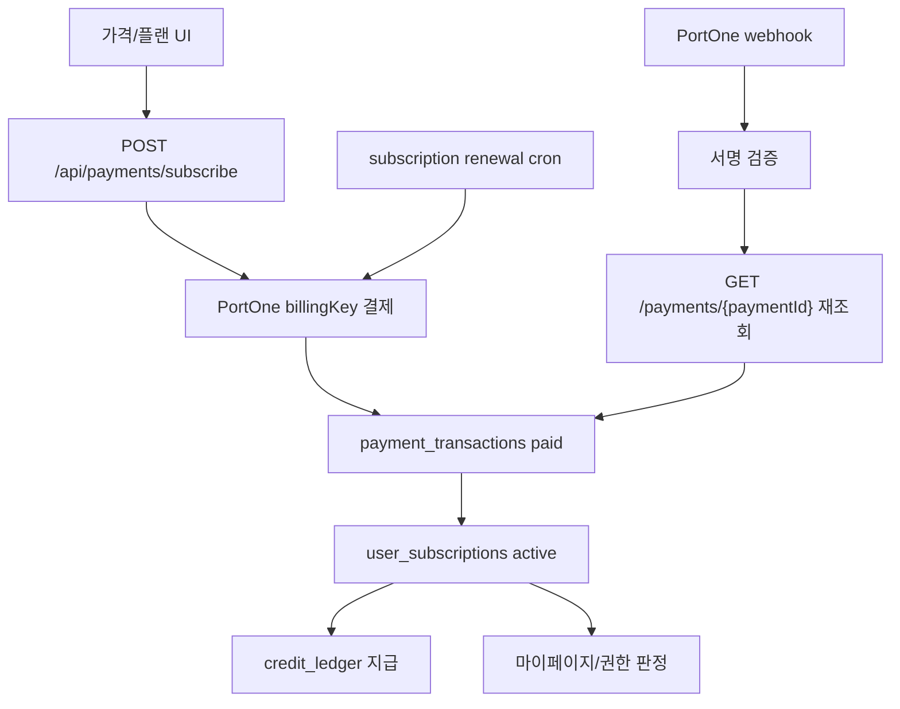

# PortOne 결제 웹훅/결제페이지/빌링 플랜 연동 계획

작성일: 2026-06-29  
최근 업데이트: 2026-06-30

## 1. 목적

HairFit의 유료 플랜을 포트원 V2 기반의 빌링키 구독 결제로 정리하고, 결제 페이지, 서버 검증, 웹훅, 구독 갱신, 크레딧 지급, 마이페이지 플랜 상태를 하나의 일관된 흐름으로 묶는다.

이번 계획의 핵심은 다음이다.

- 결제 완료 판단은 클라이언트 응답이 아니라 서버의 포트원 결제 조회와 검증된 웹훅으로 확정한다.
- `payment_transactions`와 `user_subscriptions`를 결제/구독의 단일 원장으로 사용한다.
- 크레딧 지급은 `apply_payment_credits` 또는 `grant_subscription_credits` RPC를 통해 idempotent하게 처리한다.
- 웹/모바일/갱신 cron이 같은 플랜 카탈로그와 같은 상태 전이 규칙을 쓰도록 정리한다.

## 2. 현재 상태 요약

이미 존재하는 구현:

- 웹 랜딩 가격 카드: `my-app/components/home/PricingPreview.tsx`
- 서버 플랜 금액/크레딧 상수: `my-app/lib/portone.ts`
- 가격 제안 로직: `my-app/lib/pricing-plan.ts`
- 플랜 권한 판정: `my-app/lib/plan-entitlements.ts`
- 웹 구독 API: `my-app/app/api/payments/subscribe/route.ts`
- 포트원 웹훅 API: `my-app/app/api/payments/webhook/route.ts`
- 모바일 결제 준비/완료 API: `my-app/app/api/mobile/payments/prepare/route.ts`, `my-app/app/api/mobile/payments/complete/route.ts`
- 구독 갱신 Edge Function: `my-app/supabase/functions/cron-subscription-renewal/index.ts`
- 구독/결제 DB: `payment_transactions`, `user_subscriptions`, `credit_ledger`
- 마이페이지 플랜/결제 표시: `my-app/app/mypage/page.tsx`, `my-app/components/mypage/MyPageDashboardTabs.tsx`

남은 주요 리스크:

- `salon` 플랜이 즉시 결제형인지 문의/계약형인지 최종 결정되지 않았다.
- 모바일 결제는 현재 빌링키 없이 `payment_transactions` 직접 결제를 구독처럼 upsert한다. 정기구독인지 단건 크레딧 충전인지 제품 결정을 내려야 한다.
- 전액 취소/환불 이벤트는 지급된 크레딧 중 현재 남아 있는 만큼 자동 회수하고, 이미 사용된 크레딧은 `payment_credit_clawbacks.credits_unrecovered`로 남겨 운영 보정 대상으로 추적한다. 부분취소는 금액 비율 정책이 필요해 자동 회수하지 않고 수동 검토 대상으로 기록한다.
- 신규 웹 구독의 빌링키는 `user_subscriptions.pg_billing_key_encrypted`와 `pg_billing_key_hash`에 저장한다. 기존 `pg_billing_key` plaintext row는 백필 전까지 갱신 fallback으로만 유지한다.
- 포트원 테스트 콘솔을 통한 실제 결제, 웹훅 재전송, 마이페이지 반영 smoke는 아직 필요하다.

### 2.1 2026-06-29 반영 현황

- `my-app/lib/billing-plan.ts`를 추가해 Basic/Standard/Pro/Salon 가격, 크레딧, 주문명을 한 곳에서 관리한다.
- `my-app/lib/portone.ts`와 `my-app/lib/pricing-plan.ts`는 단일 플랜 카탈로그에서 금액/크레딧을 파생하도록 정리했다.
- 웹/모바일 표시 가격, 한국어/영어 혜택 문구, README 환경 변수 기본값을 Basic 9,900원/80크레딧, Standard 19,900원/200크레딧, Pro 49,900원/600크레딧으로 맞췄다.
- `202606290001_update_billing_plan_pricing.sql` migration을 추가해 기존 구독의 월 크레딧과 갱신 금액 RPC를 새 정책에 맞췄다.
- `my-app/lib/portone-payment-confirmation.ts`를 추가해 PortOne `GET /payments/{paymentId}` 재조회, 금액/통화 검증, `payment_transactions` 상태 전이를 공통화했다.
- 웹 첫 구독 `subscribe` API는 결제 요청 전 `payment_transactions.pending`을 만들고, 결제 후 공통 확정 유틸을 통과한 경우에만 구독 생성/크레딧 지급으로 진행한다.
- `POST /api/payments/billing-key/prepare`를 추가해 인증된 사용자 기준의 `issueId`, `customerId`, PortOne 공개 설정, 플랜 표시 금액을 서버에서 준비한다.
- `my-app/components/payments/PortoneSubscriptionButton.tsx`를 추가해 랜딩, `/billing`, 마이페이지 플랜 탭이 같은 빌링키 발급/구독 API 흐름을 사용한다.
- `/billing` 웹 결제 페이지를 추가했고, 마이페이지 플랜 탭에서는 활성 구독이 없을 때 Basic/Standard/Pro 구독 버튼을 노출한다.
- 모바일 `complete` API와 웹훅 `Transaction.Paid` 처리는 공통 확정 유틸을 사용해 웹훅 payload만으로 결제를 확정하지 않는다.
- 웹훅 route는 `Transaction.Failed`, `Transaction.Cancelled`, `Transaction.PartialCancelled`, `Transaction.CancelPending`, `Transaction.PayPending`, `Transaction.Ready`, `Transaction.VirtualAccountIssued`, `BillingKey.Deleted`를 수신해 거래 metadata와 구독 상태에 반영한다.
- `Transaction.Failed`와 전액 `Transaction.Cancelled`는 `payment_transactions.metadata.source`를 기준으로 첫 웹 구독 결제와 갱신 결제를 구분한다. `web-subscribe` 첫 결제 실패/취소는 준비용 구독을 `canceled`로 닫고 빌링키 암호문/해시를 제거하며, `cron-subscription-renewal` 실패/취소는 `past_due`와 `renewal_failure_*` 재시도 상태를 기록한다. 같은 갱신 실패/취소 웹훅이 재전송돼도 `renewal_failure_count`는 중복 증가하지 않는다.
- `my-app/scripts/send-portone-webhook-test.mjs`는 `--type`, `--paymentId`, `--billingKey`, `--amount`, `--currency` 인자로 signed webhook smoke payload를 만들 수 있다.
- `cron-subscription-renewal` Edge Function은 실제 `payment_transactions` 컬럼으로 pending row를 먼저 만들고, 결제 성공/실패 상태와 idempotent 크레딧 지급용 `payment_transaction_id`를 기록하도록 수정했다.
- `SELF_SERVE_BILLING_PLAN_KEYS`를 추가해 웹/모바일 즉시 결제 API는 Basic/Standard/Pro만 허용하고, 정책 미확정인 Salon은 결제 API에서 차단한다.
- 모바일 공유 타입 `MobilePaymentPlan`과 결제 화면은 Basic/Standard/Pro만 선택 가능하게 정리해 Salon 값이 모바일 결제 API로 전달되지 않게 했다.
- `202606290002_payment_transaction_portone_tracking.sql` migration을 추가해 `payment_transactions`에 `provider_transaction_id`, `webhook_event_type`, `webhook_received_at`, `failure_code`, `failure_message`를 기록할 수 있게 했다.
- 공통 결제 확정 유틸과 갱신 cron은 포트원 거래 ID, 웹훅 수신 이벤트, 실패 사유를 metadata뿐 아니라 원장 컬럼에도 저장한다.
- 마이페이지 플랜 탭은 `failure_code`, `failure_message`, `webhook_event_type`, `webhook_received_at`을 조회해 결제 실패, 환불, 해지 예약, `past_due` 상태를 사용자에게 구분 표시한다.
- `202606290003_encrypt_portone_billing_keys.sql` migration과 `my-app/lib/billing-key-secret.ts`를 추가해 신규 빌링키를 AES-GCM 암호문과 HMAC-SHA256 해시로 저장한다.
- `subscribe` API는 빌링키 암호화/해시 생성이 성공한 뒤에만 포트원 결제를 요청한다.
- `BillingKey.Deleted` 웹훅은 `pg_billing_key_hash`로 우선 매칭하고, 기존 plaintext row는 `pg_billing_key` fallback으로 처리한다. 매칭된 구독은 해지 예약 상태로 두고 저장된 빌링키 암호문/해시/원문을 제거한다.
- 갱신 cron은 암호문 빌링키를 `BILLING_KEY_ENCRYPTION_SECRET`으로 복호화해 결제하고, 기존 plaintext row는 백필 전까지 fallback으로 결제한다.
- `202606290005_subscription_renewal_retry_tracking.sql` migration을 추가해 갱신 실패 횟수, 마지막 실패 시각, 다음 재시도 시각, 실패 코드/메시지를 `user_subscriptions`에 저장하고, `past_due` 재시도 대상도 갱신 RPC가 반환하게 했다.
- `advance_subscription_period`는 같은 `paymentId`가 이미 `pg_latest_payment_id`로 반영된 경우 no-op 처리해 중복 `Transaction.Paid` 웹훅이 구독 기간을 반복 연장하지 않게 했다.
- `plan-entitlements.ts`는 최신 결제 내역으로 플랜을 추론하지 않고, 활성/체험 구독과 `current_period_end`만으로 유료 권한을 판정한다. 해지/만료된 구독은 과거 `paid` 거래가 있어도 무료 권한으로 떨어진다.
- 웹 구독 API와 마이페이지 결제 버튼도 같은 기준을 사용한다. `status`가 아직 `active`/`trialing`으로 남아 있어도 `current_period_end`가 지났으면 새 구독을 시작할 수 있고, 활성 플랜 표시도 무료로 떨어진다.
- 첫 웹 구독에서 PortOne 결제는 성공했지만 서버 단건 조회 또는 DB `paid` 업데이트만 일시 실패한 경우에는 준비 구독의 빌링키를 보존하고 새 결제를 409로 막는다. 이는 늦게 도착하는 `Transaction.Paid` 웹훅이 같은 `paymentId`를 복구하기 전에 사용자가 중복 과금되는 일을 막기 위한 정책이다.
- 웹훅과 모바일 결제 완료 API는 이미 처리된 `paymentId`를 다시 받아도 구독 period를 다시 계산하지 않고, 크레딧 지급은 기존 `payment_transaction_id` idempotency를 재사용한다.
- 웹 구독은 결제 전 암호문/해시 빌링키를 가진 비활성 구독 레코드를 먼저 만들고 `payment_transactions.subscription_id`에 연결해, 클라이언트 응답이 끊겨도 `Transaction.Paid` 웹훅이 구독 활성화와 크레딧 지급을 보정할 수 있게 했다.
- 모바일 결제는 앱이 닫혀 `complete` API가 호출되지 않아도 `Transaction.Paid` 웹훅이 transaction metadata의 self-serve plan을 기준으로 구독 생성, 거래 연결, 크레딧 지급을 보정한다.
- 모바일 일반 결제로 생성/갱신되는 구독 레코드는 `pg_billing_key`, `pg_billing_key_encrypted`, `pg_billing_key_hash`를 명시적으로 비운다. 이전 웹 구독의 stale billing key가 남아 모바일 구독을 cron이 잘못 갱신하지 않게 하기 위함이다.
- 중복 `Transaction.Paid` 웹훅은 구독 기간은 no-op 처리하되 크레딧 지급 RPC는 다시 호출한다. 같은 `payment_transaction_id`면 기존 ledger를 반환하므로 중복 지급 없이 누락된 지급만 보정된다.
- 웹 구독 API는 구독 생성 후 크레딧 지급 RPC가 실패하면 성공 응답으로 숨기지 않고 500과 `paymentId`/`subscriptionId`를 반환해 웹훅 재처리 또는 운영 보정 대상으로 남긴다.
- `my-app/scripts/smoke-portone-webhook-db.mjs`는 `failed-first-payment`, `pending-payment-events`, `cancelled-paid-payment`, `partial-cancelled-paid-payment`, `renewal-failed-payment`, `renewal-cancelled-paid-payment`, `billing-key-deleted`, `billing-key-deleted-legacy` 시나리오를 지원한다. 실패 시나리오는 준비 구독 정리와 빌링키 제거를, 대기 시나리오는 `PayPending`/`Ready`/`VirtualAccountIssued`/`CancelPending`이 확정 상태를 만들지 않는지, 전액 취소 시나리오는 paid 거래의 `refunded` 전이/크레딧 회수/같은 `Transaction.Cancelled` 재전송 idempotency를, 갱신 실패/취소 시나리오는 `past_due` 전이와 빌링키 유지 및 `renewal_failure_count` 재전송 idempotency를, 부분취소 시나리오는 자동 회수 없이 운영 검토 metadata와 기존 크레딧/빌링키 유지 상태를, 빌링키 삭제 시나리오는 `BillingKey.Deleted`가 해시 매칭 구독과 백필 전 plaintext 구독을 해지 예약하고 저장 키를 제거하는지 검증한다.
- 해지 API는 기간 종료 후 해지 예약이면 `cancel_at_period_end=true`로 갱신 대상에서 제외하고, 즉시 해지는 `status=canceled`와 함께 저장 빌링키/갱신 실패 상태를 제거한다.
- `scripts/backfill-portone-billing-keys.mjs`와 `npm run portone:billing-key:backfill`을 추가해 기존 plaintext `pg_billing_key` row를 암호문/해시로 백필하고, 검증 후 `--clear-plaintext`로 원문을 제거할 수 있게 했다.
- `202606290004_payment_credit_clawback.sql` migration을 추가해 전액 취소/환불 시 idempotent하게 크레딧을 회수하고, 미회수분을 `payment_credit_clawbacks`에 기록한다.

### 2.2 2026-06-30 보강 현황

- 마이페이지 구독 조회는 빌링키 원문/암호문/해시를 서버에서만 읽고, 클라이언트 컴포넌트에는 `has_stored_billing_key` boolean만 전달한다.
- `subscribe` API의 `pending_confirmation` 차단 정책과 마이페이지 버튼 노출 조건을 맞췄다. `canceled`/`expired` 상태라도 저장된 빌링키가 남은 준비 구독은 "결제 확인 중"으로 표시하고 중복 결제를 막는다.
- `payment_transactions.metadata`와 갱신 cron metadata에서 빌링키 해시 저장을 제거했다. 빌링키 매칭용 해시는 `user_subscriptions.pg_billing_key_hash`에만 둔다.
- 웹훅 테스트 스크립트는 위치 인자로 URL만 전달해도 `paymentId`가 URL로 오인되지 않도록 수정했다.
- 포트원 공식 문서와 설치된 `@portone/browser-sdk` 타입을 대조해 SDK 빌링키 발급은 `customer.customerId`, REST 빌링키 결제는 `customer.id`로 분리했다.
- REST 빌링키 결제 요청에 `storeId`와 선택적 `channelKey`를 포함하고, 포트원 응답의 `{ payment }` 래퍼를 파싱하도록 `chargeBillingKey`와 갱신 cron을 보정했다. 이전 구현은 성공 응답을 직접 결제 객체로 읽어 `status`를 놓칠 수 있었다.
- 빌링키 결제 응답 요약이 `latestPgTxId` 대신 `pgTxId`만 제공하는 경우도 처리한다. `status`가 없더라도 `pgTxId` 또는 `paidAt`이 있으면 즉시 결제 성공 응답으로 간주한 뒤, 웹 첫 결제는 기존 단건 조회 확인 경로를 이어간다.
- `my-app/lib/portone-payment-result.ts`를 추가해 포트원 결제 응답 파서를 순수 모듈로 분리했고, `npm run portone:contract:test`로 `{ payment }` 래퍼, `latestPgTxId`, `pgTxId`, 실패 응답, REST 요청 필드 형태를 로컬에서 검증한다.
- 갱신 cron도 빌링키 결제 요청 직후 `GET /payments/{paymentId}` 단건 조회를 추가로 수행한다. 조회 결과가 `PAID`이고 금액/통화가 `payment_transactions`의 기대 금액과 일치할 때만 기간 연장과 크레딧 지급을 진행한다.
- 결제창/영수증에 표시되는 플랜 주문명을 서비스명과 맞춰 `HairFit Basic/Standard/Pro/Salon - 월 구독`으로 정리했다. 웹 첫 결제와 갱신 cron 모두 같은 브랜드를 사용하고, `portone:contract:test`와 `portone:audit`가 주문명 회귀를 감시한다.
- `docs/portone-billing-operations-runbook.md`를 추가해 테스트/운영 env 분리, 배포 순서, smoke 시나리오, 웹훅 장애 대응, 수동 보정, 운영 보류 기준을 정리했다.
- 루트 `package.json`와 `my-app/package.json`에 `portone:contract:test`, `portone:confirmation:test`, `portone:audit`, `portone:ui:smoke`, `portone:mobile:smoke`, `portone:webhook:test`, `portone:webhook:signature:test`, `portone:billing-key:backfill` 실행 경로를 추가했다.
- `npm run portone:audit`를 추가해 가격/크레딧/주문명, self-serve allowlist, 포트원 요청 shape, 웹훅 이벤트, 빌링키 보안, migration/runbook 핵심 불변식을 정적으로 점검한다.
- `my-app/lib/portone-payment-validation.ts`와 `npm run portone:confirmation:test`를 추가해 `PAID` 결제라도 PortOne 조회 금액/통화가 DB 거래 금액/통화와 다르면 `amount_or_currency_mismatch`로 실패 처리되는 순수 규칙을 로컬에서 검증한다.
- `my-app/scripts/smoke-portone-ui-routes.mjs`와 `npm run portone:ui:smoke`를 추가해 실행 중인 Next 서버에서 `/billing` 가격/CTA 렌더링, `/mypage?tab=plan` 비로그인 로그인 리다이렉트 query 보존, 빌링키 prepare API의 401 auth guard를 반복 검증한다.
- `scripts/smoke-portone-mobile-integration.mjs`와 `npm run portone:mobile:smoke`를 추가해 Expo 모바일 결제 화면, PortOne RN SDK adapter, shared payment 타입, API client, Next 모바일 prepare/complete route가 Basic/Standard/Pro self-serve 계약으로 맞물리는지 정적으로 검증한다.
- `verifyPortoneWebhook`을 `my-app/lib/portone-webhook.ts` 순수 모듈로 분리하고 `npm run portone:webhook:signature:test`를 추가해 정상 서명, PortOne alias header, 변조 payload, 누락 header, 오래된 timestamp, type 누락을 서버 없이 검증한다.
- `scripts/check-portone-migration-status.mjs`와 `npm run portone:migration:check`를 추가해 원격 DB에 row 데이터를 읽지 않는 schema/RPC migration 상태 체크를 수행할 수 있게 했다. 누락 schema가 있으면 필요한 migration 파일 순서를 출력한다.
- `scripts/check-portone-runtime-env.mjs`와 `npm run portone:env:check`를 추가해 실제 테스트 결제, 로컬 웹훅, 갱신 cron, 빌링키 백필 전에 필요한 환경 변수 이름과 웹훅 secret 형식을 secret 출력 없이 점검할 수 있게 했다.
- `portone:env:check -- --mode=deploy-webhook`는 `NEXT_PUBLIC_SITE_URL`/`NEXT_PUBLIC_APP_URL` 또는 `--webhookUrl` 기준으로 공개 HTTPS 배포 URL과 `/api/payments/webhook` endpoint 형식을 점검한다. `portone:webhook:test -- --deployProbe`는 같은 공개 URL에 signed `Transaction.Ready`를 보내 202 `payment transaction not found` 응답으로 배포 route, 서명 검증, Supabase 조회 경로를 확인한다.
- `scripts/generate-billing-secret.mjs`와 `npm run portone:billing-secret:generate`를 추가해 `BILLING_KEY_ENCRYPTION_SECRET` 생성과 secret 값 비출력 검증(`--check`)을 표준화했다. `portone:env:check`도 빌링키 암호화 secret이 32자 미만이면 실패로 처리한다.
- `scripts/run-portone-preflight.mjs`와 `npm run portone:preflight`를 추가해 연동 직전 로컬 정적 검증(`local`), lint/typecheck/갱신 Edge Function Deno typecheck/build까지 포함한 `full-local`, 배포 웹훅 env/갱신 cron env/배포 URL probe를 묶은 `deploy` profile을 표준화했다.
- `scripts/check-portone-launch-readiness.mjs`와 `npm run portone:launch:check`를 추가해 로컬 preflight, 테스트 결제 env, 갱신 cron env, 빌링키 백필 dry-run, 배포 route probe, 실제 `paymentId` E2E inspector를 launch 직전 한 명령으로 묶었다. 배포 URL이나 실제 결제 `paymentId`가 없으면 외부 증거 누락으로 실패한다.
- `my-app/scripts/smoke-portone-renewal-function.mjs`와 `npm run portone:renewal:function:smoke`를 추가해 배포된 `cron-subscription-renewal` Edge Function을 호출하기 전 `get_subscriptions_due_for_renewal()` 결과를 확인한다. 기본값은 due row가 0건일 때만 no-due 호출을 수행하고, due row가 있으면 실제 빌링키 결제를 막기 위해 호출 전 실패한다.
- `scripts/inspect-portone-e2e-smoke.mjs`와 `npm run portone:e2e:inspect`를 추가해 실제 테스트 결제 후 PortOne 단건 조회, `payment_transactions`, `user_subscriptions`, `credit_ledger`, 사용자 크레딧 잔액을 `paymentId` 기준으로 한 번에 검증할 수 있게 했다. `--source=web`은 웹 빌링키 구독의 암호화 빌링키 저장을, `--source=mobile`은 모바일 일반 결제 구독의 빌링키 필드 비움을 각각 확인한다.
- `docs/portone-billing-migration-status.md`를 추가해 현재 linked Supabase project ref, migration history, `supabase db push --dry-run --workdir my-app` 결과를 기록했다. 2026-06-30 기준 remote에는 `202606290001`부터 `202606290005`까지 적용 완료됐다.
- `scripts/apply-portone-migrations.mjs`와 `npm run portone:migration:apply`를 추가해 원격 DB 적용 전 linked project ref와 dry-run migration 목록을 검증한다. 실제 적용은 `--write`, `PORTONE_MIGRATION_ALLOW_REMOTE_WRITE=1`, `PORTONE_MIGRATION_CONFIRM_PROJECT_REF=<project-ref>`가 모두 있을 때만 가능하다. 중간 실패 복구를 위해 예상 migration 전체 또는 미적용 suffix만 허용하며, 전체 적용 후에는 no-op dry-run으로 종료한다.
- `scripts/smoke-portone-billing-db.mjs`와 `npm run portone:db:smoke`를 추가해 테스트 DB migration 적용 후 schema/RPC probe와 write smoke를 분리 실행할 수 있게 했다. 기본 실행도 `PORTONE_DB_SMOKE_CONFIRM_TEST_DB=1` 없이는 DB에 접속하지 않고, write smoke는 `PORTONE_DB_SMOKE_ALLOW_WRITE=1`을 추가로 요구한다.
- `scripts/smoke-portone-webhook-db.mjs`와 `npm run portone:webhook:db:smoke`를 추가해 테스트 DB에서 disposable pending transaction에 signed `Transaction.Failed` 웹훅을 보내고, 거래 실패/준비 구독 취소/빌링키 필드 제거가 실제 route를 통해 반영되는지 확인할 수 있게 했다.
- 로컬 Next 서버에 임시 웹훅 secret을 주입하고 `Transaction.Ready` signed webhook을 전송해 실제 `/api/payments/webhook` raw body 검증 경로를 확인했다. migration 적용 전에는 `payment_transactions.provider_transaction_id` 컬럼 누락으로 500을 반환해 schema 오류가 202 no-op으로 숨겨지지 않음을 확인했다. migration 적용 후에는 랜덤 `paymentId`가 `payment transaction not found` 202 no-op으로 처리되어야 한다. `send-portone-webhook-test.mjs`는 `--expectStatus`, `--expectBodyIncludes`로 이 smoke 결과를 자동 판정할 수 있다.
- `npm run portone:migration:apply -- --write`로 linked Supabase project `dpzdhxlqnogfpubpslbf`에 PortOne billing migration 5개를 적용했다. `202606290005`는 기존 RPC 반환형 변경 제한 때문에 `drop function if exists public.get_subscriptions_due_for_renewal(timestamptz)`를 추가한 뒤 재적용했다.
- 적용 후 `npm run portone:migration:check`, `PORTONE_DB_SMOKE_CONFIRM_TEST_DB=1 npm run portone:db:smoke`, `PORTONE_DB_SMOKE_ALLOW_WRITE=1 npm run portone:db:smoke -- --write`가 통과했다. write smoke는 임시 `BILLING_KEY_ENCRYPTION_SECRET`을 주입해 disposable row 생성/정리, Basic 9,900원/80크레딧, RPC idempotency를 확인했다.
- `npm run portone:env:check -- --mode=test-payment`는 현재 로컬 `.env.local` 기준 PortOne store ID, channel key, API secret, webhook secret, `BILLING_KEY_ENCRYPTION_SECRET`, Supabase URL/service role key를 secret 값 출력 없이 확인한다.
- `npm run portone:env:check -- --mode=deploy-webhook --webhookUrl=https://hairfit.example/api/payments/webhook`는 명시한 공개 HTTPS webhook URL 기준으로 배포 웹훅 URL 형식과 필수 secret/env 구성을 확인한다. `hairfit.example`는 형식 검증용 placeholder이며 실제 배포 route probe 증거는 아니다.
- `npm run portone:preflight -- --profile=deploy --webhookUrl=https://hairfit.beauty/api/payments/webhook`는 공개 앱 route까지 도달한다. 초기에는 HTTP 403 `Missing PORTONE_V2_WEBHOOK_SECRET`였고, 2026-06-30 재검증에서는 HTTP 403 `Invalid PortOne webhook signature: No matching signature found`로 바뀌었다. 즉 배포 런타임의 webhook secret 존재 여부는 진전됐지만, 로컬 smoke/PortOne 콘솔/Cloudflare Worker `hairstyleprivew`에 등록된 `PORTONE_V2_WEBHOOK_SECRET` 값이 일치해야 같은 command가 202 no-op으로 통과한다.
- `my-app/scripts/sync-portone-cloudflare-secrets.mjs`와 `npm run portone:cloudflare:secrets`를 추가해 Cloudflare Worker `hairstyleprivew`에 필요한 PortOne/Supabase secret 이름 준비 여부를 dry-run으로 확인하고, `CLOUDFLARE_API_TOKEN` 및 `PORTONE_CLOUDFLARE_SECRET_SYNC_CONFIRM=hairstyleprivew`가 있을 때만 Wrangler secret write를 수행하게 했다. secret 값은 출력하지 않는다. `--verify`는 Cloudflare에 배포된 secret 이름만 확인하고 값은 읽거나 출력하지 않는다. `--only`는 등록된 secret 이름만 허용해 오타가 있으면 write 전에 실패한다.
- `npm run portone:billing-key:backfill -- --limit=100` dry-run 결과 현재 linked DB의 legacy plaintext billing key 후보는 `0`건이다.
- 일반 `.env.local` 로딩으로 로컬 Next 서버를 띄운 뒤 `npm run portone:webhook:test -- --url=http://localhost:3010/api/payments/webhook --type Transaction.Ready --paymentId smoke-ready-local-route-normal-env-001 --expectStatus 202 --expectBodyIncludes "payment transaction not found"`를 실행해 서명 검증, route, Supabase 조회 경로를 확인했다.
- 같은 일반 `.env.local` 로딩 상태에서 `PORTONE_WEBHOOK_DB_SMOKE_CONFIRM_TEST_DB=1 npm run portone:webhook:db:smoke`의 `failed-first-payment`, `pending-payment-events`, `cancelled-paid-payment`, `partial-cancelled-paid-payment`, `renewal-failed-payment`, `renewal-cancelled-paid-payment`, `billing-key-deleted`, `billing-key-deleted-legacy` 시나리오를 모두 통과했다.
- 검증 결과: `npm run lint`, `npm run typecheck`, `npm run portone:contract:test`, `npm run portone:confirmation:test`, `npm run portone:audit`, `npm run portone:ui:smoke`, `npm run portone:mobile:smoke`, `npm run portone:webhook:signature:test`, `npm run portone:migration:check`, `npm run portone:db:smoke`, `npm run portone:db:smoke -- --write`, `npm run portone:webhook:test`, `npm run portone:webhook:db:smoke`, `npm run portone:renewal:function:smoke`, `npm run portone:cloudflare:secrets`, `npm run portone:preflight`, `npm run portone:preflight -- --profile=full-local`, `npm run portone:launch:check -- --allowMissingExternal`, `npm run portone:launch:check -- --renewalFunctionUrl=https://dpzdhxlqnogfpubpslbf.functions.supabase.co/cron-subscription-renewal --allowMissingExternal`, `npm run portone:launch:check -- --fullLocal --allowMissingExternal`, `deno check --no-lock my-app\supabase\functions\cron-subscription-renewal\index.ts`, `npm run build`, `npm run cf:build`, `node --check my-app\scripts\send-portone-webhook-test.mjs` 통과.
- 로컬 UI route smoke: `npm run portone:ui:smoke -- --baseUrl=http://localhost:3010`는 `/billing`의 Basic/Standard/Pro 가격과 CTA, `/mypage?tab=plan` 비로그인 로그인 리다이렉트 query 보존, `/api/payments/billing-key/prepare` 401 auth guard를 확인한다.
- 모바일 결제 계약 smoke: `npm run portone:mobile:smoke`는 모바일 결제 화면의 Basic/Standard/Pro 가격/크레딧, Salon 제외, PortOne RN SDK 요청 shape, deep-link complete route, API client 경로, Next 모바일 결제 prepare/complete route의 서버 금액/크레딧 검증과 idempotent credit grant를 확인한다.
- `npm run mobile:sync`는 62/63 통과 후 기존 온보딩 포팅 누락 때문에 실패한다. 실패 항목은 `/onboarding`, `/api/onboarding`, `submitOnboarding` API client method/path이며 결제 변경과 직접 관련된 실패는 아니다. 결제 관련 모바일 계약은 별도 `npm run portone:mobile:smoke`로 통과했다.

## 3. 참고 기준

- 포트원 V2 빌링키는 고객사의 카드정보 저장 없이 발급받아 이후 결제를 요청하기 위한 비밀 키다.
- 포트원 V2 빌링키 결제는 `POST /payments/{paymentId}/billing-key` 방식으로 서버에서 요청한다.
- 포트원 웹훅은 결제 완료 누락을 줄이기 위해 권장되며, V2 최신 웹훅 버전은 `2024-04-25`이고 `application/json`만 지원한다.
- 웹훅 수신 데이터는 공개 endpoint로 들어오므로 그대로 신뢰하지 않는다. 서명 검증 또는 포트원 결제 단건 조회가 필요하다.
- 웹훅 이벤트는 알 수 없는 `type`이나 필드가 추가될 수 있으므로, 미지원 이벤트는 2xx로 수신 처리하고 무시한다.

공식 문서:

- [포트원 V2 빌링키 결제 연동하기](https://developers.portone.io/opi/ko/integration/start/v2/billing/readme?v=v2)
- [포트원 V2 빌링키 발급하기](https://developers.portone.io/opi/ko/integration/start/v2/billing/issue?v=v2)
- [포트원 V2 빌링키 결제 요청하기](https://developers.portone.io/opi/ko/integration/start/v2/billing/payment?v=v2)
- [포트원 V2 예약/반복결제 구현하기](https://developers.portone.io/opi/ko/integration/start/v2/billing/schedule?v=v2)
- [포트원 V2 웹훅 연동하기](https://developers.portone.io/opi/ko/integration/webhook/readme-v2)

## 4. 목표 아키텍처

권장 책임 분리:

- 클라이언트: 빌링키 발급 창 호출, 사용자가 선택한 플랜 전달, 결과 화면 이동.
- 서버 API: 플랜 검증, 결제 요청, 포트원 결제 조회, DB 상태 전이, 크레딧 지급.
- 웹훅: 누락/지연/갱신 이벤트를 보정하는 신뢰 가능한 비동기 동기화 경로.
- DB RPC: 크레딧 지급과 구독 기간 갱신의 idempotency 보장.
- 마이페이지: DB의 `user_subscriptions`와 `payment_transactions`만 읽어 사용자에게 상태 표시.
- 권한 판정: `payment_transactions.paid`만으로 유료 권한을 추론하지 않고, `user_subscriptions`의 활성 상태와 결제 기간만 기준으로 사용.

## 5. 단일 플랜 카탈로그 정리

먼저 `my-app/lib/billing-plan.ts`를 추가해 결제/랜딩/모바일/DB 함수 호출의 기준을 하나로 만든다.

초기 플랜:

| plan_key | 월 금액 | 월 크레딧 | 결제 대상 | 비고 |
| --- | ---: | ---: | --- | --- |
| `free` | 0원 | 10 | 결제 없음 | 신규/무료 사용 |
| `basic` | 9,900원 | 80 | 웹/모바일 | 개인 입문 |
| `standard` | 19,900원 | 200 | 웹/모바일 | 기본 추천 플랜 |
| `pro` | 49,900원 | 600 | 웹/모바일 | 고사용량 |
| `salon` | 39,900원 또는 문의 | 500 | B2B 정책 확정 필요 | 현재 UI는 일부에서 문의형, 일부에서 결제형으로 혼재 |

정리 작업:

1. `PLAN_AMOUNT_KRW`, `PLAN_CREDITS`, `PLAN_ORDER_NAME`을 새 카탈로그에서 파생한다.
2. `getSuggestedPricingTiers()`와 카탈로그의 가격/크레딧이 충돌하지 않도록 한쪽을 기준으로 정한다.
3. `PricingPreview`, 모바일 `billing.tsx`, 모바일 API, 구독 갱신 RPC의 금액 계산을 모두 동일 카탈로그로 맞춘다.
4. `salon`은 "즉시 결제형"인지 "문의 후 계약형"인지 제품 결정을 먼저 반영한다. 결정 전에는 결제 버튼을 노출하지 않는다.

## 6. DB/상태 모델

### 6.1 결제 상태

`payment_transactions.status`는 기존 enum을 유지한다.

- `pending`: 결제 준비 또는 결제 요청 전/진행 중
- `paid`: 포트원 조회 결과가 `PAID`이고 금액/통화/사용자/플랜 검증 통과
- `failed`: 결제 실패 또는 금액 불일치
- `canceled`: 사용자 취소 또는 포트원 `Transaction.Cancelled`
- `refunded`: 환불 처리 완료

### 6.2 구독 상태

`user_subscriptions.status`는 기존 enum을 유지한다.

- `active`: 현재 결제 기간 안에서 사용 가능
- `trialing`: 향후 무료 체험 도입 시 사용
- `past_due`: 갱신 결제 실패. 권한 유지/제한 유예기간은 별도 정책 필요
- `canceled`: 즉시 해지 또는 기간 종료 후 해지 완료
- `expired`: 기간 종료 후 접근권 만료

### 6.3 추가 권장 컬럼/제약

필수는 아니지만 운영 안정성을 위해 다음 보강을 검토한다.

- `payment_transactions.provider_transaction_id text`: 포트원 `transactionId` 저장
- `payment_transactions.webhook_event_type text`: 마지막 반영 이벤트 추적
- `payment_transactions.webhook_received_at timestamptz`
- `payment_transactions.failure_code text`
- `payment_transactions.failure_message text`
- `user_subscriptions.pg_billing_key_encrypted text`: 원문 저장 대신 암호문 저장
- `user_subscriptions.pg_billing_key_hash text`: `BillingKey.Deleted` 매칭과 운영 조회용 keyed hash
- `user_subscriptions.next_retry_at timestamptz`: `past_due` 재시도 스케줄
- `unique(provider, provider_order_id)`는 유지
- `credit_ledger(payment_transaction_id)` idempotency unique index는 유지

## 7. 결제 페이지 연동 계획

### 7.1 웹 결제 페이지

현재 `PricingPreview` 내부에서 바로 빌링키 발급과 구독 API 호출을 수행한다. 운영형으로는 `/billing` 또는 `/mypage?tab=plan`에 명시적 결제 페이지를 두는 편이 낫다.

구성:

- 플랜 카드: Free, Basic, Standard, Pro, Salon
- 현재 플랜/다음 결제일/해지 예약 상태 표시
- 결제 CTA: `basic`, `standard`, `pro`만 우선 활성화
- Salon은 정책 확정 전 `B2B 도입 문의`로 유지
- 결제 진행 상태: 빌링키 발급 중, 첫 결제 확인 중, 완료, 실패, 사용자 취소
- 실패 시 사용자 문구: 카드 인증 실패, 결제 실패, 이미 구독 중, 서버 검증 실패를 분리

흐름:

1. 사용자가 플랜 선택.
2. 로그인 전이면 `/login?redirect_url=/billing?plan=...`로 이동.
3. `PortOne.requestIssueBillingKey()`로 빌링키 발급.
4. 클라이언트가 `/api/payments/subscribe`에 `plan`, `billingKey`, `issueId` 전달.
5. 서버가 플랜 카탈로그 기준으로 금액/크레딧/주문명을 결정한다.
6. 서버가 `POST /payments/{paymentId}/billing-key`를 호출한다.
7. 서버가 결제 조회 결과와 금액/통화/고객/플랜을 검증한다.
8. `payment_transactions`, `user_subscriptions`, `credit_ledger`를 저장한다.
9. `/mypage?tab=plan&subscribed=...`로 이동한다.

### 7.2 모바일 결제 페이지

현재 모바일은 `prepare -> SDK Payment -> complete` 구조다. 웹 구독과 동일한 결과를 만들려면 다음을 맞춘다.

- `prepare`는 `pending` 거래만 만들고 결제 요청 파라미터를 반환한다.
- `complete`는 반드시 `getPayment(paymentId)`로 포트원 상태를 조회한다.
- 모바일 결제 완료도 `user_subscriptions`를 생성/갱신하고 `apply_payment_credits`를 호출한다.
- 모바일 구독이 빌링키 기반 정기결제인지, 단건 크레딧 충전인지 제품 정책을 분리한다. 지금 구조는 "플랜 구독"처럼 보이지만 모바일 SDK는 일반 결제 흐름에 가깝다.

## 8. 웹훅 처리 계획

### 8.1 수신 endpoint

사용 endpoint:

- `POST /api/payments/webhook`

포트원 콘솔 설정:

- 웹훅 버전: 결제모듈 V2, `2024-04-25`
- Content-Type: `application/json`
- 테스트/실연동 endpoint 분리
- Secret은 테스트/운영 별도 관리
- 필요 시 포트원 V2 웹훅 IP allowlist 적용

### 8.2 처리 원칙

1. `request.text()`로 raw body를 읽는다.
2. `PORTONE_V2_WEBHOOK_SECRET`으로 Standard Webhooks 서명을 검증한다.
3. 미지원 `type`은 200으로 응답하고 무시한다.
4. `data.paymentId`가 없으면 202로 받고 보류/무시한다.
5. `getPayment(paymentId)`로 포트원 결제 상태를 재조회한다.
6. DB의 `payment_transactions`와 금액/통화/플랜/사용자를 비교한다.
7. 결제 상태 전이는 idempotent하게 처리한다.
8. 크레딧 지급은 반드시 payment transaction id 기준으로 중복 방지한다.
9. 처리 실패 시 5xx로 응답해 포트원 재시도를 유도한다. 단, 위조/검증 실패는 403 또는 400으로 종료한다.

### 8.3 이벤트별 처리

| 이벤트 | 처리 |
| --- | --- |
| `Transaction.Paid` | 포트원 결제 조회 후 `paid` 반영, 구독 활성화/기간 갱신, 크레딧 지급 |
| `Transaction.Failed` | `failed` 반영, 실패 사유 저장. `web-subscribe` 첫 결제는 준비 구독을 `canceled`로 닫고 빌링키를 제거하며, `cron-subscription-renewal`은 구독을 `past_due`로 전환하고 재시도 정보를 저장 |
| `Transaction.Cancelled` | `canceled`/`refunded` 반영. `web-subscribe` 첫 결제는 구독을 `canceled`로 정리하고, `cron-subscription-renewal`은 `past_due`로 전환. 지급된 크레딧 중 현재 잔액만 자동 회수하고 이미 사용된 크레딧은 미회수분으로 기록 |
| `Transaction.PartialCancelled` | `refunded` 상태와 이벤트 metadata만 기록. 자동 크레딧 조정은 하지 않고 운영 검토 대상으로 처리 |
| `Transaction.PayPending` | 결제 승인 대기 상태 저장, 권한 부여는 하지 않음 |
| `BillingKey.Deleted` | 구독을 해지 예약 상태로 표시하고 저장된 빌링키 암호문/해시/원문을 제거 |
| 그 외 | 200 수신 후 무시 |

### 8.4 웹훅과 동기 API의 역할

웹 첫 결제:

- `subscribe` API가 동기적으로 첫 결제를 완료하고 구독/크레딧까지 생성한다.
- 이후 같은 `paymentId`의 `Transaction.Paid` 웹훅이 도착하면 DB 상태와 ledger를 확인하고 중복 지급 없이 200 처리한다.
- 첫 결제 실패/취소 웹훅은 결제 전 생성한 복구용 구독 레코드를 `canceled`로 유지하고 빌링키를 제거한다. 이 경로는 갱신 실패가 아니므로 `past_due`로 표시하지 않는다.

모바일 결제:

- `complete` API가 결제를 조회하고 지급한다.
- 웹훅은 사용자가 앱을 닫아 `complete`가 호출되지 않은 결제를 보정한다.
- 모바일 일반 결제는 빌링키 갱신 대상이 아니므로 구독 upsert 시 저장 빌링키 컬럼을 `null`로 덮어쓴다.

구독 갱신:

- cron이 결제 요청 전 `pending` tx를 먼저 만든다.
- 결제 성공 응답 또는 `Transaction.Paid` 웹훅 중 먼저 도착한 쪽이 `paid`와 크레딧 지급을 수행한다.
- 늦게 도착한 쪽은 idempotency로 no-op 처리한다.

## 9. 구독 갱신 계획

현재 Edge Function이 직접 빌링키 결제 후 기간 갱신과 크레딧 지급을 수행한다. 이 방식은 유지하되 컬럼명과 idempotency를 수정한다.

수정 방향:

1. `get_subscriptions_due_for_renewal()`에서 갱신 대상 조회.
2. 각 구독마다 `paymentId = renewal-{subscriptionId}-{yyyyMMdd}-{uuid}` 생성.
3. 결제 요청 전 `payment_transactions`에 `pending` row 생성.
4. 포트원 `POST /payments/{paymentId}/billing-key` 호출.
5. 즉시 `PAID` 응답이면 공통 결제 확정 함수로 `paid`, 기간 갱신, 크레딧 지급.
6. 실패면 `failed`, 구독 `past_due`, 실패 사유 저장.
7. 웹훅이 같은 `paymentId`로 오면 같은 공통 처리 함수를 타게 한다.

반복결제 전략:

- MVP에서는 자체 cron이 매일 갱신 대상을 결제한다.
- 포트원 예약결제를 쓰려면 "결제 성공 후 다음 결제를 예약"하는 구조로 별도 전환한다. 이 경우 예약 결과도 웹훅으로 수신해 같은 확정 로직을 사용한다.

## 10. 보안/운영 계획

환경 변수:

- `NEXT_PUBLIC_PORTONE_V2_STORE_ID`
- `NEXT_PUBLIC_PORTONE_V2_CHANNEL_KEY`
- `PORTONE_V2_API_SECRET`
- `PORTONE_V2_WEBHOOK_SECRET`
- `BILLING_KEY_ENCRYPTION_SECRET`
- `SUPABASE_SERVICE_ROLE_KEY`
- `INTERNAL_API_SECRET`

보안 체크:

- 빌링키 원문 로그 금지.
- `metadata.billing_key_masked`는 앞 6~10자 이하만 저장.
- 신규 `pg_billing_key` 원문 저장 금지. 기존 plaintext row는 `pg_billing_key_encrypted`/`pg_billing_key_hash` 백필 후 제거한다.
- `BILLING_KEY_ENCRYPTION_SECRET`은 테스트/운영을 분리하고, 교체 시 기존 암호문 재암호화 절차가 필요하다.
- 웹훅 raw body를 검증 전에 JSON parse하지 않는다.
- 결제 확정 시 서버 카탈로그 금액과 포트원 응답 금액을 비교한다.
- 클라이언트에서 전달한 금액/크레딧/orderName은 신뢰하지 않는다.
- webhook secret은 테스트/운영을 분리하고 무중단 교체 절차를 문서화한다.

운영 알림:

- 결제 실패율 급증
- 웹훅 검증 실패 반복
- 금액 불일치
- 크레딧 지급 RPC 실패
- 전액 취소 후 `credits_unrecovered > 0` 발생
- 갱신 cron 실패
- `past_due` 사용자 증가

### 10.1 환불 절차 구현 계획

현재 구현은 PortOne에서 이미 발생한 `Transaction.Cancelled`/`Transaction.PartialCancelled` 웹훅을 수신해 내부 거래, 구독, 크레딧 회수 상태를 반영하는 단계까지다. 앱에서 환불을 직접 실행하려면 아래 순서로 별도 요청 원장과 관리자 승인 API를 추가한다.

1. `payment_refund_requests` 원장을 추가한다. 필드는 `payment_transaction_id`, `requested_by`, `approved_by`, `refund_type`(`full`/`partial`), `amount_krw`, `reason`, `status`, `portone_cancel_id`, `requested_at`, `approved_at`, `completed_at`, `failed_code`, `failed_message`를 둔다.
2. 사용자 환불 요청 API는 `POST /api/payments/refund-requests`로 분리한다. 사용자는 `paid` 거래만 요청할 수 있고, 이미 `refunded`/`canceled`이거나 같은 거래에 `pending` 요청이 있으면 409를 반환한다.
3. 관리자 환불 실행 API는 `POST /api/admin/payments/refunds/:requestId/approve`로 둔다. 승인 시 서버가 DB 거래 금액, PortOne 단건 조회 결과, 현재 취소 가능 금액을 다시 확인한다.
4. PortOne 취소 호출은 서버 전용 함수 `cancelPortonePayment(paymentId, input)`로 `my-app/lib/portone.ts`에 추가한다. 전액 취소는 `reason`만, 부분취소는 `amount`와 `currentCancellableAmount`를 함께 보내 동시성 오류를 막는다.
5. API가 PortOne 취소 요청에 성공해도 내부 최종 상태는 기존 웹훅 경로와 같은 규칙으로 확정한다. 즉 `Transaction.Cancelled`/`Transaction.PartialCancelled` 웹훅 또는 취소 후 단건 조회 결과를 통해 `payment_transactions`, `payment_credit_clawbacks`, `user_subscriptions`를 갱신한다.
6. 전액 환불은 기존 `claw_back_payment_credits` RPC를 재사용한다. 지급 크레딧 중 이미 사용된 양은 `credits_unrecovered`로 남겨 운영 보정 대상에 올린다.
7. 부분환불은 정책 확정 전까지 자동 크레딧 회수하지 않고 `manual_review_required` 상태로 남긴다. 금액 비율 회수 정책을 확정하면 `amount_krw / transaction.amount` 비율로 회수 크레딧을 계산하는 별도 RPC를 추가한다.
8. 관리자 UI는 거래 목록에서 `provider_order_id`, PortOne 상태, 환불 가능 금액, 지급/사용/회수 크레딧, 이전 환불 요청을 보여주고, 실행 전 확인 모달에서 환불 사유 입력을 필수로 한다.
9. 검증은 `portone:webhook:db:smoke -- --scenario=cancelled-paid-payment`, `--scenario=partial-cancelled-paid-payment`에 더해 새 `portone:refund:smoke`를 추가해 요청 원장, 관리자 승인, PortOne 취소 API 실패/성공, 중복 승인 차단을 확인한다.

## 11. 세분화 실행 계획

아래 단위는 그대로 GitHub issue 또는 작업 체크리스트로 옮길 수 있는 크기다. 한 작업은 가능하면 1~3개 파일, 한 가지 상태 전이, 한 가지 검증 명령으로 끝나게 자른다.

상태 표기:

| 상태 | 의미 |
| --- | --- |
| `정책 필요` | 제품/운영 결정을 내려야 구현 방향이 고정됨 |
| `반영됨` | 현재 브랜치에 코드 또는 문서 변경이 들어감 |
| `검증 필요` | 로컬 구현은 있으나 테스트 DB, 포트원 콘솔, 운영 환경에서 아직 증명 필요 |
| `운영 준비` | 배포 순서, secret, 알림, 백필 등 런칭 전 작업 |

### 11.0 Phase 단위 실행 분해

아래 Phase는 구현, 검증, 운영 승인 순서대로 닫는다. 각 Phase는 독립적으로 확인 가능한 산출물과 명령을 가진다. 결제 금액 정책은 Basic 9,900원, Standard 19,900원, Pro 49,900원 기준으로 고정한다.

| Phase | 범위 | 세부 작업 | 산출물/명령 | 완료 기준 |
| --- | --- | --- | --- | --- |
| `P0. 정책 잠금` | 플랜/상품 정책 | Basic/Standard/Pro 가격과 월 크레딧 고정, Salon self-serve 제외 유지, 모바일 결제 성격 결정, `past_due` 유예기간 결정 | `my-app/lib/billing-plan.ts`, locale, pricing UI, `docs/portone-billing-operations-runbook.md` | 서버 카탈로그, 웹, 모바일, DB 갱신 금액이 같은 정책을 표시하고 미결정 플랜은 결제 API에서 차단 |
| `P1. 콘솔/secret 준비` | PortOne/Cloudflare/Supabase 설정 | 테스트/운영 Store ID, Channel Key, API Secret, Webhook Secret 분리, Cloudflare Worker `hairstyleprivew` secret 등록, Supabase Edge Function secret 확인 | `npm run portone:env:check -- --mode=test-payment`, `npm run portone:webhook:unblock -- --webhookUrl=https://hairfit.beauty/api/payments/webhook` | secret 값 출력 없이 준비 여부가 확인되고, 배포 웹훅 route가 403 `Missing PORTONE_V2_WEBHOOK_SECRET` 또는 `Invalid PortOne webhook signature`에서 202 no-op으로 전환 |
| `P2. DB 원장 고정` | migration/RPC/idempotency | PortOne tracking 컬럼, 빌링키 암호화 컬럼, refund clawback, renewal retry migration 적용 확인 | `npm run portone:migration:check`, `npm run portone:db:smoke`, `npm run portone:db:smoke -- --write` | 원격 DB migration 5개 적용, Basic 갱신 9,900원/80크레딧, 지급/연장/회수 중복 호출 no-op 확인 |
| `P3. 웹 빌링키 발급` | 결제창 기반 빌링키 발급 | `requestIssueBillingKey` 입력값을 서버 prepare 응답에서만 구성, `customer.customerId`와 plan allowlist 검증, 빌링키 원문 로그 금지 | `/api/payments/billing-key/prepare`, `PortoneSubscriptionButton.tsx`, `npm run portone:ui:smoke` | 비로그인 401, 로그인 사용자 issue payload 생성, Basic/Standard/Pro만 발급 시도 가능 |
| `P4. 첫 결제 확정` | 구독 생성/첫 과금 | 결제 전 pending tx와 복구용 subscription row 생성, 빌링키 암호화/해시 저장, `POST /payments/{paymentId}/billing-key` 호출, 단건 조회로 최종 확정 | `npm run portone:contract:test`, `npm run portone:confirmation:test`, 실제 PortOne 테스트 결제 | PortOne 조회 `PAID`와 서버 금액/통화가 일치할 때만 tx paid, subscription active, 크레딧 지급 |
| `P5. 웹훅 동기화` | 비동기 보정 | Standard Webhooks 서명 검증, `Transaction.Paid` 재조회, 실패/취소/대기/빌링키 삭제 이벤트 상태 전이, 미지원 이벤트 2xx no-op | `npm run portone:webhook:signature:test`, `npm run portone:webhook:test -- --deployProbe`, `npm run portone:webhook:db:smoke` | 중복 `Transaction.Paid`/취소 재전송이 중복 지급, 중복 연장, 중복 회수를 만들지 않음 |
| `P6. 갱신 cron` | 반복 결제 | 갱신 대상 조회, pending tx 선생성, 암호화 빌링키 복호화, 결제 후 단건 조회, 실패 시 `past_due`와 재시도 정보 기록 | `deno check --no-lock my-app\supabase\functions\cron-subscription-renewal\index.ts`, `npm run portone:renewal:function:smoke` | no-due live probe 통과, 만료 직전 테스트 구독 1건에서 결제/기간 연장/크레딧 지급까지 확인 |
| `P7. UI 상태 반영` | 결제 페이지/마이페이지/모바일 | 활성 구독, 해지 예약, pending confirmation, failed, past_due, expired 표시 분리, 모바일 Basic/Standard/Pro self-serve 제한 유지 | `npm run portone:ui:smoke`, `npm run portone:mobile:smoke`, 로그인 세션 브라우저 확인 | 사용자 화면이 DB 구독 상태와 일치하고 빌링키 원문/암호문/해시가 클라이언트로 전달되지 않음 |
| `P8. E2E smoke` | 실제 테스트 결제 | 웹 Basic 테스트 결제, PortOne 콘솔 웹훅 재전송, E2E inspector, 마이페이지 표시 확인 | `npm run portone:e2e:inspect -- --paymentId=<payment-id> --plan=basic --source=web`, `npm run portone:launch:check -- --fullLocal --verifyCloudflareSecrets ...` | 같은 `paymentId`로 PortOne, `payment_transactions`, `user_subscriptions`, `credit_ledger`, 마이페이지가 모두 연결 |
| `P9. 환불 실행 플로우` | 앱 내부 환불 요청/승인 | 환불 요청 원장, 관리자 승인 API, PortOne 취소 API 호출, 전액/부분 환불 smoke 추가 | `payment_refund_requests`, `cancelPortonePayment`, `npm run portone:refund:smoke` | 앱에서 승인된 환불만 PortOne 취소 API를 호출하고, 웹훅/단건 조회 후 내부 거래/구독/크레딧 회수 상태가 idempotent하게 정리됨 |
| `P10. 운영 릴리즈` | 배포/운영 보류 해제 | 운영 secret 등록, 운영 웹훅 URL 등록, 백필 후보 확인, 알림/로그 기준 확인, launch readiness 최종 실행 | `npm run portone:launch:check -- --fullLocal --verifyCloudflareSecrets --webhookUrl=<prod-webhook-url> --renewalFunctionUrl=<function-url> --paymentId=<payment-id> --plan=basic --source=web` | 외부 증거 누락 없이 launch check 통과. 실패 시 운영 배포 보류 |

현재 즉시 다음 순서는 `P1`이다. `https://hairfit.beauty/api/payments/webhook`는 route까지 도달하지만 최신 probe는 `Invalid PortOne webhook signature`로 403을 반환한다. Cloudflare Worker `hairstyleprivew`의 `PORTONE_V2_WEBHOOK_SECRET`과 로컬/PortOne 콘솔 webhook secret 값을 맞춘 뒤 deploy preflight를 202 no-op까지 통과시킨 다음 `P8` 실제 테스트 결제로 넘어간다.

### 11.1 마일스톤 게이트

| 마일스톤 | 목표 | 종료 조건 | 차단 시 대응 |
| --- | --- | --- | --- |
| `M0. 정책 고정` | 가격, 혜택, 결제 가능 플랜, 모바일 성격 확정 | Basic 9,900원/80크레딧, Standard 19,900원/200크레딧, Pro 49,900원/600크레딧이 단일 정책표에 고정되고 Salon/모바일/past_due 정책이 결정됨 | 미결정 플랜은 API allowlist에서 제외하고 UI는 문의/준비중으로 표시 |
| `M1. 로컬 구현 완성` | 코드 경로와 DB migration 정렬 | lint/typecheck/build/contract/deno check 통과, 모든 결제 경로가 서버 재조회와 idempotency를 사용 | 실패 명령을 릴리즈 blocker로 남기고 해당 Track으로 되돌림 |
| `M2. 테스트 환경 smoke` | 포트원 테스트 결제와 웹훅으로 실제 상태 전이 검증 | 테스트 결제, signed webhook, DB 원장, 마이페이지 표시가 같은 `paymentId`로 연결됨 | 결제는 성공했는데 DB 반영이 누락되면 웹훅 재처리와 수동 보정 runbook 작성 |
| `M3. 운영 준비` | 운영 secret, 백필, 알림, 배포 순서 준비 | 운영 env 분리, 빌링키 백필 리허설, 알림 기준, 롤백/수동 보정 절차 문서화 | 운영 배포는 보류하고 테스트 모드만 유지 |

### 11.2 Track 0. 정책/콘솔 준비

| ID | 상태 | 작업 | 완료 기준 |
| --- | --- | --- | --- |
| `BILL-00-01` | `반영됨` | 유료 플랜 가격/혜택 확정 | Basic 9,900원/80크레딧, Standard 19,900원/200크레딧, Pro 49,900원/600크레딧이 코드, UI, 문서에 동일하게 반영됨 |
| `BILL-00-02` | `정책 필요` | Salon 플랜 결제 방식 결정 | 즉시 카드 결제면 `selfServe=true`와 결제 CTA를 열고, B2B 문의형이면 API allowlist에서 계속 제외 |
| `BILL-00-03` | `정책 필요` | 모바일 결제 성격 결정 | 모바일이 정기구독이면 빌링키 플로우로 전환하고, 단건 충전이면 구독 문구와 자동갱신 로직에서 분리 |
| `BILL-00-04` | `정책 필요` | past_due 유예기간 결정 | 갱신 실패 후 권한 유지 일수, 재시도 횟수, 최종 만료 상태가 운영 정책표에 고정됨 |
| `BILL-00-05` | `배포 blocker` | 포트원 테스트/운영 콘솔 값 분리 | `npm run portone:env:check -- --mode=test-payment`가 테스트 결제에 필요한 Store ID, Channel Key, API Secret, Webhook Secret, Billing secret, Supabase env 준비 여부를 secret 출력 없이 판정. `--mode=deploy-webhook`는 공개 HTTPS 앱 URL과 `/api/payments/webhook` endpoint 준비 여부를 확인한다. `hairfit.beauty` route probe는 최신 기준 HTTP 403 `Invalid PortOne webhook signature`로 실패하므로 `npm run portone:cloudflare:secrets -- --write --verifyAfterWrite --only=PORTONE_V2_WEBHOOK_SECRET` 또는 대시보드로 Cloudflare Worker `hairstyleprivew`의 webhook secret 값을 로컬/PortOne 콘솔과 맞춘 후 202 no-op 재검증 필요 |
| `BILL-00-06` | `운영 준비` | 웹훅 이벤트 구독 범위 확정 | `Transaction.Paid`, 실패/취소/대기 이벤트, `BillingKey.Deleted`가 테스트/운영 콘솔에서 모두 활성화됨 |

### 11.3 Track 1. 플랜 카탈로그와 표시 가격

| ID | 상태 | 작업 | 대상 | 완료 기준 |
| --- | --- | --- | --- | --- |
| `BILL-01-01` | `반영됨` | 단일 카탈로그 추가 | `my-app/lib/billing-plan.ts` | plan key, 금액, 월 크레딧, 주문명, self-serve 여부가 한 파일에서 export |
| `BILL-01-02` | `반영됨` | 포트원 상수 파생 | `my-app/lib/portone.ts` | `PLAN_AMOUNT_KRW`, `PLAN_CREDITS`, `PLAN_ORDER_NAME` 중복 하드코딩 제거 |
| `BILL-01-03` | `반영됨` | 가격 계산 정렬 | `my-app/lib/pricing-plan.ts` | 추천 플랜/예상 생성 횟수/env 기본값이 카탈로그와 일치 |
| `BILL-01-04` | `반영됨` | 웹/모바일 표시 정렬 | `PricingPreview.tsx`, `apps/hairfit-app/app/billing.tsx`, locale 파일 | Basic/Standard/Pro 가격과 혜택 문구가 동일 |
| `BILL-01-05` | `반영됨` | DB 갱신 금액 확인 | migration, `get_subscriptions_due_for_renewal`, `npm run portone:db:smoke -- --write` | 테스트 DB write smoke에서 Basic 9,900원/80크레딧 반환 확인 |
| `BILL-01-06` | `운영 준비` | 가격 변경 공지/FAQ 정리 | README, 배포 노트 | 기존 고객에게 적용되는 기준일과 다음 결제 금액 안내 문구 준비 |

### 11.4 Track 2. DB 원장/RPC

| ID | 상태 | 작업 | 대상 | 완료 기준 |
| --- | --- | --- | --- | --- |
| `BILL-02-01` | `반영됨` | 결제 추적 컬럼 추가 | `202606290002_payment_transaction_portone_tracking.sql` | provider tx id, webhook event, failure code/message 저장 가능 |
| `BILL-02-02` | `반영됨` | 기존 구독 크레딧/금액 migration | `202606290001_update_billing_plan_pricing.sql` | 기존 `basic/standard/pro` 구독 값이 새 정책으로 갱신 |
| `BILL-02-03` | `반영됨` | 빌링키 암호화 컬럼 추가 | `202606290003_encrypt_portone_billing_keys.sql` | 신규 빌링키는 암호문/해시로 저장하고 원문 저장 경로 제거 |
| `BILL-02-04` | `반영됨` | 전액 취소 회수 원장 추가 | `202606290004_payment_credit_clawback.sql` | 전액 취소 중복 웹훅이 와도 회수 ledger는 한 번만 생성 |
| `BILL-02-05` | `반영됨` | 갱신 재시도 컬럼 추가 | `202606290005_subscription_renewal_retry_tracking.sql` | 실패 횟수, 다음 재시도, 실패 사유가 구독 row에 남음 |
| `BILL-02-06` | `반영됨` | RPC idempotency DB 테스트 | `npm run portone:db:smoke -- --write`, `apply_payment_credits`, `grant_subscription_credits`, `advance_subscription_period`, `claw_back_payment_credits` | write smoke에서 같은 `payment_transaction_id`와 같은 `paymentId` 반복 호출이 중복 지급/중복 연장/중복 회수를 만들지 않음 |
| `BILL-02-07` | `반영됨` | 기존 plaintext 빌링키 백필 | `scripts/backfill-portone-billing-keys.mjs`, `npm run portone:billing-key:backfill -- --limit=100` | 현재 linked DB dry-run 후보 `0`건. 운영 DB가 별도라면 같은 명령으로 후보 확인 후 `--write`, 샘플 복호화, `--clear-plaintext` 순서 진행 |

### 11.5 Track 3. 포트원 결제 요청/확정

| ID | 상태 | 작업 | 대상 | 완료 기준 |
| --- | --- | --- | --- | --- |
| `BILL-03-01` | `반영됨` | 결제 응답 파서 분리 | `my-app/lib/portone-payment-result.ts` | `{ payment }`, `latestPgTxId`, `pgTxId`, 실패 응답을 모두 파싱 |
| `BILL-03-02` | `반영됨` | 공통 결제 확정 유틸 추가 | `my-app/lib/portone-payment-confirmation.ts` | `GET /payments/{paymentId}` 결과가 `PAID`, KRW, 서버 금액과 일치해야 성공 |
| `BILL-03-03` | `반영됨` | REST 빌링키 결제 요청 보정 | `my-app/lib/portone.ts`, cron Edge Function | `storeId`, 선택적 `channelKey`, REST용 `customer.id` 포함 |
| `BILL-03-04` | `반영됨` | contract 테스트 추가 | `scripts/verify-portone-contract.mjs` | 로컬 파서/요청 shape 검증 명령이 통과 |
| `BILL-03-05` | `검증 필요` | 테스트 결제 단건 조회 검증 | 포트원 테스트 결제 | 실제 PortOne 응답 shape가 로컬 parser 기대와 일치 |
| `BILL-03-06` | `로컬 검증 반영` | 금액/통화 불일치 실패 처리 | `lib/portone-payment-validation.ts`, `npm run portone:confirmation:test`, 테스트 DB/signed webhook | 로컬 순수 규칙은 mismatch를 `amount_or_currency_mismatch`로 판정한다. 실제 PortOne 테스트 결제/웹훅에서 transaction `failed`, 구독/크레딧 미생성까지 확인 필요 |

### 11.6 Track 4. 웹 첫 구독 플로우

| ID | 상태 | 작업 | 대상 | 완료 기준 |
| --- | --- | --- | --- | --- |
| `BILL-04-01` | `반영됨` | 빌링키 발급 준비 API | `app/api/payments/billing-key/prepare/route.ts` | 서버가 인증 사용자 기준 `issueId`, `customerId`, 표시 금액, 공개 PortOne 설정 반환 |
| `BILL-04-02` | `반영됨` | 구독 API pending-first 전환 | `app/api/payments/subscribe/route.ts` | 결제 요청 전 `payment_transactions.pending`과 복구용 구독 row 생성 |
| `BILL-04-03` | `반영됨` | 첫 결제 성공 처리 | `subscribe/route.ts` | 결제 조회 성공 후 구독 active, tx paid, 크레딧 지급 |
| `BILL-04-04` | `반영됨` | pending confirmation guard | `subscribe/route.ts`, 마이페이지 | 결제 확인 중인 row가 있으면 새 결제를 409로 차단 |
| `BILL-04-05` | `검증 필요` | 사용자 취소/카드 실패 UX | `PortoneSubscriptionButton.tsx`, 테스트 결제 | 취소는 과금 없이 안내, 실패는 저장 빌링키 제거 또는 보존 정책대로 처리 |
| `BILL-04-06` | `검증 필요` | 네트워크 끊김 복구 | 웹훅 route, 테스트 DB | 클라이언트 응답이 끊겨도 `Transaction.Paid` 웹훅으로 구독/크레딧 복구 |

### 11.7 Track 5. 웹훅 동기화

| ID | 상태 | 작업 | 대상 | 완료 기준 |
| --- | --- | --- | --- | --- |
| `BILL-05-01` | `반영됨` | raw body 서명 검증 | `app/api/payments/webhook/route.ts`, `lib/portone.ts` | 검증 실패는 403, secret/body 원문 로그 없음 |
| `BILL-05-02` | `반영됨` | 이벤트 라우팅/서명 검증 | `webhook/route.ts`, `portone-webhook.ts`, `verify-portone-webhook-signature.mjs`, `send-portone-webhook-test.mjs` | 지원 이벤트는 handler로 분기하고 미지원 이벤트는 200 no-op. raw body 서명 검증은 정상/alias/변조/누락/만료 signature 로컬 테스트 통과. `Transaction.Ready` 라우트 smoke에서 migration/schema 오류는 500으로 노출. `--deployProbe`는 공개 HTTPS 배포 URL만 대상으로 202 no-op route probe를 표준화 |
| `BILL-05-03` | `반영됨` | `Transaction.Paid` 재조회 강제 | `webhook/route.ts` | 웹훅 payload만으로 paid 확정하지 않음 |
| `BILL-05-04` | `반영됨` | 실패/취소/대기 이벤트 반영 | `webhook/route.ts` | 실패, 전액취소, 부분취소, 대기, 빌링키 삭제가 DB 상태에 남음 |
| `BILL-05-05` | `반영됨` | signed webhook 테스트 스크립트 | `scripts/send-portone-webhook-test.mjs` | `--type`, `--paymentId`, `--billingKey`, `--amount`, `--currency`로 테스트 가능 |
| `BILL-05-06` | `검증 준비됨` | 포트원 콘솔 웹훅 재전송 smoke | `npm run portone:webhook:test -- --deployProbe`, `npm run portone:webhook:db:smoke`, 포트원 관리자 콘솔, 배포 URL | 배포 route probe는 실제 결제 없이 signed `Transaction.Ready` 202 no-op을 확인한다. 로컬/테스트 DB smoke는 첫 결제 실패, 대기 계열, paid 결제 전액취소/재전송, 갱신 실패/취소 재전송, 부분취소, 빌링키 삭제 해시/legacy fallback을 분리 검증한다. 남은 작업은 배포 URL에서 PortOne 콘솔 같은 이벤트 재전송 200과 크레딧/갱신 실패 횟수 중복 없음 확인 |
| `BILL-05-07` | `반영됨` | 웹훅 장애 대응 runbook | `docs/portone-billing-operations-runbook.md` | 4xx/5xx, 재전송, 수동 결제 조회, 수동 크레딧 보정 절차 정리 |

### 11.8 Track 6. 구독 갱신 cron

| ID | 상태 | 작업 | 대상 | 완료 기준 |
| --- | --- | --- | --- | --- |
| `BILL-06-01` | `반영됨` | 실제 스키마 기준 pending tx 생성 | `supabase/functions/cron-subscription-renewal/index.ts` | 결제 전 unique `provider_order_id`의 pending row 생성 |
| `BILL-06-02` | `반영됨` | 암호화 빌링키 복호화 | Edge Function, env | 암호문 키로 결제하고 기존 plaintext는 백필 전 fallback만 사용 |
| `BILL-06-03` | `반영됨` | 결제 후 단건 조회 추가 | Edge Function | `POST billing-key` 응답 후 `GET /payments/{paymentId}`가 `PAID`와 금액/통화를 확인해야 기간 연장 |
| `BILL-06-04` | `반영됨` | 실패 재시도/past_due 기록 | Edge Function, retry migration, `renewal-failed-payment`, `renewal-cancelled-paid-payment` smoke | 실패 횟수/다음 재시도/실패 코드/메시지가 남고 같은 갱신 실패/취소 웹훅 재전송으로 실패 횟수가 중복 증가하지 않음 |
| `BILL-06-05` | `부분 검증됨` | 테스트 구독 갱신 smoke | `npm run portone:renewal:function:smoke`, 테스트 DB, Supabase Edge Function | no-due live probe는 linked project의 배포 함수에서 due row 0건, HTTP 200, `renewed=0`, `failed=0`으로 통과했다. 실제 완료 판정은 `--allowDueRows`를 명시한 만료 직전 구독 1건이 결제, 기간 연장, 크레딧 지급까지 완료되어야 함 |
| `BILL-06-06` | `운영 준비` | 갱신 실패 알림 | log drain/Sentry/Slack/email 중 선택 | 갱신 실패와 `past_due` 증가를 운영자가 당일 확인 가능 |

### 11.9 Track 7. 결제 UI/마이페이지/모바일

| ID | 상태 | 작업 | 대상 | 완료 기준 |
| --- | --- | --- | --- | --- |
| `BILL-07-01` | `반영됨` | 웹 결제 페이지 추가 | `app/billing/page.tsx` | Basic/Standard/Pro 결제 CTA와 현재 정책이 표시됨 |
| `BILL-07-02` | `반영됨` | 공통 구독 버튼 추가 | `components/payments/PortoneSubscriptionButton.tsx` | 랜딩, 결제 페이지, 마이페이지가 같은 빌링키 발급/subscribe API 사용 |
| `BILL-07-03` | `반영됨` | 마이페이지 플랜 상태 강화 | `mypage/page.tsx`, `MyPageDashboardTabs.tsx` | 현재 플랜, 다음 결제일, 해지 예약, 결제 실패, pending confirmation 표시 |
| `BILL-07-04` | `반영됨` | 빌링키 클라이언트 노출 방지 | `mypage/page.tsx` | 클라이언트에는 `has_stored_billing_key` boolean만 전달 |
| `BILL-07-05` | `반영됨` | 모바일 self-serve 플랜 제한 | `apps/hairfit-app/app/billing.tsx`, shared type | 모바일 선택지는 Basic/Standard/Pro만 노출 |
| `BILL-07-06` | `부분 검증 반영` | 브라우저/UI route smoke | `/billing`, `/mypage?tab=plan`, `npm run portone:ui:smoke` | 비로그인 route smoke는 가격/CTA 렌더링, 플랜 탭 로그인 리다이렉트 query 보존, 빌링키 prepare 401을 검증한다. 로그인/활성구독/pending/failed 상태별 브라우저 확인은 테스트 계정과 실제 세션으로 추가 필요 |
| `BILL-07-07` | `정책 필요` | 플랜 변경 UX | 마이페이지, subscribe API | 업그레이드 즉시결제, 다음 주기 적용, 다운그레이드 예약 중 하나를 선택 |

### 11.10 Track 8. 검증/릴리즈 운영

| ID | 상태 | 작업 | 명령/도구 | 완료 기준 |
| --- | --- | --- | --- | --- |
| `BILL-08-01` | `반영됨` | 정적 검증 | `npm run lint`, `npm run typecheck` | 통과 |
| `BILL-08-02` | `반영됨` | 빌드 검증 | `npm run build`, `npm run cf:build` | 통과 |
| `BILL-08-03` | `반영됨` | 포트원 contract/confirmation/audit/UI/webhook signature 검증 | `npm run portone:preflight`, `npm run portone:contract:test`, `npm run portone:confirmation:test`, `npm run portone:audit`, `npm run portone:ui:smoke`, `npm run portone:webhook:signature:test` | preflight는 script syntax, audit, contract, confirmation, signature, mobile contract를 한 번에 실행한다. 개별 smoke도 통과 |
| `BILL-08-04` | `반영됨` | Edge Function 타입 검증 | `deno check --no-lock my-app\supabase\functions\cron-subscription-renewal\index.ts` | 통과 |
| `BILL-08-05` | `부분 검증 반영` | 모바일 sync 재검증 | `npm run mobile:sync`, `npm run portone:mobile:smoke` | PortOne 모바일 결제 계약은 별도 smoke로 Basic/Standard/Pro, API client, SDK request, prepare/complete route를 검증한다. 전체 `mobile:sync`는 기존 온보딩 누락을 별도 blocker로 계속 표시 |
| `BILL-08-06` | `반영됨` | 테스트 DB migration/RPC smoke | Supabase migration, `npm run portone:migration:check`, `npm run portone:db:smoke`, `npm run portone:db:smoke -- --write` | 5개 migration이 적용되고 schema/RPC/idempotency smoke가 통과 |
| `BILL-08-07` | `검증 필요` | E2E 결제 smoke | `npm run portone:env:check -- --mode=test-payment`, PortOne 테스트 결제, `npm run portone:e2e:inspect -- --paymentId=<payment-id> --plan=basic --source=web`, 웹훅, DB, 마이페이지 | 신규 Basic 웹 결제가 tx paid, 구독 active, 암호화 빌링키 저장, 크레딧 +80, 마이페이지 표시로 연결. 모바일 결제 smoke는 같은 inspector에 `--source=mobile`을 지정해 빌링키 필드가 비어 있는지 확인 |
| `BILL-08-08` | `검증 준비됨` | 실패/대기/취소/중복 smoke | `npm run portone:preflight -- --profile=deploy`, `npm run portone:webhook:test -- --deployProbe`, `npm run portone:webhook:db:smoke`, PortOne 콘솔 재전송, 테스트 스크립트 | deploy profile이 배포 env와 signed webhook 수신/DB 조회 202 no-op을 함께 확인하고, disposable route smoke가 첫 결제 실패, 대기 계열, paid 결제 전액취소/재전송, 갱신 실패/취소 재전송, 부분취소, 빌링키 삭제 해시/legacy fallback을 검증한다. 남은 작업은 실제 PortOne 콘솔 재전송으로 `Transaction.Paid` 중복과 배포 URL 200 응답 확인 |
| `BILL-08-09` | `반영됨` | 배포 순서 확정 | `docs/portone-billing-operations-runbook.md` | migration, env, app deploy, Edge Function deploy, webhook URL 등록, smoke 순서 정리 |
| `BILL-08-10` | `반영됨` | 수동 보정 runbook | `docs/portone-billing-operations-runbook.md` | 결제 성공/크레딧 지급 실패, 부분취소, 빌링키 삭제, 갱신 실패 보정 절차 정리 |

## 12. 구현 순서 제안

1. `M0`에서 정책 미결정 항목을 닫는다. Salon, 모바일 성격, past_due 유예기간, 플랜 변경 정책이 핵심이다.
2. `BILL-01-*`과 `BILL-02-*`로 가격/혜택/DB 원장을 먼저 고정한다. 이 단계가 흔들리면 결제 금액 검증과 갱신 금액이 모두 재작업된다.
3. `BILL-03-*`로 포트원 요청/응답 파서, 단건 조회, 공통 확정 규칙을 먼저 완성한다.
4. `BILL-04-*` 웹 첫 구독을 연결한다. 결제 전 pending tx와 복구용 구독 row가 있어야 웹훅 선도착/후도착을 처리할 수 있다.
5. `BILL-05-*` 웹훅 보정을 연결한다. `Transaction.Paid`는 반드시 단건 조회를 거치고, 실패/취소/대기/빌링키 삭제는 상태만 안전하게 반영한다.
6. `BILL-06-*` 갱신 cron을 붙인다. 자체 cron을 유지하되, 결제 후 단건 조회와 idempotent period/credit RPC를 반드시 통과시킨다.
7. `BILL-07-*` UI와 마이페이지를 상태 모델에 맞춘다. 서버 상태 전이가 확정된 뒤 화면 문구를 맞추는 편이 재작업이 적다.
8. `BILL-08-*`로 로컬 검증, 테스트 DB migration, 포트원 테스트 결제, 웹훅 재전송, 운영 runbook을 순서대로 닫는다.

## 13. 릴리즈 게이트

릴리즈 전에 반드시 확인할 조건:

- 서버 카탈로그, 랜딩 가격, 모바일 가격, DB 갱신 금액이 모두 Basic 9,900 / Standard 19,900 / Pro 49,900 기준이다.
- 클라이언트가 전달한 금액, 크레딧, 주문명을 서버가 신뢰하지 않는다.
- 모든 결제 확정 경로는 포트원 결제 단건 조회 또는 검증된 웹훅을 통과한다.
- 같은 `paymentId` 또는 같은 `payment_transaction_id`가 반복 처리돼도 크레딧이 중복 지급되지 않는다.
- `Transaction.Paid`가 `subscribe`/`complete`보다 늦게 도착해도 no-op 처리된다.
- `Transaction.Paid`가 `subscribe`/`complete`보다 먼저 도착해도 pending tx 기준으로 보정된다.
- 갱신 cron은 실제 DB 컬럼명만 사용한다.
- `past_due`, `cancel_at_period_end`, `canceled`, `expired`가 마이페이지에 구분 표시된다.
- 유료 권한은 활성/체험 구독과 유효한 `current_period_end`로만 부여되고, 과거 `payment_transactions.paid` 기록은 권한 fallback으로 쓰이지 않는다.
- 신규 빌링키 원문은 DB 원문 컬럼, 로그, metadata, 클라이언트 응답에 노출되지 않는다.

## 14. 테스트 시나리오

| 시나리오 | 기대 결과 |
| --- | --- |
| 신규 사용자가 Basic 구독 | 결제 성공, `payment_transactions.paid`, `user_subscriptions.active`, 크레딧 +80 |
| 같은 `Transaction.Paid` 웹훅 2회 수신 | 두 번째 호출은 200, 크레딧 중복 지급 없음 |
| 대기 계열 웹훅 | 거래 `pending`, 구독/빌링키 유지, 크레딧/회수 원장 변경 없음 |
| 결제 금액 위조 | `failed`, 구독/크레딧 미부여, 운영 로그 |
| 첫 웹 구독 결제 실패/취소 웹훅 | 거래 `failed`/`canceled`, 준비 구독 `canceled`, 저장 빌링키 제거, `past_due` 미표시 |
| 첫 웹 구독 결제 후 서버 확인만 일시 실패 | 준비 구독의 빌링키 보존, 새 결제 409 차단, `Transaction.Paid` 웹훅으로 복구 |
| 사용자가 빌링키 발급 취소 | 결제 row 생성 없음 또는 `canceled`, UX는 취소 메시지 |
| 이미 구독 중인 사용자가 재구독 | 409 또는 플랜 변경 플로우 안내 |
| 갱신 결제 성공 | 기간 1개월 연장, 월 크레딧 지급 |
| 갱신 결제 실패 | `past_due`, 실패 사유 저장, 크레딧 미지급 |
| 사용자가 해지 예약 | `cancel_at_period_end=true`, 기간 종료까지 권한 유지 |
| PortOne 빌링키 삭제 웹훅 | 해시/legacy 원문 매칭 모두 구독은 기간 종료까지 `active`, `cancel_at_period_end=true`, 저장 빌링키 암호문/해시/원문 제거 |
| 기간 종료 후 해지 | `canceled` 또는 `expired`, 다음 cron에서 결제 제외 |
| `active` 상태가 남은 만료 구독 | 유료 권한 미부여, 마이페이지 활성 플랜 무료 표시, 새 구독 결제 가능 |
| paid 결제 전액 취소 웹훅 2회 수신 | 거래 `refunded` 유지, 잔여 크레딧 자동 회수 1회, 이미 사용한 크레딧은 `credits_unrecovered` 기록 |
| 결제 부분취소 웹훅 | 거래 `refunded`, 크레딧 자동 회수 없음, 구독/빌링키/사용자 크레딧 유지, 운영 검토 metadata 기록 |
| 관리자 전액 환불 승인 | `payment_refund_requests.completed`, PortOne `Transaction.Cancelled`, 거래 `refunded`, 크레딧 회수 1회 |
| 관리자 부분환불 승인 | `payment_refund_requests.manual_review_required` 또는 부분환불 완료, 자동 크레딧 회수 없음, 운영 검토 metadata 기록 |
| 포트원 웹훅 미지원 이벤트 | 200 응답, DB 변경 없음 |

## 15. 오픈 결정 사항

1. `salon`은 즉시 카드 결제 플랜인가, B2B 문의/계약 플랜인가?
2. 모바일 결제는 정기구독인가, 단건 크레딧 충전인가?
3. `past_due` 유예기간은 며칠로 둘 것인가?
4. 기존 `pg_billing_key` plaintext row 백필 스크립트를 운영 DB에 언제 실행하고, 어느 smoke 후 `--clear-plaintext`까지 진행할 것인가?
5. 환불 요청 권한은 사용자 요청 후 관리자 승인인가, 관리자 단독 실행인가?
6. 부분취소 시 금액 비율 기준으로 크레딧을 자동 조정할 것인가, 계속 수동 처리할 것인가?
7. 플랜 변경은 즉시 차액 결제/다음 기간 적용/다운그레이드 예약 중 어떤 정책인가?

## 16. 우선순위 제안

1. 플랜 카탈로그 단일화
2. 결제 확정 공통 함수와 idempotency 보강
3. 웹훅에서 포트원 결제 재조회 강제
4. Edge Function 스키마 불일치 수정
5. 웹 결제 페이지 UX 정리
6. 모바일 결제 정책 결정 후 구독/단건 흐름 분리
7. 환불/부분취소/플랜 변경 확장
