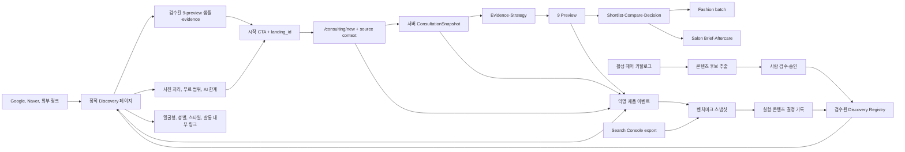
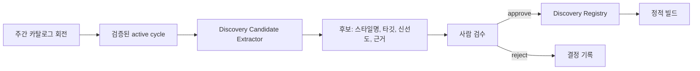

# HairFit 검색·전환 벤치마킹 적용 아키텍처

- 작성일: 2026-07-15
- 최근 구현 대조일: 2026-08-14
- 상태: Proposed — current implementation aligned
- 적용 대상: `my-app` 공개 웹 표면과 기존 HairFit 생성 퍼널

## 1. 결정 요약

HairFit은 경쟁사의 스타일 개수 경쟁을 복제하지 않는다. 공개 페이지에서 검증된 다음 구조만 채택한다.

1. 검색 의도와 일치하는 독립 랜딩을 정적으로 제공한다.
2. 첫 화면에서 실제 제품 형태와 같은 샘플 체험을 제공한다.
3. 샘플 체험 뒤 `/consulting/new`로 연결하고, feature flag OFF에서만 legacy `/workspace`로 rollback한다.
4. 얼굴형·성별·스타일·살롱 사용 목적을 내부 링크 그래프로 연결한다.
5. 사진 처리, 무료 범위, AI 결과 한계, 후기 근거를 전환 전에 공개한다.
6. 검색 유입과 제품 퍼널을 같은 `landing_id`·`intent_id`로 계측한다.
7. 주간 헤어 카탈로그는 검색 콘텐츠의 후보 신호로만 사용하고 자동 공개하지 않는다.

목표 구조는 `정적 검색 표면`, `기존 제품 런타임`, `벤치마킹·계측 데이터`의 세 평면으로 분리한다. 이 분리는 검색 페이지 장애가 생성 런타임에 영향을 주거나, 카탈로그 회전이 검수되지 않은 SEO 페이지를 자동 생산하는 일을 막는다.

## 2. 조사 방법과 증거 수준

### 2.1 조사 대상

| ID | 서비스 | 공개 URL | 관찰일 | 역할 |
| --- | --- | --- | --- | --- |
| COMP-01 | YouCam Online Editor | <https://yce.perfectcorp.com/ko/ai-hairstyle-generator> | 2026-07-15 | 1차 벤치마크: 도구 내장형 검색 랜딩 |
| COMP-02 | AIReel | <https://www.aireel.net/ko/ai-effects/ai-hairstyle> | 2026-07-15 | 보조 벤치마크: 검색 의도·FAQ 확장 |
| COMP-03 | HairTry | <https://hairtry.app/ko> | 2026-07-15 | 보조 벤치마크: 카탈로그·사회적 증거·앱 전환 |
| BASE-01 | HairFit | <https://hairfit.beauty/> | 2026-07-15 | 현재 기준선 |

### 2.2 증거 분류

| 등급 | 의미 | 사용 규칙 |
| --- | --- | --- |
| `observed` | 공개 DOM, 문구, 링크, URL, 화면 구조에서 직접 확인 | 아키텍처 근거로 사용 가능 |
| `claimed` | 경쟁사가 자신의 페이지에서 제시한 스타일 수, 사용자 수, 성공률, 리뷰 수 | 표현 방식만 참고하며 사실 검증 없이 HairFit 주장으로 재사용 금지 |
| `inferred` | 공개 표면을 보고 추론한 내부 구성 | 구현 사실로 서술 금지, 패턴 가설로만 사용 |

경쟁사의 모델, 저장소, 인증, 큐, 데이터베이스는 공개 페이지에서 확인할 수 없다. 이 문서는 경쟁사의 비공개 내부 아키텍처를 벤치마킹했다고 주장하지 않는다.

## 3. 공개 표면 벤치마킹 데이터

점수는 `0=관찰되지 않음`, `1=부분 또는 간접 제공`, `2=명시적 제공`이다. 총점은 우열 순위가 아니라 HairFit의 구조적 공백을 찾기 위한 비교 도구다.

| 평가 항목 | YouCam | AIReel | HairTry | HairFit | HairFit 판단 |
| --- | ---: | ---: | ---: | ---: | --- |
| 검색 의도와 일치하는 전용 URL·H1 | 2 | 2 | 1 | 2 | 홈은 강하지만 의도별 URL이 부족 |
| 첫 화면 체험 시작점 | 2 | 1 | 2 | 1 | 샘플은 강하나 실제 시작은 별도 이동 |
| 업로드 없이 보는 결과 예시 | 2 | 1 | 2 | 2 | 9개 전략 preview와 비교 evidence가 강점 |
| 무료 범위의 즉시 설명 | 2 | 2 | 2 | 1 | 가격 섹션까지 내려가야 구체 범위를 이해 |
| 남성·여성 세분화 | 2 | 2 | 2 | 2 | 데모 탭과 카탈로그 타깃 보유 |
| 얼굴형 기반 추천 설명 | 2 | 2 | 2 | 2 | HairFit 핵심 기능과 일치 |
| 탐색 가능한 스타일 카탈로그 | 2 | 1 | 2 | 1 | 활성 카탈로그는 있으나 공개 탐색 표면이 없음 |
| 3단계 사용 방법 | 2 | 2 | 1 | 2 | 현재 홈에 있음 |
| 사진 보안·삭제 FAQ | 2 | 0 | 1 | 1 | 정책 문서는 있으나 전환 지점 요약이 약함 |
| 관련 기능 내부 링크 | 2 | 2 | 2 | 2 | HairFit은 패션·상담으로 차별화 가능 |
| B2B 전환 브리지 | 2 | 0 | 0 | 2 | 살롱 CTA가 이미 존재 |
| 검증 가능한 사회적 증거 | 0 | 0 | 2 | 1 | 실제 근거 ID와 승인 상태가 필요 |
| 가격·무료 오퍼 명료성 | 1 | 1 | 2 | 2 | 정책 SSoT는 강점, Hero 요약이 부족 |
| 의사결정 지원 차별화 | 1 | 1 | 1 | 2 | 9개 비교→코디→상담이 독자적 |

### 3.1 관찰된 경쟁 구조

#### YouCam

- `/ko/ai-hairstyle-generator` 한 URL에서 검색 키워드, 업로드, 예제 사진, 기능 설명, 3단계 사용법, FAQ를 연결한다.
- 남성 전용 스타일, 얼굴형 분석, 관련 헤어 도구, B2B 문의를 같은 검색 세션에서 이어준다.
- 신규 무료 크레딧과 사진 처리 FAQ를 전환 전에 제시한다.
- `150가지`와 같은 수치는 `claimed`이며 HairFit이 검증 없이 사용할 수 없다.

#### AIReel

- `/ko/ai-effects/ai-hairstyle` 경로가 상위 `AI 효과` 허브에 속한다.
- 제목·본문·FAQ에 `AI 헤어스타일 바꾸기`, `나에게 어울리는 머리`, `앞머리`, 남성 스타일명을 배치한다.
- 다수의 관련 효과 링크로 검색 진입 페이지 사이의 연결을 만든다.
- 검색어 반복 방식은 참고하되, HairFit은 사용자에게 부자연스러운 반복과 키워드 스터핑을 채택하지 않는다.

#### HairTry

- Hero 다음에 카테고리 탭과 스타일 카드로 탐색 공간을 제공한다.
- 리뷰 수, 사용자 수, 매칭 성공률을 전환 증거로 사용한다.
- 수치는 모두 `claimed`이므로 HairFit에서는 근거 레코드가 있을 때만 노출한다.

### 3.2 HairFit의 현재 구조

이 절의 HairFit 기준은 [2026-08-14 구현 대조 보고서](./current-implementation-alignment-2026-08-14.md)의 feature branch다. 운영 `main` 통합·배포 완료를 뜻하지 않는다.

| 현재 자산 | 실제 위치 | 재사용 판단 |
| --- | --- | --- |
| 홈 메시지·FAQ·추천 기준 | `my-app/lib/home-content.ts` | 검색 랜딩 레지스트리의 초기 메시지 근거로 재사용 |
| 16명 hair/fashion rolling Hero | `my-app/components/home/HeroSection.tsx` | 검색 Hero를 복제하지 않고 승인 sample 후보·제품 정체성 근거로 사용 |
| 컨설팅 evidence showcase | `my-app/components/home/PremiumConsultingShowcases.tsx` | Analysis·Direction·9 Preview·Compare·Brief·Aftercare·Fashion 증거를 intent별로 재구성 |
| 홈 JSON-LD·metadata | `my-app/app/page.tsx` | 페이지별 metadata·JSON-LD 빌더로 분리 후보 |
| 컨설팅 진입 | `my-app/app/consulting/new/page.tsx` | auth·feature flag를 보존한 단일 B2C CTA |
| 11 Scene runtime | `my-app/components/consulting/*`, `my-app/app/consulting/[sessionId]/[stage]` | 공개 랜딩 안에 복제하지 않고 제품 플로우로 연결 |
| 컨설팅 정본 | `packages/shared/src/consulting/contract.ts`, `my-app/lib/consulting/server-store.ts` | 서버 `ConsultationSnapshot`과 9 preview·선택·brief 계약 재사용 |
| legacy rollback | `/workspace` | `NEXT_PUBLIC_CONSULTATION_FRONTEND_V2` OFF에서만 사용 |
| 활성 헤어 카탈로그 | `my-app/lib/hairstyle-catalog.ts` | 검색 콘텐츠 후보와 공개 샘플 선정 신호로만 사용 |
| 카탈로그 cycle·lineup | `hairstyle_catalog_*` 테이블과 RPC | 자동 게시 소스가 아닌 제안·감사 근거 |
| 플랜 표시 SSoT | `my-app/lib/plan-benefit-display.ts` | 무료 범위·가격 표시에 그대로 사용 |
| 동적 공개 FAQ | `my-app/lib/support-server.ts` | 공통 FAQ만 사용, 페이지별 SEO FAQ는 레지스트리에서 관리 |
| sitemap·robots | `my-app/app/sitemap.ts`, `my-app/app/robots.ts` | discovery 레지스트리와 연동하도록 확장 |

## 4. 목표 시스템 컨텍스트



## 5. 정적 검색 표면 아키텍처

### 5.1 URL 구조

모든 신규 검색 페이지는 `/discover` 아래에 둔다. 기존 제품 라우트와 충돌하지 않고 검색 콘텐츠를 하나의 운영 단위로 분리하기 위해서다.

| Page ID | URL | Primary Intent | Page Type | 1차 CTA |
| --- | --- | --- | --- | --- |
| `D-AI-SIM` | `/discover/ai-hairstyle-simulation` | AI 헤어스타일 시뮬레이션 | core | 9가지 헤어 비교하기 |
| `D-FACE` | `/discover/face-shape-hairstyle` | 얼굴형 헤어스타일 추천 | core | 내 얼굴형으로 시작하기 |
| `D-MEN` | `/discover/men-hairstyle-simulation` | 남자 헤어스타일 시뮬레이션 | audience | 남자 헤어 9가지 보기 |
| `D-WOMEN` | `/discover/women-hairstyle-simulation` | 여자 헤어스타일 시뮬레이션 | audience | 여자 헤어 9가지 보기 |
| `D-BANGS` | `/discover/bangs-preview` | 앞머리 어울리는지 테스트 | style | 앞머리 후보 비교하기 |
| `D-MAKEUP` | `/discover/personal-color-makeup` | 퍼스널 컬러 메이크업 추천 | style | 내 메이크업 방향 확인하기 |
| `D-SALON` | `/discover/salon-consultation-image` | 미용실 상담 이미지 | use-case | 상담용 헤어 후보 만들기 |

URL에 연도나 유행어를 넣지 않는다. 트렌드가 바뀌어도 canonical을 유지하기 위함이다.

### 5.2 Next.js 구현 경계

```text
my-app/
  app/
    (marketing)/
      discover/
        page.tsx
        [slug]/
          page.tsx
          not-found.tsx
  components/
    discovery/
      DiscoveryPageTemplate.tsx
      DiscoveryHero.tsx
      SampleComparison.tsx
      TrustSummary.tsx
      RelatedDiscoveryPages.tsx
      DiscoveryPage.module.css
  lib/
    discovery/
      types.ts
      discovery-pages.ts
      metadata.ts
      json-ld.ts
      sample-manifests.ts
      evidence-registry.ts
```

`[slug]/page.tsx`는 `generateStaticParams()`로 승인된 slug만 빌드하고 `dynamicParams = false`로 미등록 경로를 404 처리한다. Next.js 공식 문서의 정적 동적 경로 패턴을 따른다: <https://nextjs.org/docs/app/api-reference/functions/generate-static-params>.

각 페이지의 `generateMetadata()`는 레지스트리에서 title, description, canonical, Open Graph, robots를 생성한다: <https://nextjs.org/docs/app/api-reference/functions/generate-metadata>.

구현 단위와 코드 골격은 [검색 유입 페이지 구현 가이드](./search-entry-page-implementation-guide.md)를 정본으로 사용한다. 1차 PR은 `D-AI-SIM` canary의 정적 route·metadata·sitemap·audit과 승인된 정적 9-preview까지 포함한다. 샘플 상호작용, 나머지 3개 pilot, 로그인 왕복 attribution은 2차 PR로 분리한다.

### 5.3 콘텐츠 레지스트리 계약

```ts
type DiscoveryPageType = "core" | "audience" | "style" | "use-case";

interface DiscoveryPageDefinition {
  id: DiscoveryPageId;
  slug: string;
  status: "draft" | "review" | "published" | "retired";
  pageType: DiscoveryPageType;
  intentId: string;
  audience: "b2c" | "b2b";
  locale: "ko-KR";
  updatedAt: string;
  seo: DiscoverySeo;
  message: DiscoveryMessage;
  sections: readonly DiscoverySection[];
  faq: readonly DiscoveryFaq[];
  sampleManifestId: string | null;
  evidenceIds: readonly string[];
  relatedPageIds: readonly DiscoveryPageId[];
  trustPolicyVersion: string | null;
  reviewer: string;
}
```

등록 기준:

- `published`만 `generateStaticParams`, sitemap, 내부 링크에 포함한다.
- primary intent는 한 페이지에 하나만 둔다.
- CTA의 무료·가격 문구는 `plan-benefit-display.ts` 값과 모순되면 빌드 실패로 처리한다.
- FAQ JSON-LD는 화면에 실제 보이는 FAQ와 동일해야 한다.
- `updatedAt`은 본문·구조화 데이터·주요 이미지가 실질적으로 변경된 날짜만 갱신한다.
- 경쟁사 문구, 이미지, 스타일 설명을 그대로 복사하지 않는다.

### 5.4 렌더링 전략

| 영역 | 전략 | 이유 |
| --- | --- | --- |
| 본문·metadata·내부 링크 | 빌드 시 정적 생성 | 검색 크롤러 안정성, 빠른 LCP, DB 장애 격리 |
| 9-preview 샘플 전환 | 작은 Client Component | strategy·sample 탭 상호작용만 필요 |
| 가격 요약 | 서버 계산 snapshot | 클라이언트 env 노출 없이 현재 정책 SSoT 사용 |
| 동적 사용자 수 | discovery 페이지에서는 기본 제외 | 정적 캐시와 검증 가능한 증거 우선 |
| 실제 사용자 상담·생성 | `/consulting/new` 이후 | 공개 페이지와 민감 이미지 런타임 분리 |

홈은 로그인 사용자를 계정 홈으로 redirect하고 동적 FAQ·가격 표시를 조합한다. 신규 discovery 페이지는 로그인 여부와 무관하게 동일한 공개 콘텐츠를 제공하고, `/consulting/new` 진입 이후에만 auth·feature flag·세션 상태를 처리한다.

## 6. 샘플 체험 아키텍처

### 6.1 원칙

- 경쟁사의 Hero 업로드 패턴을 그대로 복제하지 않는다.
- 첫 단계는 `검수된 샘플 전환`으로 구현해 속도와 개인정보 위험을 줄인다.
- 실제 사진 선택은 기존 업로드 검증·WebP 변환·Zustand 저장 계약을 사용한다.
- 샘플 보드는 실제 제품의 BALANCE·IMAGE·LIFESTYLE 각 3개, 총 9개 결과 구조와 일치해야 한다.

### 6.2 샘플 자산 계약

```ts
interface DiscoverySampleAsset {
  id: string;
  locale: "ko-KR";
  styleTarget: "male" | "female";
  faceShape: string;
  sourceType: "commissioned" | "licensed" | "synthetic";
  consentOrLicenseRef: string;
  originalPath: string;
  gridImagePaths: string[]; // exactly 9
  styleSlugs: string[]; // exactly 9
  altTexts: string[]; // exactly 9
  approvedAt: string;
  expiresAt: string | null;
}
```

금지:

- Clerk 프로필 이미지나 실제 사용자 업로드를 샘플로 자동 사용
- 라이선스 참조 없는 자산 배포
- 실제 추천 점수처럼 보이는 임의 숫자
- 제공하지 않는 헤어컬러·볼륨 보정 기능의 샘플 노출

### 6.3 전환 연결

모든 CTA는 다음 정보를 URL 또는 서버 측 resume context에 전달한다.

```text
landing_id=D-MEN
intent_id=men-hairstyle-simulation
sample_id=sample-male-01
cta_id=hero-primary
```

민감 정보나 검색 원문 전체는 전달하지 않는다. 허용된 ID만 사용하며 `/consulting/new`의 로그인·세션 생성 경계에서 resume context를 소비해 `ConsultationSnapshot.acquisition` optional field와 연결한다. P3에서 별도 event store를 추가하기 전까지 이 필드는 transport 정본이며 집계 완료 증거가 아니다. legacy `/workspace` fallback은 return boundary까지 ID를 유지하고, 저장하지 못하면 `not-recorded-legacy`로 명시한다.

## 7. 카탈로그와 검색 콘텐츠의 경계

HairFit의 활성 카탈로그는 `trend`, `face_fit`, `evergreen`, `experimental` 슬롯과 남성·여성 9개 lineup을 제공한다. 이 데이터는 검색 콘텐츠의 좋은 후보 신호지만 자동 게시 SSoT로 쓰지 않는다.



후보 추출 규칙:

| 규칙 | 기준 |
| --- | --- |
| active only | active pointer가 가리키는 succeeded cycle만 사용 |
| freshness | `usedLookbackDays <= 60` 우선, low freshness는 신규 페이지 제안 금지 |
| recurrence | 2개 이상 cycle에서 반복 신호가 있거나 evergreen 승인 필요 |
| coverage | male/female, face-fit, length bucket 중 페이지 의도와 맞아야 함 |
| evidence | source summary와 cycle ID를 후보 레코드에 남김 |
| manual publish | 승인자·승인일 없이는 registry에 들어갈 수 없음 |

이 구조는 기존 카탈로그 실패 fallback을 보존한다. 카탈로그 회전 실패가 검색 페이지를 삭제하거나 thin page를 만들지 않는다.

## 8. SEO·메타데이터 아키텍처

### 8.1 페이지별 필수 항목

| 항목 | 계약 |
| --- | --- |
| title | primary intent + 구체 결과 + HairFit, 페이지별 고유 |
| description | 사진 1장, 9개 비교, 페이지 의도에 맞는 차별점 포함 |
| H1 | title을 복사하지 않되 같은 검색 의도를 명확히 표현 |
| canonical | 자기 URL 한 개 |
| Open Graph | 승인된 1200×630 자산과 고유 alt |
| internal links | 부모 hub 1개, 형제 2개 이상, 제품 CTA 1개 이상 |
| structured data | 실제 화면 내용과 동일한 `WebPage`, `BreadcrumbList`, 필요 시 `FAQPage` |
| image alt | 이미지가 보여주는 스타일·타깃을 설명, 키워드 나열 금지 |
| robots | published=`index,follow`, draft/review=`noindex,nofollow` |

Google은 `meta keywords`를 검색 순위에 사용하지 않는다. 기존 `homeSeo.keywords`는 호환성을 위해 유지할 수 있지만 신규 아키텍처의 성공 기준으로 사용하지 않는다: <https://developers.google.com/search/docs/crawling-indexing/special-tags>.

FAQ·HowTo 구조화 데이터는 리치 결과 노출을 보장하지 않는다. 화면에 실제로 존재하는 콘텐츠의 기계 판독 표현으로만 사용한다: <https://developers.google.com/search/blog/2023/08/howto-faq-changes>.

### 8.2 sitemap 계약

현재 `sitemap.ts`는 모든 요청에서 `new Date()`를 사용한다. 목표 구조에서는 registry의 `updatedAt`을 사용해 실질 변경일만 노출한다.

```ts
publishedDiscoveryPages.map((page) => ({
  url: `${siteUrl}/discover/${page.slug}`,
  lastModified: new Date(page.updatedAt),
}))
```

Google은 sitemap의 URL을 canonical 후보로 해석하고 정확한 `lastmod` 사용을 권장한다: <https://developers.google.com/search/docs/crawling-indexing/sitemaps/build-sitemap>.

## 9. 신뢰·정책 아키텍처

### 9.1 Trust Policy SSoT

```text
my-app/lib/trust/
  trust-policy.ts
  photo-processing-policy.ts
  ai-result-disclaimer.ts
```

공개 랜딩, 업로드, 개인정보처리방침, FAQ가 같은 버전의 정책을 참조한다.

필수 문구 영역:

| 영역 | 표시 내용 | 금지 |
| --- | --- | --- |
| 사진 처리 | 처리 목적, 원본 보존 기간, 삭제 방법, 제3자 처리 범위 | 확인되지 않은 즉시 삭제 주장 |
| 무료 범위 | 현재 크레딧 SSoT로 가능한 결과 수 | 고정 숫자 하드코딩 |
| AI 한계 | 실제 시술 결과와 차이가 날 수 있음 | 실패 없는 변신, 완벽 일치 보장 |
| 후기 | 근거 ID, 승인 상태, 실제/예시 구분 | 가상의 이름·평점·성과 수치 |
| 상담 활용 | 의사소통 보조 자료 | 전문 디자이너 판단 대체 주장 |

### 9.2 증거 레지스트리

```ts
interface MarketingEvidence {
  id: string;
  type: "product-capability" | "metric" | "testimonial" | "policy";
  statement: string;
  sourceRef: string;
  status: "draft" | "verified" | "expired" | "revoked";
  verifiedAt: string | null;
  expiresAt: string | null;
  approvedBy: string | null;
}
```

Discovery의 `proofPoints[].evidenceId`가 `verified`가 아니면 빌드 감사가 실패해야 한다.

## 10. 계측과 벤치마크 피드백 루프

### 10.1 이벤트 계약

```ts
type DiscoveryEventName =
  | "landing_viewed"
  | "sample_tab_selected"
  | "sample_viewed"
  | "trust_detail_opened"
  | "related_page_clicked"
  | "cta_clicked"
  | "consultation_started"
  | "photo_started"
  | "photo_validated"
  | "preview_board_viewed"
  | "shortlist_updated"
  | "style_selected"
  | "fashion_started"
  | "signup_completed"
  | "purchase_completed";

interface DiscoveryEvent {
  eventId: string;
  eventName: DiscoveryEventName;
  occurredAt: string;
  anonymousSessionId: string;
  userIdHash?: string;
  landingId?: string;
  intentId?: string;
  sampleId?: string;
  ctaId?: string;
  experimentAssignments?: Record<string, string>;
  path: string;
  referrerHost?: string;
  deviceClass?: "mobile" | "tablet" | "desktop";
  schemaVersion: 1;
}
```

금지 필드:

- 사진 URL, 이미지 base64, 얼굴 분석 원문
- 이메일, 이름, 전화번호
- 전체 referrer URL의 query string
- 자유 입력 프롬프트

### 10.2 저장 경계

초기 구현:

```text
packages/shared/src/analytics/discovery-event.ts
my-app/lib/analytics/discovery-client.ts
my-app/lib/analytics/discovery-server.ts
my-app/app/api/analytics/events/route.ts
Supabase product_funnel_events + daily aggregate view
```

API는 이벤트 allowlist, payload 크기, timestamp 허용 범위, rate limit, 중복 `eventId`를 검증한다. 원시 이벤트는 90일 보존을 기본 제안으로 하며, 일별 집계는 장기 보존한다. 실제 보존기간은 개인정보 검토 후 확정한다.

고트래픽 전환 조건:

- 일 100,000 이벤트 이상
- 이벤트 쓰기가 운영 DB latency 또는 비용에 유의미한 영향을 줌
- 90일 원시 데이터 쿼리가 대시보드 SLO를 넘김

전환 시 `EventSink` 인터페이스 뒤에서 Cloudflare Analytics Engine 또는 전용 분석 저장소로 교체한다. 제품 컴포넌트의 이벤트 계약은 바꾸지 않는다.

### 10.3 검색 데이터 결합

Search Console export는 다음 키로 일별 집계한다.

```text
date + landing_id + page + query_cluster + device + country
```

제품 이벤트는 `landing_id + date + device_class`로 집계하고 개인 단위로 Search Console 데이터와 조인하지 않는다.

핵심 퍼널:

```text
impression -> organic_click -> landing_viewed -> cta_clicked
-> consultation_started -> photo_started -> preview_board_viewed
-> shortlist_updated -> style_selected
-> fashion_started | purchase_completed
```

### 10.4 KPI와 결정 규칙

| KPI | 정의 | 보호지표 |
| --- | --- | --- |
| 비브랜드 노출 | 브랜드명을 제외한 query cluster impressions | 색인 제외·중복 canonical 0건 |
| 검색 CTR | organic clicks / impressions | title 과장·낚시 문구 금지 |
| CTA 시작률 | CTA click / landing view | bounce와 LCP 동시 확인 |
| 추천 보드 도달률 | board view / CTA click | 업로드 검증 실패율 |
| 스타일 선택률 | style selected / board view | 생성 실패·재시도율 |
| 유료 전환 | purchase / qualified landing sessions | 환불·불만 비율 |

실험 승리 조건은 주 지표 개선과 보호지표 비열화를 동시에 만족해야 한다. 트래픽이 적으면 고정 14일만으로 승리를 선언하지 않고 최소 표본과 신뢰구간을 함께 기록한다.

## 11. 운영·실험 아키텍처

### 11.1 실험 할당

- 서버가 `hf_exp` first-party cookie에 익명 할당을 저장한다.
- 크롤러와 봇에는 항상 control 콘텐츠를 제공한다.
- title, canonical, H1을 실험별로 무작위 변경하지 않는다.
- CTA label, 데모 배치, trust 요약 위치처럼 본문 내 전환 요소부터 실험한다.
- 실험 종료 후 winner를 registry에 반영하고 할당 코드를 제거한다.

### 11.2 벤치마킹 주기

| 주기 | 작업 | 산출물 |
| --- | --- | --- |
| 매주 | Search Console·퍼널 지표 확인 | weekly scorecard |
| 매월 | 페이지별 intent 성과와 content gap 검토 | monthly decision record |
| 분기 | 경쟁사 공개 구조 재관찰 | competitor snapshot |
| 카탈로그 회전 후 | 새 스타일 신호를 페이지 후보로 평가 | content candidate report |

## 12. 단계별 적용 순서

현재 구현 재판정은 [2026-08-14 구현 대조 보고서](./current-implementation-alignment-2026-08-14.md)를 따른다. P2~P4의 `partial-reuse-ready`는 랜딩·컨설팅 기반을 재사용할 수 있다는 뜻이며 검색 Phase 완료를 뜻하지 않는다.

| Phase | 범위 | 선행조건 | 완료 기준 |
| --- | --- | --- | --- |
| [P0 Evidence](./implementation-plan/phase-00-evidence-baseline.md) | 기준선, 경쟁 snapshot, 이벤트 taxonomy | Search Console 접근 확인 | 기준선 날짜·출처·누락값 기록 |
| [P1 Foundation](./implementation-plan/phase-01-search-surface-foundation.md) | registry, 정적 route, metadata, sitemap, audit | P0 | pilot slug가 정적 빌드되고 미등록 slug는 404 |
| [P2 Pilot](./implementation-plan/phase-02-pilot-content-sample-experience.md) | AI, 얼굴형, 남자, 여자 4페이지 | 승인된 copy·assets | 브라우저·SEO·접근성 게이트 통과 |
| [P3 Trust & Funnel](./implementation-plan/phase-03-trust-funnel-measurement.md) | trust SSoT, CTA source, 이벤트 API | 개인정보·보존 승인 | 민감정보 없는 퍼널 측정 가능 |
| [P4 Expansion](./implementation-plan/phase-04-content-expansion-operations.md) | 앞머리, 보브, 살롱 3페이지, 허브 링크 | P2 지표 확인 | 7페이지 고유 콘텐츠·내부 링크 완성 |
| [P5 Optimization](./implementation-plan/phase-05-experiment-optimization.md) | 실험과 월간 결정 루프 | 충분한 표본 | winner·loser·inconclusive 기록과 rollback 가능 |

## 13. 구현 영향도

| 영역 | 신규·변경 경로 | 목적 |
| --- | --- | --- |
| 페이지 | `my-app/app/(marketing)/discover/*` | 정적 검색 진입점 |
| 콘텐츠 | `my-app/lib/discovery/*` | 승인된 페이지 SSoT |
| UI | `my-app/components/discovery/*` | 재사용 가능한 Hero·데모·신뢰·FAQ |
| 홈 | `my-app/app/page.tsx`, `components/home/HeroSection.tsx`, `PremiumConsultingShowcases.tsx` | approved evidence adapter, discovery 허브 연결 |
| sitemap | `my-app/app/sitemap.ts` | published registry와 정확한 lastModified |
| robots | `my-app/app/robots.ts` | 공개 discovery 허용, draft 차단 |
| 분석 계약 | `packages/shared/src/analytics/*` | 웹·모바일 공유 가능한 이벤트 타입 |
| 분석 수집 | `my-app/app/api/analytics/events/route.ts` | 서버 검증·익명 수집 |
| DB | `my-app/supabase/migrations/*_discovery_funnel_events.sql` | 이벤트·집계·보존 기반 |
| 감사 | `my-app/scripts/audit-search-discovery.mjs` | 콘텐츠·SEO·증거·이벤트 계약 회귀 방지 |
| 문서 | `docs/search-benchmark/*` | 근거, 결정, 실행 아티팩트 |

## 14. 리스크와 대응

| 리스크 | 조기 신호 | 대응 |
| --- | --- | --- |
| thin/programmatic SEO | 페이지 본문과 FAQ가 slug만 바뀌고 동일 | 수동 승인, 고유 evidence와 데모 없으면 publish 금지 |
| 정책 불일치 | 랜딩 무료 횟수와 결제 화면 값이 다름 | plan SSoT 참조, 정적 audit |
| 카탈로그 자동 오염 | 저신선도 스타일이 검색 페이지에 즉시 등장 | 후보·승인·registry 3단계 분리 |
| 사용자 사진 노출 | 샘플 manifest에 user source가 존재 | source type allowlist, 라이선스 gate |
| 이벤트 개인정보 수집 | payload에 URL/query/이미지 포함 | 서버 schema allowlist와 payload 감사 |
| 홈 성능 악화 | LCP·JS bundle 증가 | 정적 페이지, client island 최소화, 이미지 budget |
| 검색 성과 과대해석 | 적은 표본에서 잦은 winner 결정 | minimum sample·confidence 기록 |
| 경쟁사 모방으로 차별점 약화 | 카탈로그 개수만 강조 | 모든 페이지에서 9개 비교→코디→상담 중 하나를 증거로 포함 |

## 15. 품질 게이트

| Gate | 통과 조건 |
| --- | --- |
| Architecture | route→registry→component→CTA→event 흐름에 끊긴 계약이 없음 |
| Content | audience, problem, outcome, proof, CTA가 한 message map을 공유 |
| Evidence | 모든 수치·후기·정책에 verified evidence ID 존재 |
| SEO | 고유 title/H1/canonical, published sitemap, crawlable internal links |
| Privacy | 샘플 자산 권리 확인, 이벤트 PII 0건, 사진 정책 버전 표시 |
| Browser | 360/390/768/1440 viewport, 키보드, 이미지 실패, JS 실패 상태 검증 |
| Performance | 모바일 LCP 2.5초 목표, CLS 0.1 이하, discovery JS budget 승인 |
| Funnel | landing_id가 CTA부터 추천 보드·결제까지 보존됨 |
| Operations | 페이지 retire, evidence revoke, 실험 rollback 절차 존재 |

## 16. 오픈 결정사항

| ID | 결정 | 기본 제안 | 결정 시점 |
| --- | --- | --- | --- |
| OD-01 | B2C와 B2B 중 1차 KPI | B2C upload start | P0 시작 전 |
| OD-02 | 이벤트 원시 데이터 보존 | 90일 | migration 승인 전 |
| OD-03 | 실제 업로드를 Hero에 내장할지 | P2에서는 샘플만, P5 실험 후보 | P2 결과 후 |
| OD-04 | Search Console 자동 수집 | 초기 수동 export, 안정화 후 API | P0 |
| OD-05 | 샘플 점수 표시 | 실제 근거 없으면 제거 | 자산 승인 시 |
| OD-06 | discovery locale 확장 | ko-KR 검증 후 en | P4 이후 |
