# 컨설팅·프리미엄 랜딩 구현 대조 보고서

- 대조일: 2026-08-14
- 문서 상태: current-branch evidence captured
- 구현 기준: `feat/2026-08-12-premium-landing-refactor` @ `e86e40d260c7cdd7c1de01e7d6aa0aa72752f8f8`
- 컨설팅 통합 기준: `develop/2026-08-08-hairfit-v2-backend` @ `3be4d8894dd3e1249808275afd001933417883c8`
- 운영 `main` 기준: `b33c33c6e0bc70413322a9af3be2f848500a1443`
- 판정 범위: 로컬 소스·커밋·계약 테스트. 검색 색인, 운영 트래픽, 원격 DB 적용, 배포 상태는 포함하지 않음

## 1. 결론

프리미엄 랜딩과 AI 컨설팅은 검색 벤치마킹 계획을 작성했던 2026-07-15 이후 크게 바뀌었다.

1. 공개 홈의 주 전환 목적지는 `/workspace`가 아니라 `/consulting/new`다.
2. 홈의 주 증거는 Hero 내부 3×3 데모가 아니라 16명 hair/fashion rolling media와 Analysis Evidence부터 Style Dossier까지 이어지는 프리미엄 컨설팅 showcase다.
3. 실제 제품 런타임은 11개 addressable Scene과 서버 소유 `ConsultationSnapshot`을 사용한다.
4. 9개 preview, 2~3개 shortlist, compare, immutable decision, salon brief, aftercare, fashion 흐름은 검색 랜딩이 연결할 실제 제품 증거로 재사용할 수 있다.
5. 후속 full-surface 브랜치에는 `/discover` hub, 7개 정적 route, registry, sitemap과 고유 decision artifact가 구현됐다. 검색 유입 event API와 실험 manifest는 아직 없다.

따라서 기존 P0~P5 계획을 완료로 올리지 않는다. 구현된 랜딩·컨설팅을 `재사용 가능한 선행 기반`으로 기록하고 검색 전용 산출물은 별도 Exit Gate를 유지한다.

## 2. Git·증거 경계

| 구분 | 기준 | 상태 | 문서 판정 |
| --- | --- | --- | --- |
| 운영 기준 | `main@b33c33c` | 프리미엄 랜딩·V2 컨설팅 feature 이력 미통합 | 운영 완료 근거로 사용 금지 |
| 컨설팅 Scene 최초 구현 | `feat/2026-08-08-ai-consultant-frontend@d51ffcb` | clean commit, 후속 V2 브랜치의 ancestor | 구현 계보 근거 |
| 컨설팅 통합 기준 | `develop/2026-08-08-hairfit-v2-backend@3be4d88` | 11 Scene·V2 API·snapshot·운영 안전장치 포함 | 현재 랜딩이 의존하는 committed contract |
| 프리미엄 랜딩 | `feat/2026-08-12-premium-landing-refactor@e86e40d` | clean commit, 컨설팅 기준의 descendant | 이 보고서의 구현 기준 |
| Color Studio 후속 | `feat/2026-08-12-discovery-scroll@3870742`와 해당 worktree 변경 | tracked/untracked 변경이 남은 active work | 완료·통합으로 판정 금지 |

`e86e40d`의 구현·문서는 로컬에서 검증된 feature 상태다. 이 보고서는 merge, push, production flag, 검색 색인을 완료됐다고 주장하지 않는다.

## 3. 구현 대조 매트릭스

| 영역 | 2026-07 계획 | 2026-08 구현 증거 | 상태 | 검색 계획 반영 |
| --- | --- | --- | --- | --- |
| 홈 Hero | 남녀 3×3 데모 | `HeroSection.tsx`의 16명 hair/fashion rolling media | implemented on feature | P2는 Hero 추출 대신 승인 showcase 자산을 별도 manifest로 구성 |
| 주 CTA | `/workspace` 또는 `/upload` | 홈 CTA 5개 이상이 `/consulting/new`, flag OFF 시 `/workspace` fallback | implemented on feature | CTA allowlist와 handoff 대상을 `/consulting/new`로 변경 |
| 제품 여정 | 업로드→생성→결과→패션 | Discovery부터 Fashion까지 11 Scene | implemented on feature | 검색 랜딩은 새 flow를 복제하지 않고 consultation entry로 연결 |
| 상태 정본 | 기존 Zustand·생성 runtime | `consultation_sessions.snapshot`과 shared `ConsultationSnapshot` | implemented on feature | `landing_id`는 session 생성 시 서버 snapshot/context로 흡수 |
| 분석 신뢰 | trust copy·evidence registry 계획 | Evidence→Meaning→Action, confidence, manual correction 계약 | implemented product evidence | C-04는 제품 evidence ID를 마케팅 evidence로 승인·매핑 |
| Preview | 검수된 3×3 sample | BALANCE·IMAGE·LIFESTYLE 각 3개, 총 9개 | implemented product contract | 검색 sample은 이 구조를 정적으로 설명하되 실제 생성으로 오인시키지 않음 |
| 선택 | 결과 선택 | 최대 3 shortlist, 최소 2 compare, revisioned selection | implemented product contract | CTA·카피를 “생성”보다 “비교와 결정”에 맞춤 |
| Salon | 상담 이미지 랜딩 계획 | versioned salon brief와 공개 share 경계 | implemented product contract | D-SALON의 proof로 사용하되 실제 share payload·사진은 공개 샘플로 재사용 금지 |
| Aftercare·Fashion | 결과 후 확장 | 실제 시술 기반 aftercare와 9 look fashion batch | implemented product contract | 관련 콘텐츠와 내부 링크 차별점으로 반영 |
| 랜딩 IA | 일반 Hero→demo→workflow | Hero→Evidence→Direction→Preview→Compare→Brief→Aftercare→Fashion→Dossier→Pricing→Trust | implemented on feature | discovery template는 전체 홈을 복제하지 않고 intent별 핵심 4~6 section만 재조합 |
| 랜딩 모션·접근성 | P2 Browser Gate 예정 | bounded reveal, reduced-motion, mobile CTA, keyboard/overflow contract | implemented and locally verified in feature history | discovery가 공용 token·motion contract를 재사용 |
| 검색 route | `/discover/[slug]` 7개 | hub와 7개 `generateStaticParams` 경로 | implemented locally | integration·deploy·live index는 별도 |
| 검색 registry | C-01 | 7 page·7 manifest·13 evidence·7 artifact kind | implemented locally | 외부 provenance 승인 별도 |
| sitemap | published registry 연동 | hub와 7개 `updatedAt` 기반 discovery entry | implemented locally | 배포 후 Search Console 제출 필요 |
| 검색 퍼널 분석 | `landing_id` event API·DB | `/api/analytics/events` 없음 | not implemented | P3 유지 |
| 검색 실험 | `hf_exp` manifest | discovery experiment manifest 없음 | not implemented | P5 유지 |

## 4. 현재 랜딩 계약

### 4.1 정보 구조

`my-app/app/page.tsx`의 현재 순서는 다음과 같다.

```text
Hero
-> Analysis Evidence
-> User Direction
-> Strategic Preview
-> Compare / Decision
-> Salon Brief
-> Aftercare
-> Fashion Direction
-> Style Dossier
-> Pricing
-> Trust / Final CTA
```

검색 페이지는 이 순서를 전부 복제하지 않는다. primary intent에 필요한 evidence, preview, objection, CTA만 선택하며 source component가 marketing page copy를 소유하지 않게 한다.

### 4.2 카피·전환

- 제품 정체성: `프라이빗 AI 스타일 컨설팅`
- core promise: 사진을 생성하는 데서 끝나지 않고 근거·전략·비교·선택을 연결
- primary CTA: `/consulting/new`
- secondary conversion: `/b2b/contact`
- 금지 주장: 실제 시술 결과 보장, 완벽한 일치, 검증되지 않은 정확도·가격·전문가 검수
- 미구현 오퍼: 통합 PDF Dossier export, 연간 Style Archive, 전문가 검수 상품

### 4.3 디자인·브라우저

현재 랜딩은 `LandingScene`과 `RevealOnScroll`로 section composition과 motion을 분리한다. `landing.css`는 bounded stagger와 `prefers-reduced-motion` fallback을 가진다. 검색 discovery 구현은 이 계약을 재사용할 수 있지만, discovery 페이지 자체의 360/390/768/1440 Browser Gate는 별도로 수행해야 한다.

## 5. 현재 컨설팅 계약

```mermaid
flowchart LR
  Entry["/consulting/new"] --> Session["ConsultationSnapshot"]
  Session --> Discovery
  Discovery --> Photo --> Scan --> Analysis --> Direction
  Direction --> Previews["9 previews"]
  Previews --> Compare["2-3 shortlist / compare"]
  Compare --> Decision["revisioned selection"]
  Decision --> Brief["salon brief"]
  Brief --> Aftercare --> Fashion
```



핵심 구현 경계:

- `packages/shared/src/consulting/contract.ts`가 web·Expo 공용 DTO와 11 stage slug를 소유한다.
- `my-app/lib/consulting/server-store.ts`가 snapshot hydrate, optimistic version conflict, stage mutation을 처리한다.
- `my-app/app/consulting/new/page.tsx`는 flag와 auth를 확인하고 세션 진입점을 제공한다.
- `my-app/components/consulting/ConsultationStagePage.tsx`는 stage workbench와 장기 작업 transition을 조합한다.
- flag OFF이면 `/consulting/new`는 legacy `/workspace`로 되돌아간다.

검색 랜딩은 client에서 빈 consultation ID를 만들지 않는다. CTA source 전달 계약은 authenticated session 생성과 함께 서버에 저장하거나, 로그인 전 허용된 first-party resume context로 전달한 뒤 세션 생성 시 소비해야 한다.

## 6. Phase 재판정

| Phase | 기존 상태 | 대조 후 상태 | 구현된 선행 기반 | 남은 검색 전용 Exit Gate |
| --- | --- | --- | --- | --- |
| P0 Evidence | planned | planned | 랜딩·컨설팅 source inventory 확보 | Search Console·query·funnel 기준선 |
| P1 Foundation | planned | PR-1 complete locally | home metadata·JSON-LD·site URL helper | integration·deploy·live index 확인 |
| P2 Pilot | planned | 4개 core/audience page complete locally | premium showcase, 9-preview contract, 고유 artifact, browser tests | integration·deploy·attribution |
| P3 Trust & Funnel | planned | partial-reuse-ready | snapshot, evidence, privacy/share, feature-flag rollback | landing source handoff·event API·aggregate·retention |
| P4 Expansion | planned | 7-page surface complete locally | D-BANGS·D-BOB·D-SALON, candidate manifests, link graph | 운영 승인·candidate 자동화는 별도 |
| P5 Optimization | planned | planned | landing contract tests | assignment·exposure·scorecard·decision loop |

`partial-reuse-ready`는 해당 검색 Phase가 완료됐다는 뜻이 아니다.

## 7. 문서 변경 결정

이번 동기화에서 다음 계약을 바꾼다.

1. discovery primary CTA를 `/consulting/new`로 변경한다.
2. legacy `/workspace`는 feature-flag rollback 경로로만 남긴다.
3. P2의 홈 3×3 primitive 추출 작업을 프리미엄 showcase·9-preview evidence adapter 작업으로 교체한다.
4. P3 handoff는 consultation session과 `landing_id` 연결을 명시한다.
5. 각 Phase에 현재 구현 재사용 상태와 PR-1 canary 완료 상태를 분리해 표시한다.
6. Browser Gate는 랜딩과 D-AI-SIM 각각의 증거로 기록한다.
7. 검색 유입 구현은 [별도 구현 가이드](./search-entry-page-implementation-guide.md)에서 P1 canary PR과 P2 pilot PR로 분리한다.

## 8. 2026-08-14 로컬 재검증

| 명령 | 결과 | 판정 |
| --- | --- | --- |
| `landing-premium:contract:test` | 7/7 pass | premium message·11 scene order·CTA·mobile 계약 유지 |
| `landing-hero:contract:test` | 1/1 pass | 4열×8행, 16명 pair 유지 |
| `landing-motion:contract:test` | 3/3 pass | bounded reveal·reduced-motion 유지 |
| `landing-flat-surface:contract:test` | 5/5 pass | editorial surface·proof order 유지 |
| `consulting:contract:test` | 78/78 pass | 위임된 랜딩 CTA owner component까지 검사하도록 stale contract 갱신 |
| `search:discovery:contract:test` | 12/12 pass | registry·sample·metadata·JSON-LD·sitemap 계약 통과 |
| `search:discovery:audit` | finding 0 | published canary blocking 0 |
| `search-discovery.spec.ts` | 39/39 pass | 7개 경로 metadata·static HTML·axe·390/1440, 404·image failure·performance 통과 |
| `build` | pass | `/discover` static, 7개 detail SSG |

검색 구현 중 발견된 실제 UI finding은 신뢰 날짜 텍스트의 3.14:1 대비 한 건이었다. 색상 토큰을 수정한 뒤 axe serious·critical 0으로 재검증했다. 전역 Clerk streaming shell은 JavaScript 비활성 브라우저에서 loading shell을 시각적으로 교체하지 못하지만, 정적 HTML 응답에는 H1·비교·FAQ·CTA가 포함된다. 이를 검색 HTML 계약과 별도 shell architecture 후속으로 분리했다.

## 9. 다음 행동

`외부 provenance 문서 위치와 integration·deploy 승인을 확정한다. 배포 후 Search Console 28일 기준선과 field Core Web Vitals를 수집하고, P3에서 landing_id attribution을 구현한다.`
