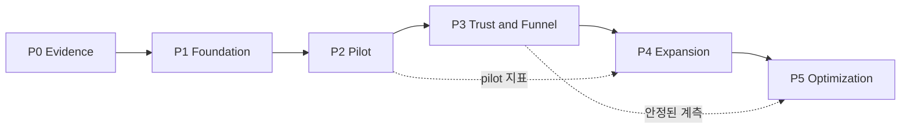

# 검색 벤치마킹 적용 Phase 인덱스

- 기준일: 2026-07-15
- 상태: implementation-ready
- 상위 문서: [아키텍처](../architecture.md), [아티팩트 정의](../artifact-specification.md)
- 구현 기준 브랜치: Phase 시작 시 `git_preflight.py`로 다시 확정

## 실행 원칙

각 Phase는 독립적인 실행 문서다. 선행 Phase의 Exit Gate와 산출물 링크가 모두 채워지기 전에는 다음 Phase의 공개 범위를 활성화하지 않는다. 구현자는 코드만 생성하지 않고 각 문서의 Evidence 열에 실제 커밋, 보고서, 스크린샷 또는 쿼리 결과를 연결해야 한다.

- 상태는 `planned → in-progress → verification → complete` 순으로만 이동한다.
- 외부 접근 또는 승인이 없으면 수치를 추정하지 않고 `external-blocked` 또는 `confirmation-needed`로 남긴다.
- 구현 변경은 Phase별 `dev/*` 브랜치에서 수행하고, 정확한 `develop/*` 통합 대상을 기록한다.
- Search Console 제출, 배포, DB migration 적용은 별도 권한이 필요한 외부 작업이다.
- P0/P1 결함은 공개 차단, P2는 소유자·완화책·기한이 있을 때만 예외 승인한다.

## Phase 맵

| Phase | 문서 | 핵심 결과 | 선행 Gate | 종료 시 공개 상태 |
| --- | --- | --- | --- | --- |
| P0 | [Evidence Baseline](./phase-00-evidence-baseline.md) | 기준선·경쟁 snapshot·intent map | 데이터 접근 범위 확인 | 코드 공개 없음 |
| P1 | [Search Surface Foundation](./phase-01-search-surface-foundation.md) | registry·정적 route·SEO audit | P0 complete | canary 1개, 비노출 검증 가능 |
| P2 | [Pilot Content & Sample Experience](./phase-02-pilot-content-sample-experience.md) | 4개 랜딩·3×3 샘플·내부 링크 | P1 complete, 자산 승인 | pilot 공개 후보 |
| P3 | [Trust & Funnel Measurement](./phase-03-trust-funnel-measurement.md) | trust SSoT·이벤트 API·집계 | 개인정보·보존 승인 | 계측된 pilot |
| P4 | [Content Expansion & Operations](./phase-04-content-expansion-operations.md) | 7개 랜딩·운영 runbook | P2/P3 지표 확인 | 확장 공개 후보 |
| P5 | [Experiment & Optimization](./phase-05-experiment-optimization.md) | 실험 할당·판정·주기 운영 | 최소 표본·계측 안정성 | 지속 최적화 |

## 공통 구현 티켓 형식

각 작업 티켓에는 다음 필드를 복사한다.

```yaml
ticket_id: P1-W01
phase: P1
owner: role-or-name
status: planned
inputs: []
files: []
acceptance: []
evidence: []
rollback: []
blocked_by: []
```

## 공통 Definition of Done

- [ ] 입력 아티팩트가 `accepted` 상태이며 실제 경로가 연결됨
- [ ] 작업 패키지별 파일·계약·검증·롤백이 구현됨
- [ ] Architecture, Copy, Evidence, SEO, Privacy, Browser, Performance, Funnel, Operations Gate 중 해당 항목의 증거가 있음
- [ ] `git diff --check`와 Phase별 정적 검사가 통과함
- [ ] P0/P1 finding이 0건이거나 공개가 차단됨
- [ ] Q-04 출시 승인 패킷에 실제 상태가 기록됨
- [ ] 다음 Phase의 첫 행동이 한 개로 지정됨

## 의존성 흐름



## 공통 명령 기준

구현 Phase에서는 저장소 스크립트를 우선한다. 명령이 아직 없으면 해당 Phase에서 먼저 만들고 `package.json`에 연결한다.

```powershell
npm --prefix my-app run lint
npm run typecheck
npm --prefix my-app run build
npm --prefix my-app run search:discovery:audit
```

브라우저·성능 검증은 P2부터 필수다. 실행 환경이 없으면 통과로 표시하지 않고 `limited`로 남긴다.
