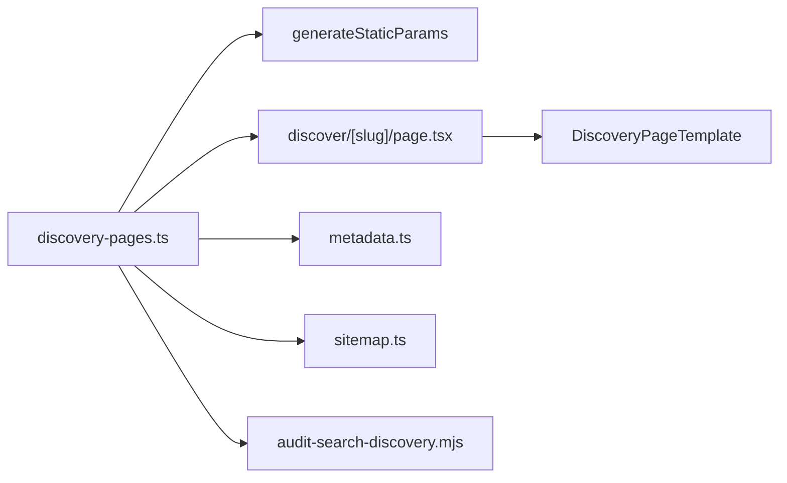

# P1. Search Surface Foundation 상세 구현 계획

- 상태: verification — PR-1 local route·registry·SEO·browser gate 통과, integration·deploy·live index 미수행
- 선행조건: P0 Exit Gate, ADR-001 accepted
- 입력: B-02 intent map, 현재 home content·sitemap·robots
- 출력: C-01, C-02, S-01, S-02, S-03, Q-01
- 다음 Phase: [P2 Pilot Content & Sample Experience](./phase-02-pilot-content-sample-experience.md)

## 현재 구현 대조

- 재사용 가능: `getSiteUrl`, 홈 metadata·JSON-LD, `LandingScene`, `RevealOnScroll`, premium landing token·motion 계약
- 변경된 제품 진입점: `/consulting/new`
- 구현됨: `my-app/app/(marketing)/discover`, `my-app/lib/discovery`, `search:discovery:audit`, discovery sitemap·robots
- 외부 미완료: provenance 보관 위치, integration·deploy, Search Console index 확인
- 증거: [2026-08-14 구현 대조 보고서](../current-implementation-alignment-2026-08-14.md)
- 실행 가이드: [검색 유입 페이지 구현 가이드](../search-entry-page-implementation-guide.md)의 PR-1 Foundation Canary
- 실행 티켓: [EX-00~EX-09](./search-entry-page-execution-plan.md)

## 1. 목표와 비범위

승인된 콘텐츠만 정적 검색 페이지로 만들 수 있는 최소 기반을 구축한다. `D-AI-SIM` canary에서 시작한 route, registry, metadata, JSON-LD, sitemap, audit 계약은 현재 7개 공개 대상에 동일하게 적용돼 로컬 검증을 통과했다.

비범위:

- 실제 사용자 업로드를 Hero에 내장
- 이벤트 DB 또는 실험 할당
- 4개 pilot의 최종 카피·이미지 공개
- 카탈로그 변경이 즉시 검색 페이지에 반영되는 자동화

## 2. 목표 구조



소스는 하나의 registry이고 route, metadata, sitemap, 내부 링크는 이를 소비한다. 개별 page 파일에 title·canonical·FAQ를 다시 선언하지 않는다.

## 3. 변경 파일

| 작업 | 경로 | 변경 |
| --- | --- | --- |
| P1-W01 | `my-app/lib/discovery/types.ts` | page, message, FAQ, CTA, status 타입 |
| P1-W02 | `my-app/lib/discovery/discovery-pages.ts` | 승인 registry와 lookup |
| P1-W03 | `my-app/lib/discovery/metadata.ts` | title·description·canonical·Open Graph builder |
| P1-W03A | `my-app/lib/discovery/json-ld.ts` | 화면 FAQ와 동일한 WebPage·FAQPage serializer |
| P1-W04 | `my-app/app/(marketing)/discover/page.tsx` | discovery hub skeleton |
| P1-W05 | `my-app/app/(marketing)/discover/[slug]/page.tsx` | 정적 route·404 |
| P1-W05A | `my-app/app/(marketing)/discover/[slug]/not-found.tsx` | discovery 전용 404 |
| P1-W06 | `my-app/components/discovery/DiscoveryPageTemplate.tsx` | 서버 컴포넌트 중심 skeleton |
| P1-W06A | `my-app/components/discovery/DiscoveryPage.module.css` | 검색 페이지 전용 responsive style |
| P1-W07 | `my-app/app/sitemap.ts`, `my-app/app/robots.ts` | published page 반영 |
| P1-W08 | `my-app/scripts/audit-search-discovery.mjs` | Q-01 정적 감사 |
| P1-W09 | `my-app/lib/discovery/*.test.ts` | registry·metadata·sample·contract test |
| P1-W10 | `my-app/package.json`, `package.json` | audit·contract test script |

## 4. 핵심 타입 계약

```ts
export type DiscoveryStatus = "draft" | "review" | "published" | "retired";

export type DiscoveryPageId =
  | "D-AI-SIM"
  | "D-FACE"
  | "D-MEN"
  | "D-WOMEN"
  | "D-BANGS"
  | "D-BOB"
  | "D-SALON";

export interface DiscoveryPageDefinition {
  id: DiscoveryPageId;
  slug: string;
  status: DiscoveryStatus;
  pageType: "core" | "audience" | "style" | "use-case";
  intentId: string;
  audience: "b2c" | "b2b";
  locale: "ko-KR";
  updatedAt: string;
  seo: {
    title: string;
    description: string;
    canonicalPath: `/discover/${string}`;
    index: boolean;
  };
  message: {
    eyebrow: string;
    h1: string;
    support: string;
    primaryCta: DiscoveryCta;
    forbiddenClaims: string[];
  };
  sections: readonly DiscoverySection[];
  faq: readonly DiscoveryFaq[];
  sampleManifestId: string | null;
  evidenceIds: readonly string[];
  relatedPageIds: readonly DiscoveryPageId[];
  trustPolicyVersion: string | null;
  reviewer: string;
}
```

추가 invariant:

- `published`만 정적 params·sitemap·hub에 포함한다.
- `published`는 `seo.index=true`, evidence, CTA, FAQ, sections를 필수로 가진다.
- slug와 id는 전 registry에서 unique다.
- `canonicalPath === /discover/${slug}`다.
- retired는 replacement가 있으면 redirect 결정 레코드를 가진다.

## 5. 작업 패키지

### P1-W01. 타입과 fixture 우선

1. 타입과 canary `D-AI-SIM` fixture를 작성한다.
2. registry를 `satisfies readonly DiscoveryPageDefinition[]`로 제한한다.
3. `getPublishedDiscoveryPages`, `getDiscoveryPageBySlug`, `getDiscoveryPageById`를 만든다.
4. lookup은 입력을 normalize하지 않는다. 미등록 slug는 `undefined`다.

### P1-W02. 정적 route

```ts
export const dynamicParams = false;

export function generateStaticParams() {
  return getPublishedDiscoveryPages().map(({ slug }) => ({ slug }));
}

export default async function DiscoveryDetailPage({ params }: PageProps) {
  const { slug } = await params;
  const definition = getDiscoveryPageBySlug(slug);
  if (!definition || definition.status !== "published") notFound();
  return <DiscoveryPageTemplate definition={definition} />;
}
```

route는 auth, cookie, request header, DB query에 의존하지 않는다. 로그인 여부에 따른 redirect도 하지 않는다. CTA가 `/consulting/new`로 이동한 뒤에만 auth·feature flag·consultation session 계약을 실행한다.

### P1-W03. metadata와 구조화 데이터

`generateMetadata`는 registry의 title, description, canonical, Open Graph를 반환한다. JSON-LD builder는 화면에 렌더된 FAQ와 같은 배열을 사용한다.

- canonical origin은 검증된 site URL helper를 사용
- title/H1은 동일해도 되지만 모든 페이지 간 완전 중복은 금지
- FAQ가 없으면 FAQPage JSON-LD도 생성하지 않음
- 검증되지 않은 평점·가격·후기 구조화 데이터 금지
- `updatedAt`만 sitemap `lastModified`로 사용

### P1-W04. sitemap·robots

기존 정적 URL을 보존하고 published discovery만 합친다. draft/review/retired는 sitemap에서 제외한다. robots는 공개 `/discover`를 허용하되 preview/draft 전용 경로가 생기면 명시적으로 차단한다.

### P1-W05. Q-01 감사 스크립트

감사기는 registry를 import해 다음을 non-zero exit로 막는다.

1. slug·ID·canonical 중복
2. published 필수값 누락
3. invalid ISO date
4. evidence/sample ID dangling reference
5. related self-link, draft-link, orphan
6. FAQ 화면/JSON-LD source 분리
7. 허용되지 않은 CTA 경로
8. forbidden claim 포함
9. sitemap 대상과 registry 불일치

결과는 사람과 CI가 모두 읽도록 text summary와 JSON report 경로를 제공한다.

## 6. 컴포넌트·디자인 계약

`DiscoveryPageTemplate`는 다음 순서를 기본으로 한다.

1. Hero: HairFit 정체성, audience, outcome, primary CTA, 다음 섹션 힌트
2. sample: 승인된 canary 정적 9-preview. 자산이 없으면 페이지를 `review`로 유지하고 공개하지 않음
3. workflow
4. benefit/proof
5. trust summary
6. related pages
7. FAQ
8. final CTA

클라이언트 컴포넌트는 상호작용이 필요한 island로 제한한다. 색상·spacing·button과 bounded reveal은 기존 홈의 `LandingScene`·`RevealOnScroll`·`landing.css` 계약을 재사용하고 P1에서 새 시각 시스템을 만들지 않는다.

## 7. 테스트와 명령

```powershell
npm --prefix my-app run search:discovery:audit
npm --prefix my-app run lint
npm run typecheck
npm --prefix my-app run build
```

검증 사례:

- canary slug는 build output에 존재
- `/discover/not-registered`는 404
- view-source에 H1 본문·canonical·JSON-LD가 존재
- draft로 바꾸면 params·hub·sitemap에서 동시에 사라짐
- 기존 home, `/consulting/new`, 11개 consultation stage와 legacy `/workspace` rollback의 build 결과가 유지됨

## 8. 출시와 롤백

P1은 canary를 `review` 상태로 먼저 병합할 수 있다. 외부 공개 승인 시에만 `published`로 전환한다. 문제가 생기면 registry status를 `review`로 되돌려 다음 build에서 sitemap과 정적 route에서 제거한다. 이미 색인된 URL은 단순 404로 끝내지 않고 noindex 또는 redirect 결정을 별도 기록한다.

PR-1은 registry·route·metadata·sitemap·audit과 `D-AI-SIM` 공개에 필요한 좁은 C-03/C-04 canary slice를 포함한다. 승인된 sample/evidence가 없으면 `D-AI-SIM`을 `review`로 유지하며, 빈 placeholder나 미완성 샘플을 검색 페이지로 공개하지 않는다. P3 event API·DB 또는 P5 experiment 코드는 PR-1에 포함하지 않는다.

## 9. Exit Gate

- [ ] C-01 타입·registry·lookup invariant가 테스트됨
- [ ] `/discover`와 canary가 정적 build됨
- [ ] 미등록·비공개 slug가 404임
- [ ] view-source에 핵심 본문·canonical·JSON-LD가 있음
- [ ] sitemap은 published만 포함하고 실제 `updatedAt`을 사용함
- [ ] Q-01이 fixture 실패를 검출하고 정상 registry에서 통과함
- [ ] home·`/consulting/new`·consultation stages·legacy `/workspace` rollback 회귀가 없음
- [ ] P2 입력용 sample/evidence placeholder ID가 확정됨
