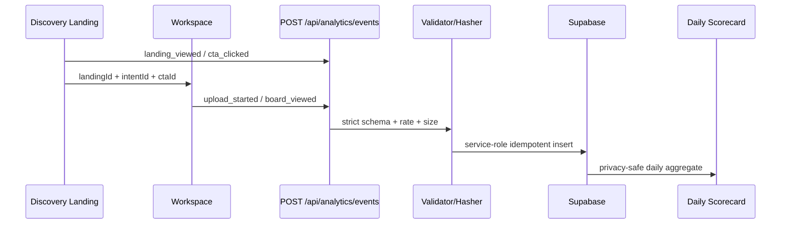

# P3. Trust & Funnel Measurement 상세 구현 계획

- 상태: planned
- 선행조건: P2 pilot, 개인정보·보존기간·service role 사용 승인
- 입력: C-04 evidence, CTA handoff, 현재 업로드·생성·결제 이벤트 가능 지점
- 출력: C-05, T-01, T-02, T-03, T-04, O-02
- 다음 Phase: [P4 Content Expansion & Operations](./phase-04-content-expansion-operations.md)

## 1. 목표와 비범위

랜딩부터 CTA, 업로드, 추천 보드까지 동일한 익명 유입 ID로 측정하고, 사진·prompt·email을 수집하지 않는 최소 퍼널을 만든다. 사진 처리·결과 한계·가격 표시는 기존 제품 정책 SSoT와 같은 버전을 참조한다.

비범위:

- 범용 사용자 행동 로그 또는 session replay
- 원본 이미지·image URL·prompt 저장
- 클라이언트의 Supabase 직접 insert
- 광고 attribution 플랫폼 또는 GA4 대체 프로젝트
- 이벤트를 이유로 생성·결제 계약 변경

## 2. 데이터 흐름



## 3. 변경 파일

| 작업 | 경로 | 변경 |
| --- | --- | --- |
| P3-W01 | `packages/shared/src/analytics/discovery-events.ts` | 이벤트 union·schema version |
| P3-W02 | `my-app/lib/analytics/discovery-event-schema.ts` | 서버 runtime validator |
| P3-W03 | `my-app/lib/analytics/discovery-session.ts` | 익명 ID·hash·handoff |
| P3-W04 | `my-app/lib/analytics/emit-discovery-event.ts` | client beacon/fetch wrapper |
| P3-W05 | `my-app/app/api/analytics/events/route.ts` | validate·rate limit·insert |
| P3-W06 | `my-app/supabase/migrations/*_discovery_funnel_events.sql` | table·constraint·aggregate·purge |
| P3-W07 | `my-app/components/discovery/*`, workspace 경계 | event trigger |
| P3-W08 | `docs/search-benchmark/policies/trust-policy-v1.md` | C-05 snapshot |
| P3-W09 | `docs/search-benchmark/runbooks/analytics-operations.md` | O-02 |
| P3-W10 | `docs/search-benchmark/scorecards/funnel-YYYY-MM-DD.md` | T-04 |

## 4. 이벤트 계약

허용 이벤트:

```ts
type DiscoveryEvent =
  | { eventName: "landing_viewed"; landingId: DiscoveryPageId; intentId: string }
  | { eventName: "sample_viewed"; landingId: DiscoveryPageId; sampleId: string }
  | { eventName: "cta_clicked"; landingId: DiscoveryPageId; ctaId: DiscoveryCtaId }
  | { eventName: "upload_started"; landingId?: DiscoveryPageId }
  | { eventName: "upload_validated"; landingId?: DiscoveryPageId }
  | { eventName: "board_viewed"; landingId?: DiscoveryPageId }
  | { eventName: "checkout_started"; landingId?: DiscoveryPageId };

interface DiscoveryEventEnvelope {
  eventId: string;
  schemaVersion: 1;
  occurredAt: string;
  anonymousSessionId: string;
  path: string;
  event: DiscoveryEvent;
  experimentAssignments?: Record<string, string>;
}
```

금지 필드:

- image, image URL, prompt, filename
- email, phone, display name, raw user ID
- 전체 referrer URL, query string, user agent 원문
- 자유형 metadata, 오류 stack, 생성 결과

서버는 알려진 필드만 허용하는 strict schema를 사용한다. path는 allowlist된 pathname만 받고 query를 제거한다. referrer는 필요한 경우 host만 normalize한다.

## 5. API 계약

`POST /api/analytics/events`:

| 조건 | 응답 |
| --- | --- |
| 정상 신규 event | `202 Accepted` |
| 같은 eventId 재전송 | `202 Accepted`, 집계 1회 |
| schema/enum/path 오류 | `400` |
| payload byte 초과 | `413` |
| rate limit | `429` |
| 저장소 일시 실패 | `503`, 제품 플로우는 계속 |

구현 순서:

1. request body byte limit을 parse 전에 적용
2. JSON과 schema를 검증
3. anonymous session ID를 서버 salt로 hash
4. path/referrer/device를 allowlist normalize
5. service role repository를 통해 idempotent insert
6. 운영 로그에는 eventId, eventName, status만 남김

클라이언트 emitter는 analytics 실패로 CTA navigation이나 upload를 차단하지 않는다. `sendBeacon` 실패 시 제한된 fetch fallback을 사용하되 무한 retry하지 않는다.

## 6. DB migration 계약

`product_funnel_events`는 [아티팩트 정의](../artifact-specification.md)의 최소 컬럼을 사용한다. migration에는 다음을 함께 포함한다.

- `event_id` primary key
- event name, device class, schema version check constraint
- 직접 사용자 insert/update/delete를 막는 RLS
- service role repository만 insert
- `occurred_at`과 `received_at`의 허용 시간 편차
- 일별 `discovery_funnel_daily` aggregate view 또는 materialized strategy
- raw event 90일 기본 purge 함수와 dry-run query
- 필요한 최소 index: received_at, event_name+occurred_at, landing_id+occurred_at

rollback은 데이터 유실을 자동 수행하지 않는다. 앱 writer feature flag를 끄고, 새 schema writer를 중단한 뒤 view/index를 역순 제거한다. table drop은 별도 승인이다.

## 7. Trust SSoT

C-05에 다음 정책을 versioned snapshot으로 기록한다.

- 업로드 원본 저장 여부·보존기간·삭제 트리거
- AI 결과가 실제 시술과 다를 수 있다는 한계
- 무료/포함 크레딧 표시는 `plan-benefit-display.ts`를 따른다는 계약
- 후기·수치의 evidence ID와 만료
- 정책 화면, upload, discovery에서 같은 `policyVersion`을 표시

정책과 실제 구현이 다르면 문구만 맞추지 않는다. P1 trust finding으로 등록하고 공개를 차단한다.

## 8. 작업 패키지와 rollout

### P3-W01. Contract test 우선

정상, unknown field, oversized, duplicate, invalid path, future timestamp, forbidden field fixture를 만든다. API와 shared type이 같은 fixture를 소비하게 한다.

### P3-W02. Shadow mode

writer는 켜되 제품 화면에는 scorecard를 의사결정 근거로 사용하지 않는다. 3~7일간 다음을 확인한다.

- 요청 대비 accepted 비율
- event별 누락·중복
- landing ID 연속성
- API latency/error
- raw row와 daily aggregate 일치

### P3-W03. Funnel 활성화

shadow 검증 후 T-04를 생성한다. 분모·분자, 기간, timezone, bot/internal traffic 제외 규칙, missing 상태를 기록한다.

## 9. 검증

```powershell
npm --prefix my-app run lint
npm run typecheck
npm --prefix my-app run build
npm --prefix my-app run search:discovery:audit
```

필수 smoke:

- 잘못된 event name/field/path/payload는 4xx
- 중복 eventId는 row·aggregate 1개
- DB direct anonymous insert 거부
- API 저장 실패 시 CTA와 upload 계속 동작
- landing→CTA→upload→board에서 landing ID 보존
- purge dry-run과 실제 대상 수가 일치
- sample payload·운영 로그에서 금지 필드 0건

## 10. 운영·장애·롤백

O-02에는 누락, 중복, 지연, schema mismatch, DB quota, salt rotation, purge 실패 대응을 정의한다. kill switch는 client emitter와 server writer를 각각 끌 수 있어야 한다. privacy incident가 의심되면 writer를 끄고 해당 field/source를 격리하며 삭제는 승인된 incident 절차로만 실행한다.

## 11. Exit Gate

- [ ] C-05 정책 버전이 discovery·upload·정책 화면에서 동일함
- [ ] strict contract와 forbidden field test 통과
- [ ] anonymous direct DB write가 거부됨
- [ ] idempotency·rate·size limit 검증
- [ ] landing ID 연속성이 end-to-end로 증명됨
- [ ] daily aggregate와 raw 표본이 일치함
- [ ] purge dry-run과 O-02 runbook이 검증됨
- [ ] T-04가 missing과 zero를 구분함
