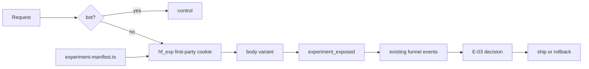

# P5. Experiment & Optimization 상세 구현 계획

- 상태: planned — landing contract tests 존재, discovery experiment runtime 미구현
- 선행조건: P3 계측 안정, P4 운영 체계, minimum sample 결정
- 입력: T-04 scorecard, 7페이지 registry, competitor snapshot
- 출력: E-01, E-02, E-03, 월별 T-04, 분기 O-03
- 다음 단계: 주기 운영 또는 새 P0 baseline

## 현재 구현 대조

- 현재 프리미엄 랜딩은 CTA·mobile·rolling Hero·motion·surface 계약 테스트를 가진다.
- 이 테스트는 회귀 기준이며 A/B assignment·exposure·판정 시스템은 아니다.
- `my-app/lib/experiments/discovery-experiment-manifest.ts`와 discovery exposure event는 존재하지 않는다.
- 증거: [2026-08-14 구현 대조 보고서](../current-implementation-alignment-2026-08-14.md)

## 1. 목표와 비범위

검색 metadata를 안정적으로 유지하면서 본문 전환 요소를 통제된 실험으로 개선한다. winner뿐 아니라 loser와 inconclusive도 기록하고 종료된 실험 코드를 제거한다.

비범위:

- title, canonical, H1의 사용자별 무작위 변경
- 표본·기간 없이 winner 선언
- 봇·크롤러에 treatment 제공
- 실험을 이유로 privacy·성능 guardrail 무시
- 서로 다른 여러 요소를 한 실험에서 동시에 변경

## 2. 아키텍처



metadata, canonical, JSON-LD, status code는 variant 이전의 registry에서 생성한다. 실험은 CTA label, sample 순서, trust summary 위치처럼 본문 컴포넌트 slot만 바꾼다.

## 3. 변경 파일

| 작업 | 경로 | 변경 |
| --- | --- | --- |
| P5-W01 | `my-app/lib/experiments/discovery-experiment-types.ts` | brief·variant·assignment 타입 |
| P5-W02 | `my-app/lib/experiments/discovery-experiment-manifest.ts` | 활성 실험 SSoT |
| P5-W03 | `my-app/lib/experiments/assign-discovery-variant.ts` | bot·cookie·deterministic assignment |
| P5-W04 | `my-app/components/discovery/ExperimentSlot.tsx` | 허용 slot 렌더링 |
| P5-W05 | `packages/shared/src/analytics/discovery-events.ts` | exposure 이벤트 |
| P5-W06 | `docs/search-benchmark/experiments/EXP-*/brief.yaml` | E-01 |
| P5-W07 | `docs/search-benchmark/experiments/EXP-*/assignment.yaml` | E-02 |
| P5-W08 | `docs/search-benchmark/experiments/EXP-*/decision.md` | E-03 |
| P5-W09 | `docs/search-benchmark/evidence/quarterly-benchmark-*.md` | O-03 |

## 4. 실험 manifest 계약

```ts
interface DiscoveryExperiment {
  id: `EXP-DISCOVERY-${number}`;
  status: "draft" | "running" | "paused" | "completed";
  slot: "hero-order" | "primary-cta-label" | "trust-position";
  pageIds: readonly DiscoveryPageId[];
  audience: { devices?: readonly DeviceClass[] };
  allocation: { control: number; treatment: number };
  startsAt: string;
  endsAt: string;
  variants: { control: string; treatment: string };
  primaryMetric: string;
  guardrails: readonly string[];
  minimumSample: number;
  rollbackVariant: "control";
}
```

invariant:

- allocation 합은 100
- 한 page/slot에는 running 실험 하나
- 종료일 없는 running 실험 금지
- metric은 T-01 taxonomy에 존재
- treatment component는 manifest allowlist에 존재
- metadata/canonical/H1 slot은 타입 단계에서 허용하지 않음

## 5. 할당·cookie·bot 계약

- `hf_exp`는 실험 ID와 variant만 저장하고 개인 식별자를 포함하지 않음
- assignment는 안정된 익명 session hash로 deterministic
- cookie는 `SameSite=Lax`, `Secure`, 최소 경로·만료 사용
- 알려진 crawler와 사전 렌더링은 control
- cookie parse 실패, unknown experiment, expired assignment는 control
- 실험 시작 전 사용자에게 보여지지 않은 assignment는 exposure가 아님

`experiment_exposed`는 variant가 실제 viewport 대상 컴포넌트 렌더 경로에 들어갔을 때 한 세션·실험당 한 번 기록한다.

## 6. 첫 실험 작업 패키지

EXP-DISCOVERY-001 기본안:

- 가설: sample-first 순서가 qualified board view를 늘린다.
- 대상: D-AI-SIM, D-MEN, D-WOMEN mobile
- control: 현재 Hero→CTA→sample
- treatment: Hero→sample preview→CTA
- primary: `preview_board_viewed / landing_viewed`
- guardrails: mobile LCP, upload validation failure, generation failure
- maximum duration: 42일
- stop: privacy incident, P0 render, 승인 임계치 이상의 LCP 회귀

실행 순서:

1. E-01의 가설·단일 변경·표본·기간·중단 조건 승인
2. A/A 또는 assignment smoke로 exposure 누락 확인
3. 5% 내부/제한 traffic
4. 50/50 본 실험
5. anomaly와 guardrail 일일 점검
6. 기간 종료 후 E-03 작성
7. ship/rollback/repeat 후 manifest와 dead code 정리

## 7. 판정 계약

E-03은 다음을 반드시 포함한다.

- 실제 시작/종료, 포함·제외 조건
- variant별 landing·exposure·outcome 표본
- primary metric 차이와 confidence interval
- guardrail과 instrumentation anomaly
- `winner`, `loser`, `inconclusive` 중 하나
- practical significance와 제품 해석
- ship, rollback, repeat 결정
- 반영 commit과 제거할 실험 코드 기한

최소 표본 전에는 방향성 메모만 가능하며 winner로 표시하지 않는다. 여러 페이지를 묶은 경우 전체와 page별 이질성을 모두 확인한다.

## 8. 검증

- bot fixture는 항상 control
- assignment deterministic·allocation 경계 test
- expired/unknown/corrupt cookie는 control
- canonical, title, description, JSON-LD snapshot이 variant 간 동일
- exposure 없이 outcome만 있는 세션 비율 monitor
- 한 세션·실험 exposure 중복 방지
- kill switch 후 모든 요청 control
- mobile/desktop control·treatment Browser Gate
- treatment의 performance budget 비교

## 9. 운영 주기

| 주기 | 작업 | 결정 아티팩트 |
| --- | --- | --- |
| 매주 | Search Console·퍼널·event health | T-04 weekly scorecard |
| 매월 | intent/page 성과, 실험 backlog | monthly decision |
| 분기 | 경쟁사 공개 표면 재관찰 | O-03 snapshot |
| catalog 회전 후 | 새로운 콘텐츠 후보 평가 | candidate report |

변경이 없더라도 `no-change`와 근거를 기록한다. 분기 snapshot에서 발견한 패턴은 자동 구현하지 않고 adopt/reject/defer 결정을 남긴다.

## 10. 롤백과 정리

즉시 롤백은 manifest status를 `paused`로 바꾸고 control을 제공한다. 코드 삭제는 관찰 기간 후 별도 change set으로 수행한다. experiment cookie의 만료 entry를 무시하고 다음 응답에서 정리한다. guardrail 사고는 실험만 끄며 제품 계측 전체를 임의로 삭제하지 않는다.

## 11. Exit Gate

- [ ] E-01에 단일 가설·표본·기간·중단 조건이 있음
- [ ] bot은 항상 control이며 metadata가 variant 간 동일함
- [ ] exposure·outcome attribution과 중복 방지가 검증됨
- [ ] guardrail monitor와 kill switch가 동작함
- [ ] E-03에 inconclusive 포함 명시적 판정이 있음
- [ ] winner ship 또는 loser rollback이 registry에 반영됨
- [ ] 종료 실험 manifest·cookie·dead code 정리 기한이 있음
- [ ] 다음 분기 O-03 또는 새 P0 baseline 날짜가 지정됨
