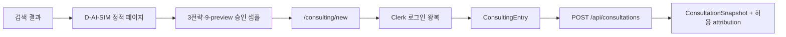
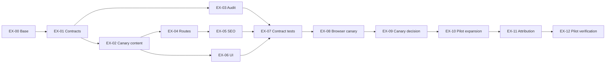

# 검색 유입 페이지 구체 구현 실행 계획

- 작성일: 2026-08-14
- 상태: planned
- 구현 대상: Next.js 16 App Router 기반 `/discover` 검색 유입 표면
- 1차 canary: `D-AI-SIM` / `/discover/ai-hairstyle-simulation`
- 기본 CTA: `/consulting/new`
- 기준 구현: `feat/2026-08-12-premium-landing-refactor@e86e40d`
- 상위 설계: [검색 유입 페이지 구현 가이드](../search-entry-page-implementation-guide.md)
- 관련 Phase: [P1 Search Surface Foundation](./phase-01-search-surface-foundation.md), [P2 Pilot Content & Sample Experience](./phase-02-pilot-content-sample-experience.md)

## 1. 목표

이 문서는 검색 유입 페이지를 실제 코드로 옮길 때 작업자가 순서대로 실행할 수 있는 티켓 수준 계획이다. 각 티켓은 입력, 변경 파일, 구현 절차, 테스트, 완료 조건을 가진다.

최종 사용자 흐름은 다음과 같다.



구현이 끝났다는 판정은 파일 생성이 아니라 정적 build, 등록되지 않은 slug 404, metadata·JSON-LD·sitemap 정합성, 브라우저 접근성, CTA 왕복, 기존 홈·컨설팅 회귀가 모두 검증됐을 때만 내린다.

## 2. 구현 전 고정 결정과 확인사항

### 2.1 고정 결정

| 항목 | 결정 |
| --- | --- |
| URL namespace | `/discover` |
| 렌더링 | Server Component 중심 정적 생성 |
| 동적 slug | `generateStaticParams`, `dynamicParams = false` |
| 콘텐츠 정본 | `my-app/lib/discovery/discovery-pages.ts` |
| 공개 조건 | `status === "published"`이며 승인 sample/evidence 존재 |
| 첫 공개 | `D-AI-SIM` 한 개 |
| 실제 업로드 | 검색 페이지에 넣지 않음 |
| CTA | `/consulting/new` |
| 인증 | CTA 이후 기존 Clerk 흐름 사용 |
| 상담 정본 | 서버 `ConsultationSnapshot` |
| 이미지 | `public/discovery/*`와 `next/image` |
| 검색 계측 DB | P3 전에는 구현하지 않음 |

### 2.2 구현 시작 전 confirmation-needed

현재 premium landing 기준 커밋 `e86e40d`는 `main`이 아니라 feature branch에 있다. 실제 코드 구현 전에 다음 중 하나가 확정돼야 한다.

1. premium landing 결과가 포함된 `develop/*`를 검색 구현의 통합 대상으로 지정한다.
2. premium landing이 다른 integration branch에 반영된 후 그 commit을 사용한다.
3. 검색 구현에서 premium landing 의존을 제거하고 `main` 기준으로 다시 설계한다.

권장안은 premium landing 결과를 포함한 `develop/2026-08-14-search-discovery`를 명시적으로 만든 뒤, 아래 두 feature branch를 그 브랜치에서 시작하는 것이다.

```text
develop/2026-08-14-search-discovery
  ├─ feat/2026-08-14-search-discovery-canary
  └─ feat/2026-08-14-search-discovery-pilot
```

이 브랜치 구조는 구현 시작 시 `git_preflight.py`로 실제 ref·SHA·ancestry를 다시 확인한다. 이 문서 작성은 브랜치 생성, merge, push, 배포를 수행하지 않는다.

## 3. PR과 의존성



| PR | 티켓 | 산출물 |
| --- | --- | --- |
| PR-1 Foundation Canary | EX-00~EX-09 | D-AI-SIM 정적 검색 페이지, 승인 9-preview, audit·browser 증거 |
| PR-2 Pilot Experience | EX-10~EX-12 | D-FACE·D-MEN·D-WOMEN, 상호작용, CTA attribution |
| P3 후속 | 이벤트·DB 티켓 | landing view부터 product funnel까지 집계 |

## 4. PR-1 Foundation Canary

### EX-00. 구현 기준과 기준선 고정

**목적**

코드 구현이 어떤 commit과 제품 계약을 기준으로 하는지 고정한다.

**입력**

- premium landing commit과 실제 integration target
- B-00 검색·퍼널 기준선
- B-02 intent map의 `D-AI-SIM`
- 승인 가능한 샘플 자산 후보

**작업**

1. `git_preflight.py`에 work branch와 integration target을 모두 전달한다.
2. target SHA, fork point, worktree path를 구현 티켓에 기록한다.
3. `D-AI-SIM`의 title, H1, description, CTA, proof, FAQ를 C-02 message map으로 확정한다.
4. 샘플 원본·9개 preview·OG 이미지를 C-03 manifest 후보로 기록한다.
5. 3전략·9-preview·최대 3 shortlist·최소 2 compare·Salon Brief 주장을 C-04 evidence에 연결한다.

**변경 파일**

```text
docs/search-benchmark/evidence/baseline-YYYY-MM-DD.md
docs/search-benchmark/evidence/intent-map.yaml
docs/search-benchmark/content/message-map.yaml
```

**완료 조건**

- [ ] integration target과 exact SHA가 한 개로 확정됨
- [ ] `D-AI-SIM` primary intent가 다른 페이지와 겹치지 않음
- [ ] 빈 값은 `missing`으로 기록되고 추정 수치가 없음
- [ ] 샘플 권리·출처 검토 담당자가 지정됨

### EX-01. 타입·레지스트리·조회 함수

**목적**

route, metadata, sitemap, audit이 공유하는 콘텐츠 정본을 먼저 만든다.

**신규 파일**

```text
my-app/lib/discovery/types.ts
my-app/lib/discovery/discovery-pages.ts
my-app/lib/discovery/discovery-pages.test.ts
```

**구현 절차**

1. `DiscoveryPageId`, `DiscoveryStatus`, `DiscoveryPageDefinition`, `DiscoverySection`, `DiscoveryFaq`, `DiscoveryCta`를 정의한다.
2. `DiscoverySection`은 `workflow | proof | trust | faq | related` 판별 union으로 만든다.
3. 레지스트리는 `satisfies readonly DiscoveryPageDefinition[]`로 선언한다.
4. 다음 순수 함수를 구현한다.

```ts
getDiscoveryPageById(id)
getDiscoveryPageBySlug(slug)
getPublishedDiscoveryPages()
getRelatedDiscoveryPages(page)
```

5. lookup은 입력을 소문자화하거나 trim하지 않는다. 등록되지 않은 입력은 `undefined`다.
6. `published` 필터 외의 공개 판단을 route·sitemap에서 반복하지 않는다.

**단위 테스트**

- 정상 slug·ID lookup
- 미등록 slug는 `undefined`
- `draft`, `review`, `retired`는 published 목록에서 제외
- slug, ID, canonical 중복 fixture 실패
- published page의 CTA가 `/consulting/new`가 아니면 실패
- related self-link와 비공개 related link 실패
- `updatedAt` invalid ISO date 실패

**완료 조건**

- [ ] 레지스트리 함수가 filesystem, request, cookie, DB에 의존하지 않음
- [ ] Server→Client 전달 가능한 plain object만 포함
- [ ] 모든 invariant가 unit test로 재현됨

### EX-02. Canary sample·evidence·copy

**목적**

빈 SEO 골격이 아닌 유용한 `D-AI-SIM` 페이지를 만들 수 있도록 승인된 정적 증거를 준비한다.

**신규 파일**

```text
my-app/lib/discovery/sample-manifests.ts
my-app/lib/discovery/evidence-registry.ts
my-app/lib/discovery/sample-manifests.test.ts
my-app/public/discovery/ai-hairstyle-simulation/source.webp
my-app/public/discovery/ai-hairstyle-simulation/balance-01.webp
my-app/public/discovery/ai-hairstyle-simulation/balance-02.webp
my-app/public/discovery/ai-hairstyle-simulation/balance-03.webp
my-app/public/discovery/ai-hairstyle-simulation/image-01.webp
my-app/public/discovery/ai-hairstyle-simulation/image-02.webp
my-app/public/discovery/ai-hairstyle-simulation/image-03.webp
my-app/public/discovery/ai-hairstyle-simulation/lifestyle-01.webp
my-app/public/discovery/ai-hairstyle-simulation/lifestyle-02.webp
my-app/public/discovery/ai-hairstyle-simulation/lifestyle-03.webp
my-app/public/discovery/ai-hairstyle-simulation/og.webp
```

파일명은 예상 계약이며 실제 승인 자산의 포맷과 ID를 manifest에 기록한다. 기존 홈의 16명 rolling media를 그대로 복사하지 않는다.

**구현 절차**

1. sample manifest에 source type, license reference, consent reference, width, height, bytes, alt, crop, status를 기록한다.
2. grid는 `BALANCE`, `IMAGE`, `LIFESTYLE` 각각 정확히 3개로 제한한다.
3. evidence registry에 statement, source ref, verified date, owner, expiry를 기록한다.
4. `D-AI-SIM` copy는 다음 message map을 사용한다.

```yaml
title: AI 헤어스타일 시뮬레이션, 9가지 후보 비교 | HairFit
h1: AI 헤어스타일 시뮬레이션, 한 장에서 9가지 후보 비교
support: 세 가지 스타일 방향을 같은 기준에서 비교하고, 마음에 드는 후보를 골라 미용실 상담 자료까지 이어갑니다.
primary_cta: 프라이빗 AI 컨설팅 시작
primary_cta_href: /consulting/new
```

5. 실제 시술 동일, 100% 어울림, 실패 없음, 근거 없는 정확도 표현을 금지한다.
6. 사진 보관·삭제, 무료 횟수, 가격은 verified policy ID 없이는 넣지 않는다.

**테스트**

- source 1개, grid 9개, OG 1개
- 모든 asset path 실제 존재
- width·height·alt·bytes 누락 실패
- expired/revoked asset 참조 실패
- verified가 아닌 evidence를 published page가 참조하면 실패

**완료 조건**

- [ ] C-03/C-04 canary subset 승인
- [ ] 원본과 9-preview의 인물·권리 연결 확인
- [ ] 페이지의 모든 product claim에 evidence ID 존재

### EX-03. 정적 감사기와 package script

**목적**

콘텐츠 오류를 build 이전에 빠르게 차단한다.

**신규·변경 파일**

```text
my-app/scripts/audit-search-discovery.mjs
my-app/package.json
package.json
```

**명령 계약**

```powershell
npm --prefix my-app run search:discovery:audit
npm --prefix my-app run search:discovery:contract:test
```

root `package.json`에도 같은 명령을 전달하는 proxy script를 추가한다.

**감사 항목**

1. ID·slug·canonical unique
2. published 필수값 완비
3. canonical과 slug 일치
4. title·H1·FAQ fingerprint 중복 경고
5. sample/evidence dangling reference
6. asset path·dimension·byte budget
7. related self-link·비공개 link·orphan
8. CTA allowlist
9. forbidden claim
10. sitemap 대상과 published registry 일치

**출력**

- console summary
- `artifacts/search-discovery/audit-report.json`
- finding마다 `id`, `priority`, `area`, `message`, `evidence`, `fix`

**완료 조건**

- [ ] 정상 registry exit code 0
- [ ] 각 invalid fixture exit code non-zero
- [ ] P0/P1 finding이 있으면 공개 차단

### EX-04. Hub와 정적 detail route

**신규 파일**

```text
my-app/app/(marketing)/discover/page.tsx
my-app/app/(marketing)/discover/[slug]/page.tsx
my-app/app/(marketing)/discover/[slug]/not-found.tsx
```

**구현 절차**

1. hub는 `getPublishedDiscoveryPages()`만 사용한다.
2. detail route에 `dynamicParams = false`를 선언한다.
3. `generateStaticParams()`는 published slug만 반환한다.
4. Next.js 16 계약에 따라 `params: Promise<{ slug: string }>`를 await한다.
5. lookup 실패 또는 비공개 상태이면 `notFound()`를 호출한다.
6. route에서 `auth()`, `cookies()`, `headers()`, Supabase, 동적 FAQ를 호출하지 않는다.
7. route는 Server Component를 유지한다.

**테스트**

- `/discover` 200
- `/discover/ai-hairstyle-simulation` 200
- `/discover/not-registered` 404
- review fixture는 hub와 정적 params에 없음
- 비로그인과 로그인 상태가 같은 공개 본문을 반환

**완료 조건**

- [ ] canary가 build output에 정적 route로 생성됨
- [ ] 미등록 slug가 fallback page를 생성하지 않음
- [ ] route에 request-time dependency가 없음

### EX-05. Metadata·JSON-LD·sitemap·robots

**신규·변경 파일**

```text
my-app/lib/discovery/metadata.ts
my-app/lib/discovery/json-ld.ts
my-app/lib/discovery/metadata.test.ts
my-app/app/sitemap.ts
my-app/app/robots.ts
```

**구현 절차**

1. `generateMetadata()`는 Server Component detail route에 둔다.
2. registry의 title, description, canonical, Open Graph, robots만 사용한다.
3. `getSiteUrl()`을 origin 정본으로 사용한다.
4. `json-ld.ts`는 `WebPage`와 화면 FAQ 배열 기반 `FAQPage`를 만든다.
5. JSON-LD serializer는 `<`를 `\u003c`로 escape한다.
6. sitemap은 기존 URL을 보존하고 published discovery만 추가한다.
7. discovery `lastModified`는 registry `updatedAt`을 사용한다.
8. 기존 정적 URL의 실제 변경일을 모르면 매 build 시각 대신 `lastModified`를 생략한다.
9. robots는 `/discover`를 허용하며 별도 review preview route를 만들지 않는다.

**금지**

- Client Component에서 metadata export
- 화면에 없는 FAQ JSON-LD
- 검증되지 않은 rating·price·review
- query별 canonical
- 모든 build에서 `new Date()`로 discovery lastModified 갱신

**테스트**

- canonical absolute URL과 path 일치
- Open Graph title·description 일치
- visible FAQ와 JSON-LD deep equality
- draft/review/retired sitemap 제외
- sitemap URL unique

**완료 조건**

- [ ] view-source에서 canonical과 JSON-LD 확인 가능
- [ ] sitemap entry와 registry `updatedAt`이 일치
- [ ] metadata·JSON-LD·sitemap이 같은 published selector를 사용

### EX-06. 정적 UI와 스타일

**신규 파일**

```text
my-app/components/discovery/DiscoveryPageTemplate.tsx
my-app/components/discovery/DiscoveryHero.tsx
my-app/components/discovery/SampleComparison.tsx
my-app/components/discovery/TrustSummary.tsx
my-app/components/discovery/RelatedDiscoveryPages.tsx
my-app/components/discovery/DiscoveryPage.module.css
```

**컴포넌트 경계**

| 컴포넌트 | Server/Client | 책임 |
| --- | --- | --- |
| `DiscoveryPageTemplate` | Server | 섹션 순서, JSON-LD, 공통 레이아웃 |
| `DiscoveryHero` | Server | HairFit 정체성, H1, support, CTA, 다음 섹션 힌트 |
| `SampleComparison` PR-1 | Server | 세 전략과 9-preview 정적 grid |
| `TrustSummary` | Server | 검증된 결과 한계·사진 정책·과금 근거 |
| `RelatedDiscoveryPages` | Server | published page의 `next/link` 내부 링크 |

**구현 절차**

1. Hero → sample → workflow → proof → trust → related → FAQ → final CTA 순서를 사용한다.
2. 기존 `LandingScene`과 token을 재사용하되 `PremiumConsultingShowcases` 전체를 import하지 않는다.
3. `DiscoveryPage.module.css`에 discovery 전용 grid·hero·trust 규칙만 둔다.
4. 기존 `landing.css` selector를 수정할 경우 영향을 받는 홈 컴포넌트를 목록화한다.
5. `next/image`를 사용하고 모든 이미지에 실제 width·height 또는 `fill + sizes`를 제공한다.
6. 첫 viewport LCP 후보 하나만 우선 로드한다.
7. 9-preview는 viewport 밖에서 lazy load한다.
8. PR-1에는 client state를 만들지 않는다. 모든 핵심 내용은 JS 없이 보인다.

**디자인 계약**

- 첫 viewport에 제품명, 대상 사용자 문제, 구체적 결과, primary CTA, 다음 섹션 힌트
- 2~3 brand color와 neutral, 기존 radius·shadow token 재사용
- 중첩 card 금지
- mobile CTA overflow 금지
- motion이 없어도 정보 손실 없음

**완료 조건**

- [ ] H1은 페이지당 한 개
- [ ] CTA가 화면과 키보드 순서에서 명확함
- [ ] 모든 이미지 alt가 기능과 결과를 설명함
- [ ] 홈 16명 rolling Hero와 scene CSS가 변하지 않음

### EX-07. Contract test와 회귀 게이트

**신규·변경 파일**

```text
my-app/lib/discovery/discovery-contract.test.ts
my-app/package.json
```

**신규 script**

```json
{
  "search:discovery:contract:test": "node --no-warnings --test lib/discovery/*.test.ts"
}
```

**신규 contract test**

- route가 `generateStaticParams`, `dynamicParams = false`, `notFound()`를 가짐
- detail route가 registry를 통해 definition을 읽음
- metadata와 sitemap이 같은 published selector를 사용
- CTA target이 `/consulting/new`
- D-AI-SIM은 3 strategy·9 asset을 가짐
- forbidden claims가 source와 registry에 없음
- Server Component 파일에 불필요한 `use client`가 없음

**필수 회귀 명령**

```powershell
npm --prefix my-app run search:discovery:contract:test
npm --prefix my-app run search:discovery:audit
npm --prefix my-app run landing-premium:contract:test
npm --prefix my-app run landing-hero:contract:test
npm --prefix my-app run landing-motion:contract:test
npm --prefix my-app run landing-flat-surface:contract:test
npm --prefix my-app run web-image:contract:test
npm --prefix my-app run lint
npm run typecheck
npm --prefix my-app run build
```

`consulting:contract:test`는 현재 기준에서 알려진 2개 제한이 있으므로 재실행하되, 기존 실패와 신규 regression을 분리해 기록한다. 기존 실패를 검색 구현 성공으로 숨기거나 전체 pass로 표시하지 않는다.

**완료 조건**

- [ ] 신규 discovery contract·audit 모두 통과
- [ ] 기존 landing 16개 contract test 통과
- [ ] lint·typecheck·build 통과
- [ ] consulting 결과가 기준선보다 악화되지 않음

### EX-08. Browser·접근성·성능 검증

**신규 파일**

```text
tests/web-e2e/search-discovery.spec.ts
tests/web-e2e/__screenshots__/search-discovery.spec.ts/*
artifacts/search-discovery/browser-report.md
artifacts/search-discovery/performance-report.md
```

**Playwright 시나리오**

1. canary의 title, H1, CTA, 9개 preview가 보인다.
2. CTA href가 `/consulting/new`다.
3. skip link 후 `#main-content`에 focus가 간다.
4. axe serious/critical violation이 없다.
5. 360×800, 390×844, 768×1024, 1440×900에서 horizontal overflow가 없다.
6. JS를 차단해도 H1, 첫 sample, CTA, FAQ가 보인다.
7. 이미지 실패 시 고정 크기와 alt가 유지된다.
8. `/discover/not-registered`는 404다.

**성능 기록**

| 지표 | 목표 |
| --- | --- |
| mobile LCP | 2.5초 이하 |
| CLS | 0.1 이하 |
| INP | 200ms 이하 |
| Hero priority image | 1개 |
| client JS | PR 전후 증분 기록 |
| image bytes | manifest 합계와 첫 viewport 합계 기록 |

목표를 넘으면 환경, 원인, owner, 완화책, 재검증일을 보고서에 남긴다. 다른 환경의 수치를 직접 비교하지 않는다.

**완료 조건**

- [ ] 필수 viewport screenshot과 overflow 결과 존재
- [ ] axe serious/critical 0건
- [ ] console·asset P0/P1 0건
- [ ] 성능 수치와 측정 환경이 보고서에 기록됨

### EX-09. Canary 공개 결정

**산출물**

```text
docs/search-benchmark/releases/release-readiness-D-AI-SIM.md
```

**완료 조건**

- [ ] P0/P1 finding 0건
- [ ] content·sample·evidence 승인
- [ ] static build·404·canonical·JSON-LD·sitemap 통과
- [ ] Browser Gate 통과
- [ ] Performance Gate 통과 또는 승인된 P2 예외
- [ ] home·consulting regression 없음
- [ ] `published` 전환 commit이 식별됨

조건이 부족하면 `status: review`를 유지한다. 이 상태에서는 hub, params, sitemap에서 제외한다.

## 5. PR-2 Pilot Experience

### EX-10. 3개 pilot 확장과 sample 상호작용

**대상**

- `D-FACE` / `/discover/face-shape-hairstyle`
- `D-MEN` / `/discover/men-hairstyle-simulation`
- `D-WOMEN` / `/discover/women-hairstyle-simulation`

**구현 절차**

1. 각 페이지에 고유 audience, problem, outcome, proof, CTA, FAQ를 작성한다.
2. 각 페이지에 별도 승인 sample/evidence를 연결한다.
3. slug만 바꾼 동일 H1·본문·FAQ는 audit에서 차단한다.
4. `SampleComparison`에만 `use client`를 추가한다.
5. Server Component가 serializable한 sample DTO를 전달한다.
6. tablist에 `aria-selected`, ArrowLeft/Right, Home/End 키보드 이동을 구현한다.
7. reduced-motion에서는 자동 전환을 실행하지 않는다.
8. 페이지마다 2개 이상의 related published link를 제공한다.

**완료 조건**

- [ ] 4개 페이지 fingerprint가 고유함
- [ ] 모든 tab이 키보드로 선택됨
- [ ] JS 실패 시 첫 전략과 CTA가 남음
- [ ] related graph orphan 0개

### EX-11. CTA source handoff와 ConsultationSnapshot 연결

**목적**

검색 source를 허용된 ID만 사용해 로그인 왕복과 상담 생성까지 보존한다.

**신규·변경 파일**

```text
my-app/lib/discovery/handoff.ts
my-app/lib/discovery/handoff.test.ts
my-app/app/consulting/new/page.tsx
my-app/components/consulting/ConsultingEntry.tsx
my-app/app/api/consultations/route.ts
my-app/lib/consulting/defaults.ts
my-app/lib/consulting/server-store.ts
packages/shared/src/consulting/contract.ts
```

**전달 계약**

```ts
interface DiscoveryHandoff {
  landingId: DiscoveryPageId;
  intentId: string;
  ctaId: "hero-primary" | "sample-primary" | "final-primary";
  sampleId?: string;
}
```

**구현 절차**

1. CTA URL은 `/consulting/new`에 허용 ID query만 추가한다.
2. `handoff.ts`가 `searchParams`를 registry와 allowlist로 검증한다.
3. 잘못된 값은 저장하지 않고 기본 `/consulting/new` 흐름을 계속한다.
4. 비로그인 사용자의 `buildSignInRedirectUrl()`에는 검증된 return path만 전달한다.
5. 로그인 후 `NewConsultationPage`가 검증된 handoff plain object를 `ConsultingEntry`에 전달한다.
6. `ConsultingEntry`의 POST body에 handoff를 포함한다.
7. `/api/consultations`가 서버에서 다시 검증한다.
8. `ConsultationSnapshot`에 optional acquisition field를 additive하게 저장한다.
9. 이미 존재하는 latest session을 여는 동작은 과거 acquisition을 덮어쓰지 않는다.
10. feature flag OFF에서는 legacy `/workspace` return path에 허용 ID만 유지하고, legacy가 source를 소비하지 못하면 `not-recorded-legacy`를 명시적으로 기록한다.

**개인정보 금지**

- 검색어 원문
- referrer 전체
- prompt
- 이미지 URL·파일명
- 이메일·Clerk user ID
- 임의 query field

**테스트**

- valid handoff parse/serialize round trip
- unknown page·intent·cta 제거
- duplicate query는 첫 allowlisted scalar만 사용
- login redirect 이후 handoff 복원
- API가 client 검증을 신뢰하지 않고 재검증
- 새 snapshot acquisition 저장
- latest snapshot acquisition 불변
- feature flag OFF의 명시적 legacy 판정

P3 이벤트 저장소가 추가되기 전까지 이 필드는 attribution transport 정본이지 퍼널 분석 완료 증거가 아니다.

**완료 조건**

- [ ] 허용 ID만 로그인 왕복 후 복원됨
- [ ] 신규 session의 optional acquisition에 source가 저장됨
- [ ] 기존 session acquisition을 덮어쓰지 않음
- [ ] legacy 미저장 상태를 성공으로 오인하지 않음

### EX-12. Pilot 전체 검증과 인계

**필수 명령**

```powershell
npm --prefix my-app run search:discovery:contract:test
npm --prefix my-app run search:discovery:audit
npm --prefix my-app run consulting:contract:test
npm --prefix my-app run landing-premium:contract:test
npm --prefix my-app run landing-hero:contract:test
npm --prefix my-app run landing-motion:contract:test
npm --prefix my-app run landing-flat-surface:contract:test
npm --prefix my-app run web-image:contract:test
npm run component-registry:validate
npm --prefix my-app run lint
npm run typecheck
npm --prefix my-app run build
npm run web:e2e -- tests/web-e2e/search-discovery.spec.ts
```

**인계 산출물**

- 4개 page별 message map
- sample/evidence approval record
- audit JSON
- browser screenshots·axe 결과
- performance report
- CTA handoff contract test 결과
- 기존 known failure와 신규 regression 분리표
- Q-04 공개 승인 또는 보류 결정

**완료 조건**

- [ ] 4개 published 후보가 모든 Phase Gate를 만족하거나 review로 차단됨
- [ ] P0/P1 finding 0건
- [ ] 인계 산출물에 commit·명령·스크린샷 경로가 연결됨
- [ ] 다음 Phase의 첫 행동이 한 개로 지정됨

## 6. 파일별 구현 순서

| 순서 | 파일 | 먼저 만드는 이유 |
| --- | --- | --- |
| 1 | `lib/discovery/types.ts` | 모든 소비자의 compile-time 계약 |
| 2 | `discovery-pages.ts` | route·metadata·sitemap의 정본 |
| 3 | `sample-manifests.ts`, `evidence-registry.ts` | 공개 가능 여부를 먼저 결정 |
| 4 | `*.test.ts`, audit script | 잘못된 콘텐츠를 UI 전에 차단 |
| 5 | hub·detail route | 정적 route와 404 검증 |
| 6 | metadata·JSON-LD·sitemap | 검색 표면 완성 |
| 7 | discovery components·CSS | 승인 데이터만 렌더링 |
| 8 | Playwright | 실제 viewport·접근성 검증 |
| 9 | handoff·consulting contract | 공개 표면 안정화 후 제품 연결 |

## 7. 권장 commit 분할

| Commit | 범위 | 예시 메시지 |
| --- | --- | --- |
| 1 | types, registry, unit tests | `feat: 검색 페이지 레지스트리 계약 추가` |
| 2 | sample/evidence, audit | `feat: 검색 canary 증거 검증 추가` |
| 3 | routes, metadata, sitemap | `feat: 검색 유입 정적 라우트 추가` |
| 4 | UI, CSS, images | `feat: 검색 canary 샘플 경험 구현` |
| 5 | browser tests, reports | `test: 검색 유입 브라우저 게이트 추가` |
| 6 | pilot pages, handoff | `feat: 검색 pilot와 상담 source 연결` |

각 commit 전 해당 범위의 빠른 테스트를 실행하고, PR 전 전체 게이트를 실행한다. squash는 사용자가 요청하지 않으면 수행하지 않는다.

## 8. Rollback 단위

| 문제 | 조치 |
| --- | --- |
| copy·evidence 미승인 | page를 `review`로 유지 |
| sample revoke | 승인 fallback manifest 교체, 없으면 공개 차단 |
| metadata·sitemap 오류 | page를 review로 내려 sitemap에서 제거 |
| UI 회귀 | discovery component/CSS만 되돌리고 registry 보존 |
| CTA handoff 오류 | query 없는 직접 `/consulting/new` 링크로 복귀 |
| consulting regression | acquisition optional field 소비를 중단하고 기존 snapshot 읽기 유지 |
| 이미 색인된 URL retire | Q-04에서 noindex 또는 permanent redirect 결정 |

rollback은 데이터·브랜치 삭제가 아니라 상태 전환과 additive contract 비활성화를 우선한다.

## 9. 전체 Definition of Done

- [ ] exact base·integration target·fork point 기록
- [ ] D-AI-SIM과 3개 pilot의 고유 message map
- [ ] published-only hub·params·sitemap·related graph
- [ ] 미등록·비공개 slug 404
- [ ] visible FAQ와 JSON-LD 동일
- [ ] 승인된 sample/evidence만 공개
- [ ] 360·390·768·1440 Browser Gate
- [ ] axe serious/critical 0건
- [ ] LCP·CLS·INP·JS·image budget 기록
- [ ] CTA source가 login과 새 ConsultationSnapshot 생성까지 보존
- [ ] PII·검색어·이미지 정보 저장 0건
- [ ] home landing 16개 기존 contract test 통과
- [ ] consulting known failure와 신규 regression 분리
- [ ] lint·typecheck·build 통과
- [ ] Q-04에 공개 또는 보류 결정

## 10. 다음 행동

`EX-00: premium landing 결과를 포함할 정확한 develop integration target을 확정하고, D-AI-SIM message map과 canary sample 승인 담당자를 지정한다.`
