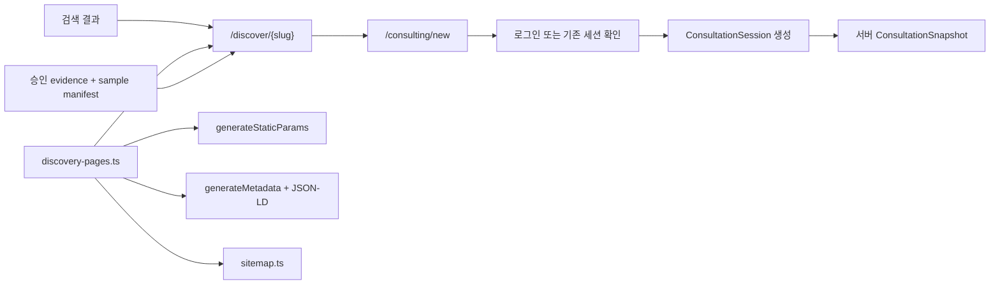

# 검색 유입 페이지 구현 가이드

- 작성일: 2026-08-14
- 구현 상태: full-surface locally complete — 7개 페이지·고유 artifact 구현·검증 완료, attribution·외부 공개 미완료
- 구현 기준: `feat/2026-08-12-premium-landing-refactor@e86e40d`
- 선행 문서: [아키텍처](./architecture.md), [P1 상세 계획](./implementation-plan/phase-01-search-surface-foundation.md), [P2 상세 계획](./implementation-plan/phase-02-pilot-content-sample-experience.md)
- 실행 티켓: [검색 유입 페이지 구체 구현 실행 계획](./implementation-plan/search-entry-page-execution-plan.md)
- 로컬 공개 대상: `D-AI-SIM`, `D-FACE`, `D-MEN`, `D-WOMEN`, `D-BANGS`, `D-BOB`, `D-SALON`

## 1. 구현 결론

검색 유입 페이지는 홈을 복제하거나 실제 사진 업로드를 내장하지 않는다. 승인된 콘텐츠 레지스트리를 정본으로 사용해 정적 페이지를 만들고, 현재 프리미엄 랜딩에서 검증된 컨설팅 증거를 검색 의도에 맞게 재구성한 뒤 `/consulting/new`로 연결한다.

첫 구현은 다음 두 PR로 나눈다.

| PR | 범위 | 공개 단위 | 완료 기준 |
| --- | --- | --- | --- |
| PR-1 Foundation Canary | registry, hub, slug route, metadata, JSON-LD, sitemap, audit, 승인된 canary sample/evidence, 정적 9-preview | `D-AI-SIM` 1개 | 유용한 정적 page·404·canonical·published-only sitemap |
| PR-2 Pilot Experience | sample 상호작용, trust, related links, CTA source handoff | `D-FACE`, `D-MEN`, `D-WOMEN` 추가 | Browser·Performance Gate와 auth/session handoff |

PR-1 canary 뒤 full-surface 브랜치에서 7개 C-03/C-04 레코드, 정적 route, 고유 decision artifact, SEO·browser gate를 구현했다. P3 이벤트 API·DB와 P5 실험 할당은 섞지 않았으며 외부 provenance·integration·deploy는 후속이다.

## 2. 요청 흐름



경계 원칙:

- `/discover/*`는 로그인·cookie·DB query에 의존하지 않는 Server Component 중심 정적 표면이다.
- 미등록 또는 비공개 slug는 `dynamicParams = false`와 `notFound()`로 404 처리한다.
- 실제 사진 업로드, feature flag, 인증, 세션 생성은 `/consulting/new` 이후에만 실행한다.
- `ConsultationSnapshot`이 상담 정본이며 검색 페이지의 상태나 샘플 선택을 상담 정본으로 취급하지 않는다.
- P2 source handoff는 허용된 `landingId`, `intentId`, `ctaId`, 선택적 `sampleId`만 전달한다. 검색어 원문, prompt, 이미지 URL은 전달하지 않는다.

## 3. 최종 파일 계약

```text
my-app/
  app/
    (marketing)/
      discover/
        page.tsx
        [slug]/
          page.tsx
          not-found.tsx
  components/
    discovery/
      DiscoveryPageTemplate.tsx
      DiscoveryHero.tsx
      SampleComparison.tsx
      TrustSummary.tsx
      RelatedDiscoveryPages.tsx
      DiscoveryPage.module.css
  lib/
    discovery/
      types.ts
      discovery-pages.ts
      sample-manifests.ts
      evidence-registry.ts
      metadata.ts
      json-ld.ts
  public/
    discovery/
  scripts/
    audit-search-discovery.mjs
tests/
  web-e2e/
    search-discovery.spec.ts
```

기존 변경 파일:

- `my-app/app/sitemap.ts`: 기존 URL을 보존하고 `published` discovery만 병합한다.
- `my-app/app/robots.ts`: 공개 `/discover`는 허용하고 별도 preview 경로가 생길 때만 차단한다.
- `my-app/package.json`: `search:discovery:audit` 명령을 등록한다.
- `my-app/app/page.tsx` 또는 홈 소유 컴포넌트: P2 이후 crawlable discovery 허브 링크만 추가한다.

파일명은 위 계약을 정본으로 사용한다. 이전 문서의 `page-registry.ts`, `page-schema.ts`, `sample-assets.ts`, `marketing-evidence.ts` 표기는 각각 `discovery-pages.ts`, `types.ts`, `sample-manifests.ts`, `evidence-registry.ts`로 통일한다.

## 4. 레지스트리 구현

### 4.1 타입

```ts
export type DiscoveryStatus = "draft" | "review" | "published" | "retired";

export type DiscoveryPageId =
  | "D-AI-SIM"
  | "D-FACE"
  | "D-MEN"
  | "D-WOMEN"
  | "D-BANGS"
  | "D-BOB"
  | "D-SALON";

export interface DiscoveryPageDefinition {
  id: DiscoveryPageId;
  slug: string;
  status: DiscoveryStatus;
  pageType: "core" | "audience" | "style" | "use-case";
  intentId: string;
  audience: "b2c" | "b2b";
  locale: "ko-KR";
  updatedAt: string;
  seo: {
    title: string;
    description: string;
    canonicalPath: `/discover/${string}`;
    index: boolean;
  };
  message: {
    eyebrow: string;
    h1: string;
    support: string;
    primaryCta: {
      id: "hero-primary" | "sample-primary" | "final-primary";
      label: string;
      href: "/consulting/new";
    };
    forbiddenClaims: string[];
  };
  sections: readonly DiscoverySection[];
  faq: readonly DiscoveryFaq[];
  sampleManifestId: string | null;
  evidenceIds: readonly string[];
  relatedPageIds: readonly DiscoveryPageId[];
  trustPolicyVersion: string | null;
  reviewer: string;
}
```

`DiscoverySection`은 자유 HTML 문자열이 아니라 `workflow`, `proof`, `trust`, `faq`, `related` 같은 판별 가능한 union으로 정의한다. 이 방식은 템플릿이 임의 마크업을 해석하지 않게 하고, 섹션 누락과 중복을 audit에서 검사할 수 있게 한다.

### 4.2 Canary 레코드

`D-AI-SIM`의 첫 message map은 다음 계약으로 시작한다.

| 필드 | 값 |
| --- | --- |
| SEO title | `AI 헤어스타일 시뮬레이션, 9가지 후보 비교 | HairFit` |
| Meta description | `사진 한 장을 기준으로 BALANCE·IMAGE·LIFESTYLE 세 방향과 9가지 헤어 후보를 비교하고 상담에 활용할 스타일을 골라보세요.` |
| H1 | `AI 헤어스타일 시뮬레이션, 한 장에서 9가지 후보 비교` |
| Support | `세 가지 스타일 방향을 같은 기준에서 비교하고, 마음에 드는 후보를 골라 미용실 상담 자료까지 이어갑니다.` |
| Primary CTA | `프라이빗 AI 컨설팅 시작` → `/consulting/new` |
| 필수 proof | 3 strategy, 9 preview, 최대 3 shortlist, 최소 2 compare, Salon Brief |
| 금지 주장 | 실제 시술과 동일, 100% 어울림, 실패 없음, 근거 없는 정확도 |

이 문구는 현재 컨설팅 제품 계약을 설명하지만 실제 결과를 보장하지 않는다. 사진 보관·삭제, 무료 범위, 가격 문구는 검증된 policy/evidence ID 없이는 노출하지 않는다.

### 4.3 공개 invariant

- `published`만 hub, `generateStaticParams`, sitemap, related links에 포함한다.
- `published`는 `seo.index=true`, 고유 slug·canonical, CTA, FAQ, evidence, sample을 가진다.
- `canonicalPath`는 항상 `/discover/${slug}`와 일치한다.
- `relatedPageIds`는 자기 자신과 `draft/review/retired`를 참조하지 않는다.
- `updatedAt`은 실제 본문·구조화 데이터·주요 이미지 변경일이다.
- 샘플 또는 evidence가 `revoked/expired`이면 fallback 없이는 build를 실패시킨다.

## 5. App Router 구현

### 5.1 Detail route

```tsx
import { notFound } from "next/navigation";
import { DiscoveryPageTemplate } from "@/components/discovery/DiscoveryPageTemplate";
import {
  getDiscoveryPageBySlug,
  getPublishedDiscoveryPages,
} from "@/lib/discovery/discovery-pages";

export const dynamicParams = false;

export function generateStaticParams() {
  return getPublishedDiscoveryPages().map(({ slug }) => ({ slug }));
}

type Props = { params: Promise<{ slug: string }> };

export default async function DiscoveryDetailPage({ params }: Props) {
  const { slug } = await params;
  const definition = getDiscoveryPageBySlug(slug);

  if (!definition || definition.status !== "published") {
    notFound();
  }

  return <DiscoveryPageTemplate definition={definition} />;
}
```

Next.js 16 기준으로 `params`는 Promise로 처리한다. `page.tsx`는 Server Component로 유지하고, 탭·샘플 선택처럼 브라우저 상태가 필요한 부분만 작은 Client Component로 분리한다.

### 5.2 Metadata와 JSON-LD

`generateMetadata()`는 같은 registry 레코드에서 title, description, canonical, Open Graph, robots를 생성한다. `metadata`와 `generateMetadata`는 Server Component에만 둔다.

JSON-LD는 `json-ld.ts`에서 `WebPage`와 화면에 실제 렌더링되는 동일 FAQ 배열을 직렬화한다. `<script type="application/ld+json">` 삽입 시 `<`를 `\u003c`로 치환해 임의 스크립트 종료 문자열을 만들지 못하게 한다.

금지 항목:

- 화면에 없는 FAQ를 구조화 데이터에만 추가
- 검증되지 않은 `AggregateRating`, 가격, 후기
- 모든 요청마다 현재 시각을 `dateModified`나 sitemap `lastModified`로 기록
- query parameter별 canonical 생성

### 5.3 Sitemap

기존 홈·지원·정책 URL은 보존한다. discovery 항목만 레지스트리에서 병합하며 `updatedAt`을 사용한다.

```ts
const discoveryEntries = getPublishedDiscoveryPages().map((page) => ({
  url: `${siteUrl}${page.seo.canonicalPath}`,
  lastModified: new Date(page.updatedAt),
  changeFrequency: "monthly" as const,
  priority: 0.8,
}));
```

기존 정적 URL의 실제 변경일을 알 수 없으면 배포 시각을 `lastModified`로 생성하지 말고 해당 필드를 생략하거나 검증된 콘텐츠 변경일 상수로 교체한다.

## 6. 컴포넌트 책임

| 컴포넌트 | 책임 | 금지 |
| --- | --- | --- |
| `DiscoveryPageTemplate` | 섹션 순서, JSON-LD, 공통 레이아웃 | 페이지별 문구 하드코딩 |
| `DiscoveryHero` | 정체성, H1, support, primary CTA, 다음 섹션 힌트 | 실제 업로드·생성 시작 |
| `SampleComparison` | 승인된 3전략·9-preview 샘플, 선택 상태 | 사용자 사진 저장, 실제 상담 상태 변경 |
| `TrustSummary` | 결과 차이·사진 처리·과금 근거 링크 | 미검증 정책 문구 |
| `RelatedDiscoveryPages` | published 페이지의 crawlable 링크 | client-only navigation, orphan 생성 |

섹션 기본 순서는 Hero → sample → workflow → proof → trust → related → FAQ → final CTA다. 홈의 `LandingScene`, `RevealOnScroll`, token을 재사용할 수 있지만 `PremiumConsultingShowcases` 전체를 import하거나 홈의 16명 rolling Hero를 검색 샘플 보드로 복제하지 않는다.

이미지는 `next/image`를 사용하고 크기를 명시한다. 첫 viewport의 LCP 후보 1개만 우선 로드하며, 9-preview는 viewport 밖에서 lazy load하고 실제 레이아웃에 맞는 `sizes`를 제공한다.

## 7. CTA와 attribution 단계

PR-1의 CTA는 직접 `/consulting/new`로 연결한다. 이 단계에서는 계측 완료를 주장하지 않는다.

PR-2에서는 다음 허용값을 로그인과 세션 생성 이후까지 보존한다.

```ts
interface DiscoveryHandoff {
  landingId: DiscoveryPageId;
  intentId: string;
  ctaId: "hero-primary" | "sample-primary" | "final-primary";
  sampleId?: string;
}
```

구현 원칙:

1. 클라이언트가 임의 payload를 상담 snapshot에 직접 쓰지 않는다.
2. 서버 경계에서 registry와 allowlist로 값을 다시 검증한다.
3. 로그인 redirect를 견디는 짧은 수명의 first-party resume context를 사용한다.
4. 세션 생성 시 허용 ID만 attribution record 또는 snapshot의 명시 필드에 연결한다.
5. feature flag OFF에서는 `/workspace` return boundary까지 허용 ID를 유지한다. legacy가 이를 저장하지 못하면 `not-recorded-legacy`로 판정하고 snapshot persistence를 주장하지 않는다.
6. URL query 전체, referrer 전체, 검색어, prompt, 이미지 경로는 저장하지 않는다.

PR-2는 검증된 handoff를 `ConsultationSnapshot.acquisition` optional field로 additive하게 저장한다. P3의 event API·별도 DB·보존기간은 privacy 결정 뒤 확정하며, snapshot transport만으로 퍼널 계측 완료를 주장하지 않는다.

## 8. 구현 순서

### PR-1 Foundation Canary

1. `types.ts`와 `discovery-pages.ts`를 만든다.
2. `D-AI-SIM` 레코드와 lookup·published filter 단위 테스트를 만든다.
3. 승인된 `D-AI-SIM` sample manifest·evidence와 서버 렌더링 정적 9-preview를 만든다.
4. `/discover` hub와 `[slug]` detail route를 만든다.
5. metadata·JSON-LD builder를 같은 레코드에 연결한다.
6. sitemap을 published registry 기반으로 확장한다.
7. `audit-search-discovery.mjs`와 package script를 추가한다.
8. lint, typecheck, build, source·404 검증을 실행한다.

PR-1은 sample UI가 준비되지 않았다는 placeholder를 공개하지 않는다. 승인된 canary sample/evidence가 없으면 레코드를 `review`로 두고 P1 scaffold만 검증하며, 공개와 Phase 완료를 보류한다.

### PR-2 Pilot Experience

1. 나머지 pilot의 `sample-manifests.ts`와 `evidence-registry.ts` 승인 절차를 완료한다.
2. `SampleComparison` 상호작용, `TrustSummary`, related link를 확장한다.
3. D-FACE, D-MEN, D-WOMEN에 고유 message map과 고유 evidence를 연결한다.
4. CTA source handoff를 auth·session 경계까지 통합 테스트한다.
5. 360, 390, 768, 1440 viewport와 키보드·JS 실패·이미지 실패를 검증한다.
6. LCP, CLS, INP, client JS, 이미지 byte budget을 기록한다.

## 9. 검증 명령과 증거

```powershell
npm --prefix my-app run search:discovery:audit
npm --prefix my-app run lint
npm run typecheck
npm --prefix my-app run build
```

필수 증거:

- build output에 canary route 존재
- `/discover/not-registered` 404
- page source에 H1, canonical, visible FAQ와 동일한 JSON-LD 존재
- `review` fixture가 hub·params·sitemap에서 제외됨
- sitemap의 discovery `lastModified`가 registry `updatedAt`과 일치
- 홈 16명 rolling Hero, premium scene 순서, `/consulting/new`, 11 consultation stage 회귀 없음
- PR-2에서는 CTA source가 로그인 왕복과 `ConsultationSession` 생성 후에도 유지되고 민감정보가 없음

브라우저 검증과 실제 배포를 실행하지 않은 문서 단계에서는 Browser Gate와 release 상태를 `planned/limited`로 유지한다.

## 10. 롤백

- 미공개 문제: 레코드를 `review`로 유지해 build·hub·sitemap에서 제외한다.
- 공개 직후 문제: `published → review`로 변경하고 재배포하되, 이미 색인된 URL의 noindex/redirect 결정을 Q-04에 기록한다.
- 샘플 문제: 승인된 fallback manifest로 교체한다. fallback이 없으면 공개를 차단한다.
- CTA 문제: discovery page는 유지하고 직접 `/consulting/new` 링크로 되돌린다.
- 홈 회귀: home evidence adapter와 discovery 링크만 되돌리고 독립 discovery registry는 보존한다.

## 11. 완료 판정

문서 갱신 완료와 검색 페이지 구현 완료를 분리한다.

- 현재 완료: 구현 경로, 파일 정본, canary copy contract, PR 경계, 검증·롤백 정의
- 현재 미완료: `/discover/*` 코드, 승인 sample/evidence, sitemap 연결, browser/performance 증거, attribution 저장, 배포·색인
- 다음 행동: 외부 provenance 보관 위치와 integration·deploy 승인을 확정하고, 별도 P3에서 `landing_id` attribution을 구현한다.
